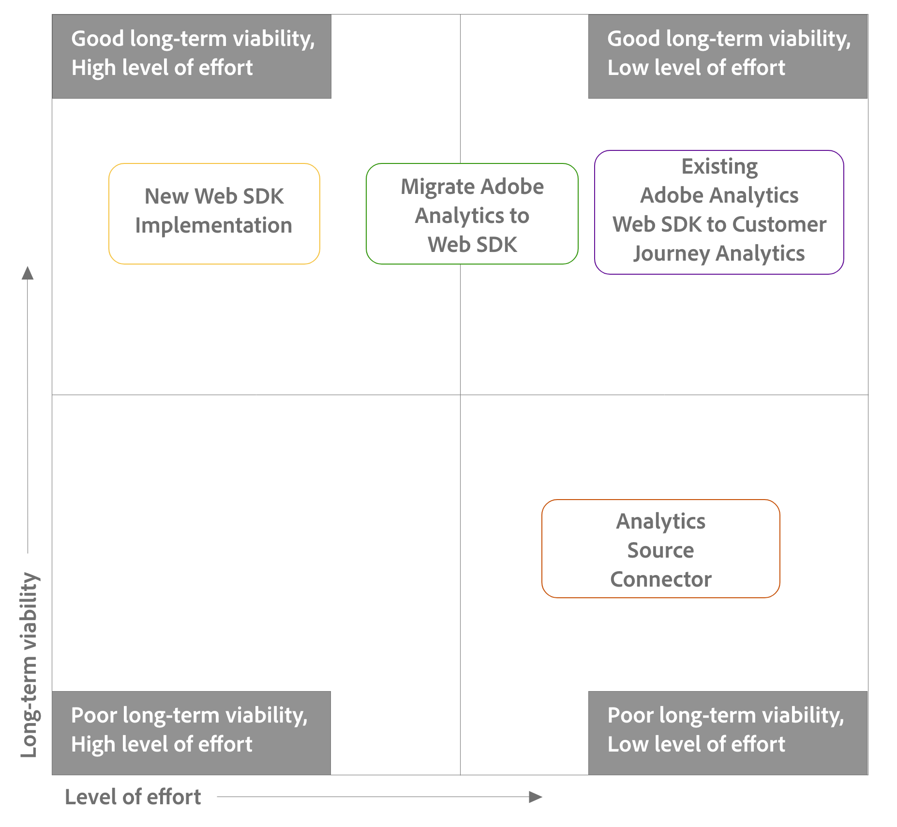

# Etapa 2: Escolher o caminho de atualização

+++Expanda esta seção para ver onde as informações desta página se encaixam no processo de atualização maior. Verifique se todas as etapas de atualização anteriores foram concluídas.

Antes de continuar com esta seção, primeiro verifique se você concluiu todas as tarefas de atualização anteriores.

As informações nesta página abordam a Etapa 2 do processo de atualização, conforme destacado na tabela abaixo:

| Atualizar tarefa | Detalhes |
|---------|----------|
| **Etapa 1: [Introdução à atualização](/help/getting-started/cja-upgrade/cja-upgrade-getstarted.md)** | Saiba mais sobre os benefícios de atualizar para o Customer Journey Analytics e o processo básico de atualização. |
| **Etapa 2: Escolher o caminho de atualização** | Vários métodos estão disponíveis para atualizar para o Customer Journey Analytics. Escolha o método mais adequado de acordo com o ambiente atual do Adobe Analytics e as metas de longo prazo da sua organização. |
| **Etapa 3: [enviar dados para a Adobe Experience Platform](/help/getting-started/cja-upgrade/cja-upgrade-send-to-platform.md)** | O processo de envio de dados para o Adobe Experience Platform difere dependendo do caminho de atualização escolhido na Etapa 2. |
| **Etapa 4: [reter dados históricos](/help/getting-started/cja-upgrade/cja-upgrade-historical-data.md)** | A maioria das organizações precisa reter dados históricos do Adobe Analytics por um determinado período. Há várias opções disponíveis para fazer isso. |
| **Etapa 5: [executar tarefas de implementação adicionais](/help/getting-started/cja-getting-started.md)** | Nesse ponto do processo de atualização, é necessário executar várias tarefas antes que o ambiente de Customer Journey Analytics esteja pronto para uso.
Essas tarefas adicionais se aplicam às atualizações do Adobe Analytics, bem como às novas implementações do Customer Journey Analytics.

Essas tarefas incluem:
<ul><li>Migrar outros dados para a Experience Platform</li><li>Criar conexões entre conjuntos de dados da Platform e o Customer Journey Analytics</li><li>Criar visualizações de dados</li><li>Transferir o uso da API de relatórios</li><li>Contabilizar feeds de dados e data warehouse</li><li>Migrar projetos e componentes</li><li>Planejar a integração de usuários</li></ul> 
Para mais informações, consulte [Introdução ao Customer Journey Analytics](/help/getting-started/cja-getting-started.md). |

{style="table-layout:auto"}

+++

Depois de decidir atualizar para o Customer Journey Analytics, é necessário determinar o caminho de atualização ideal para sua organização.

O caminho escolhido para a atualização do Adobe Analytics para o Customer Journey Analytics depende dos seguintes fatores:

* Sua implementação existente do Adobe Analytics

* Suas metas para o futuro

Use as informações desta página para determinar qual caminho de atualização de Customer Journey Analytics se alinha melhor à implementação atual e às metas futuras de sua organização.

Para determinar o caminho de atualização ideal para sua organização, as seguintes seções devem ser lidas sequencialmente:

1. Primeiro, [compreender os caminhos de atualização disponíveis](#understand-upgrade-paths).

1. Em seguida, [avaliar quais caminhos de atualização estão disponíveis para você](#assess-the-upgrade-paths-available-to-you-based-on-your-current-adobe-analytics-implementation).

1. E finalmente, [pesar as vantagens e desvantagens de cada caminho de atualização](#weigh-the-advantages-and-disadvantages-of-the-upgrade-paths-available-to-you).

## Entender os caminhos de atualização

Existem vários caminhos de atualização para fazer upgrade do Adobe Analytics para o Customer Journey Analytics.

Em geral, cada caminho de atualização difere no nível de esforço necessário para executar a atualização, bem como na viabilidade a longo prazo obtida após a conclusão da atualização.

A tabela a seguir lista cada caminho de upgrade, seu nível de esforço e sua viabilidade a longo prazo:

| Caminho de atualização | Nível de dificuldade | Viabilidade a longo prazo |
|---------|----------|---------|
| **Nova implementação do SDK da Web do Experience Platform**  Você pode começar a usar o Customer Journey Analytics fazendo uma nova implementação do SDK da Web do Experience Platform. Isso permite iniciar o envio de dados para a Edge Network da Experience Plataform e o Customer Journey Analytics. 
Para organizações que ainda não estão no SDK da Web, esse caminho de atualização talvez seja o mais simples de obter dados para o Edge Network, pois requer o menor número de etapas; no entanto, como todo o trabalho é feito antecipadamente (como a criação do esquema XDM), ele requer um esforço inicial maior.

As etapas básicas são:
<ol><li>Criar um esquema XDM para a organização.</li><li>Implementar o SDK da web.</li><li>Enviar dados para a Platform.</li></ol> | Alto | Alto |
| **Migrar sua implementação do Adobe Analytics para usar o SDK da web**  Se sua implementação do Adobe Analytics utiliza o AppMeasurement ou a extensão do Analytics, é possível migrá-la para usar o SDK da web da Adobe Experience Platform e começar a enviar dados para a Edge Network e o Adobe Analytics, antes de enviá-los para o Customer Journey Analytics.
Para organizações que ainda não estão no SDK da web, essa é a maneira mais fácil e simples de enviar dados para a Edge Network. Ela exige mais etapas, mas oferece uma transição mais metódica do Adobe Analytics para o Customer Journey Analytics, com marcos mais tangíveis.

As etapas básicas são:
<ol><li>Mova sua implementação existente do Adobe Analytics para o SDK da web e verifique se tudo está funcionando no Adobe Analytics.</li><li>Crie um esquema XDM para sua organização assim que possível.</li><li>Use o mapeamento de sequência de dados para mapear todos os campos no objeto de dados para o esquema XDM.</li><li>Enviar dados para a Platform.</li></ol> | Moderado | Alto |
| **Configurar a implementação existente do SDK da Web da Adobe Analytics**  Se sua implementação do Adobe Analytics já estiver usando o SDK da Web da Adobe Experience Platform, você poderá começar a enviar dados para a Platform configurando um fluxo de dados. Ou, se você já estiver enviando dados para a Platform, basta criar uma conexão entre os conjuntos de dados da Platform e o Customer Journey Analytics.
Antes de enviar dados para a Platform para uso no Customer Journey Analytics, considere atualizar o esquema do Adobe Analytics para as necessidades específicas da sua organização e de quaisquer outros aplicativos da Platform que você use.

As etapas básicas são:
<ol><li>Comece a enviar dados para a Platform.
Se você já estiver enviando dados para a Platform com a implementação do Adobe Analytics, esta etapa não será necessária. Basta criar uma conexão entre os conjuntos de dados da plataforma e o Customer Journey Analytics, conforme descrito posteriormente neste processo.
</li><li>(Opcional) Crie um esquema XDM para sua organização assim que possível.</li><li>(Condicional) Se você criou um esquema XDM, use o mapeamento de sequência de dados para mapear todos os campos no objeto de dados para o esquema XDM.</li></ol> | Baixo | Alto |
| **Usar o conector de origem do Analytics**  Se sua implementação do Adobe Analytics utiliza o AppMeasurement ou a extensão do Analytics, é possível iniciar o envio de dados para uma visualização de dados no Customer Journey Analytics.
Essa é a maneira mais fácil de enviar dados para o Customer Journey Analytics, mas é o método menos viável a longo prazo.
 | Baixo | Baixo |

{style="table-layout:auto"}

Use o diagrama a seguir para ajudar a visualizar onde cada caminho de atualização se encaixa no espectro em termos de nível de esforço e viabilidade a longo prazo:

## Avalie os caminhos de atualização disponíveis para você com base em sua implementação atual do Adobe Analytics

Nem todos os caminhos de atualização estão disponíveis para cada tipo de implementação do Adobe Analytics.

Use as informações abaixo para entender qual caminho de atualização é mais apropriado para sua organização.

Entre em contato com o(a) representante da Adobe se precisar de suporte ou conselhos e orientações específicas.

| Implementação existente do Adobe Analytics | Caminhos de atualização disponíveis |
|---------|----------|
| AppMeasurement | <ul><li>Nova implementação do SDK da web da Experience Platform</li><li>Migrar o Adobe Analytics para o SDK da web</li><li>Conector de origem do Analytics</li></ul> |
| Extensão do Adobe Analytics | <ul><li>Nova implementação do SDK da web da Experience Platform</li><li>Migrar o Adobe Analytics para o SDK da web</li><li>Conector de origem do Analytics</li></ul> |
| SDK da Web | <ul><li>Configurar a implementação do SDK da Web da Adobe Analytics para enviar dados à Platform</li></ul> |

{style="table-layout:auto"}

## Avalie as vantagens e desvantagens dos caminhos de atualização disponíveis para você

As vantagens e desvantagens de um determinado caminho de atualização diferem dependendo da implementação existente do Adobe Analytics.

Antes de usar as informações abaixo para determinar qual é o caminho de upgrade certo para você, reveja as informações em [Entender os caminhos de atualização](#understand-migration-methods) se você ainda não tiver feito.

### Para implementações do Adobe Analytics que usam o AppMeasurement e a extensão do Adobe Analytics

A seguir estão os caminhos de atualização disponíveis para organizações que implementaram o Adobe Analytics com o AppMeasurement ou a extensão do Adobe Analytics. Expanda cada seção para visualizar as vantagens e desvantagens de cada caminho de atualização.

#### Caminhos de atualização

+++Nova implementação do SDK da web da Experience Platform

| Vantagens | Desvantagens |
|----------|---------|
| <ul><li>**Mostra todas as vantagens de hospedar dados na Experience Edge Network**: 
As vantagens incluem:
<ul><li>Geração de relatórios com alto desempenho e disponibilidade de dados devido à capacidade da Adobe Experience Platform de potencializar [casos de uso de personalização em tempo real](https://experienceleague.adobe.com/br/docs/experience-platform/destinations/ui/activate/configure-personalization-destinations.html)</li><li>Consolidar a implementação da coleção de dados da Adobe Experience Cloud entre outros produtos da Experience Cloud (AJO, RTCDP e assim por diante)</li><li>Não dependente da nomenclatura do Adobe Analytics (prop, eVar, evento etc.)</li></ul></li><li>**À prova de obsolescência**: maior facilidade para atualizar implementações futuras.</li></ul> | <ul><li>**Exige uma nova implementação do zero**: o requisito de se realizar uma nova implementação do zero tem as seguintes desvantagens: </li><ul><li>**Demorado**: este é o caminho de atualização mais demorado e exigente porque requer que você comece novamente com uma nova implementação.</li><li>**Necessidade de recriar o esquema completo no XDM**: antes de começar a implementar o SDK da web, é necessário recriar o esquema completo no XDM.</li><li>**Necessidade de recriar regras e elementos de dados**: antes de começar a implementar o SDK da Web, é necessário recriar quaisquer condições de regra e elementos de dados da implementação do Adobe Analytics.</li></ul></ul> |

{style="table-layout:auto"}

+++

+++Migrar o Adobe Analytics para o SDK da web da Experience Platform

| Vantagens | Desvantagens |
|----------|---------|
| <ul><li>**Mostra todas as vantagens de hospedar dados na Experience Edge Network**: 
As vantagens incluem:
<ul><li>Geração de relatórios com alto desempenho e disponibilidade de dados devido à capacidade da Adobe Experience Platform de potencializar [casos de uso de personalização em tempo real](https://experienceleague.adobe.com/br/docs/experience-platform/destinations/ui/activate/configure-personalization-destinations.html)</li><li>Consolidar a implementação da coleção de dados da Adobe Experience Cloud entre outros produtos da Experience Cloud (AJO, RTCDP e assim por diante)</li><li>Não dependente da nomenclatura do Adobe Analytics (prop, eVar, evento etc.)</li></ul><li>**Uso da implementação existente**: embora sejam necessárias algumas alterações de implementação, essa abordagem não exige uma implementação totalmente nova. Você pode usar sua camada de dados e código existentes com alterações mínimas na lógica de implementação sem afetar os relatórios existentes do Adobe Analytics.</li><li>**Flexibilidade para criar um esquema XDM para a organização posteriormente**: é possível migrar sua implementação existente do Adobe Analytics para usar o SDK da web, verificar se tudo está funcionando no Adobe Analytics e criar o esquema XDM. Essa flexibilidade permite uma atualização mais metódica e ponderada para o Customer Journey Analytics.</li></ul> | <ul><li>**Requisito de mapeamento para envio de dados para a Platform**: quando sua organização estiver pronta para usar o Customer Journey Analytics, envie dados para um conjunto de dados na Adobe Experience Platform. Essa ação exige que cada campo no objeto de dados seja uma entrada na ferramenta de mapeamento de sequência de dados que o atribui a um campo de esquema XDM. O mapeamento só precisa ser feito uma vez para esse fluxo de trabalho e não é necessário fazer alterações de implementação. No entanto, essa é uma etapa extra que não é necessária ao enviar dados em um objeto XDM.</li><li>**Dívida técnica**: como essa abordagem usa uma forma modificada da implementação existente, pode ser mais difícil rastrear a lógica de implementação e executar alterações futuras quando necessário. </li></ul> |

{style="table-layout:auto"}

+++

+++Uso do conector de origem do Analytics

| Vantagens | Desvantagens |
|----------|---------|
| <ul><li>O caminho de atualização menos demorado e exigente. 
Os dados são migrados para o Customer Journey Analytics rapidamente e com o mínimo de investimento
</li></ul> | <ul><li>**Os dados não são enviados para a Edge Network**: 
Isso resulta nas seguintes desvantagens:
<ul><li>Nível mais alto de [latência](/help/technotes/guardrails.md#latencies) nos relatórios em todos os caminhos de atualização; não otimizado para casos de uso de personalização em tempo real.</li><li>Os dados não podem ser compartilhados com outros aplicativos da Adobe Experience Platform e estão restritos somente ao Customer Journey Analytics</li><li>Dependente da nomenclatura do Adobe Analytics (prop, eVar, evento etc.)</li></ul><li>**Dificuldade em migrar para o SDK da web no futuro**: </li><li>**Usa o grupo de campos de evento de experiência do Analytics no esquema**: esse grupo de campos adiciona muitos eventos do Adobe Analytics que não são necessários no esquema do Customer Journey Analytics.  Isso pode levar a um esquema mais desorganizado e complexo do que o necessário para o Customer Journey Analytics.</li></ul> |

{style="table-layout:auto"}

+++

### Para implementações do Adobe Analytics que usam o SDK da web

O seguinte caminho de atualização está disponível para organizações que implementaram o Adobe Analytics com o SDK da Web do Experience Platform.

Ao escolher esse caminho de atualização, você também precisa escolher seu esquema.

#### Caminho de atualização

+++Configure a implementação do SDK da Web da Adobe Analytics para enviar dados à Platform

| Vantagens | Desvantagens |
|----------|---------|
| Esse é o caminho de atualização preferencial se a implementação do Adobe Analytics já estiver usando o SDK da Web.<ul><li>**Mostra todas as vantagens de hospedar dados na Experience Edge Network**: 
As vantagens incluem:
<ul><li>Geração de relatórios com alto desempenho e disponibilidade de dados devido à capacidade da Adobe Experience Platform de potencializar [casos de uso de personalização em tempo real](https://experienceleague.adobe.com/br/docs/experience-platform/destinations/ui/activate/configure-personalization-destinations.html)</li><li>Consolidar a implementação da coleção de dados da Adobe Experience Cloud entre outros produtos da Experience Cloud (AJO, RTCDP e assim por diante)</li><li>Não dependente da nomenclatura do Adobe Analytics (prop, eVar, evento etc.)</li></ul><li>**Uso da implementação existente**: embora sejam necessárias algumas alterações de implementação, essa abordagem não exige uma implementação totalmente nova. Você pode usar sua camada de dados e código existentes com alterações mínimas na lógica de implementação sem afetar os relatórios existentes do Adobe Analytics.</li><li>**Fornece uma opção para usar um esquema XDM**: é possível optar por usar seu esquema do Adobe Analytics existente ou criar um esquema XDM e mapear campos no objeto de dados desse esquema. [Esquemas XDM](https://experienceleague.adobe.com/br/docs/experience-platform/xdm/home#xdm-schemas) são flexíveis e permitem definir quaisquer campos necessários e relevantes. 
Consulte “Usar seu próprio esquema XDM” abaixo para obter mais informações sobre as vantagens de usar seu próprio esquema XDM.
</li><li>**Mantém regras e elementos de dados**: embora sejam necessárias novas ações de regra, é possível reutilizar elementos de dados e condições de regra existentes com alterações mínimas.</li><li>**À prova de obsolescência**: se você optar por usar seu próprio esquema XDM, isso facilitará as atualizações de implementação futuras.</li></ul> | Nenhum |

{style="table-layout:auto"}

+++

#### Escolher o esquema

Se você escolher o caminho de atualização que permite configurar a implementação do SDK da Web da Adobe Analytics para enviar dados para a Platform, será possível escolher o esquema que deseja usar.

É possível optar por usar o esquema existente do Adobe Analytics ou utilizar um esquema XDM próprio para se alinhar melhor às necessidades da organização à medida que começa a usar outros serviços da Platform.

+++Use o esquema do Adobe Analytics com a implementação do SDK da web do Adobe Analytics

| Vantagens | Desvantagens |
|----------|---------|
| 
As vantagens de usar o esquema do Adobe Analytics incluem:
<ul><li>Facilidade de atualização
Se você já estiver enviando dados para o Adobe Analytics com o SDK da web da Adobe Experience Platform, é possível adicionar um serviço extra à sequência de dados para enviar dados para a Adobe Experience Platform (que também pode ser usado na configuração do Customer Journey Analytics).
</li></ul> | 
As desvantagens de usar o esquema do Adobe Analytics incluem:
<ul><li>Embora o uso do esquema do Adobe Analytics não limite a maneira como você utiliza outros aplicativos da Platform, ele é um esquema um pouco mais complexo. Isso ocorre porque o esquema do Adobe Analytics contém muitos objetos específicos do Adobe Analytics que provavelmente não serão usados pela organização.
Quando é preciso realizar alterações no esquema, é necessário analisar milhares de campos não utilizados para localizar o campo que precisa de atualização.
</li></ul> |

+++

+++Use seu próprio esquema XDM com a implementação do SDK da web do Adobe Analytics

| Vantagens | Desvantagens |
|----------|---------|
| <ul>
As vantagens de utilizar seu próprio esquema XDM incluem:
<ul><li>Um esquema simplificado e adaptado às necessidades da organização e aos aplicativos específicos da Platform que você usa.</li>
Quando é preciso realizar alterações no esquema, não é necessário analisar milhares de campos não utilizados para localizar o campo que precisa de atualização.
</ul> | 
As desvantagens de utilizar seu próprio esquema XDM incluem:
<ul><li>A atualização do esquema é um processo demorado e necessário antes de você começar a enviar dados para a Platform.</li></ul> |

+++

## Em seguida, envie os dados para a Adobe Experience Platform

Depois de usar as informações acima para escolher um caminho de atualização, saiba como [enviar dados para o Adobe Experience Platform](/help/getting-started/cja-upgrade/cja-upgrade-send-to-platform.md) dependendo do caminho de atualização escolhido.
