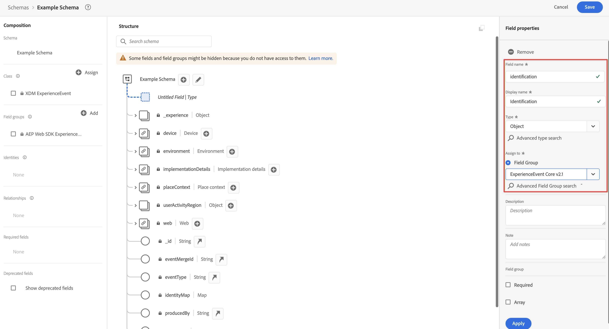

# Criar um esquema XDM para usar com a implementação do SDK da Web do Customer Journey Analytics

>[!NOTE]
> 
>Siga as etapas desta página somente após concluir todas as etapas de atualização anteriores. Você pode seguir as [etapas de atualização recomendadas](/help/getting-started/cja-upgrade/cja-upgrade-recommendations.md#recommended-upgrade-steps-for-most-organizations) ou seguir as etapas de atualização que foram geradas dinamicamente para a sua organização com o [questionário de atualização do Adobe Analytics para o Customer Journey Analytics](https://gigazelle.github.io/cja-ttv/).
>
>Após concluir as etapas desta página, continue seguindo as etapas de atualização recomendadas ou as etapas de atualização geradas dinamicamente.

>[!IMPORTANT]
>
>Antes de começar a criar seu esquema XDM, trabalhe com sua equipe de dados e outras partes interessadas em toda a organização para identificar o design de esquema ideal para o Customer Journey Analytics e outros aplicativos da Adobe Experience Platform que você usa. Para obter mais informações, consulte [Criar o esquema para uso com o Customer Journey Analytics](/help/getting-started/cja-upgrade/cja-upgrade-schema-architect.md).

O Adobe recomenda criar um esquema personalizado do Experience Data Model (XDM) ao atualizar para o Customer Journey Analytics. Um esquema personalizado permite um esquema simplificado adaptado às necessidades da sua organização e dos aplicativos específicos da Platform que você usa. Quando é preciso realizar alterações no esquema, não é necessário analisar milhares de campos não utilizados para localizar o campo que precisa de atualização.

## Criar o esquema

O esquema XDM definido representa o modelo dos dados coletados na Adobe Experience Platform.

Para criar um schema personalizado:

<!-- Should we single source this instead of duplicate it? The following steps were copied from: /help/data-ingestion/aepwebsdk.md-->

1. No Adobe Experience Platform, no painel à esquerda, selecione **[!UICONTROL Esquemas]** em [!UICONTROL GERENCIAMENTO DE DADOS].

1. Selecione **[!UICONTROL Criar esquema]**.

1. Na etapa **[!UICONTROL Selecionar uma classe]** do assistente Criar esquema:

   1. Selecione **[!UICONTROL Evento de experiência]**.

      

      >[!INFO]
      >
      >    Um esquema de Evento de Experiência é usado para modelar o _comportamento_ de um perfil (como nome da cena, botão de push para adicionar ao carrinho). Um esquema de Perfil individual é usado para modelar os _atributos_ de perfil (como nome, email, gênero).

   1. Selecione **[!UICONTROL Próximo]**.

1. No [!UICONTROL Nome e na etapa de revisão] do assistente [!UICONTROL Criar esquema]:

   1. Insira um **[!UICONTROL nome para exibição do esquema]** para seu esquema e (opcional) uma **[!UICONTROL Descrição]**.

      

   1. Selecione **[!UICONTROL Concluir]**.

1. Adicione todos os grupos de campos que contêm quaisquer campos que você deseja incluir no esquema.

   Grupos de campos são coleções reutilizáveis de objetos e atributos que permitem estender facilmente o esquema.

   1. Na seção **[!UICONTROL Grupos de campos]**, selecione **[!UICONTROL + Adicionar]**.

      

   1. Na caixa de diálogo [!UICONTROL Adicionar grupos de campos], selecione o grupo de campos **[!UICONTROL SDK da Web ExperienceEvent da AEP]** na lista.

      

      É possível selecionar o botão de visualização para visualizar os campos que fazem parte desse grupo de campos, como `web > webPageDetails > name`.

      

      Selecione **[!UICONTROL Voltar]** para fechar a visualização.

   1. (Opcional) Selecione quaisquer grupos de campos adicionais que deseja incluir.

   1. Selecione **[!UICONTROL Adicionar grupos de campos]**.

1. (Opcional) Se você tiver campos personalizados que deseja incluir no esquema, crie um grupo de campos personalizados e adicione-os ao grupo de campos.

   1. Na seção **[!UICONTROL Grupos de campos]**, selecione **[!UICONTROL + Adicionar]**.

      

   1. Na caixa de diálogo [!UICONTROL Adicionar grupos de campos], selecione **[!UICONTROL Criar novo grupo de campos]**.

   1. Especifique um nome para exibição e uma descrição opcional e selecione **[!UICONTROL Adicionar grupos de campos]**.

1. Selecione **[!UICONTROL +]** ao lado do nome do esquema no painel [!UICONTROL Estrutura].

   

1. No painel [!UICONTROL Propriedades do campo], digite `Identification` como nome, **[!UICONTROL Identificação]** como [!UICONTROL Nome de exibição], selecione **[!UICONTROL Objeto]** como [!UICONTROL Tipo] e selecione **[!UICONTROL ExperienceEvent Core v2.1]** como [!UICONTROL Grupo de campos].

   >[!NOTE]
   >
   >Se esse grupo de campos não estiver disponível, procure outro grupo de campos que contenha campos de identidade. Ou [crie um novo grupo de campos](https://experienceleague.adobe.com/docs/experience-platform/xdm/ui/resources/field-groups.html) e [adicione novos campos de identidade](https://experienceleague.adobe.com/docs/experience-platform/xdm/ui/fields/identity.html#define-a-identity-field) (como `ecid`, `crmId` e outros que você precise) ao grupo de campos e selecione esse novo grupo de campos.

   

   O objeto de identificação adiciona recursos de identificação ao esquema. No seu caso, você deseja identificar os perfis que visitam seu site usando a ID do Experience Cloud e o endereço de email. Há muitos outros atributos disponíveis para rastrear a identificação da pessoa (por exemplo, ID do cliente, ID de fidelidade).

   Selecione **[!UICONTROL Aplicar]** para adicionar esse objeto ao esquema.

1. Selecione o campo **[!UICONTROL ecid]** no objeto de identificação que você acabou de adicionar e selecione **[!UICONTROL Identidade]** e **[!UICONTROL Identidade principal]** e **[!UICONTROL ECID]** do [!UICONTROL Namespace de identidade] no painel direito.

   

   Você está especificando a Experience Cloud Identity como a identidade principal que o serviço Adobe Experience Platform Identity pode usar para combinar (compilar) o comportamento dos perfis com a mesma ECID.

   Selecione **[!UICONTROL Aplicar]**. Você verá um ícone de impressão digital no atributo ecid.

1. Selecione o **[!UICONTROL email]** no objeto de identificação que você acabou de adicionar e selecione **[!UICONTROL Identidade]** e **[!UICONTROL Email]** na lista [!UICONTROL Namespace de identidade] no painel [!UICONTROL Propriedades do campo].

   

   Você está especificando o endereço de email como outra identidade que o serviço Adobe Experience Platform Identity pode usar para combinar (compilar) o comportamento dos perfis.

   Selecione **[!UICONTROL Aplicar]**. Você vê que um ícone de impressão digital aparece no atributo de email.

   Selecione **[!UICONTROL Salvar]**.

1. (Opcional) Se quiser integrar o Customer Journey Analytics com a RTCDP, selecione o elemento raiz do esquema que exibe o nome do esquema e selecione a opção **[!UICONTROL Perfil]**.

   Você deve habilitar o esquema para o perfil. Depois de ativados, quando os dados são assimilados em conjuntos de dados com base nesse esquema, esses dados são mesclados ao Perfil do cliente em tempo real.

   Consulte [Ativar o esquema para usar no Perfil do cliente em tempo real](https://experienceleague.adobe.com/docs/experience-platform/xdm/tutorials/create-schema-ui.html#profile) para obter mais informações.

   >[!IMPORTANT]
   >
   >Depois que você ativa um esquema para perfil, ele não pode ser desativado para perfil.

   

1. Selecione **[!UICONTROL Salvar]** para salvar o esquema.

   Você criou um esquema mínimo que modela os dados que pode capturar de seu site. O esquema permite que os perfis sejam identificados usando a Experience Cloud Identity e o endereço de email. Ao ativar o esquema para o perfil, você garante que os dados capturados de seu site sejam adicionados ao Perfil do cliente em tempo real.

   Ao lado dos dados de comportamento, você também pode capturar os dados do atributo de perfil do site (por exemplo, detalhes de perfis que assinam um boletim informativo).

   Para capturar esses dados de perfil, você deve:

   * Criar um esquema com base na classe Perfil individual XDM.

   * Adicionar o grupo de campos Profile Core v2 ao esquema.

   * Adicionar um objeto de identificação com base no grupo de campos Profile Core v2.

   * Defina a ID do Experience Cloud como identificador principal e o email como identificador.

   * Ativar o esquema do perfil

   Consulte [Criar e editar esquemas na interface do usuário](https://experienceleague.adobe.com/docs/experience-platform/xdm/ui/resources/schemas.html?lang=pt-BR) para obter mais informações sobre a adição e remoção de grupos de campos e campos individuais a um esquema.

1. Continue seguindo as [etapas de atualização recomendadas](/help/getting-started/cja-upgrade/cja-upgrade-recommendations.md#recommended-upgrade-steps-for-most-organizations) ou as [etapas de atualização geradas dinamicamente](https://gigazelle.github.io/cja-ttv/).
