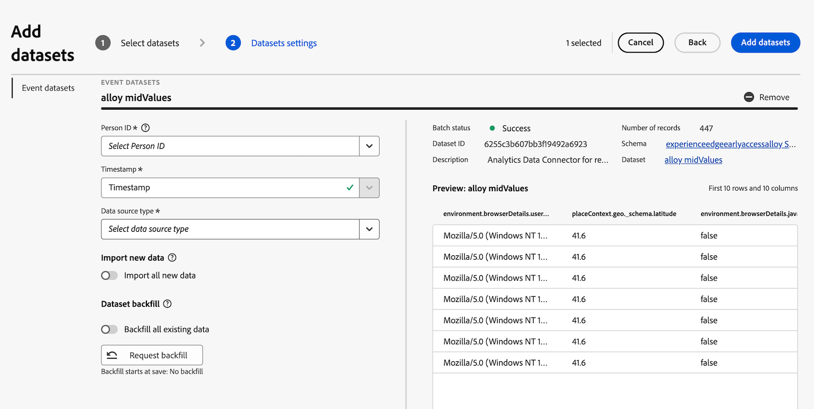

# Adicionar o conjunto de dados do conector de origem do Analytics à conexão

>[!NOTE]
> 
>Siga as etapas desta página somente após concluir todas as etapas de atualização anteriores. Você pode seguir as [etapas de atualização recomendadas](/help/getting-started/cja-upgrade/cja-upgrade-recommendations.md#recommended-upgrade-steps-for-most-organizations) ou seguir as etapas de atualização que foram geradas dinamicamente para a sua organização com o [questionário de atualização do Adobe Analytics para o Customer Journey Analytics](https://gigazelle.github.io/cja-ttv/).
>
>Após concluir as etapas desta página, continue seguindo as etapas de atualização recomendadas ou as etapas de atualização geradas dinamicamente.

## Entenda como o conector de origem do Analytics pode trazer dados históricos para o Customer Journey Analytics

Você pode usar o conector de origem do Analytics para trazer dados do conjunto de relatórios do Adobe Analytics para a Adobe Experience Platform. Esses dados podem ser usados como dados históricos no Customer Journey Analytics.

Esse processo pressupõe que você deseja [criar um esquema XDM ao atualizar para o Customer Journey Analytics](/help/getting-started/cja-upgrade/cja-upgrade-schema-create.md), pois deseja um esquema simplificado adaptado às necessidades da sua organização e dos aplicativos específicos da Platform que você usa.

Para usar o conector de origem do Analytics para trazer dados históricos para o Customer Journey Analytics, é necessário:

1. [Criar um esquema XDM para o conector de origem do Analytics](/help/getting-started/cja-upgrade/cja-upgrade-source-connector-schema.md)

1. [Criar o conector de origem do Analytics e mapear campos](/help/getting-started/cja-upgrade/cja-upgrade-source-connector.md)

1. Adicione o conjunto de dados do conector de origem do Analytics à conexão, conforme descrito abaixo.

## Adicionar o conjunto de dados do conector de origem do Analytics à conexão

Depois de [criar um conector de origem do Analytics para dados históricos](/help/getting-started/cja-upgrade/cja-upgrade-source-connector.md), um conjunto de dados é criado automaticamente para os dados do Analytics.

É necessário adicionar esse conjunto de dados criado automaticamente à mesma conexão criada para a implementação do SDK da Web. Isso traz os dados do Analytics para a mesma visualização de dados no Customer Journey Analytics que os dados do SDK da Web.

Para adicionar o conjunto de dados criado automaticamente à mesma conexão criada para a implementação do SDK da Web:

1. No Customer Journey Analytics, selecione a guia **[!UICONTROL Conexões]**.

1. Selecione a conexão que você [criou para a implementação do SDK da Web](/help/getting-started/cja-upgrade/cja-upgrade-connection.md).

1. Selecione **[!UICONTROL Editar]**.

   

1. Selecione **[!UICONTROL Adicionar conjuntos de dados]** no canto superior direito.

   

1. Role para ou procure o conjunto de dados que foi criado automaticamente quando você criou o conector de origem do Analytics.

   O nome deste conjunto de dados é o nome do seu conjunto de relatórios, seguido por `midValues`. Por exemplo: `My report suite midValues`

1. Marque a caixa de seleção ao lado do nome do conjunto de dados e selecione **[!UICONTROL Próximo]**.

   

1. Especifique as seguintes informações:

   <!-- Copied from help/connections/create-connection.md. Should we single source? -->

   | Configuração | Descrição |
   | --- | --- |
   | **[!UICONTROL ID de pessoa]** | Disponível somente para conjuntos de dados de evento e perfil. Selecione uma ID de pessoa na lista suspensa de identidades disponíveis. Essas identidades foram definidas no esquema do conjunto de dados na Experience Platform. Consulte abaixo para obter informações sobre como usar o Mapa de identidade como uma ID de pessoa.
Se não houver IDs de pessoa para escolher, significa que uma ou mais IDs de pessoa não foram definidas no esquema. Consulte [Definir campos de identidade na interface](https://experienceleague.adobe.com/pt-br/docs/experience-platform/xdm/ui/fields/identity) para obter mais informações. 
O valor da ID de pessoa selecionada diferencia maiúsculas de minúsculas. Por exemplo, `abc123` e `ABC123` são dois valores diferentes. |
   | **[!UICONTROL Carimbo de data e hora]** | Somente para conjuntos de dados de evento e resumo, essa configuração é definida automaticamente para o campo de carimbo de data e hora padrão em esquemas baseados em eventos na Experience Platform. |
   | **[!UICONTROL Fuso horário]** | Disponível somente para dados de resumo. Selecione o fuso horário apropriado para os dados de resumo da série temporal. |
   | **[!UICONTROL Tipo de fonte de dados]** | Selecione um tipo de fonte de dados.  Os tipos de fontes de dados incluem: <ul><li>[!UICONTROL Dados da Web]</li><li>[!UICONTROL Dados do aplicativo móvel]</li><li>[!UICONTROL Dados de POS]</li><li>[!UICONTROL Dados de CRM]</li><li>[!UICONTROL Dados de pesquisa]</li><li>[!UICONTROL Dados da central de atendimento]</li><li>[!UICONTROL Dados de produto]</li><li> [!UICONTROL Dados de contas]</li><li> [!UICONTROL Dados de transação]</li><li>[!UICONTROL Dados de feedback de clientes]</li><li> [!UICONTROL Outro]</li></ul>Este campo é usado para consultar os tipos de fontes de dados que estão sendo usados. |

   {style="table-layout:auto"}

1. Na seção **[!UICONTROL Importar novos dados]**, deixe a opção **[!UICONTROL Importar todos os novos dados]** desabilitada.

   Como você está usando o conjunto de dados do conector de origem do Analytics para dados históricos, não convém trazer dados futuros coletados para esse conjunto de dados.

1. Na seção **[!UICONTROL Preenchimento retroativo de conjunto de dados]**, selecione **[!UICONTROL Solicitar preenchimento retroativo]**.

1. Defina o período que deseja incluir no preenchimento retroativo inserindo as datas de início e término ou selecionando o ícone de calendário .

   O conector de origem do Analytics importa 13 meses de dados (independentemente do tamanho) para sandboxes de produção. O preenchimento retroativo em sandboxes de não produção é de 3 meses.

   >[!IMPORTANT]
   >
   >Seja explícito ao especificar as datas solicitadas para preenchimento retroativo. A data de término deve ser a data quando você começou a coletar dados pela primeira vez com a implementação do SDK da Web.
   >
   >Como alternativa, você pode escolher uma data logo após a data em que começou a coletar dados com a implementação do SDK da Web e, em seguida, usar segmentos para filtrar os dados sobrepostos.

   <!-- Include any of the following?  Make sure you're explicit as to the dates you request backfill to. You want to request it to the date that you start gathering data with your Web SDK implementation. Also possibly include segments for any overlapping date. So you could request everything and then use a segment to exclude data that you don't want. That way if you need to move up the date, then you could change the date in the filter. Downside would be that you might pay for double rows.  When they do that, they're going to see all schema fields from both their custom schema and their Analytics schema. So they'll need to be cognizant to select the right fields, and never select any Analytics fields, because they will be mapped as part of the source connector. Never select any Analytics field group fields because they'll be mapped.  -->

1. Selecione **[!UICONTROL Preenchimento retroativo de fila]**.

1. Selecione **[!UICONTROL Adicionar conjuntos de dados]** e **[!UICONTROL Salvar]** para salvar a conexão.

1. Continue seguindo as [etapas de atualização recomendadas](/help/getting-started/cja-upgrade/cja-upgrade-recommendations.md#recommended-upgrade-steps-for-most-organizations) ou as [etapas de atualização geradas dinamicamente](https://gigazelle.github.io/cja-ttv/).
