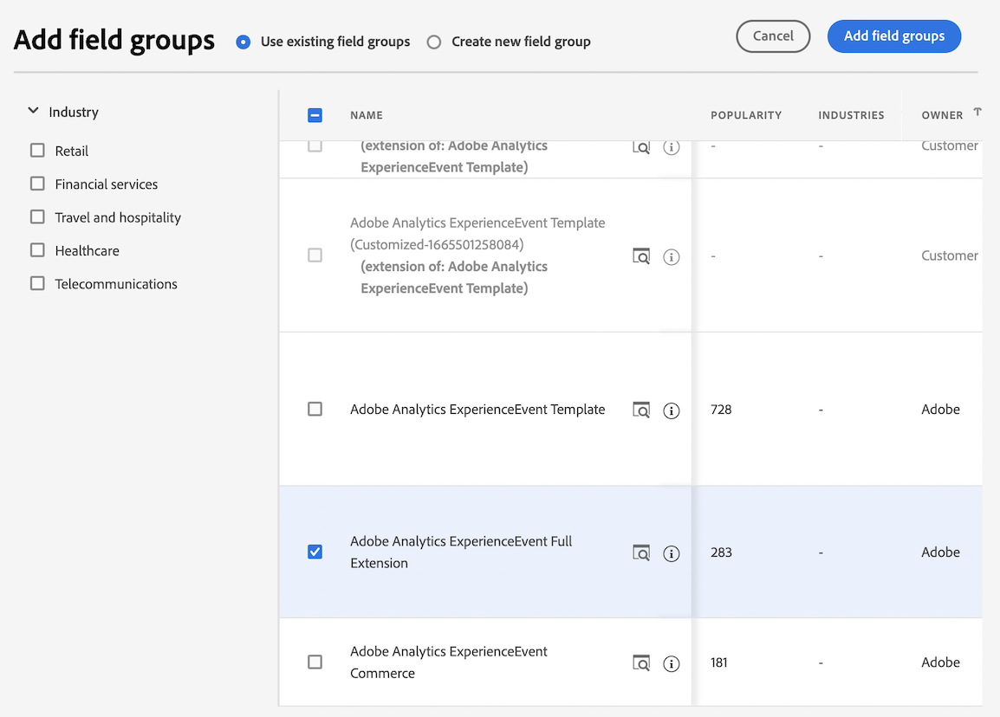

# Criar um esquema personalizado para o conector de origem do Analytics {#create-custom-schema}

<!-- markdownlint-disable MD034 -->

>[!CONTEXTUALHELP]
>id="cja-upgrade-source-connector-create-schema"
>title="Criar um esquema para o conector de origem do Analytics"
>abstract="Esse esquema é uma combinação do grupo de campos ExperienceEvent do Adobe Analytics com todos os grupos de campos que compõem o esquema personalizado da sua organização. Ele permite mapear os campos usados pelo conector de origem do Analytics no esquema da sua organização e é usado somente para dados históricos.  Embora seja um processo técnico, a criação deste esquema pode ser concluída em horas, ou até mais rápido se você souber exatamente quais grupos de campos compõem o esquema personalizado da sua organização."

<!-- markdownlint-enable MD034 -->

<!-- markdownlint-disable MD034 -->

>[!CONTEXTUALHELP]
>id="cja-upgrade-source-connector-historical"
>title="Criar o conector de origem do Analytics para dados históricos"
>abstract="Você pode usar o conector de origem do Analytics para trazer dados do conjunto de relatórios do Adobe Analytics para a Adobe Experience Platform. Esses dados podem ser usados como dados históricos no Customer Journey Analytics."

<!-- markdownlint-enable MD034 -->

{{upgrade-note-step}}

## Entenda como o conector de origem do Analytics pode trazer dados históricos para o Customer Journey Analytics

Você pode usar o conector de origem do Analytics para trazer dados do conjunto de relatórios do Adobe Analytics para a Adobe Experience Platform. Esses dados podem ser usados como dados históricos no Customer Journey Analytics.

Esse processo pressupõe que você deseja [criar um esquema personalizado para usar com a implementação do SDK da web do Customer Journey Analytics](/help/getting-started/cja-upgrade/cja-upgrade-schema-create.md), porque você deseja um esquema simplificado e adaptado às necessidades da sua organização e dos aplicativos específicos da Platform que você usa.

Para usar o conector de origem do Analytics para trazer dados históricos para o Customer Journey Analytics, é necessário:

1. Crie um esquema personalizado para o conector de origem do Analytics, conforme descrito abaixo.

1. Se você ainda não tiver um conector de origem do Analytics, [crie o conector de origem do Analytics e mapeie os campos para seu esquema personalizado](/help/getting-started/cja-upgrade/cja-upgrade-source-connector.md).

   Ou

   Se você já tiver um conector de origem do Analytics, [mapeie os campos do conector de origem para o esquema do XDM](/help/getting-started/cja-upgrade/cja-upgrade-from-source-connector.md).

1. [Adicionar o conjunto de dados do conector de origem do Analytics à conexão](/help/getting-started/cja-upgrade/cja-upgrade-source-connector-dataset.md)

## Criar um esquema personalizado para o conector de origem do Analytics

Você já deve ter [criado um novo esquema personalizado](/help/getting-started/cja-upgrade/cja-upgrade-schema-create.md) para sua implementação do SDK da web da Experience Platform para usar com o Customer Journey Analytics. Este esquema deve conter todos os grupos de campos para os quais você planeja coletar dados.

Agora é necessário usar os mesmos grupos de campos do esquema do SDK da web e adicioná-los a um novo esquema que pode ser usado com o conector de origem do Analytics.

Este esquema do conector de origem do Analytics precisa conter:

* Todos os grupos de campos (incluindo quaisquer grupos de campos personalizados que você criou) que estão incluídos no esquema personalizado criado para a implementação do SDK da web. (Todos os campos personalizados que não fazem parte de um grupo de campos padrão devem ter sido adicionados ao esquema do SDK da web como parte de um grupo de campos personalizados.)

* O grupo de campos do modelo ExperienceEvent do Adobe Analytics

Para criar o esquema personalizado a ser usado com o conector de origem do Analytics:

1. Na Adobe Experience Platform, comece a criar um novo esquema personalizado conforme descrito em [Criar um esquema personalizado para usar com a implementação do SDK da web do Customer Journey Analytics](/help/getting-started/cja-upgrade/cja-upgrade-schema-create.md).

1. Adicione todos os grupos de campos (incluindo quaisquer grupos de campos personalizados) que estão incluídos no esquema que você criou para a implementação do SDK da web.

1. Depois de terminar de adicionar esses grupos de campos, adicione o grupo de campos ExperienceEvent do Adobe Analytics:

   Na seção **[!UICONTROL Grupos de campos]**, selecione **[!UICONTROL Adicionar]** para adicionar um grupo de campos adicional.

   

1. Pesquise e selecione o grupo de campos **[!UICONTROL Modelo ExperienceEvent do Adobe Analytics]**.

   

1. Selecione **[!UICONTROL Adicionar grupos de campos]**.

1. Selecione **[!UICONTROL Salvar]** para salvar o esquema.

{{upgrade-final-step}}
