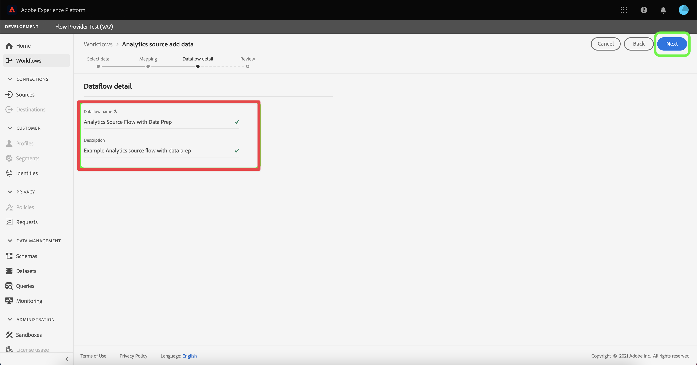

# Criar o conector de origem do Analytics e mapear campos

>[!NOTE]
> 
>Siga as etapas desta página somente após concluir todas as etapas de atualização anteriores. Você pode seguir as [etapas de atualização recomendadas](/help/getting-started/cja-upgrade/cja-upgrade-recommendations.md#recommended-upgrade-steps-for-most-organizations) ou seguir as etapas de atualização que foram geradas dinamicamente para a sua organização com o [questionário de atualização do Adobe Analytics para o Customer Journey Analytics](https://gigazelle.github.io/cja-ttv/).
>
>Após concluir as etapas desta página, continue seguindo as etapas de atualização recomendadas ou as etapas de atualização geradas dinamicamente.

Você pode usar o conector de origem do Analytics para trazer dados do conjunto de relatórios do Adobe Analytics para a Adobe Experience Platform. Esses dados podem ser usados como dados históricos no Customer Journey Analytics.

As etapas a seguir pressupõem que você deseja [criar um esquema XDM ao atualizar para o Customer Journey Analytics](/help/getting-started/cja-upgrade/cja-upgrade-schema-create.md), pois deseja um esquema simplificado adaptado às necessidades da sua organização e dos aplicativos específicos da Platform que você usa.

Com o esquema XDM criado, é necessário criar o conector de origem do Adobe Analytics para usar em dados históricos.

Para obter diretrizes gerais mais abrangentes sobre como criar um conector de origem, consulte [Criar uma conexão de origem do Adobe Analytics na interface](https://experienceleague.adobe.com/docs/experience-platform/sources/ui-tutorials/create/adobe-applications/analytics.html?lang=pt-BR).

Para criar um conector de origem do Adobe Analytics a ser usado para dados históricos:

1. Na interface da Platform, na seção **[!UICONTROL Conexões]** no painel esquerdo, selecione **[!UICONTROL Fontes]**.

1. Selecione **[!UICONTROL Aplicativos da Adobe]** na lista de [!UICONTROL CATEGORIAS].

1. Selecione **[!UICONTROL Adicionar dados]** no bloco do Adobe Analytics.

   

1. Selecione **[!UICONTROL Conjunto de relatórios]** e, na lista de conjuntos de relatórios, selecione o conjunto de relatórios que contém os dados históricos que você deseja usar no Customer Journey Analytics.

   

1. Selecione **[!UICONTROL Avançar]** no canto superior direito da tela.

1. Selecione **[!UICONTROL Esquema personalizado]** e depois o esquema criado em [Criar um esquema XDM que inclua o grupo de campos do Adobe Analytics](/help/getting-started/cja-upgrade/cja-upgrade-source-connector-schema.md). <!-- Deleted this, because I changed this from choosing the default schemawe're pointing them now at the schema they just created: "Adobe Experience Platform  automatically creates the schema and the corresponding dataset to map all standard fields from the selected Adobe Analytics report suite." -->

   <!-- add screenshot -->

1. Mapeie cada dimensão do Adobe Analytics para uma dimensão de esquema XDM personalizada.

   1. Na seção **[!UICONTROL Mapear campos padrão]**, selecione a guia **[!UICONTROL Personalizar]**.

   1. Selecione **[!UICONTROL Adicionar novo mapeamento]**.

   

   1. No **[!UICONTROL campo Source]**, selecione um campo Adobe Analytics do grupo de campos Modelo de evento de experiência do Adobe Analytics. Em seguida, no **[!UICONTROL Campo de destino]**, selecione o campo XDM para o qual você deseja mapeá-lo.

   1. Repita esse processo para cada campo no grupo de campos Modelo de evento de experiência do Adobe Analytics que você está usando para coletar dados no Adobe Analytics.

1. Selecione **[!UICONTROL Avançar]** no canto superior direito da tela.

1. Nomeie o fluxo de dados e (opcionalmente) forneça uma descrição.

   

1. Selecione **[!UICONTROL Avançar]** no canto superior direito da tela.

1. Revise a conexão e selecione **[!UICONTROL Concluir]**.

   

   Após a criação da conexão, o fluxo de dados é criado automaticamente para preencher um conjunto de dados com os dados do Adobe Analytics no conjunto de relatórios. O fluxo de dados assimila até 13 meses de dados históricos para sandboxes de produção. O preenchimento retroativo em sandboxes de não produção é limitado a três meses.

   Se você estiver usando o conector de origem do Analytics para trazer dados históricos para a implementação do SDK da Web do Customer Journey Analytics, será necessário adicionar esse conjunto de dados criado automaticamente à conexão criada para a implementação do SDK da Web.

1. Continue seguindo as [etapas de atualização recomendadas](/help/getting-started/cja-upgrade/cja-upgrade-recommendations.md#recommended-upgrade-steps-for-most-organizations) ou as [etapas de atualização geradas dinamicamente](https://gigazelle.github.io/cja-ttv/).

