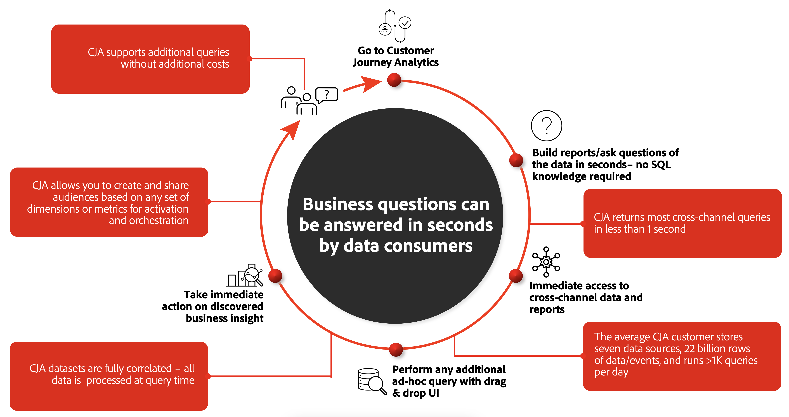

# Comparar o CJA às soluções de BI

Com o foco atual na experiência do cliente, as marcas exigem soluções avançadas para entender melhor a jornada holística do cliente. Entender essa jornada completa do cliente permite analisar e obter informações valiosas sobre como os canais online e offline envolvem os clientes e levam a aumentar a conversão, a retenção e a fidelidade. Uma jornada de clientes neste contexto pode ser a simples ordem online de uma refeição numa cadeia sushi alimentar. Ou a compra de um carro novo, onde o cliente combina pesquisa on-line com visitas ao showroom do revendedor e uma compra final presencial.

Muitas organizações consolidaram seus dados omnicanais em um lago de dados ou data warehouse. As ferramentas de BI (Business Intelligence) são usadas sobre esses armazenamentos de dados para fornecer relatórios, visualizações e insights que a empresa requer para entender a jornada do cliente. Geralmente, essa combinação de soluções e ferramentas é um objetivo geral por natureza e projeto, e não se concentra explicitamente no cliente. O Customer Journey Analytics (CJA) tem como foco capacitar os responsáveis pela experiência do cliente, como comerciantes, analistas de dados, cientistas de dados. A ferramenta permite que eles visualizem a jornada do cliente em contexto completo em todos os canais em tempo real, sem limitações que muitas outras ferramentas de BI têm.

Esta seção da documentação explica as diferenças fundamentais entre o CJA e as ferramentas de BI comumente usadas, primeiro analisando o fluxo de trabalho geral usado para realizar o objetivo mencionado acima: entendendo essa jornada do cliente. Em seguida, ele fornece mais detalhes sobre como os dados são armazenados, coletados e consultados de forma diferente entre as ferramentas do CJA e do BI. Por fim, ele explica as diferenças nos recursos de visualização.

## Fluxo de trabalho tradicional de BI

Um obstáculo frequente com abordagens tradicionais para analisar jornadas de clientes é que elas não são centradas no cliente. Cada equipe coleta dados em silos, analisando e otimizando experiências com base nos dados aos quais tem acesso.

Se quiser entender como uma campanha digital específica afeta uma ação offline armazenada em um silo de dados diferente, emita uma solicitação para a fila da equipe do BI. A equipe de BI grava o query necessário para adquirir e transformar os dados. Depois que os dados brutos são recuperados, a equipe de BI cria a visualização. Os dados são compartilhados com você e você gasta tempo combinando os insights e extraindo dados para ativação em outros sistemas.

Cada uma dessas etapas pode levar horas, dias ou até semanas. Se houver perguntas ou problemas de acompanhamento com os dados consultados, poderá levar ainda mais tempo até que essas perguntas sejam abordadas e o ciclo continue. Para análise, exploração e compreensão contínuas da jornada do cliente, esse processo é ineficiente e não escalável. Além disso, as equipes de BI geralmente abordam mais do que apenas questões relacionadas à jornada do cliente.

## CJA: Fluxo de trabalho democratizado para dados online e offline

O CJA fornece um ambiente para conectar dados online e offline entre canais no nível abrangente do cliente com o único objetivo de entender a jornada do cliente. Ele requer uma configuração inicial para [connect](/help/connections/overview.md) e [definir exibições](/help/data-views/data-views.md) aos dados que você qualificar como relevantes. No entanto, uma vez concluídos, esses dados estão prontamente disponíveis para análise e exploração contínuas. Você pode obter progressivamente insights sobre as jornadas do cliente e entendê-las. Ao democratizar dados online e offline combinados, você pode responder perguntas relacionadas à jornada do cliente em segundos.

Você pode usar o CJA para fazer perguntas usando o ambiente visual do Analysis Workspace e obter insights quase instantaneamente. Os dados e relatórios entre canais são imediatamente disponibilizados, sem necessidade de código SQL. Consultas e análises adicionais podem ser realizadas com um simples arrastar e soltar na interface do usuário, com dados totalmente correlacionados. Você pode continuar fazendo perguntas, explorando progressivamente mais detalhes conforme necessário. Em seguida, você pode realizar ações imediatas sobre os insights descobertos, como compartilhar públicos para ativação e orquestração.

## O poderoso mecanismo de relatórios do CJA

O CJA usa uma poderosa arquitetura proprietária que distribui a análise em centenas ou até milhares de servidores para exibir dados no Analysis Workspace em segundos. Algumas propriedades notáveis dessa arquitetura de processamento incluem:

* **Otimizado para consultas individuais relacionadas ao cliente**: Tecnicamente, o CJA armazena os dados em um mecanismo de relatório distribuído que faz uso extensivo do armazenamento em cache. Esse mecanismo é ajustado para consultas responsivas em dados de eventos de nível individual e, como tal, perfeitamente otimizado para consultas relacionadas ao cliente. O mecanismo de relatórios armazena dados em índices de bitmap orientados por coluna que permitem um cálculo rápido e dinâmico de métricas agregadas. Ele tem um mecanismo de filtragem abrangente que permite segmentação/análise de público-alvo poderosa. E ele tem um entendimento central da sequência entre pontos de dados que é útil para analisar o comportamento nesses pontos de dados (a ordem em que as coisas ocorreram) e para atribuir a atribuição usando vários modelos complexos.

* **Aplicação rápida de definição de caminho e filtros complexos**: O mecanismo de relatórios trabalha em conjuntos de dados hierárquicos parcialmente ordenados (por exemplo, pessoa -> sessões -> eventos). Todos os dados de um objeto de nível superior (perfis individuais) residem em um único nó de processamento para obter resultados precisos. Esse particionamento permite a aplicação rápida de caminhos e filtros complexos. Operações complexas, como sessões, atribuição, persistência estática de atributos de dados e opções complexas de manipulação de dados são executadas em escala com tempo de relatório rápido. No mundo de BI, esses tipos de operações normalmente exigem a criação de novos cubos OLAP para cada caso de uso. O mecanismo de relatórios do CJA permite acesso irrestrito a todo o conjunto de dados em cada query, resultando em dados totalmente correlacionados sem exigir cubos antecipadamente.

* **Consulta eficiente de fluxos de dados complexos**: Uma das maiores diferenças do mecanismo de relatórios em relação aos bancos de dados SQL e NoSQL tradicionais é sua capacidade de determinar predicados com base em relacionamentos orientados por sequência em um nível fundamental. Essas operações fundamentais de consulta podem observar o fluxo de registro, que é composto por muitas sequências intercaladas (e até aninhadas). Eles executam uma consulta em relação a todos esses fluxos de dados interligados com a eficiência de uma única operação de sequência contígua.

* **Projetado para responder rapidamente a consultas grandes**: O mecanismo de relatórios não tem um objetivo tão geral quanto os grandes sistemas tradicionais de dados. No entanto, é projetado especificamente para responder consultas que abrangem milhões ou até bilhões de registros (dados do evento/eventos de experiência), geralmente em menos de um segundo. Ao contrário de outros grandes sistemas de dados, ele não faz isso amostrando os dados ou pré-calculando as respostas para todas as perguntas que acha que você pode fazer. Em vez disso, é possível calcular as respostas com rapidez suficiente para suportar casos de uso de consulta interativa. Esse design específico do mecanismo de relatórios do CJA facilita a disponibilidade dos dados e em alta velocidade para análise e exploração contínuas, permitindo assim obter progressivamente insights e compreensão das jornadas do cliente.

* **Atua como uma solução de BI headless**: Você define suas dimensões, métricas, filtros em um local e qualquer cliente CJA (incluindo nossa API CJA pública) pode acessar esses componentes. Isso abstrai as consultas complexas dos usuários finais e garante que os resultados sejam os mesmos, independentemente do cliente de relatório ou visualização usado.

## Recursos de visualização exclusivos do CJA

O mecanismo de relatórios é fundamental para o CJA, para que você possa interagir progressivamente com e atuar em todos os dados de jornada do cliente dentro desse mecanismo de relatórios. O CJA vem com um conjunto extenso de componentes que capacitam você a fazer isso visualmente e por meio de arrastar e soltar. As ferramentas de visualização de BI permitem explorar os limites dos dados preparados por SQL (conforme definido pela TI). O CJA permite detalhar e destrinchar os dados o quanto quiser, sem precisar voltar para a TI para criar mais uma visualização SQL.

&quot;Progressivamente&quot; é um conceito-chave aqui: ao contrário da maioria das visualizações nas ferramentas de BI, a interface de usuário de arrastar e soltar visual no CJA permite detalhar continuamente seus dados para suas necessidades específicas: você pode criar consultas visuais interativamente usando métricas, dimensões, filtros (segmentos), cálculos, linhas do tempo, anotações e outros valores de análise relevantes.

Os componentes de visualização são recursos inteligentes como:

* **Recursos do analista virtual** como [Detecção de anomalias](/help/analysis-workspace/virtual-analyst/c-anomaly-detection/anomaly-detection.md) que usam algoritmos preditivos e aprendizado de máquina para fornecer insights do que está gerando comportamentos incomuns em seus dados.

* **Recursos de análise avançada** que se concentram especificamente em insights de jornada do cliente, como [diagramas de fluxo](/help/analysis-workspace/visualizations/c-flow/flow.md), [Attribution IQ](/help/analysis-workspace/attribution/overview.md), [diagramas de fallout](/help/analysis-workspace/visualizations/fallout/fallout-flow.md)e [detalhamentos de dimensão](/help/components/dimensions/t-breakdown-fa.md). Exemplos de visualizações prontas para uso são:

   * [Análise de retenção do cliente por meio de tabelas de coorte/latência](/help/analysis-workspace/visualizations/cohort-table/cohort-use-cases.md), onde você simplesmente arrasta e solta métricas/dimensões em um construtor e faz menos de 30 segundos,

   * [Fallout](/help/analysis-workspace/visualizations/fallout/configuring-fallout.md) / [fluxo](/help/analysis-workspace/visualizations/c-flow/create-flow.md) visualizações. Configurado em menos de um minuto.

   * [Modelos de atribuição](/help/analysis-workspace/attribution/algorithmic.md) como primeiro toque, último toque, participação, redução de tempo, até mesmo personalizado que requer alguns cliques para configurar.

* **Recurso de segmentação em cada etapa da exploração progressiva**: sempre que achar que faz sentido, publique seu público-alvo de volta no Experience Platform e a partir daí para qualquer um dos destinos compatíveis.

* **Sessões** que [personalizável](/help/data-views/component-settings/persistence.md): determine quando uma sessão, como parte de um canal em uma jornada do cliente, começa e termina.

* **Preparação e democratização**: Os painéis criados no CJA podem ser:

   * [Preparado](/help/analysis-workspace/curate-share/curate.md) a outros indivíduos da organização para exploração contínua,
   * Exportado para Excel usando [Report Builder](/help/report-builder/report-buider-overview.md) (um plug-in dedicado),
   * [Compartilhado](/help/analysis-workspace/curate-share/share-projects.md) em vários formatos, incluindo [PDF](/help/analysis-workspace/curate-share/download-send.md), [CSV](/help/analysis-workspace/curate-share/download-send.md) e através de [aplicativo móvel dedicado](/help/mobile-app/home.md), àqueles que estão interessados nos relatórios finais e/ou nas visualizações.

A comparação dos recursos de visualização do CJA com o que as ferramentas de BI oferecem é difícil devido à variedade de visualizações disponíveis. Algumas ferramentas de BI têm visualizações mais avançadas, mas o CJA se concentra em visualizações de jornada do cliente interativas e interoperáveis, que permitem detalhar os dados em segundos e não &quot;cobrar&quot; por cada query adicional.

## Resumo

O CJA é diferente das ferramentas de BI na forma como integra um mecanismo de relatórios altamente otimizado voltado para a jornada do cliente, perfeitamente com ferramentas e componentes amigáveis para realizar análises e criar relatórios e visualizações avançadas. Tudo isso de uma única interface do usuário, sem que seja necessário mover-se entre o mecanismo de consulta e o ambiente de visualização.

