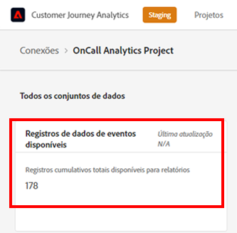

# Estimar e gerenciar o uso do CJA

Para entender o uso do CJA, você pode usar dois métodos:

* Adicionar os dados do evento para cada conexão (consulte **Estime o tamanho da conexão** abaixo)
* Usar o Analysis Workspace para...

Para gerenciar o uso do CJA:

* Usar a API do CJA

## Estimar tamanho da conexão {#estimate-size}

Talvez seja necessário saber quantas linhas de dados de evento você tem atualmente em [!UICONTROL Customer Journey Analytics]. Para obter uma conta precisa do uso dos registros de dados de evento (linhas de dados) de sua organização, faça o seguinte **para cada uma das conexões criadas pela organização**.

>[!NOTE]
>
>Faça isso na primeira sexta-feira de cada mês, já que o Adobe executa seu relatório de uso mais recente naquele dia.

1. No [!UICONTROL Customer Journey Analytics], clique na guia **[!UICONTROL Conexões]**.

   Agora você pode ver uma lista de todas as conexões atuais.

1. Clique em cada nome de conexão para acessar o Gerenciador de conexões.

1. Adicione o **[!UICONTROL Registros dos dados do evento disponíveis]** para todas as conexões criadas. (Dependendo do tamanho da conexão, o número pode levar algum tempo para ser exibido.)

   

1. Depois de ter uma soma de todas as linhas de dados do evento, procure o direito de “Linhas de dados” no contrato do Customer Journey Analytics que sua empresa assinou com a Adobe.

   Isso fornece o número máximo de linhas de dados autorizadas na Ordem de venda. Se o número de linhas de dados resultante da Etapa 3 for maior que esse número, você está incorrendo em um excedente.

1. Para corrigir essa situação, você tem várias opções:

   * Alterar as [configurações de retenção de dados](https://experienceleague.adobe.com/docs/analytics-platform/using/cja-connections/manage-connections.html?lang=pt-BR#set-rolling-window-for-connection-data-retention).
   * [Excluir todas as conexões não usadas](https://experienceleague.adobe.com/docs/analytics-platform/using/cja-overview/cja-faq.html?lang=pt-BR#implications-of-deleting-data-components).
   * [Excluir um conjunto de dados na AEP](https://experienceleague.adobe.com/docs/analytics-platform/using/cja-overview/cja-faq.html?lang=pt-BR#implications-of-deleting-data-components).
   * Entre em contato com o Gerente de conta da Adobe para obter licença de capacidade adicional.
