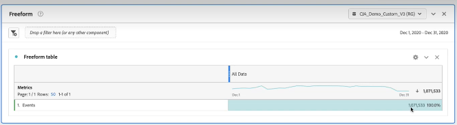

# Estimar e gerenciar o uso do CJA

Para entender o uso do CJA, você pode usar 3 métodos:

* Adicione as linhas de dados do evento para cada conexão. (Consulte **Estime o tamanho da conexão** abaixo) Essa é uma maneira fácil de ver os dados da linha do evento, por conexão, para um carimbo de data e hora específico.
* Use o Analysis Workspace para relatar os eventos do mês passado. (Consulte **Criar um projeto do Workspace usando todos os dados do evento** abaixo.) Isso permite fazer uma análise mais profunda dos dados de uso, bem como do histórico de uso.
* Use a API do CJA para criar um relatório automatizado. (Consulte **Criar um relatório na API do CJA** abaixo.)

Para gerenciar o uso do CJA:

* Defina uma janela de dados do acumulado. (Consulte **Definir uma janela de dados do acumulado** abaixo.)

## Estimar tamanho da conexão {#estimate-size}

Talvez seja necessário saber quantas linhas de dados de evento você tem atualmente em [!UICONTROL Customer Journey Analytics]. Para obter uma conta precisa do uso dos registros de dados de evento (linhas de dados) de sua organização, faça o seguinte **para cada uma das conexões criadas pela organização**.

>[!NOTE]
>
>Faça isso na primeira sexta-feira de cada mês, já que o Adobe executa seu relatório de uso mais recente naquele dia.

1. No [!UICONTROL Customer Journey Analytics], clique na guia **[!UICONTROL Conexões]**.

   Agora você pode ver uma lista de todas as conexões atuais.

1. Clique em cada nome de conexão para acessar o Gerenciador de conexões.

1. Adicione o **[!UICONTROL Registros dos dados do evento disponíveis]** para cada conexão criada pela organização. (Dependendo do tamanho da conexão, o número pode levar algum tempo para ser exibido.)

   

   >[!CAUTION]
   >
   >   Essa contagem se aplica somente aos dados do evento, não aos dados do perfil ou da pesquisa. Se você tiver dados de perfil e pesquisa, a contagem será um pouco maior. No entanto, atualmente não há como criar relatórios sobre o uso de dados de perfil e pesquisa na interface do usuário. Essa funcionalidade está programada para 2023.

1. Depois de ter uma soma de todas as linhas de dados do evento, procure o direito de “Linhas de dados” no contrato do Customer Journey Analytics que sua empresa assinou com a Adobe.

   Isso fornece o número máximo de linhas de dados autorizadas na Ordem de venda. Se o número de linhas de dados resultante da Etapa 3 for maior que esse número, você está incorrendo em um excedente.

1. Para corrigir essa situação, você tem várias opções:

   * Alterar as [configurações de retenção de dados](https://experienceleague.adobe.com/docs/analytics-platform/using/cja-connections/manage-connections.html?lang=pt-BR#set-rolling-window-for-connection-data-retention).
   * [Excluir todas as conexões não usadas](https://experienceleague.adobe.com/docs/analytics-platform/using/cja-overview/cja-faq.html?lang=pt-BR#implications-of-deleting-data-components).
   * [Excluir um conjunto de dados na AEP](https://experienceleague.adobe.com/docs/analytics-platform/using/cja-overview/cja-faq.html?lang=pt-BR#implications-of-deleting-data-components).
   * Entre em contato com o Gerente de conta da Adobe para obter licença de capacidade adicional.

## Criar um projeto do Workspace usando todos os dados do evento {#workspace-event-data}

1. Antes de criar o projeto no Workspace, [criar uma visualização de dados](/help/data-views/create-dataview.md) para cada conexão, sem filtros aplicados.

1. No Workspace, crie novos projetos com base em cada visualização de dados e extraia todos os eventos (da variável **[!UICONTROL Métricas]** lista suspensa) até a primeira sexta-feira do mês, começando pelo primeiro dia do seu contrato CJA atual.

   

   Isso lhe dará uma boa ideia de como sua utilização está apresentando tendências mês a mês.

1. Dependendo das suas necessidades, você pode detalhar por conjunto de dados, etc.

## Criar um relatório automatizado na API do CJA {#api-report}

1. Use o [API de relatórios CJA](https://developer.adobe.com/cja-apis/docs/api/#tag/Reporting-API) para executar um relatório em todos os dados do evento, **para cada conexão**. Configure isso para que o relatório seja executado

   * a cada três sextas-feiras de cada mês.
   * voltar ao primeiro dia do seu contrato CJA atual.

   Isso lhe dará uma boa ideia de como sua utilização está apresentando tendências mês a mês. Ele fornecerá o número total de linhas em todas as suas conexões do CJA.

1. Use o Excel para personalizar ainda mais este relatório.

## Definir uma janela de dados do acumulado {#rolling}

Para gerenciar seu uso, a variável [interface de usuário de conexões](/help/connections/create-connection.md) permite definir a retenção de dados do CJA como uma janela contínua em meses (1 mês, 3 meses, 6 meses, etc.), no nível da conexão.

O principal benefício é armazenar ou relatar apenas dados que sejam aplicáveis e úteis, além de excluir dados mais antigos que não sejam mais úteis. Isso ajuda você a ficar dentro dos limites do contrato e reduz o risco de custo excedente.

Se deixar o padrão (desmarcado), o período de retenção será substituído pela configuração de retenção de dados da Adobe Experience Platform. Se você tiver dados correspondentes a 25 meses na Experience Platform, o CJA obterá 25 meses de dados por meio do preenchimento retroativo. Se você excluísse 10 desses meses na Platform, o CJA manteria os 15 meses restantes.

A retenção de dados tem por base os carimbos de data e hora do conjunto de dados do evento e se aplica somente aos conjuntos de dados do evento. Não existe configuração de janela de dados contínuos para conjuntos de dados de perfil ou pesquisa, pois não há carimbos de data/hora aplicáveis. No entanto, se sua conexão incluir qualquer perfil ou conjunto de dados de pesquisa (além de um ou mais conjuntos de dados de evento), esses dados serão retidos pelo mesmo período.

