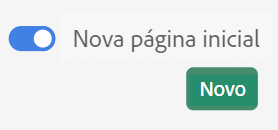

# Página inicial do Customer Journey Analytics

A landing page do Customer Journey Analytics apresenta uma página inicial do gerente de projeto e uma seção de aprendizado que ajuda você a iniciar com mais eficiência.

>[!VIDEO](https://video.tv.adobe.com/v/334278/?quality=12)

## Acessar a página de aterrissagem {#access-landing}

Depois de fazer logon na Adobe Experience Cloud e no Customer Journey Analytics, ative o botão [!UICONTROL Nova landing page - Beta] no canto inferior esquerdo. O acesso ao botão de alternância é específico do usuário por organização, não por empresa.

É possível

* Expanda a tabela [!UICONTROL Projetos] para entrar em tela cheia. Para expandir a tabela, basta clicar no ícone de menu de hambúrguer. Essa ação recolherá as guias do painel esquerdo.
* Personalize a largura da coluna arrastando o separador de colunas.
* Reordenar os itens fixados. Para mover os itens fixados para cima e para baixo, clique nas reticências ao lado do item fixado e selecione **[!UICONTROL Mover para cima]** ou **[!UICONTROL Mover para baixo]**.

## Navegue até a guia [!UICONTROL Projetos] {#navigate-projects}

[!UICONTROL Os projetos] servem como página inicial do [!UICONTROL Workspace]. Qualquer projeto do Workspace é exibido aqui, incluindo scorecards para dispositivos móveis. **[!UICONTROL Projetos]** são itens que você criou ou que outra pessoa criou e compartilhou com você. [!UICONTROL Projetos] também se refere a projetos em branco e scorecards para dispositivos móveis em branco.

>[!NOTE]
>
>Várias das seguintes configurações persistem (são lembradas) durante a sessão e entre sessões. Exemplos: em qual guia você está, quais filtros foram selecionados, quais colunas foram selecionadas e a direção da classificação da coluna. No entanto, os resultados da pesquisa não são persistentes.

| Elemento da interface | Definição |
| --- | --- |
| ... Mais | Permite [!UICONTROL Exibir Tutoriais] e [Editar preferências de usuário](/help/analysis-workspace/user-preferences.md). |
| O modal **[!UICONTROL Criar novo]** está de volta | Ao clicar em **[!UICONTROL Criar novo]** no Espaço de trabalho, você novamente terá a escolha entre um [!UICONTROL Projeto em branco] e um [!UICONTROL Cartão de pontuação para dispositivos móveis em branco]. Você também pode escolher qualquer modelo criado por sua empresa. |
| [!UICONTROL Mostrar menos/mais] | Alterna entre não mostrar e mostrar o banner:  |
| [!UICONTROL Projeto em branco] | Cria um [projeto do Workspace](https://experienceleague.adobe.com/docs/analytics/analyze/analysis-workspace/home.html?lang=pt-BR) em branco para que você o preencha. |
| [!UICONTROL Cartão de pontuação para dispositivos móveis em branco] | Cria um [cartão de pontuação móvel](https://experienceleague.adobe.com/docs/analytics/analyze/mobapp/curator.html?lang=pt-BR) em branco para que você o preencha. |
| [!UICONTROL Abrir tutorial de treinamento] | Abre o tutorial de treinamento do Workspace que orienta novos usuários por meio da criação de um projeto passo a passo. |
| [!UICONTROL Abrir notas de versão] | Abre as notas de versão mais recentes do Adobe Experience Cloud. |
| Ícone Filtrar | Você pode filtrar por tags, conjuntos de relatórios, proprietários, tipos e outros filtros (Meus, Compartilhados comigo, Favoritos e Aprovados) |
| Barra de pesquisa | A pesquisa agora inclui todas as colunas na tabela. |
| Caixa de seleção | Clicar nesta caixa ao lado de um ou mais projetos exibe as ações de gerenciamento de projetos que você pode executar: Excluir, Marcar, Fixar, Aprovar, Compartilhar, Renomear, Copiar e Exportar para CSV. Talvez você não tenha permissões para executar todas essas ações. |
| [!UICONTROL Favoritos] | Marcar um projeto como favorito coloca uma estrela junto a ele e o marca como um favorito que você pode filtrar. |
| [!UICONTROL Nome] | O nome do projeto. |
| Ícone Informações (i) | Clicar no ícone de informações mostra as seguintes informações sobre este projeto: Tipo, Função do projeto, Proprietário, Descrição e com quem ele é compartilhado. Também indica quem pode [editar ou duplicar](/help/analysis-workspace/curate-share/share-projects.md) o projeto. |
| Reticências (...) | As reticências ao lado de um projeto exibem as ações de gerenciamento de projeto que você pode executar: Excluir, Marcar, Fixar, Aprovar, Compartilhar, Renomear, Copiar e Exportar para CSV. Observe que talvez você não tenha permissões para executar todas essas ações. |
| [!UICONTROL Tipo] | Indica se é um projeto do Workspace ou um cartão de pontuação móvel. |
| [!UICONTROL Tags] | Você pode adicionar tags aos relatórios para organizá-los em grupos. |
| [!UICONTROL Função do projeto] | As funções de projeto se referem ao proprietário do projeto e se você tem permissões para Editar ou Duplicar o projeto. |
| [!UICONTROL Visualização de dados] | Tabelas e visualizações em um painel derivam dados da visualizações de dados selecionada na parte superior direita do painel. A visualizações de dados também determina quais componentes estão disponíveis no painel esquerdo. Em um projeto, você pode usar uma ou várias visualizações de dados dependendo dos casos de uso da análise. A lista de visualizações de dados é classificada de acordo com a relevância. A Adobe define a relevância com base na recente e frequente utilização da visualizações de dados pelo usuário atual e na frequência com que a visualizações de dados é usada na organização. |
| [!UICONTROL Proprietário] | A pessoa que criou o projeto. |
| [!UICONTROL Compartilhado com] | Com quem esse projeto foi compartilhado. |
| [!UICONTROL Última modificação] | Quando este projeto foi modificado pela última vez. |
| [!UICONTROL Aberto pela última vez] | Quando este projeto foi aberto pela última vez por você. |
| [!UICONTROL Programado] | Defina como [!UICONTROL Ligado] quando um projeto estiver programado ou **[!UICONTROL Desligado]** quando não estiver. Clicar no link **[!UICONTROL Ligado]** permite ver informações sobre o projeto agendado. Também é possível [editar a programação do projeto](/help/analysis-workspace/curate-share/t-schedule-report.md) se você for o proprietário do projeto. |
| [!UICONTROL ID do projeto] | A ID do projeto pode ser usada para depurar projetos. |
| [!UICONTROL Intervalo de datas mais longo] | Intervalos de datas mais longos aumentam a complexidade do projeto e podem aumentar os tempos de processamento e carregamento. |
| [!UICONTROL Número de consultas] | O número total de solicitações feitas no Analytics quando o projeto é carregado. Um número maior de consultas de projeto aumenta a complexidade do projeto e pode aumentar os tempos de processamento e carregamento. Esses dados só estão disponíveis depois que um projeto é carregado ou um projeto agendado é enviado. |
| Ícone Personalizar tabela | (Canto superior direito) Se quiser adicionar ou remover colunas da lista de projetos, você selecioná-las ou desmarcá-las. |
| &lt; (Botão voltar) | Esse botão em um projeto do Espaço de trabalho direciona você à configuração mais recente da landing page. Qualquer configuração de página que você tenha ao sair da página de aterrisagem persistirá ao retornar. |

## Navegue pela guia Aprendizagem {#navigate-learning}

A página Aprendizado contém tutoriais e visitas de vídeo práticos, além de links para a documentação.

* O Tour [!UICONTROL Fundamentos do Workspace] leva você diretamente para o Workspace, o orienta no layout do Workspace e indica onde encontrar/executar as ações mais comuns. Esse Tour também pode ser reiniciado a qualquer momento diretamente no Workspace por meio do pop-over da dica de ferramenta do cabeçalho do painel.
* Clicar em um vídeo/tour adiciona uma tag **[!UICONTROL Visualizada]**. Essa tag ajuda a rastrear o progresso pelo conteúdo de aprendizagem. Caso ainda não tenha concluído o conteúdo, você poderá clicar na tag, e ela desaparecerá.
* O botão **[!UICONTROL Saiba mais]** no modal de vídeo leva você a uma página de documentação do Adobe Experience League com mais conteúdo de ajuda relacionado ao vídeo que você acabou de assistir.  **[!UICONTROL Ver mais vídeos]** leva você à lista de reprodução completa do Analysis Workspace YouTube.

## Perguntas frequentes sobre a página de aterrissagem {#landing-faq}

| Pergunta | Resposta |
| --- | --- |
| Há um número máximo de projetos que eu posso fixar? | Não, não há limite para o número de projetos que você pode fixar. |
| Os administradores podem designar essa landing page para seus usuários? | Não, os administradores não podem designar a landing page em nome de seus usuários. Os usuários individuais devem ativar a alternância. |
