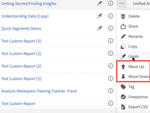
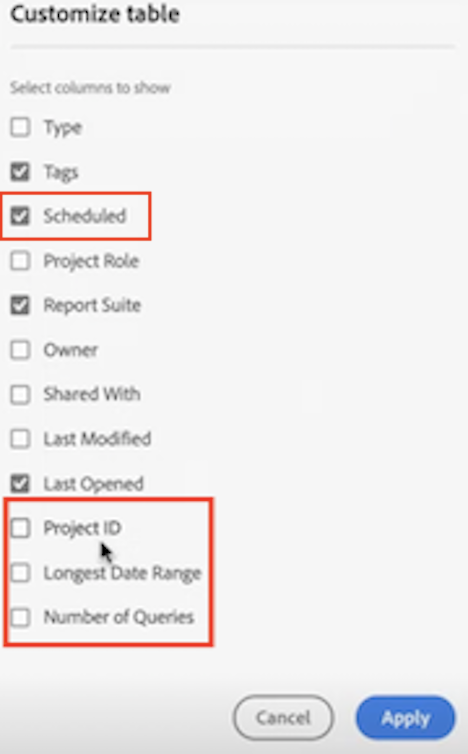

# Página inicial do Customer Journey Analytics

A página de destino do Customer Journey Analytics destaca o [!DNL Analysis Workspace] e apresenta uma página inicial do gerente de projeto e uma seção de aprendizado para ajudar você a gerenciar os dados da jornada do cliente com mais eficiência.

>[!VIDEO](https://video.tv.adobe.com/v/334278/?quality=12)

## Recursos da nova página de aterrissagem {#new-features}

| Recurso | Descrição | Captura de tela |
| --- | --- | --- |
| Expandir a tabela [!UICONTROL Projetos] para tela inteira | Para expandir a tabela, basta clicar no ícone de menu de hambúrguer. Essa ação recolherá as guias do painel esquerdo. |  |
| Personalizar a largura da coluna | Anteriormente, a largura da coluna era fixa. Agora é possível ajustá-la arrastando o separador de colunas. |  |
| Reordenar itens fixados | Para mover os itens fixados para cima e para baixo, clique nas reticências ao lado do item fixado e selecione **[!UICONTROL Mover para cima]** ou **[!UICONTROL Mover para baixo]**. |  |
| Novas colunas da tabela | Clique no ícone [!UICONTROL Personalizar tabela] na parte superior direita da tabela. As novas colunas da tabela incluem: <ul><li>**[!UICONTROL Agendado]**: definido como [!UICONTROL Ativado] quando um projeto estiver agendado ou [!UICONTROL Desativado] quando não estiver. Clicar no link [!UICONTROL Ativado] permite ver informações sobre o projeto agendado. Você também pode [editar o agendamento do projeto](/help/analysis-workspace/export/t-schedule-report.md) se for o proprietário do projeto.</li><li>**[!UICONTROL ID do projeto]**: a ID do projeto pode ser usada para depurar projetos.</li><li>**[!UICONTROL Intervalo de datas mais longo]**: intervalos de datas mais longos aumentam a complexidade do projeto e podem aumentar os tempos de processamento e carregamento. </li><li>**[!UICONTROL Número de consultas]**: o número total de solicitações feitas no Analytics quando o projeto é carregado. Um número maior de consultas de projeto aumenta a complexidade do projeto e pode aumentar os tempos de processamento e carregamento. Esses dados só estão disponíveis depois que um projeto é carregado ou depois que um projeto agendado é enviado. </li></ul> |  |
| O modal **[!UICONTROL Criar projeto]** voltou | Ao clicar em **[!UICONTROL Criar projeto]** no Espaço de trabalho, você novamente terá a escolha entre um [!UICONTROL Projeto em branco] e um [!UICONTROL Cartão de pontuação móvel em branco]. Você também pode escolher a partir de qualquer modelo criado por sua empresa. |  |

{style="table-layout:auto"}

## Navegue até a guia [!UICONTROL Projetos] {#navigate-projects}

[!UICONTROL Os projetos] servem como página inicial do [!UICONTROL Espaço de trabalho]. A guia Projetos exibe a pasta Empresa, qualquer pasta pessoal criada, seus projetos e cartões de pontuação para dispositivos móveis. Use esta página para exibir, criar e modificar pastas, projetos e cartões de pontuação para dispositivos móveis. Para obter mais informações, consulte [Sobre pastas no Analytics](/help/analysis-workspace/build-workspace-project/workspace-folders/about-folders.md).

**[!UICONTROL Projetos]** são designs personalizados que combinam componentes de dados, tabelas e visualizações que você criou ou que outra pessoa criou e compartilhou com você. [!UICONTROL Projetos] também se refere a projetos em branco e scorecards para dispositivos móveis em branco.

>[!NOTE]
>
>Várias das seguintes configurações persistem durante a sessão e entre sessões. Por exemplo, a guia selecionada, os filtros selecionados, as colunas selecionadas e a direção de classificação da coluna. Os resultados da pesquisa não são persistentes.

| Elemento da interface | Definição |
| --- | --- |
| Editar preferências | Permite [!UICONTROL Exibir Tutoriais] e [Editar preferências de usuário](/help/analysis-workspace/user-preferences.md). |
| [!UICONTROL Criar novo] | Abre o modal do projeto, onde é possível criar um projeto do Espaço de trabalho ou um Cartão de pontuação para dispositivos móveis ou abrir um modelo de empresa. |
| [!UICONTROL Mostrar menos  Mostrar mais] | Alterna entre não mostrar e mostrar o banner:  |
| [!UICONTROL Projeto do Espaço de trabalho] | Cria um [Projeto do Espaço de trabalho](https://experienceleague.adobe.com/docs/analytics/analyze/analysis-workspace/home.html?lang=pt-BR) em branco para que você desenvolva e crie. |
| [!UICONTROL Cartão de pontuação para dispositivos móveis] | Cria um [cartão de pontuação para dispositivos móveis](https://experienceleague.adobe.com/docs/analytics/analyze/mobapp/curator.html?lang=pt-BR) para que você desenvolva e crie. |
| [!UICONTROL Abrir tutorial de treinamento] | Abre o tutorial de treinamento do Espaço de trabalho que o orienta pelo processo de criação de um novo projeto inicial em um tutorial passo a passo. |
| [!UICONTROL Abrir notas de versão] | Abre a seção Adobe Analytics das notas de versão mais recentes do Adobe Experience Cloud. |
| Ícone Filtrar | Filtros de tags, visualizações de dados, proprietários, tipos, entre outros (Meus, Compartilhados comigo, Favoritos e Aprovados) |
| Barra de pesquisa | Pesquisa todas as colunas na tabela. |
| Caixa de seleção | Seleciona um ou mais projetos para exibir as ações de gerenciamento de projetos que você pode executar: **Excluir**, **Compartilhar**, **Renomear**, **Copiar**, **Remover**, **Mover para cima**, **Mover para baixo**, **Tag**, **Aprovar**, **Exportar CSV** e **Mover para**. Talvez você não tenha permissões para executar todas as ações listadas. |
| [!UICONTROL Favoritos] | Adiciona uma estrela ao lado de um projeto ou pasta favorita que pode ser usada como filtro. |
| [!UICONTROL Nome] | Identifica o nome do projeto. |
| Ícone Fixar | Fixa os itens para que eles sempre apareçam na parte superior da lista, mas você pode reajustar a ordem movendo-os para cima ou para baixo. Use o menu de opções de reticências e selecione **Mover para cima** ou **Mover para baixo** na lista. |
| Ícone Informações (i) | Exibe as seguintes informações sobre um projeto: Tipo, Função do projeto, Proprietário, Descrição e com quem ele é compartilhado. Também indica quem pode [editar ou duplicar](https://experienceleague.adobe.com/docs/analytics/analyze/analysis-workspace/curate-share/share-projects.html?lang=pt-BR) o projeto. |
| Reticências (...) | Exibe as ações de gerenciamento de projeto que você pode executar: **Excluir**, **Compartilhar**, **Renomear**, **Copiar**, **Remover**, **Mover para cima**, **Mover para baixo**, **Tag**, **Aprovar**, **Exportar CSV** e **Mover para**. Talvez você não tenha permissões para executar todas as ações listadas. |
| [!UICONTROL Tipo] | Indica se é um projeto do Espaço de trabalho, um cartão de pontuação para dispositivos móveis ou uma pasta. |
| [!UICONTROL Tags] | Marque projetos para organizá-los em grupos. |
| [!UICONTROL Função do projeto] | Identifica as funções do projeto: se você é o proprietário do projeto e se tem permissões para editar ou duplicar o projeto. |
| [!UICONTROL Visualização de dados] | Identifica as visualizações de dados associadas ao projeto. Tabelas e visualizações em um painel derivam dados da visualizações de dados selecionada na parte superior direita do painel. A visualização de dados também determina quais componentes estão disponíveis no painel esquerdo. Em um projeto, você pode usar uma ou várias visualizações de dados dependendo dos casos de uso da análise. A lista de visualizações de dados é classificada de acordo com a relevância. A Adobe define a relevância com base no quão recente e frequente é a utilização do conjunto pelo usuário atual e na frequência com que o conjunto é usado na organização. |
| [!UICONTROL Proprietário] | Identifica a pessoa que criou o projeto. |
| [!UICONTROL Aberto pela última vez] | Identifica a data em que o projeto foi aberto pela última vez. |
| Ícone Personalizar tabela | Seleciona quais colunas exibir na tabela. Para adicionar ou remover colunas da lista de projetos, clique no ícone de coluna () no canto superior direito, em seguida, selecione ou desmarque os títulos das colunas. |
| MOSTRAR: Pastas e projetos ou todos os projetos | Altera a configuração de exibição na tabela para mostrar pastas e projetos de acordo com a organização da pasta **ou** mostrar todos os seus projetos em uma lista não organizada. |
| &lt; (Botão voltar) | Retorna à configuração de página inicial mais recente em um projeto do Espaço de trabalho. A configuração da página que você tinha quando saiu da página inicial persistirá quando você retornar. |

### Descontinuação da página do Gerenciador de projetos {#deprecate-pm-page}

Com o lançamento da nova página de destino, descontinuamos o Gerenciador de projetos, conforme listado no Gerenciador de componentes. A nova página de destino conta com todas as funcionalidades da antiga página do Gerenciador de projetos e muito mais.

Um caso de uso comum para a página Gerenciador de projetos era exibir todos os seus projetos. Para exibir todos os projetos na nova página de destino usando o painel de filtros, selecione **OUTROS FILTROS** e depois selecione **Mostrar tudo**.

Se você estiver na visualização “Pastas e projetos”, aparecerá uma modal perguntando se deseja alternar para a visualização “Todos os projetos”, o que facilita a visualização de todos os projetos fora de qualquer pasta em que eles possam estar organizados.   Selecione **Alternar para a exibição “Todos os projetos”** para visualizar melhor todos os projetos aos quais você tem acesso.

## Usar a guia Aprendizagem {#navigate-learning}

A página Aprendizagem contém tours práticos em vídeo, tutoriais e links para a documentação.

Use a página Aprendizagem do Customer Journey Analytics para aprender sobre:

* Recursos e casos de uso iniciantes, intermediários ou avançados no CJA
* Como migrar mais facilmente do Adobe Analytics para o CJA

### Acessar a página Aprendizagem

1. No Customer Journey Analytics, selecione [!UICONTROL **Espaço de trabalho**] > [!UICONTROL **Aprendizagem**].

### Recursos da página Aprendizagem

* **Filtrar conteúdo:** o ícone Filtrar no painel à esquerda permite filtrar o conteúdo de aprendizagem por nível de experiência (iniciante, intermediário ou avançado) e por tipo de conteúdo (documento, vídeo ou tours e tutoriais).
* **Rastrear progresso:** após selecionar um conteúdo, uma tag **[!UICONTROL Visualizado]** é exibida. Essa tag ajuda a rastrear o progresso pelo conteúdo de aprendizagem. É possível selecionar a tag **[!UICONTROL Visualizado]** e removê-la de um conteúdo.
* **Exibir conteúdo adicional:** ao visualizar qualquer vídeo, selecione **[!UICONTROL Saiba mais]** para ver a documentação relacionada na Experience League. Ou, na página Aprendizagem, selecione uma das seguintes opções para exibir o conteúdo adicional:
   * **[!UICONTROL Visitar o YouTube]:** veja a lista de reprodução completa do Analysis Workspace no YouTube.
   * [!UICONTROL **Visitar a Experience League**]: veja o conjunto completo de documentações do CJA na Experience League.
* **Conceitos básicos para novos usuários:** o tour [!UICONTROL Conceitos básicos do espaço de trabalho] é recomendado para novos usuários. Esse tour leva você diretamente ao espaço de trabalho e explica sobre as ações mais comuns. Esse tour também pode ser reiniciado a qualquer momento diretamente do espaço de trabalho por meio da dica de ferramenta do cabeçalho do painel.

## Definir sua página de destino {#set-landing}

Os usuários podem definir sua página de aterrissagem preferencial.

1. Vá até Analytics > [!UICONTROL Componentes] > [!UICONTROL Preferências] > [!UICONTROL Geral].
1. Marque a página de aterrissagem que você prefere:

   

## Perguntas frequentes sobre a página de aterrissagem {#landing-faq}

| Pergunta | Resposta |
| --- | --- |
| O trabalho que eu realizo na interface do programa beta é transferido para a experiência do [!UICONTROL Espaço de trabalho] de produção? | Sim, qualquer trabalho realizado no beta é transferido para a experiência antiga/atual do [!UICONTROL Espaço de trabalho.] |
| Há um número máximo de projetos que eu posso fixar? | Não, não há limite para o número de projetos que você pode fixar. |
| Os administradores podem designar essa página de aterrissagem para seus usuários? | Não, os administradores não podem designar a página de aterrissagem em nome de seus usuários. Os usuários individuais devem ativar a alternância. |
<!-- | Are all reports that currently exist in [!DNL Reports & Analytics] still available? | No, the following reports were phased out, based on overall usage data: <ul><li>Any custom eVars/props/events/classifications<li>My Recommended Reports</li><li>Hourly/Daily/Weekly/Monthly/Quarterly/Yearly unique visitors</li><li>DailyWeekly/Monthly/Quarterly/Yearly unique customers</li><li>Action name depth</li><li>Action name summary</li><li>Add dashboard</li><li>Age</li><li>Audio support</li><li>Billing information</li><li>Clicks to page</li><li>Color depth</li><li>Cookie support</li><li>Cookies</li><li>Connection types</li><li>Creative elements</li><li>Credit card type</li><li>Cross sell</li><li>Custom event funnels</li><li>Custom links</li><li>Customer ID</li><li>Day of week</li><li>Entry action name</li><li>Exit action name</li><li>Exit links</li><li>Fallout</li><li>File downloads</li><li>Find in store</li><li>Full paths</li><li>Gender</li><li>Hit ype VISTA rule</li><li>Image support</li><li>Java</li><li>JavaScript</li><li>JavaScript version</li><li>Manage bookmarks</li><li>Manage dashboards</li><li>Monitor color depth</li><li>Monitor resolutions</li><li>Newsletter signups</li><li>Next action name</li><li>Next action name flow</li><li>Null searches</li><li>Operating system</li><li>Order review</li><li>Page of day</li><li>Pages not found</li><li>Pathfinder</li><li>Path length</li><li>Previous action name</li><li>Previous action name flow</li><li>Product activity</li><li>Product cost</li><li>Product department</li><li>Product inventory category</li><li>Product name</li><li>Product reviews</li><li>Product season</li><li>Product shares</li><li>Product zooms</li><li>Reload</li><li>Searches</li><li>Servers</li><li>Single page visits</li><li>Shipping information</li><li>Site hierarchy</li><li>Social mentions</li><li>Time of day</li><li>Time spent on action name</li><li>Video support</li><li>Visitor state</li></ul> | -->
