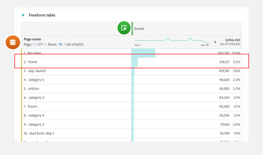

# Perguntas frequentes sobre análise guiada

{{release-limited-testing}}

Perguntas frequentes sobre análise guiada.

+++**A análise guiada está disponível para todos?**

Não; a análise guiada é um complemento pago do Customer Journey Analytics. Se quiser começar a usar este complemento, entre em contato com a equipe de conta do Adobe.

+++

+++**Quais alterações de implementação são necessárias para usar a análise guiada?**

Se você já estiver usando o Analysis Workspace no Customer Journey Analytics, nenhuma alteração de implementação adicional será necessária. A análise guiada usa as mesmas visualizações de dados e conexões que o Analysis Workspace. O processo para integrar e usar qualquer tipo de projeto é idêntico para todo o Customer Journey Analytics, incluindo análise guiada.

+++

+++**Como os termos se relacionam entre si dentro e fora da Análise guiada?**

A análise guiada usa termos mais usados no setor de análise de produtos. Você pode fazer referência a essa tabela ao alternar entre a Análise guiada e a Analysis Workspace.

| Termo de análise guiada | Termo do Analysis Workspace |
| --- | --- |
| Evento  | Métrica |
| Usuários | Pessoas |
| Propriedade | Dimensão |
| Valor | Item de dimensão |
| Segmento | Filtro |

{style="table-layout:auto"}

+++

+++**Quais são algumas diferenças em relação à forma como o Analysis Workspace e a análise guiada abordam a análise?**

Embora o Analysis Workspace e a Análise guiada usem os mesmos dados subjacentes, a maneira como cada ferramenta permite que você forme consultas desses dados é diferente.

* **O Analysis Workspace é uma experiência centralizada em dimensões.** As tabelas geralmente consistem em linhas de item de dimensão, enquanto as colunas normalmente são métricas. Aplique filtros a linhas e colunas para obter os dados desejados.

* **A análise guiada é uma experiência centrada em eventos.** As visualizações se concentram em eventos, usando dimensões e filtros para complementar esses dados.

Considere o exemplo a seguir em que você se concentra nos dados na página inicial do site. As equipes fazem perguntas semelhantes, mas a abordagem de análise pode ser diferente.

* Uma abordagem típica do Analysis Workspace centralizada em dimensão seria &quot;Quantas visualizações de página a página inicial recebeu?&quot;

  

* Uma abordagem típica de análise guiada centrada em eventos seria &quot;Quantos usuários visualizaram a página inicial?&quot;

  

Essas declarações ilustram dois métodos diferentes para obter o mesmo relatório, dependendo da estratégia de gerenciamento de eventos.

+++
