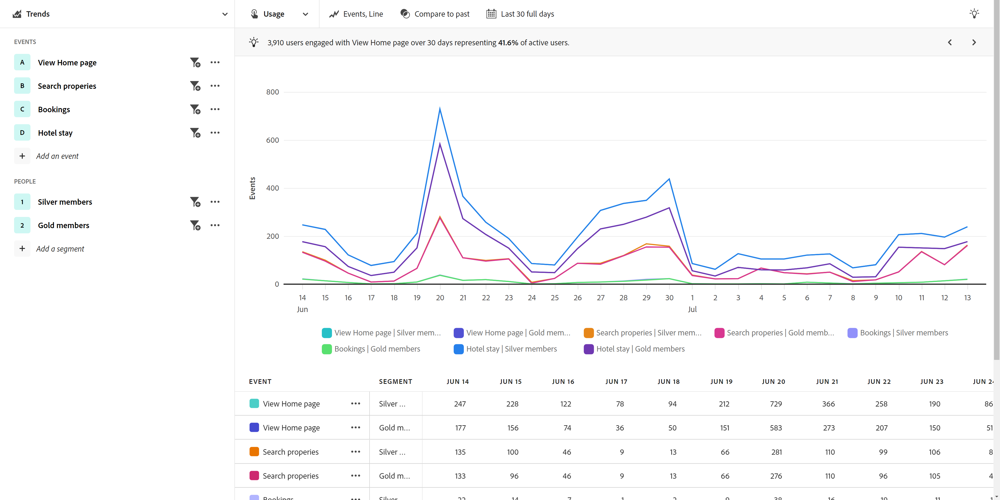
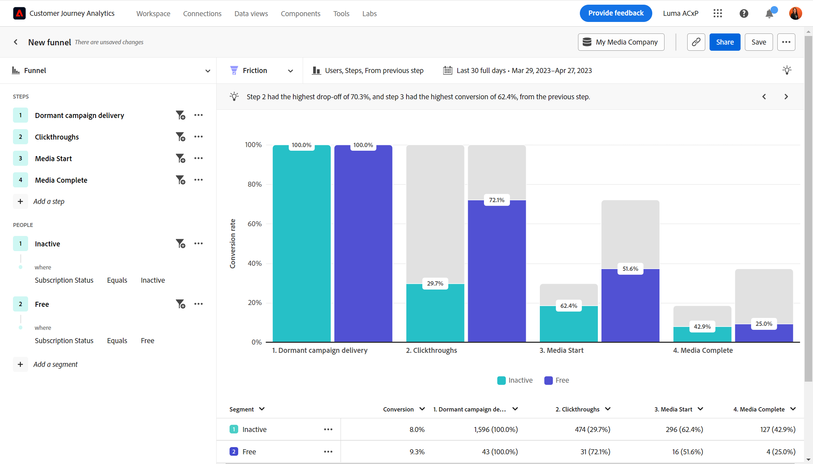
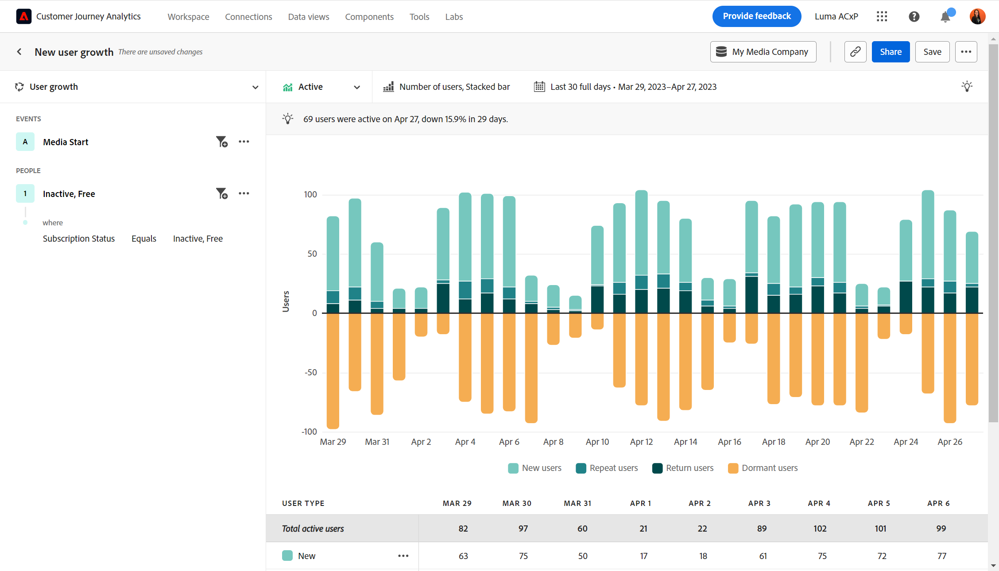
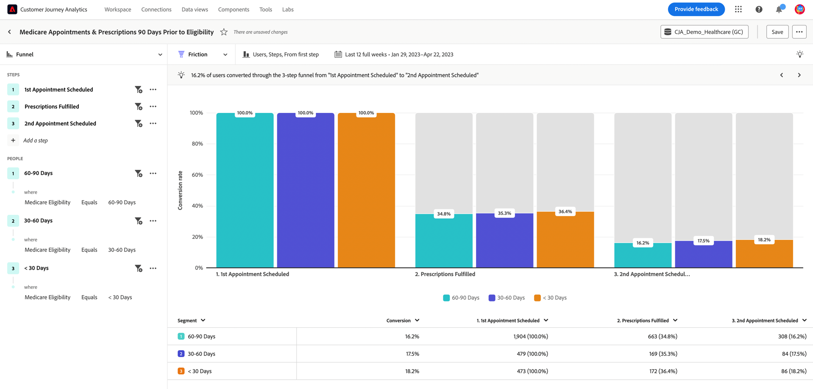

# Casos de uso do setor

Esta página fornece alguns exemplos ilustrativos do setor sobre o que as equipes de experiência do cliente, desde analistas a equipes de produtos e profissionais de marketing, podem realizar com a análise guiada.

+++**Varejo**

| Caso de uso | Exemplo | Impacto | Análise |
| --- | --- | --- | --- |
| **Otimizar o aplicativo móvel de compras** | Vários clientes baixaram o aplicativo móvel de uma organização, mas nunca voltaram. A empresa descobre que clientes usam o aplicativo apenas para a oferta inicial. Ela engaja esses clientes inativos novamente. | **Aumente o LTV de clientes em dispositivos móveis.** Avalie e impulsione o uso do aplicativo para desenvolver uma experiência de usuário mais satisfatória. | [Análise de crescimento ativo](types/active-growth.md) [Análise de crescimento líquido](types/net-growth.md) |
| **Quantificar o impacto dos novos recursos de check-out** | Uma mercearia dá uma chance a compras online. Ela avalia rapidamente o impacto de novos recursos de check-out, como recomendações de produtos ou coleta na calçada. | **Aumentar as taxas de conversão.** Avalie o impacto nos negócios ao invés de avaliar apenas o uso de recursos. | [Análise de impacto da versão](types/release-impact.md) [Análise de impacto no primeiro uso](types/first-use-impact.md) |
| **Reduzir o churn de assinaturas** | Uma organização descobre pontos de atrito em jornadas de clientes que resultam na perda de clientes. Permite conferir os programas de assinatura e analisar comportamentos de membros em risco. | **Reduzir o churn.** Identificar maneiras de promover e nutrir relacionamentos com clientes para evitar o atrito e reduzir o churn. | [Análise de crescimento ativo](types/active-growth.md) [Análise de funil](types/funnel.md) |
| **Encontrar jornadas de vendas ineficientes** | Uma organização descobre ineficiências na jornada de associados de vendas presenciais, o que afasta esses associados de clientes. Ela ajusta o seu processo, o que proporciona a clientes uma experiência de compra mais agradável na loja. | **Melhorar a resposta das vendas.** Reduza processos ineficientes, o que resulta em melhores jornadas internas e uma experiência positiva do cliente. | [Análise de funil](types/funnel.md) |

{style="table-layout:auto"}

{style="border:1px solid gray"}

{style="border:1px solid gray"}

+++

+++**Serviços financeiros**

| Caso de uso | Exemplo | Impacto | Análise |
| --- | --- | --- | --- |
| **Quantificar o impacto dos novos recursos** | Uma instituição financeira implanta transferências bancárias com Zelle e quer entender o impacto do novo recurso na finalização de transferências. A análise guiada permite ver como clientes reagem para que a equipe de marketing possa implantar o recurso. | **Aumentar as taxas de conversão.** Meça o impacto dos novos recursos nas conversões de transferência. | [Análise de impacto da versão](types/release-impact.md) [Análise de impacto no primeiro uso](types/first-use-impact.md) |
| **Desviar chamadas da central de atendimento** | A análise guiada revela que o processo de solicitação móvel em cinco etapas de uma organização gera chamadas para a central de atendimento. Ela cria um público-alvo e envia emails a esses clientes para entender melhor suas experiências. | **Isole o atrito na experiência.** Melhore as jornadas de “caminho feliz” e reduza as chamadas. | [Análise de funil](types/funnel.md) [Análise de tendências de conversão](types/conversion-trends.md) |
| **Reduzir churn do cliente** | Uma organização sabe que os clientes que fazem logon no aplicativo móvel do banco com frequência mensal permanecem por mais tempo. A análise guiada permite identificar quem está em risco de churn e criar uma estratégia de retorno. | **Reduzir o churn.** Mantenha o nível dos clientes enquanto investe na aquisição de novos clientes. | [Análise de crescimento ativo](types/active-growth.md) [Análise de crescimento líquido](types/net-growth.md) |
| **Recomendar novos recursos** | Uma organização observa que as retiradas digitais diminuíram nos últimos meses. O número de chamadas para um consultor financeiro aumentou. A análise guiada ajuda a organização a priorizar as otimizações do processo digital com um comitê diretor. | **Criar um roteiro orientado por dados.** Usar dados para planejar e implementar otimizações. | [Análise de tendências](types/trends.md) |

{style="table-layout:auto"}

{style="border:1px solid gray"}

{style="border:1px solid gray"}

{style="border:1px solid gray"}

+++

+++**Viagens e hospitalidade**

| Caso de uso | Exemplo | Impacto | Análise |
| --- | --- | --- | --- |
| **Quantificar o impacto dos novos recursos de fluxo de reserva** | Uma organização usa a análise guiada para visualizar rapidamente o impacto de um novo recurso da etapa de reserva nas taxas de conversão. Ela identifica a parte da experiência com os maiores ganhos. | **Aumentar as taxas de reserva.** Medir o impacto nos negócios em vez de medir apenas o uso de recursos. | [Análise de impacto da versão](types/release-impact.md) [Análise de funil](types/funnel.md) |
| **Otimizar a experiência do aplicativo móvel** | Uma organização entende de maneira rápida e fácil que usuários ativos do aplicativo por mês ao longo do tempo e identifica o impacto positivo por versão. | **Aumentar MAUs.** Medir e aumentar o uso do aplicativo, que está correlacionado à satisfação do cliente. | [Análise de crescimento ativo](types/active-growth.md) [Análise de crescimento líquido](types/net-growth.md) |
| **Encontrar atrito no fluxo de check-in móvel** | Ver onde as pessoas obtêm êxito ou quando desistem do processo de check-in em dispositivos móveis esperado permite que uma organização identifique áreas para otimização da experiência facilmente. | **Aumentar o CSAT e reduzir os IROPs.** A remoção do atrito leva a uma experiência de “dia de viagem” mais descomplicada. | [Análise de funil](types/funnel.md) [Análise de tendências de conversão](types/conversion-trends.md) |
| **Desviar chamadas da central de atendimento** | Ver a experiência do usuário em uma análise de funil mostra ao usuário onde os visitantes têm problemas, o que resulta em um volume oneroso para a central de atendimento. As próximas etapas para focar estão claras. | **Reduzir o uso da central de atendimento.** Obter mais experiências de usuário de “caminho feliz” e reduzir chamadas dispendiosas. | [Análise de funil](types/funnel.md) [Análise de tendências de conversão](types/conversion-trends.md) |

{style="table-layout:auto"}

{style="border:1px solid gray"}

{style="border:1px solid gray"}

{style="border:1px solid gray"}

+++

+++**Mídia e entretenimento**

| Caso de uso | Exemplo | Impacto | Análise |
| --- | --- | --- | --- |
| **Quantificar o impacto de novos programas ou séries** | Um serviço de streaming pode analisar os efeitos na audiência, após usuários assistirem a um novo programa ou série, e entender melhor qual conteúdo repercute. | **Aumentar a audiência.** Encontrar conteúdo que tenha o maior impacto na audiência. | [Análise de impacto do primeiro uso](types/first-use-impact.md) |
| **Identificar risco de churn** | Uma organização vê uma alta taxa de rotatividade de clientes que se inscrevem em sua plataforma para assistir a um evento sazonal e que cancelam imediatamente após o término do evento. A identificação rápida dessas pessoas permite a exibição de recomendações que motivem esses clientes a permanecerem engajados na plataforma. | **Manter assinantes felizes.** Encontrar conteúdo que engaje um segmento em crescimento para intervir com recomendações. | [Análise de crescimento ativo](types/active-growth.md) [Análise de crescimento líquido](types/net-growth.md) |
| **Encontrar oportunidades para venda adicional** | Uma parte vital para o crescimento da receita de uma organização é entender quais ofertas no aplicativo são mais atraentes para os fãs enquanto estão no estádio. A análise guiada permite ver exatamente quais ofertas são mais eficazes. | **Aumentar a receita auxiliar.** Entenda o impacto das ofertas no aplicativo na indução de comportamentos de compra. | [Análise de impacto no primeiro uso](types/first-use-impact.md) [Análise de funil](types/funnel.md) |
| **Otimizar a experiência entre dispositivos** | Uma organização deseja analisar como assinantes interagem com vários dispositivos/aplicativos. Essa informação permite entender os padrões de consumo de conteúdo e determinar para onde seria melhor redirecioná-los. | **Personalizar a experiência.** Entenda qual conteúdo mais repercute entre assinantes em cada dispositivo. | [Análise de tendências](types/trends.md) |
| **Desviar chamadas da central de atendimento** | Uma organização usa a análise guiada para identificar um problema em que o pagamento automático não está funcionando, o que levou clientes frustrados a entrarem em contato com a central de suporte para cancelar seus planos. | **Reduzir as chamadas de suporte.** Crie uma melhor experiência do cliente e diminua as chamadas para o atendimento ao cliente. | [Análise de funil](types/funnel.md) [Análise de tendências de conversão](types/conversion-trends.md) |

{style="table-layout:auto"}

{style="border:1px solid gray"}

{style="border:1px solid gray"}

{style="border:1px solid gray"}

+++

+++**Serviços de saúde**

| Caso de uso | Exemplo | Impacto | Análise |
| --- | --- | --- | --- |
| **Melhorar os resultados de saúde dos pacientes** | Uma organização tem os dados para concentrar seus esforços em crescimento. Antes de usar a análise guiada, ela não tinha uma compreensão clara de quantos membros do plano de bem-estar simplesmente pararam de usá-lo por semana. | **Reduzir as consultas médicas.** Usuários inativos rapidamente identificados para reengajamento. | [Análise de crescimento ativo](types/active-growth.md) |
| **Melhorar a experiência do paciente** | A visibilidade de quantos pacientes entram em contato com centrais de atendimento para uma simples redefinição de senha renovou a vontade de um analista de concentrar-se no fortalecimento da experiência do paciente. | **Reduzir o custo geral de atendimento.** Crie uma melhor experiência do paciente e diminua as chamadas para os serviços de pacientes. | [Análise de tendências](types/trends.md) [Análise de funil](types/funnel.md) |
| **Identificar ações repetidas entre canais por segmento** | Uma organização deseja entender o quão ativos os membros elegíveis do Medicare estão com o uso do plano para fornecer mensagens específicas em seus produtos digitais. Os insights obtidos com a análise guiada ajudam a tornar o marketing mais eficaz. | **Personalizar as opções de inscrição no Medicare.** Compare ações sequenciais comuns dos membros mais ativos do plano. | [Análise de funil](types/funnel.md) [Análise de crescimento ativo](types/active-growth.md) |
| **Mantenha os melhores talentos do setor** | Os recursos do Analytics para uma organização têm pouco tempo. A análise guiada permite que a organização obtenha rapidamente os dados de uso do produto necessários para chamadas de atualização da liderança. | **Reduza a carga de trabalho do analista.** Obter respostas mais rapidamente. Relatórios acessíveis quando é mais importante. | [Análise guiada](overview.md) |

{style="table-layout:auto"}

{style="border:1px solid gray"}

+++

+++**Alta tecnologia e B2B**

| Caso de uso | Exemplo | Impacto | Análise |
| --- | --- | --- | --- |
| **Quantificar o impacto dos novos recursos** | Uma organização pode analisar o aumento do uso de um novo recurso do produto e determinar quais segmentos funcionam melhor. Essa análise a ajuda a priorizar onde alocar recursos para maximizar o engajamento do usuário e fortalecer sua parceria com o marketing. | **Priorização orientada por dados.** Tome decisões fundamentadas sobre a alocação de recursos. | [Análise de impacto da versão](types/release-impact.md) [Análise de impacto do primeiro uso](types/first-use-impact.md) |
| **Identificar funções que estão subutilizando o produto** | Uma organização projeta um produto para ser usado por engenheiros, gerentes de produto e profissionais de marketing. A análise guiada mostrou que, embora os gerentes de produto e os profissionais de marketing o utilizem quase diariamente, a equipe de engenharia não o adotou. | **Aumentar a adoção de produtos.** Identifique rapidamente o comportamento do usuário de várias maneiras. | [Análise de crescimento ativo](types/active-growth.md) [Análise de crescimento líquido](types/net-growth.md) |
| **Remover pontos de atrito no processo de conversão** | Exigir um número de ordem de compra no fluxo de compra impede que usuários que preferem usar cartões de crédito concluam seus pedidos. As conversões aumentaram quando esse campo se tornou opcional. | **Melhore a experiência do cliente.** Reduza a possibilidade de churn. | [Análise de funil](types/funnel.md) [Análise de tendências de conversão](types/conversion-trends.md) |
| **Desbloquear análise de autoatendimento** | Obter acesso a insights é um desafio, e alguns usuários em uma organização não são treinados para análise. A análise guiada permite obter respostas e aproveitar os mesmos dados que o restante da organização usa, resultando em parcerias mais fortes e permitindo decisões realmente orientadas por dados. | **Parcerias mais próximas em toda a organização.** Conceda aos gerentes de produtos acesso aos dados colocados em silos anteriormente. | [Análise guiada](overview.md) |

{style="table-layout:auto"}

{style="border:1px solid gray"}

+++
