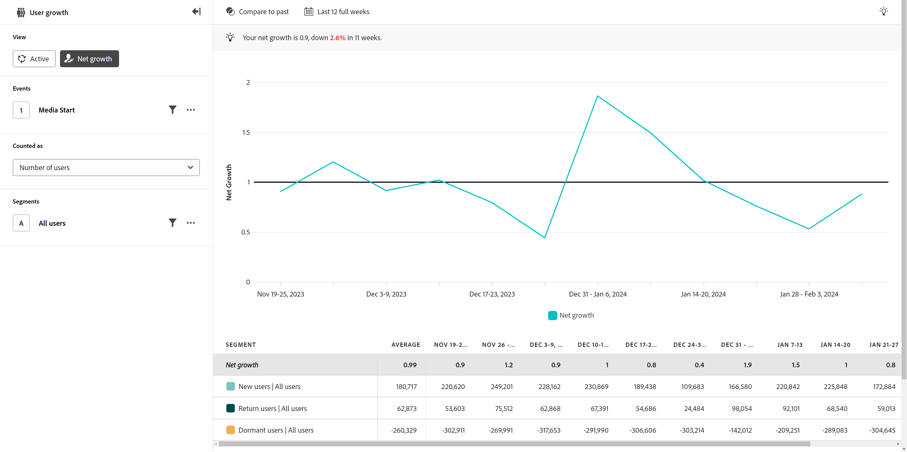

# Crescimento líquido

{{release-limited-testing}}

A variável **Crescimento líquido** o tipo de exibição fornece insights sobre a taxa em que você adquire ou perde usuários em um período específico. O eixo horizontal é sempre uma granularidade de tempo, enquanto o eixo vertical é sempre a medida do crescimento.

Cada ponto de dados representa o crescimento líquido do ponto de dados, que é calculado usando a seguinte fórmula:

`([New users] + [Return users]) / [Dormant users]`

Semelhante ao [Ativo](active.md) tipo de exibição, os usuários são definidos como o seguinte:

* **Novo**: o usuário estava ativo durante o ponto de dados atual e não apareceu em nenhum ponto de dados anterior.
* **Retornar**: o usuário não apareceu no ponto de dados imediatamente anterior, mas não é um novo usuário.
* **Inativo**: o usuário não apareceu no ponto de dados atual, mas apareceu no ponto de dados imediatamente anterior. Os usuários inativos não contam para o número total de usuários ativos.

**Repetir** os usuários não são considerados nesse cálculo, pois não representam crescimento ou perda.

O resultado dessa fórmula é uma proporção na qual sua base de usuários cresceu ou diminuiu durante esse ponto de dados. Um crescimento líquido de `1` representa um equilíbrio; o produto ganhou o mesmo número de usuários que perdeu. Um crescimento líquido maior do que `1` representa um crescimento positivo; havia mais usuários novos/de retorno do que usuários dormentes. Do mesmo modo, um crescimento líquido `1` representa uma perda de usuários ativos; havia mais usuários inativos do que usuários novos/de retorno.

Os casos de uso para esse tipo de exibição incluem:

* **Análise de aquisição de usuário**: permite avaliar a eficácia das estratégias de aquisição de usuários. A análise das fontes de crescimento do usuário, como mecanismos de pesquisa, campanhas ou outros canais de marketing, permite identificar as fontes mais significativas de crescimento, para que você possa alocar recursos adequadamente.
* **Avaliação de desempenho**: permite avaliar o desempenho geral do produto em termos de aquisição de novos usuários. Ao rastrear as tendências de crescimento, é possível entender melhor se o seu produto está atraindo e retendo usuários no ritmo desejado.
* **Análise de churn**: O crescimento líquido leva inclui o atrito em sua fórmula (usuários dormentes). Você pode avaliar a integridade geral de sua base de usuários ao longo do tempo. Se o crescimento líquido for consistentemente inferior a `1`Além disso, indica um alto desgaste, o que leva você a investigar os motivos por trás disso e implementar estratégias de retenção.

## Painel de consulta

O painel de consulta permite configurar os seguintes componentes:

* **Eventos**: o evento que você deseja medir. Como esse tipo de exibição é baseado no usuário, ele pode tocar no evento uma vez dentro da granularidade de data definida para estar no crescimento líquido. Você pode incluir apenas um evento em uma query.
* **Pessoas**: o segmento que você deseja medir. Você pode incluir apenas um segmento em uma consulta.

## Intervalo de datas

O período desejado. Há dois componentes importantes nessa configuração:

* **Interval**: a granularidade de data em que você deseja exibir os dados. As opções válidas incluem Diariamente, Semanalmente, Mensalmente e Trimestralmente. O mesmo intervalo de datas pode ter intervalos diferentes que afetam o número de pontos de dados no gráfico e o número de colunas na tabela. Por exemplo, a visualização de uma análise abrangendo três dias com granularidade diária mostraria apenas três pontos de dados, enquanto uma análise abrangendo três dias com granularidade horária mostraria 72 pontos de dados.
* **Data**: a data inicial e final. As predefinições de intervalo de datas estão disponíveis para sua conveniência ou você pode usar o seletor de calendário para definir a data exata desejada.
