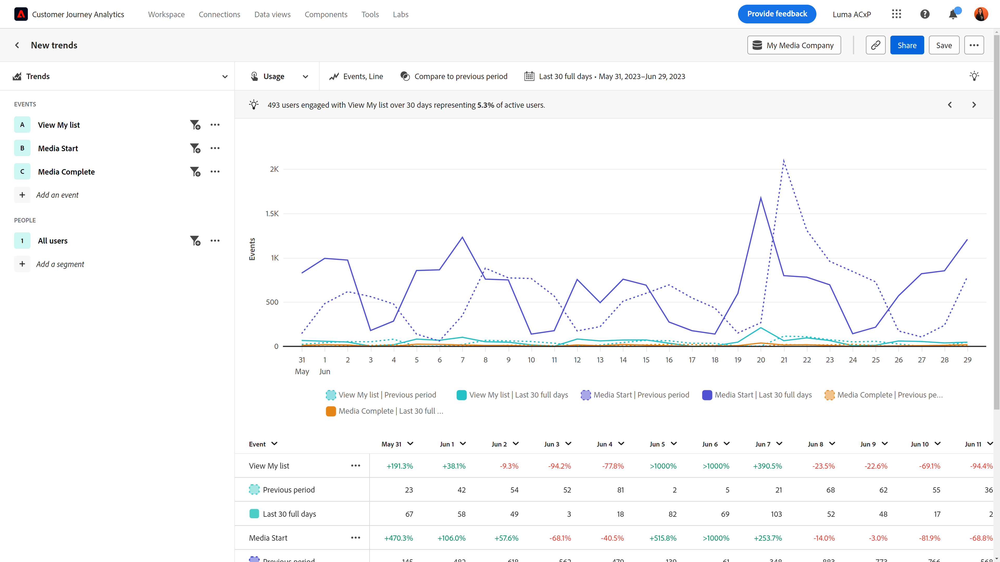

# Exibição de [!UICONTROL Uso]

A exibição **[!UICONTROL Uso]** fornece informações valiosas sobre o desempenho do produto ou o comportamento dos usuários ao longo do tempo. O eixo horizontal desse relatório é um intervalo de tempo, enquanto o eixo vertical mede os eventos desejados.

>[!VIDEO](https://video.tv.adobe.com/v/3421666/?learn=on)

## Casos de uso

Os casos de uso para esse tipo de exibição incluem:

* **Avaliar o desempenho do produto**: as tendências permitem avaliar o desempenho geral do produto em um determinado período. Analisando métricas como envolvimento do usuário, adoção ou taxas de conversão, você pode identificar se o desempenho do seu produto está melhorando, estagnando ou diminuindo.
* **Adoção de recursos**: as tendências permitem que você entenda como os usuários adotam novos recursos ou atualizações lançados. Você pode determinar quais recursos são populares e quais recursos precisam ser aprimorados. Essas informações permitem tomar decisões orientadas por dados sobre quais recursos priorizar seus esforços de desenvolvimento.
* **Comportamento do usuário**: as tendências podem fornecer informações sobre o comportamento do usuário ao longo do tempo. Ao examinar ações específicas que os usuários realizam, é possível identificar padrões em que os usuários podem cair. Você pode combinar insights desta exibição com [Atrito](friction.md) para obter ainda mais insights sobre o comportamento.
* **Teste A/B e experimentação**: se você executar testes A/B no produto, poderá usar as Tendências para medir quais testes são os mais bem-sucedidos ao longo do tempo.

## Painel de consulta

O painel de consulta permite configurar os seguintes componentes:

* **[!UICONTROL Exibir]**: alternar entre este tipo de modo de exibição e [Frequência](frequency.md).
* **[!UICONTROL Eventos e métricas]**: os eventos ou as métricas que você deseja medir. Cada seleção é representada como uma série de gráfico e uma linha de tabela. Eventos e métricas não podem ser combinados na consulta; uma vez feita a primeira seleção, as seleções de consulta restantes devem ser do mesmo tipo. É possível incluir até cinco seleções.
* **[!UICONTROL Contado como]**: o método de contagem que você deseja aplicar aos eventos selecionados. As opções incluem Eventos, Sessões, Usuários, Porcentagem de usuários, Eventos por sessão e Eventos por usuário. As opções contadas como são aplicáveis somente a consultas de eventos e são removidas para consultas de métricas.
* **[!UICONTROL Segmentos]**: os segmentos que você deseja medir. Cada segmento selecionado dobra o número de séries de gráficos e linhas de tabela. É possível incluir até cinco segmentos.
* **[!UICONTROL Detalhamento da propriedade]**: divide a série de gráficos e as linhas de tabela pelos valores da propriedade selecionada. Há suporte para uma única propriedade de detalhamento. Os 20 valores principais são exibidos na tabela e até dez valores podem ser exibidos no gráfico. Você pode ocultar ou expor uma linha no gráfico alternando o ícone .

## Configurações de gráficos

A exibição [!UICONTROL Uso] oferece as seguintes configurações de gráfico, que podem ser ajustadas no menu acima do gráfico:

* **[!UICONTROL Tipo de gráfico]**: o tipo de visualização que você deseja usar. As opções incluem Linha, Barra, Barra empilhada e Área empilhada.

## Sobreposições

Adicionar dados adicionais ao gráfico. Quando mais de uma série estiver visível no gráfico, as sobreposições serão exibidas somente ao passar o mouse.

* **[!UICONTROL Detecção de anomalias]**: executa a [detecção de anomalias](/help/analysis-workspace/c-anomaly-detection/anomaly-detection.md) na análise de tendências. Outliers são exibidos como pontos nos quais você pode passar o mouse para obter mais informações.
* **[!UICONTROL Sobreposição de linha de tendência]**: adiciona uma linha de tendência ao gráfico que ajuda a distinguir um padrão mais claro nos dados.
   * [!UICONTROL Linear]: cria uma linha de regressão reta. Melhor para dados lineares simples que aumentam ou diminuem a uma taxa estável. Equação: `y = a + b * x`
   * [!UICONTROL Logarítmico]: cria uma linha de regressão curva. Melhor para dados que aumentam ou diminuem rapidamente, depois se tornam mais nivelados. Equação: `y = a + b * log(x)`
   * [!UICONTROL Média móvel]: cria uma linha de tendência suave com base em um conjunto de médias. Também conhecida como média variável, uma média móvel usa um número específico de pontos de dados anteriores (determinado por sua seleção), faz a média deles e usa a média como o ponto na linha. Os exemplos incluem média móvel de sete dias ou média móvel de quatro semanas. As opções de média móvel disponíveis dependem do intervalo e do intervalo de datas selecionados.

## Comparação de tempo

{{apply-time-comparison}}

{style="border:1px solid gray"}

## Intervalo de datas

O intervalo de datas desejado para sua análise. Há dois componentes nessa configuração:

* **[!UICONTROL Intervalo]**: a granularidade de data pela qual você deseja exibir dados de tendência. As opções válidas incluem Por hora, Diariamente, Semanalmente, Mensalmente e Trimestralmente. O mesmo intervalo de datas pode ter intervalos diferentes que afetam o número de pontos de dados no gráfico e o número de colunas na tabela. Por exemplo, a visualização de uma análise abrangendo três dias com granularidade diária mostraria apenas três pontos de dados, enquanto uma análise abrangendo três dias com granularidade horária mostraria 72 pontos de dados.
* **[!UICONTROL Data]**: a data inicial e final. As predefinições de intervalo de datas contínuo e os intervalos personalizados salvos anteriormente estão disponíveis para sua conveniência ou você pode usar o seletor de calendário para escolher um intervalo de datas fixo.
