# Integrar IA de atribuição ao CJA

A [IA de atribuição](https://experienceleague.adobe.com/docs/experience-platform/intelligent-services/attribution-ai/overview.html?lang=pt-BR), como parte dos Serviços inteligentes da Adobe Experience Platform, é um serviço de atribuição de vários canais e algoritmos que calcula a influência e o impacto incremental das interações com o cliente em relação aos resultados especificados. Com a IA de atribuição, os profissionais de marketing podem medir e otimizar os gastos com marketing e publicidade, entendendo o impacto de cada interação individual com o cliente em cada fase das jornadas do cliente.

A IA de atribuição integra-se ao Customer Journey Analytics (CJA) na medida em que a IA de atribuição executa modelos em relação aos pontos de contato de marketing e às fontes de dados de conversão dos clientes. O CJA importa a saída desses modelos como um conjunto de dados ou ele pode ser integrado ao restante dos conjuntos de dados do CJA. Os conjuntos de dados habilitados para a IA de atribuição podem ser usados em exibições de dados e relatórios no CJA.

A IA de atribuição aceita 3 esquemas da Experience Platform: Evento de experiência, Adobe Analytics e Evento de experiência do consumidor.

A IA de atribuição aceita duas categorias de pontuações: algorítmica e baseada em regras.

## Pontuações algorítmicas

As pontuações algorítmicas incluem pontuações incrementais e influenciadas.

* **[!UICONTROL Pontuações] influenciadas** dividem 100% do crédito de conversão entre canais de marketing.
* **[!UICONTROL Pontuações] incrementais** primeiro consideram uma linha de base de conversão que você teria alcançado mesmo sem marketing. Essa linha de base depende de observações de padrões de IA, sazonalidade e assim por diante, devido ao reconhecimento da marca existente, lealdade e boca a boca. O crédito restante é dividido entre os canais de marketing.

## Pontuações baseadas em regras

As pontuações baseadas em regras incluem

* **[!UICONTROL Primeiro contato]** oferece 100% de crédito ao primeiro ponto de contato visto na janela de retrospectiva de atribuição.
* **[!UICONTROL Último contato]** oferece 100% de crédito ao ponto de contato mais recente antes da conversão.
* **[!UICONTROL Linear]** oferece crédito igual a todos os pontos de contato que resultem em uma conversão.
* **[!UICONTROL Em forma de U]** dá 40% de crédito para a primeira interação, 40% de crédito para a última interação e divide os 20% restantes para qualquer ponto de contato intermediário. Para conversões com um só ponto de contato, o crédito é de 100%. Para conversões com dois pontos de contato, o crédito é de 50% para ambos.
* **[!UICONTROL Declínio de tempo]** segue um declínio exponencial com um parâmetro personalizado de meia-vida e padrão de 7 dias. O peso de cada canal depende da quantidade de tempo decorrido entre a iniciação do ponto de contato e a conversão final. A fórmula usada para determinar o crédito é `2^(-t/halflife)`, em que `t` é o tempo entre um ponto de contato e uma conversão. Todos os pontos de contato são normalizados para 100%.

## Fluxo de trabalho

Algumas etapas são executadas na Adobe Experience Platform antes de trabalhar com a saída no CJA. A saída consiste em um conjunto de dados com um modelo de IA de atribuição aplicado.

### Etapa 1: Criar uma instância de IA de atribuição

Na Experience Platform, crie uma instância da IA de atribuição selecionando e mapeando dados, definindo eventos e treinando seus dados, conforme descrito [aqui](https://experienceleague.adobe.com/docs/experience-platform/intelligent-services/attribution-ai/user-guide.html?lang=pt-BR).

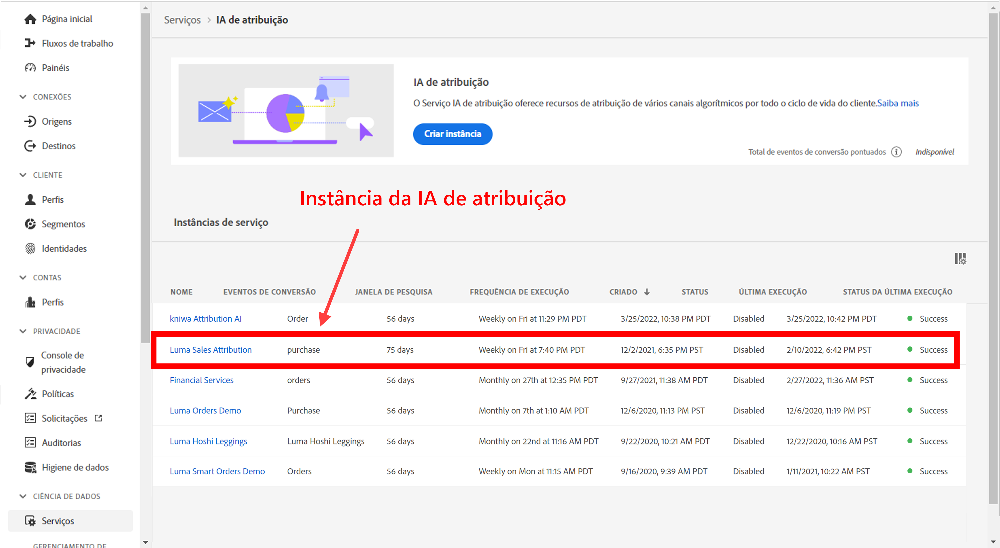

### Etapa 2: Configurar uma conexão do CJA com conjuntos de dados da IA de atribuição

No CJA, agora você pode [criar uma ou mais conexões](/help/connections/create-connection.md) para conjuntos de dados da Experience Platform que foram instrumentados para a IA de atribuição. Esses conjuntos de dados são exibidos com o prefixo “Pontuações da IA de atribuição”, como mostrado aqui:

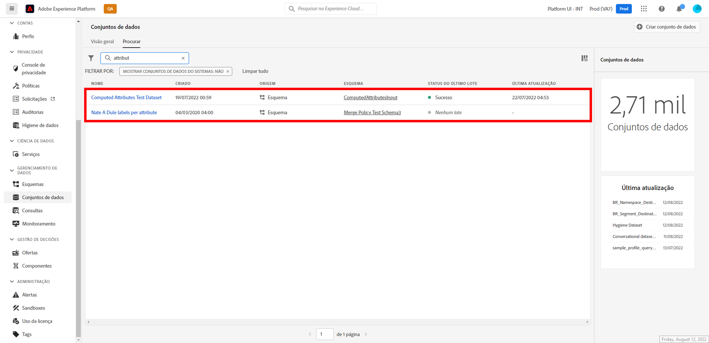

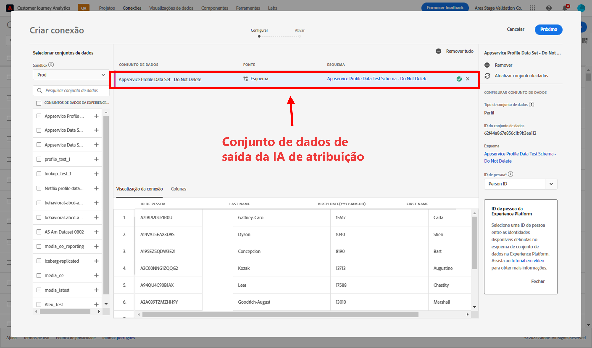

### Etapa 3: Criar visualizações de dados com base nessas conexões

No CJA, [criar uma ou mais visualizações de dados](/help/data-views/create-dataview.md) que contêm os campos XDM da IA de atribuição.

Estes são os campos de esquema XDM para pontos de contato:

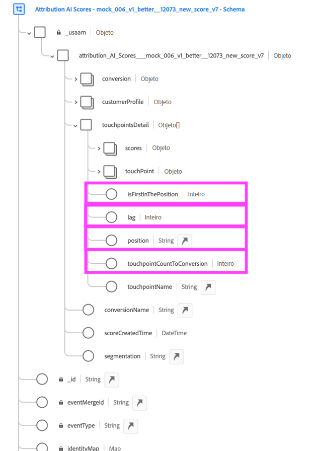

E aqui estão os campos de esquema XDM para conversão:

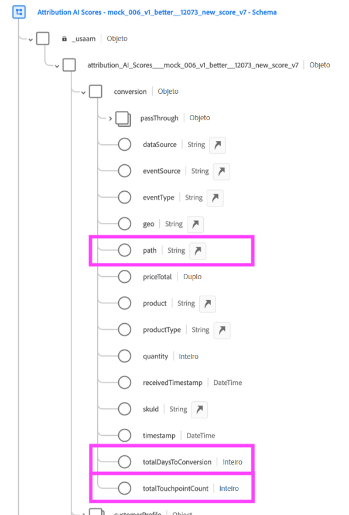

### Etapa 4: Relatório de dados da AAI no Espaço de trabalho do CJA

Em um projeto do Espaço de trabalho do CJA, você pode obter métricas como “Pedidos da AAI” e dimensões como “Nome da campanha da AAI” ou “Canal de marketing da AAI”, por exemplo.

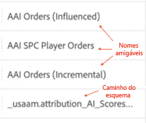

**Pedidos com pontuações influenciadas e incrementais**

Aqui vemos um projeto do Espaço de trabalho com dados da AAI que mostra pedidos com pontuações influenciadas e incrementais. Detalhe qualquer dimensão para entender a atribuição por: campanha, grupo de produtos, segmento de usuário, região e assim por diante.

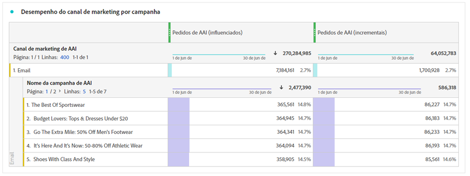

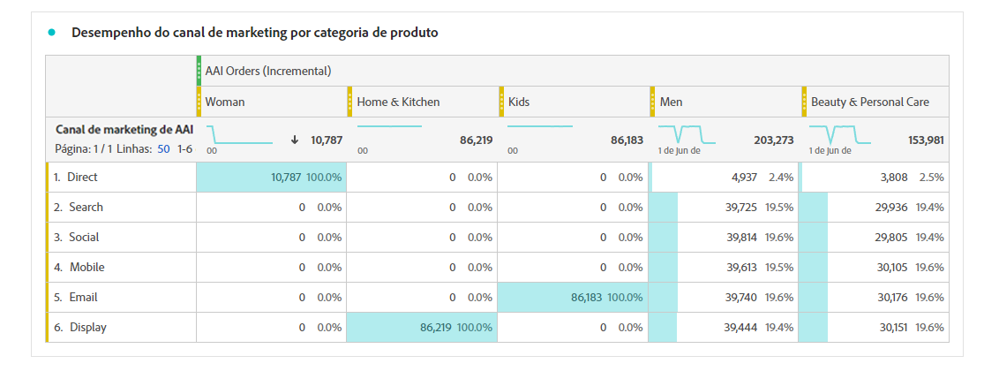

**Desempenho de marketing**

Compare e contraste a atribuição de pontos de contato entre diferentes modelos de atribuição:

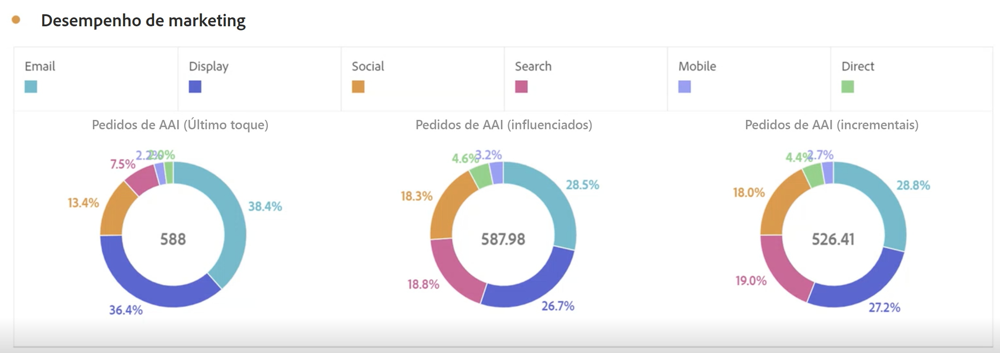

**Interação de canal**

Entenda a interação do canal para ver qual canal pode ser usado com mais eficiência com outros canais, usando um diagrama Venn:

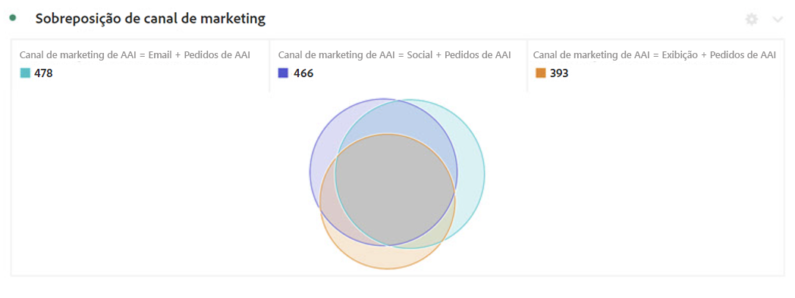

**Principais caminhos para conversão**

Esta tabela mostra os principais caminhos para a conversão (desduplicado) para ajudá-lo a criar e otimizar pontos de contato:

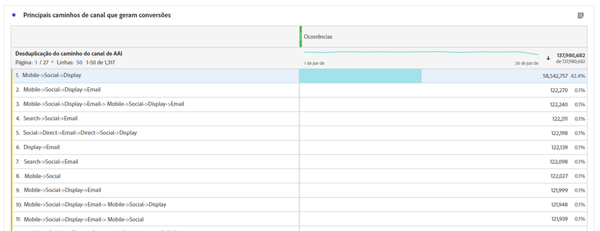

**Lead time para conversão**

Aqui, vemos o lead time para a conversão quando um ponto de contato está na combinação. Ajuda na otimização do lead time:

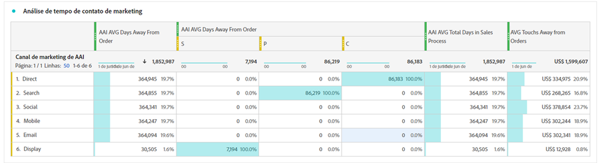

## Diferenças entre a IA de atribuição e o Attribution IQ

Quando você deve usar os dados da IA de atribuição e não o [Attribution IQ](/help/analysis-workspace/attribution/overview.md), um recurso nativo do CJA? Esta tabela mostra algumas das diferenças na funcionalidade:

| Funcionalidade | IA de atribuição | Attribution IQ |
| --- | --- | --- |
| Faz atribuição incremental | Sim | Não |
| Permite que os usuários ajustem o modelo | Sim | Sim |
| Faz atribuição em canais (Observação: o AAI não usa os mesmos dados compilados que o CJA usa.) | Sim | Sim |
| Inclui pontuações influenciadas | Sim | Sim |
| Faz modelagem de ML | Sim | Sim |
| Modelos de atribuição baseados em região | Sim | Sim |
| Pode configurar pontos de contato de marketing no modelo | Sim | Não |

{style=&quot;table-layout:auto&quot;}
