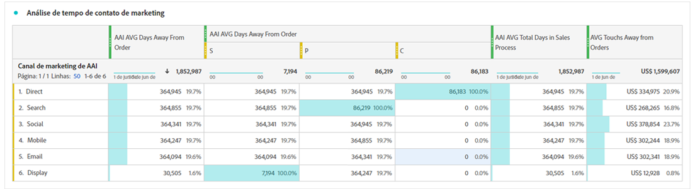

# Integrar o Attribution AI ao CJA

[Attribution AI](https://experienceleague.adobe.com/docs/experience-platform/intelligent-services/attribution-ai/overview.html?lang=en), como parte dos Serviços inteligentes da Adobe Experience Platform, é um serviço de atribuição de vários canais e algoritmos que calcula a influência e o impacto incremental das interações com o cliente em relação aos resultados especificados. Com o Attribution AI, os profissionais de marketing podem medir e otimizar os gastos com marketing e publicidade, entendendo o impacto de cada interação individual com o cliente em cada fase das jornadas do cliente.

O Attribution AI integra-se ao Customer Journey Analytics (CJA) na medida em que o Attribution AI executa modelos em relação aos pontos de contato de marketing e às fontes de dados de conversão dos clientes. O CJA então importa a saída desses modelos como um conjunto de dados ou ele pode ser integrado ao restante dos conjuntos de dados do CJA. Os conjuntos de dados habilitados para o Attribution AI podem ser aproveitados em exibições de dados e relatórios no CJA.

O Attribution AI suporta 3 esquemas de Experience Platform: Evento de experiência, Adobe Analytics e Evento de experiência do consumidor.

O Attribution AI suporta duas categorias de pontuações: algorítmico e baseado em regras.

## Pontuações algorítmicas

As pontuações algorítmicas incluem pontuações incrementais e influenciadas.

* **[!UICONTROL Influenciado] pontuações** divida 100% do crédito de conversão entre canais de marketing.
* **[!UICONTROL Incremental] pontuações** primeiro, considere uma linha de base de conversão que você teria alcançado mesmo sem marketing. Essa linha de base depende de observações de IA de padrões, sazonalidade e assim por diante, devido ao reconhecimento de marca, fidelidade e palavra de boca existentes. O crédito restante é dividido entre os canais de marketing.

## Pontuações baseadas em regras

As pontuações baseadas em regras incluem

* **[!UICONTROL Primeiro contato]** dá 100% de crédito ao primeiro ponto de contato visto na janela de retrospectiva de atribuição.
* **[!UICONTROL Último contato]** O atribui 100% do crédito ao ponto de contato que ocorreu mais recentemente antes da conversão.
* **[!UICONTROL Linear]** dá crédito igual a todos os pontos de contato que resultem em uma conversão.
* **[!UICONTROL Forma de U]** dá crédito de 40% à primeira interação, de 40% à última interação e divide os 20% restantes para os pontos de contato entre as duas. Para conversões com um só ponto de contato, o crédito é de 100%. Para conversões com dois pontos de contato, o crédito é de 50% para ambos.
* **[!UICONTROL Declínio de tempo]** O segue um declínio exponencial com um parâmetro personalizado de meia-vida, onde o padrão é 7 dias. O peso de cada canal depende da quantidade de tempo decorrido entre a iniciação do ponto de contato e a conversão final. A fórmula usada para determinar o crédito é `2^(-t/halflife)`, em que `t` é o tempo entre um ponto de contato e uma conversão. Todos os pontos de contato são normalizados para 100%.

## Fluxo de trabalho

Algumas etapas são executadas no Adobe Experience Platform antes de trabalhar com a saída no CJA. A saída consiste em um conjunto de dados com um modelo de Attribution AI aplicado.

### Etapa 1: Criar uma instância do Attribution AI

No Experience Platform, crie uma instância do Attribution AI selecionando e mapeando dados, definindo eventos e treinando seus dados, conforme descrito [here](https://experienceleague.adobe.com/docs/experience-platform/intelligent-services/attribution-ai/user-guide.html).

### Etapa 2: Configurar uma conexão CJA com conjuntos de dados do Attribution AI

No CJA, agora você pode [criar uma ou mais conexões](/help/connections/create-connection.md) para conjuntos de dados de Experience Platform que foram instrumentados para o Attribution AI. Esses conjuntos de dados são exibidos com o prefixo &quot;Pontuações de Attribution AI&quot;, como mostrado aqui:

### Etapa 3: Criar visualizações de dados com base nessas conexões

No CJA, [criar uma ou mais visualizações de dados](/help/data-views/create-dataview.md) que contêm os campos XDM do Attribution AI.

Estes são os campos de esquema XDM para pontos de contato:

E aqui estão os campos de esquema XDM para conversão:

### Etapa 4: Relatório de dados do AAI no CJA Workspace

Em um projeto do CJA Workspace, você pode obter métricas como &quot;Pedidos de AAI&quot; e dimensões como &quot;Nome da campanha AAI&quot; ou &quot;Canal de marketing AAI&quot;, por exemplo.

>[!IMPORTANT]
>
>Essas dimensões e métricas não são nomeadas nativamente dessa maneira. Esses são &quot;nomes amigáveis&quot;. O [convenção de nomenclatura no Attribution AI](https://experienceleague.adobe.com/docs/experience-platform/intelligent-services/attribution-ai/input-output.html?lang=en#attribution-ai-output-data) segue o caminho do esquema. Recomendamos renomear os nomes longos de caminho do esquema do AAI para nomes curtos e mais amigáveis (dimensões/métricas) no CJA. Você pode fazer isso em **[!UICONTROL Visualizações de dados]** > **[!UICONTROL Editar visualização de dados]** > **[!UICONTROL Componentes]** guia > **[!UICONTROL Campos de esquema]** -> Clique em um campo de esquema -> **[!UICONTROL Nome do componente]**.

**Pedidos com pontuações influenciadas e incrementais**

Aqui vemos um projeto do Workspace com dados do AAI que mostra pedidos com pontuações influenciadas e incrementais. Detalhe qualquer dimensão para entender a atribuição por: campanha, grupo de produtos, segmento de usuário, geografia e assim por diante.

**Desempenho de marketing**

Comparar e contrastar atribuição de ponto de contato entre diferentes modelos de atribuição:

**Interação de canal**

Entenda a interação do canal para ver qual canal pode ser usado com mais eficiência com outros canais, usando um diagrama Venn:

**Principais caminhos para conversão**

Esta tabela mostra os principais caminhos para a conversão (desduplicado) para ajudá-lo a criar e otimizar pontos de contato:

**Lead time para conversão**

Aqui, vemos o lead time para a conversão quando um ponto de contato está na combinação. Ajuda na otimização do lead time:

## Diferenças entre o Attribution AI e o Attribution IQ

Portanto, quando você deve usar os dados do Attribution AI versus [Attribution IQ](/help/analysis-workspace/attribution/overview.md), um recurso CJA nativo? Esta tabela mostra algumas das diferenças na funcionalidade:

| Funcionalidade | Attribution AI | Attribution IQ |
| --- | --- | --- |
| A atribuição incremental | Sim | Não |
| Permite que os usuários ajustem o modelo | Sim | Sim |
| A atribuição em canais (Observação: O AAI não usa os mesmos dados compilados que o CJA usa.) | Sim | Sim |
| Inclui pontuações influenciadas | Sim | Sim |
| Modelagem do Does ML | Sim | Sim |
| Modelos de atribuição baseados em região | Sim | Sim |
| Pode configurar pontos de contato de marketing no modelo | Sim | Não |

{style=&quot;table-layout:auto&quot;}
