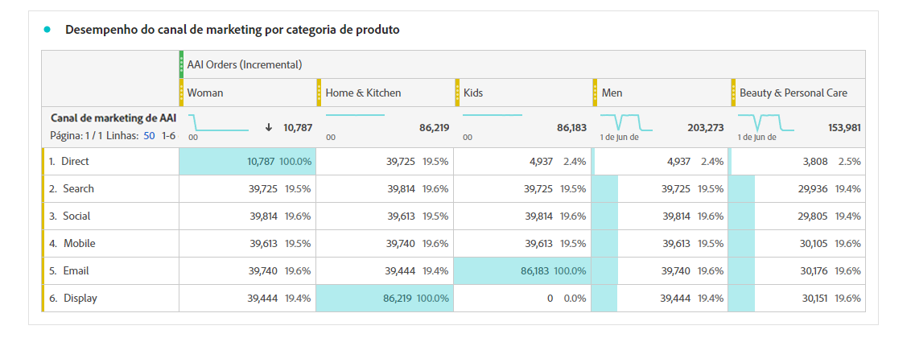

# Integrar o Attribution AI ao CJA

>[!NOTE]
>
>Essa funcionalidade será lançada em 25 de maio de 2022.

[Attribution AI](https://experienceleague.adobe.com/docs/experience-platform/intelligent-services/attribution-ai/overview.html?lang=en), como parte dos Serviços inteligentes da Adobe Experience Platform, é um serviço de atribuição de vários canais e algoritmos que calcula a influência e o impacto incremental das interações com o cliente em relação aos resultados especificados. Com o Attribution AI, os profissionais de marketing podem medir e otimizar os gastos com marketing e publicidade, entendendo o impacto de cada interação individual com o cliente em cada fase das jornadas do cliente.

O Attribution AI suporta duas categorias de pontuações: algorítmico e baseado em regras. As pontuações algorítmicas incluem pontuações incrementais e influenciadas.

* **Pontuações influenciadas** divida 100% do crédito de conversão entre canais de marketing.
* **Pontuações incrementais** primeiro, considere uma linha de base de conversão que você teria alcançado mesmo sem marketing. Essa linha de base depende de observações de IA de padrões, sazonalidade e assim por diante, devido ao reconhecimento de marca, fidelidade e palavra de boca existentes. O crédito restante é dividido entre os canais de marketing.

As pontuações baseadas em regras incluem [!UICONTROL Primeiro contato], [!UICONTROL Último contato], [!UICONTROL Linear], [!UICONTROL Forma de U]e [!UICONTROL Declínio de tempo]. O Attribution AI suporta 3 esquemas de Experience Platform: Evento de experiência, Adobe Analytics e Evento de experiência do consumidor.

O Attribution AI integra-se ao Customer Journey Analytics (CJA) na medida em que o Attribution AI executa modelos em relação a dados e, em seguida, o CJA importa a saída desses modelos como um conjunto de dados, que pode ser integrado ao restante dos conjuntos de dados do CJA. Os conjuntos de dados habilitados para o Attribution AI podem ser aproveitados em exibições de dados e relatórios no CJA.

## Fluxo de trabalho

Algumas etapas são executadas no Adobe Experience Platform antes de trabalhar com a saída no CJA. A saída consiste em um conjunto de dados com um modelo de Attribution AI aplicado.

### Etapa 1: Criar uma instância do Attribution AI

No Experience Platform, crie uma instância do Attribution AI selecionando e mapeando dados, definindo eventos e treinando seus dados, conforme descrito [here](https://experienceleague.adobe.com/docs/experience-platform/intelligent-services/attribution-ai/user-guide.html).

### Etapa 2: Configurar uma conexão CJA com conjuntos de dados do Attribution AI

No CJA, agora você pode [criar uma ou mais conexões](/help/connections/create-connection.md) para conjuntos de dados de Experience Platform que foram instrumentados para o Attribution AI. Esses conjuntos de dados são exibidos com o prefixo &quot;Pontuações de Attribution AI&quot;, como mostrado aqui:

### Etapa 3: Criar visualizações de dados com base nessas conexões

No CJA, [criar uma ou mais visualizações de dados](/help/data-views/create-dataview.md) que contêm os campos XDM do Attribution AI. (Seria ótimo ter uma captura de tela aqui.)

### Etapa 4: Relatório de dados do AAI no CJA Workspace

Em um projeto do CJA Workspace, você pode obter métricas como &quot;Pedidos de AAI&quot; e dimensões como &quot;Nome da campanha AAI&quot; ou &quot;Canal de marketing AAI&quot;, por exemplo.

Aqui vemos um projeto do Workspace com dados do AAI que mostra pedidos com pontuações influenciadas e incrementais. Detalhe qualquer dimensão para entender a atribuição por: campanha, grupo de produtos, segmento de usuário, geografia e assim por diante.

Entenda a interação do canal para ver qual canal pode ser usado com mais eficiência com outros canais:

Esta tabela mostra os principais caminhos para a conversão (desduplicado) para ajudá-lo a criar e otimizar pontos de contato:

Aqui, vemos o lead time para a conversão quando um ponto de contato está na combinação. Ajuda na otimização do lead time:

## Novas métricas do CJA

| Métrica | Descrição |
| --- | --- |
| [!UICONTROL Taxa de aquisição] | Para cada canal, entre os caminhos de conversão que tocou, a porcentagem do canal é o Inicial. |
| [!UICONTROL Taxa do player] | Para cada canal, entre os caminhos de conversão que tocou, a porcentagem do canal é um Player. |
| [!UICONTROL Taxa mais próxima] | Para cada canal, entre os caminhos de conversão que ele tocou, a porcentagem do canal é o Fechador. |
| [!UICONTROL AAI AVG Dias longe do pedido] | Para cada canal, o número médio de dias desde o pedido. |
| [!UICONTROL Total de dias do AAI AVG em processo de vendas] | Para cada canal, o total médio de dias dos caminhos de conversão que ele tocou. |
| [!UICONTROL AVG se afasta da ordem] | Para cada canal, a média se afasta da ordem. |

## Diferenças entre o Attribution AI e o Attribution IQ

Portanto, quando você deve usar os dados do Attribution AI versus [Attribution IQ](/help/analysis-workspace/attribution/overview.md), um recurso CJA nativo? Esta tabela mostra algumas das diferenças na funcionalidade:

| Funcionalidade | Attribution AI | Attribution IQ |
| --- | --- | --- |
| Atribuição fracionária | Sim | Não |
| Permite que os usuários ajustem o modelo | Sim | Sim |
| A atribuição em canais (Observação: O AAI não usa os mesmos dados compilados que o CJA usa.) | Sim | Sim |
| Inclui pontuações incrementais e influenciadas | Sim | Não |
| Modelagem do Does ML | Sim | Sim |
| Modelagem do ML com previsões | Sim | Não |

{style=&quot;table-layout:auto&quot;}
