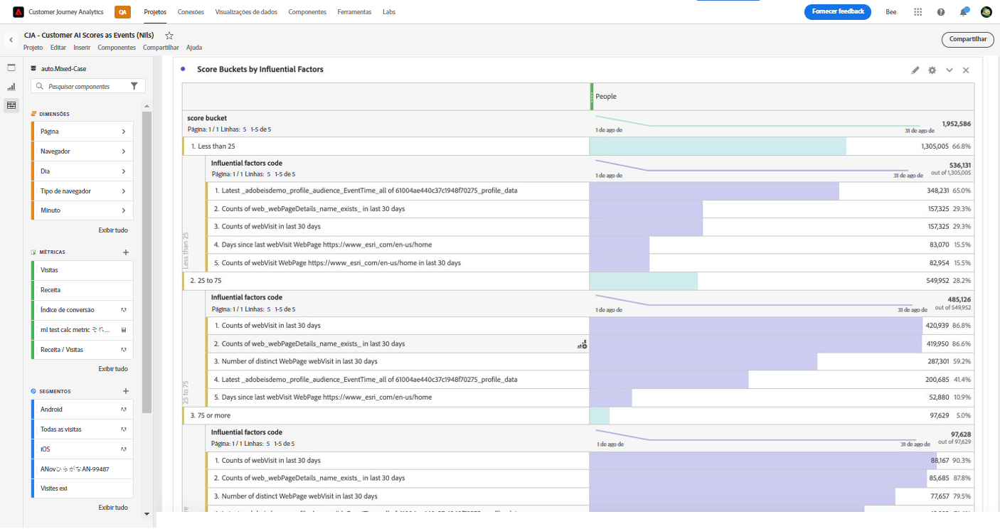

# Integrar os dados da IA do cliente à Adobe Customer Journey Analytics

{{release-limited-testing}}

A [IA do cliente](https://experienceleague.adobe.com/docs/experience-platform/intelligent-services/customer-ai/overview.html?lang=pt-BR), como parte dos Serviços inteligentes da Adobe Experience Platform, fornece aos profissionais de marketing o poder de gerar previsões de clientes individualmente.

Com a ajuda de fatores influentes, a IA do cliente pode informar o que um cliente deve fazer e por quê. Além disso, os profissionais de marketing podem se beneficiar das previsões e insights da IA do cliente para personalizar as experiências do cliente, disponibilizando as ofertas e mensagens mais apropriadas.

A IA do cliente depende de dados comportamentais individuais e de dados de perfil para pontuação de propensão. A IA do cliente é flexível, pois pode receber várias fontes de dados, incluindo Adobe Analytics, Adobe Audience Manager, dados de eventos de experiência do consumidor e dados de eventos de experiência. Se você usar o conector de origem da Experience Platform para trazer os dados do Adobe Audience Manager e do Adobe Analytics, o modelo seleciona automaticamente os tipos de evento padrão para treinar e pontuar o modelo. Se você trouxer seu próprio conjunto de dados de Evento de experiência sem tipos de evento padrão, todos os campos relevantes precisarão ser mapeados como eventos personalizados ou atributos de perfil se você quiser usá-lo no modelo. Isso pode ser feito na etapa de configuração da IA do cliente na Experience Platform.

A IA do cliente pode se integrar ao Customer Journey Analytics na medida em que os conjuntos de dados habilitados para a IA do cliente possam ser aproveitados nas visualizações de dados e relatórios no Customer Journey Analytics. É possível:

* **Rastrear as pontuações de propensão para um segmento de usuários ao longo do tempo**.
   * Caso de uso: entender a probabilidade de conversão de clientes em um segmento específico.
   * Exemplo: um profissional de marketing em uma cadeia de hotéis quer entender a probabilidade de um cliente de hotel comprar um ingresso para um show no teatro do hotel.
* **Analisar quais eventos ou atributos de sucesso estão associados às pontuações de propensão**.
   * Caso de uso: entender os atributos ou eventos de sucesso associados às pontuações de propensão.
   * Exemplo: um profissional de marketing de uma cadeia de hotéis quer entender como as compras de ingressos para shows no teatro de um hotel estão associadas às pontuações de propensão.
* **Siga o fluxo de entrada para a propensão do cliente em diferentes execuções de pontuação**.
   * Caso de uso: entender as pessoas que eram inicialmente usuários de baixa propensão e, com o tempo, se tornaram usuários de alta propensão.
   * Exemplo: um profissional de marketing em uma cadeia de hotéis quer entender quais clientes de hotel foram identificados inicialmente como clientes com baixa propensão para comprar um ingresso para um show, mas com o tempo se tornou cliente com alta propensão para comprar um ingresso para um show.
* **Veja a distribuição da propensão**.
   * Caso de uso: entenda a distribuição das pontuações de propensão para ser mais preciso na definição de segmentos.
   * Exemplo: um varejista deseja executar uma promoção específica por US$ 50 de desconto em um produto. Eles podem querer executar apenas uma promoção muito limitada devido ao orçamento, etc. Eles analisam os dados e decidem segmentar apenas os 80%+ de seus clientes.
* **Examine a propensão para realizar uma ação para um coorte específico ao longo do tempo**.
   * Caso de uso: rastrear um coorte específico ao longo do tempo.
   * Exemplo: um profissional de marketing em uma cadeia de hotéis deseja rastrear o nível bronze em relação ao nível prata, ou nível prata em relação ao nível ouro, ao longo do tempo. Eles podem ver a propensão de cada coorte para reservar o hotel ao longo do tempo.

Para integrar de fato os dados da IA do cliente ao Customer Journey Analytics, siga estas etapas:

>[!NOTE]
>
>Algumas etapas são executadas no Adobe Experience Platform antes de trabalhar com a saída no Customer Journey Analytics.

## Etapa 1: Configurar uma instância da IA do cliente

Depois de preparar seus dados e ter todas as credenciais e esquemas em vigor, comece seguindo o guia [Configurar uma instância da IA do cliente](https://experienceleague.adobe.com/docs/experience-platform/intelligent-services/customer-ai/user-guide/configure.html?lang=pt-BR) na Adobe Experience Platform.

## Etapa 2: Configurar uma conexão de Customer Journey Analytics para conjuntos de dados da IA do cliente

No Customer Journey Analytics, agora é possível [criar uma ou mais conexões](/help/connections/create-connection.md) para conjuntos de dados de Experience Platform que foram instrumentados para a IA do cliente. Cada previsão, como “Probabilidade de atualização da conta”, equivale a um conjunto de dados. Esses conjuntos de dados são exibidos com o prefixo “Pontuações da IA do cliente no formato EE - nome_do_aplicativo”.

>[!IMPORTANT]
>
>Cada instância da IA do cliente tem dois conjuntos de dados de saída se o botão estiver ativado para ativar pontuações para o Customer Journey Analytics durante a configuração na Etapa 1. Um conjunto de dados de saída é exibido no formato XDM do perfil e um no formato XDM do evento da experiência.

Este é um exemplo de um esquema XDM que o Customer Journey Analytics traria como parte de um conjunto de dados existente ou novo:

(Observe que o exemplo é um conjunto de dados de perfil; o mesmo conjunto de objetos de esquema faria parte de um conjunto de dados de Evento de experiência que o Customer Journey Analytics capturaria. O conjunto de dados do Evento de experiência incluiria carimbos de data e hora como a data da pontuação.) Cada cliente classificado neste modelo teria uma pontuação, uma scoreDate, etc. associada a eles.

## Etapa 3: Criar visualizações de dados com base nessas conexões

No Customer Journey Analytics, agora você pode prosseguir para [criar visualizações de dados](/help/data-views/create-dataview.md) com as dimensões (como pontuação, data de pontuação, probabilidade etc.) e métricas que foram trazidas como parte da conexão estabelecida.

## Etapa 4: Relatório das pontuações de CAI no Workspace

No Espaço de trabalho do Customer Journey Analytics, crie um novo projeto e extraia visualizações.

### Pontuações de propensão de tendência

Este é um exemplo de um projeto do Workspace com dados de CAI que realiza a tendência das pontuações de propensão para um segmento de usuários ao longo do tempo, em &#x200B;um gráfico de barras empilhadas:

### Tabela com códigos de motivo

É uma tabela que mostra códigos de motivo pelo qual um segmento tem alta ou baixa propensão:

### Fluxo de entrada para propensão do cliente

Este diagrama de fluxo mostra o fluxo de entrada para a propensão do cliente em diferentes execuções de pontuação &#x200B;:

### Distribuição das pontuações de propensão

Este gráfico de barras mostra a distribuição das pontuações de propensão:

### Sobreposições de propensão

Este diagrama Venn mostra as sobreposições de propensão em diferentes execuções de pontuação:

