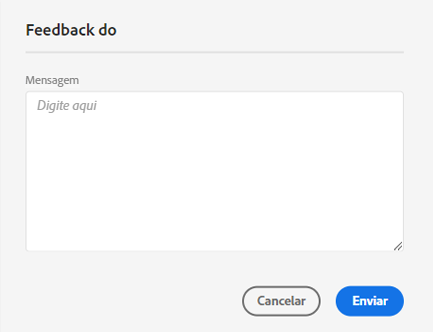
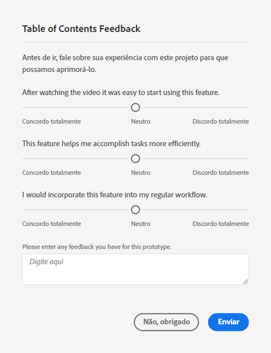

# Guia do usuário do [!UICONTROL Labs]

O [!UICONTROL Labs] permite a prototipagem mais rápida de ideias em fase inicial. É uma combinação de ferramentas e processos que acelera o desenvolvimento de forma transparente, com foco no cliente. Isso permite que os usuários se envolvam com tecnologias emergentes, descubram informações valiosas e influenciem o desenvolvimento e as prioridades de recursos futuros. Você pode usar o Labs para obter acesso antecipado às inovações da Adobe Customer Journey Analytics e avaliar os recursos futuros no contexto de casos de uso e dados de sua empresa.

>[!IMPORTANT]
>
>O Customer Journey Analytics Labs não é um serviço pronto para HIPAA e não pode ser usado para processar dados pessoais confidenciais, incluindo dados de saúde permitidos (como informações de saúde pessoal ou PHI) que sua organização pode ter permissão para usar no Customer Journey Analytics.

## Requisitos

O [!UICONTROL Labs] é ativado automaticamente para todos os administradores. Outros membros da equipe devem entrar em contato com os administradores do produto e solicitar acesso.

Se você ainda não tiver feito isso, leia e assine os formulários do Contrato de não divulgação e dos Termos e condições aplicáveis.

## Acesse o portal do [!UICONTROL Labs]

Para acessar o [!UICONTROL Labs]:

1. Caso ainda não tenha acesso ao [!UICONTROL Workspace] e ao [!UICONTROL Labs], peça as credenciais ao seu administrador.

1. No Customer Journey Analytics, clique na guia **[!UICONTROL Labs]**.

## Avaliar um protótipo

Para iniciar e avaliar um protótipo:

1. Na tela do [!UICONTROL Labs], clique no botão **[!UICONTROL Iniciar]** do protótipo que deseja ver. Quando o protótipo for iniciado, você verá seu nome no canto superior esquerdo do ambiente do protótipo.

   adicionar captura de tela aqui

1. Assista ao vídeo que destaca o protótipo clicando em **[!UICONTROL Assistir ao vídeo]** no canto superior direito da tela. Clique em **[!UICONTROL Fechar]** quando o vídeo for concluído.

   adicionar captura de tela aqui

1. Trabalhar com o protótipo. Ao trabalhar no ambiente de protótipo:

* Os projetos criados no ambiente de protótipo não podem ser salvos ou compartilhados.

* Em um protótipo, é possível avaliar os dados com qualquer dimensão, métrica, segmento e visualização que você tenha acesso a partir do Workspace.

* Quaisquer alterações feitas em um protótipo não afetarão a coleta ou o processamento de dados.

* As alterações feitas ao criar ou modificar segmentos, métricas calculadas e alertas são mantidas fora do ambiente do protótipo.

## Deixar feedback

1. Clique em **[!UICONTROL Fornecer feedback]** para fornecer feedback na caixa de mensagem a qualquer momento ao trabalhar com o protótipo.

   

1. Clique em **[!UICONTROL Enviar]** para enviar seu feedback.

1. Para experimentar um protótipo diferente ou sair do ambiente do protótipo, clique em **[!UICONTROL Sair do protótipo]**, no canto superior direito da tela, e conclua a breve pesquisa do protótipo. As mudanças feitas em um projeto de protótipo são perdidas ao sair do ambiente do protótipo.

   

1. Clique em **[!UICONTROL Enviar]** para retornar ao portal Visualizações principal.

## Informações adicionais

* Alguns protótipos no [!UICONTROL Labs] se tornam recursos do Customer Journey Analytics, outros não. Seus comentários guiam a decisão, portanto, reveja os protótipos e informe à Adobe o quanto você os acha valiosos.
* O Labs está disponível para todos os direitos de SKU.
