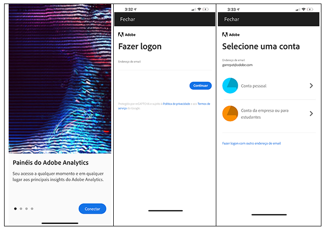
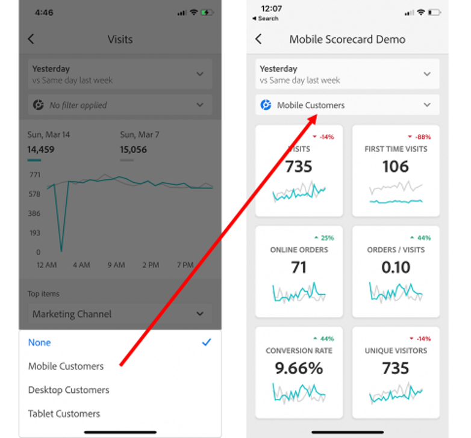

# Painéis do Analytics: guia de início rápido do usuário executivo

As informações a seguir fornecem aos usuários executivos informações sobre as práticas recomendadas para usar e exibir painéis do Analytics. Para ver um vídeo demonstrando essas informações, consulte [painéis do Analytics na experiência no aplicativo](https://youtu.be/QXqQ_PkArbA).

## Introdução

Os painéis do Analytics fornecem insights do Customer Journey Analytics a qualquer hora e em qualquer lugar.  O aplicativo permite aos usuários acesso móvel a scorecards intuitivos. Os scorecards são uma coleção das métricas principais e de outros componentes apresentados em um layout lado a lado, que você pode usar para obter detalhamentos mais minuciosos e relatórios de tendências. Os painéis são aceitos em sistemas operacionais iOS e Android.

## Mais informações sobre este guia

Este guia tem como objetivo ajudar usuários executivos a ler e interpretar Scorecards nos painéis do Analytics. O aplicativo permite que os usuários executivos visualizem uma ampla renderização de importantes dados resumidos de maneira rápida e fácil em seus próprios dispositivos móveis.

## Glossário de termos

| Termo | Definição |
|--- |--- |
| Consumidor | Usuário executivo que visualiza os insights e as métricas principais do CJA em um dispositivo móvel |
| Curador | Usuário com conhecimento de dados que encontra e distribui insights do CJA e configura os scorecards para serem visualizados pelo consumidor |
| Preparação | O ato de criar ou editar um scorecard para dispositivos móveis com métricas, dimensões e outros componentes relevantes para o consumidor |
| Scorecard | Uma exibição de painéis que contém um ou mais blocos |
| Bloco | Uma renderização para uma métrica em uma Exibição de scorecard |
| Detalhamento | Uma exibição secundária acessível ao tocar em um bloco no Scorecard. Essa exibição é expandida na métrica mostrada no bloco e, opcionalmente, relata as dimensões adicionais de detalhamento |
| Intervalo de datas | O intervalo de datas principal dos relatórios de painéis |
| Intervalo de datas de comparação | O Intervalo de datas comparado ao intervalo de datas principal |

## Configure os painéis no seu dispositivo

Para usar os painéis de maneira eficaz, você precisará do curador do Scorecard para ajudar a configurar. Esta seção fornece informações para ajudar a configurar com a assistência do curador.

### Obter acesso

Para acessar os Scorecards nos painéis, verifique se:

* Você tem um logon válido no Customer Journey Analytics
* O curador criou corretamente os Scorecards para dispositivos móveis e os compartilhou com você

### Painéis de download e instalação

Para baixar e instalar o aplicativo, siga as etapas de acordo com o sistema operacional do dispositivo.

**Para usuários executivos no iOS:**

Clique no link a seguir (ele também está disponível no CJA em **[!UICONTROL Ferramentas]** > **[!UICONTROL Painéis do Analytics (Aplicativo móvel)]**) e siga as instruções para baixar, instalar e abrir o aplicativo:

[Link para iOS](https://apple.co/2zXq0aN)

**Para usuários executivos no Android:**

Clique no link a seguir (ele também está disponível no CJA em **[!UICONTROL Ferramentas]** > **[!UICONTROL Painéis do Analytics (Aplicativo móvel)]**) e siga as instruções para baixar, instalar e abrir o aplicativo:

[Link do Android](https://bit.ly/2LM38Oo)

Depois de baixados e instalados, os usuários executivos podem fazer logon no aplicativo usando suas credenciais do Adobe Analytics.

## Usar painéis

Para usar painéis:

1. Faça logon no aplicativo. A tela de logon será exibida ao iniciar os painéis. Siga as instruções usando suas credenciais atuais do Adobe Analytics. Oferecemos suporte para Adobe ID e Enterprise/Federated ID.

   

2. Escolha uma empresa. Depois que você entrar nos painéis, a tela **[!UICONTROL Escolher uma empresa]** é exibida. Esta tela lista as empresas de logon às quais você pertence. Toque no nome da empresa associado ao Scorecard compartilhado com você.

3. A lista Scorecard mostra todos os Scorecards que foram compartilhados com você. Toque no Scorecard que deseja exibir.

   

   Se você fizer logon e vir uma mensagem informando que nada foi compartilhado, verifique o seguinte com o curador:

   * Você pode fazer logon na instância correta do Analytics
   * O Scorecard foi compartilhado com você

   

4. Analisar como os blocos aparecem no Scorecard (o primeiro Scorecard é mostrado no modo escuro; consulte **[!UICONTROL Preferências]** abaixo para obter mais informações).

   

   Informações adicionais sobre blocos:

   * A granularidade dos minigráficos depende da duração do intervalo de datas:

      * Um dia mostra uma tendência horária
      * Mais de um dia e menos de um ano mostra uma tendência diária
      * Um ano ou mais mostra uma tendência semanal
   * A fórmula de alteração do valor percentual é o total da métrica (intervalo de datas atual) - total da métrica (intervalo de datas de comparação) / total da métrica (intervalo de datas de comparação).

   * Você pode puxar a tela para baixo para atualizar o Scorecard.

   O exemplo de Scorecard a seguir é mostrado no modo normal:

   

5. Toque em um bloco para mostrar como funciona um detalhamento minucioso do bloco.

   

6. Para alterar os intervalos de datas do Scorecard:

   

   * Você também pode alterar os intervalos de datas na exibição de Detalhamento mostrada acima da mesma maneira.

   * Dependendo do intervalo em que você tocar (**Dia**, **Semana**, **Mês** ou **Ano**), você verá duas opções para os intervalos de datas - o período de tempo atual ou o imediatamente anterior. Toque em uma dessas duas opções para selecionar o primeiro intervalo. Na lista **[!UICONTROL COMPARAR COM]**, toque em uma das opções apresentadas para comparar os dados desse período com o primeiro intervalo de datas selecionado. Toque em **[!UICONTROL Concluído]** no canto superior direito da tela. O campo **[!UICONTROL Intervalos de datas]** e os blocos de Scorecard são atualizados com os novos dados de comparação dos novos intervalos selecionados.

7. Para aplicar um filtro ao cartão de pontuação, toque na lista suspensa e selecione um filtro que foi configurado pelo curador. [Os Filtros](https://experienceleague.adobe.com/docs/analytics-learn/tutorials/analysis-workspace/using-panels/using-drop-down-filters.html?lang=pt-BR) no aplicativo funcionam da mesma forma que no Analytics Workspace.

   

8. Obter atualizações do Scorecard. Se um Scorecard não incluir todas as métricas ou detalhamentos em que você possa estar interessado, entre em contato com a equipe do Analytics para atualizar o Scorecard. Depois da atualização, puxe o cartão para baixo na tela para atualizá-lo e carregar os dados adicionados recentemente.

9. Para deixar comentários sobre este aplicativo:

   1. Toque no ícone de configurações no canto superior direito da tela do aplicativo.
   2. Na tela **[!UICONTROL Configurações]**, toque na opção **[!UICONTROL Feedback]**.
   3. Toque para ver as opções para deixar comentários.

      

10. Para alterar as preferências, toque na opção **[!UICONTROL Preferências]** mostrada acima. Em preferências, você pode ativar o logon biométrico ou pode definir o aplicativo para o modo escuro, como mostrado abaixo:

   

**Para relatar um erro**:

Toque na opção e escolha uma subcategoria do erro. No formulário para relatar um erro, informe o endereço de email no campo superior e a descrição do erro no campo abaixo. Uma captura de tela das informações da sua conta é anexada automaticamente à mensagem, mas você pode excluí-la se desejar tocando no **X** na imagem do anexo. Você também tem opções para gravar uma tela, adicionar mais capturas de tela ou anexar arquivos. Para enviar o relatório, toque no ícone de plano de papel na parte superior direita do formulário.

**Para sugerir uma melhoria**:

Toque na opção e escolha uma subcategoria para a sugestão. No formulário de sugestão, informe o endereço de email no campo superior e a descrição do erro no campo abaixo. Uma captura de tela das informações da sua conta é anexada automaticamente à mensagem, mas você pode excluí-la se desejar tocando no **X** na imagem do anexo. Você também tem opções para gravar uma tela, adicionar mais capturas de tela ou anexar arquivos. Para enviar a sugestão, toque no ícone de plano de papel na parte superior direita do formulário.

**Para fazer uma pergunta**:

Toque na opção e informe o endereço de email no campo superior e a pergunta no campo abaixo. Uma captura de tela é anexada automaticamente à mensagem, mas você pode excluí-la se desejar tocando no **X** na imagem do anexo. Você também tem opções para gravar uma tela, adicionar mais capturas de tela ou anexar arquivos. Para enviar a pergunta, toque no ícone de plano de papel na parte superior direita do formulário.
