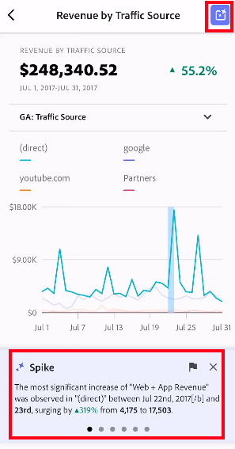
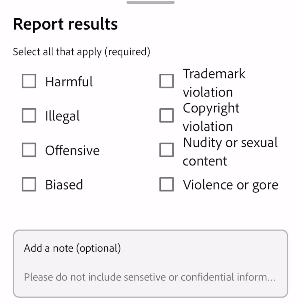

# Gerenciar cartões de pontuação

Este tópico instrui os curadores de dados do Customer Journey Analytics sobre como exibir e gerenciar elementos do cartão de pontuação.

## Exibir e configurar propriedades de blocos {#tiles}

Ao clicar em um bloco no construtor de cartões de pontuação, o painel direito exibe as propriedades e características associadas a esse bloco e seu slide de detalhes. Nesse painel, você pode fornecer um novo **Título** para o bloco e, como alternativa, configurar o bloco aplicando filtros. Segmentos são filtros em Customer Journey Analytics.

## Exibir slides de detalhes {#view-detail-slides}

Ao clicar nos blocos, uma janela pop-up dinâmica mostrará como o slide de detalhes aparecerá para o usuário executivo no aplicativo. Você pode adicionar dimensões para detalhar seus dados de acordo com suas necessidades específicas. Se nenhuma dimensão for aplicada, a dimensão de detalhamento será definida como **hora** ou **dias**, dependendo do intervalo de datas padrão.

Os detalhamentos refinam sua análise ao detalhar métricas por itens de dimensão, como o seguinte:

* Métrica de Visitantes únicos detalhada por Plataforma de publicidade (AMO ID)
* Visitas detalhadas por Categoria de produto (Varejo)
* Receita total detalhada por Nome do produto

Cada dimensão adicionada ao bloco será mostrada em uma lista suspensa na exibição detalhada do aplicativo. O usuário executivo pode então escolher entre as opções indicadas na lista suspensa.

## Personalizar slides de detalhes {#customize-detail-slide}

Os slides de detalhes personalizados permitem ter ainda mais controle sobre quais informações você compartilha com seu público.

>[!VIDEO](https://video.tv.adobe.com/v/3410002)

Você pode modificar o layout de cada slide de detalhes e adicionar texto para explicar melhor o que o usuário final pode ver nos dados. Também é possível alterar o tipo de gráfico usando o menu suspenso.

### Alterar o layout do slide

Altere o layout do slide para se concentrar nas informações mais importantes. Por exemplo, é possível alterar o layout para mostrar apenas um gráfico ou apenas uma tabela. Para alterar o layout do slide, selecione um dos formatos pré-projetados.

Você também pode alterar o layout do slide arrastando e soltando componentes de visualização do painel esquerdo na tela. Cada slide de detalhe pode acomodar apenas duas visualizações por vez.

### Adicionar texto descritivo a um slide

É possível adicionar texto para fornecer informações significativas sobre o que está contido nos gráficos ou nuances dos dados.

Para adicionar texto a um slide de detalhes, selecione um layout que apresente o símbolo `T` ou arraste e solte o componente de visualização de texto do painel esquerdo. O editor de texto será aberto automaticamente ao adicionar uma nova visualização de texto ou escolher um layout de slide com texto. O editor de texto fornece todas as opções padrão para a formatação do texto. É possível aplicar estilos de texto como parágrafo, cabeçalho e subtítulo, além de aplicar negrito e itálico à fonte. Você pode justificar o texto, adicionar listas com marcadores, números e adicionar links. Quando terminar a edição, selecione o botão Minimizar no canto superior direito do editor de texto para fechá-lo. Para editar um texto já adicionado, selecione o ícone de lápis para abrir o editor de texto novamente.

## Remover componentes {#remove}

Da mesma forma, para remover um componente aplicado a todo o cartão de pontuação, clique em qualquer lugar do cartão de pontuação fora dos blocos e remova-o clicando no **x** exibido ao passar o mouse sobre o componente, como mostrado abaixo para **Primeiras visitas**:

## Criar histórias de dados {#create-data-story}

Uma história de dados é uma coleção de pontos de dados de suporte, contexto comercial e métricas relacionadas com base em um tema ou métrica central.

Por exemplo, se você se concentrar no tráfego da Web, sua métrica mais importante pode ser visitas, mas você também pode estar interessado em novas pessoas, pessoas únicas, e pode querer ver os dados detalhados por página da Web ou por que tipo de dispositivo o tráfego está vindo. As histórias de dados em projetos de cartões de pontuação móveis permitem colocar suas métricas mais importantes em primeiro plano ao mesmo tempo em que conta toda a história por trás das métricas com vários slides de detalhes.

Assista ao vídeo para saber mais sobre como criar histórias de dados em projetos de cartões de pontuação móveis no Analysis Workspace.

>[!VIDEO](https://video.tv.adobe.com/v/3416392/?quality=12&learn=on)

**Para criar uma história de dados** {#data-story-create}

Crie sua história de dados adicionando vários slides de detalhes a um bloco.

1. Comece com um projeto de cartão de pontuação móvel.
1. Selecione um bloco do qual deseja criar uma história.
   
   {width=".50%"}
1. Adicione slides para criar sua história de dados. Seu primeiro slide é gerado por padrão.
Para adicionar novos slides, passe o mouse sobre ou clique em um slide e selecione uma das opções disponíveis:
   * Toque no sinal de + para criar um novo slide.
   * Toque no ícone de duplicação para duplicar o slide já existente.
1. Se você criar um slide em branco, arraste e solte componentes do painel esquerdo ou escolha um layout para preencher automaticamente o slide com os dados do bloco.
   
Para excluir um slide, toque no ícone de lixeira.

### Personalizar uma história de dados {#customize-data-story}

As histórias de dados permitem personalizar tudo. Assim você pode compartilhar as informações que deseja e excluir tudo que não precisa. Você pode personalizar blocos e slides individuais para adicionar filtros, mostrar detalhamentos, alterar o layout e as visualizações.

**Para personalizar blocos**

1. Toque em um bloco. O bloco selecionado será contornado em azul e o painel direito mostrará as propriedades do bloco.
1. Altere o título, o tipo de gráfico e outras opções do bloco.
1. Arraste um componente para o bloco.
   
Ao arrastar e soltar um componente, como uma visualização em um bloco, o componente é aplicado a todos os slides da história de dados.
1. Para aplicar uma alteração somente ao título, mantenha pressionada a tecla Shift para aplicar a alteração.
   

>[!NOTE]
>Os slides herdam componentes do bloco, mas os blocos não herdam componentes dos slides.

**Como personalizar slides individuais**

Você pode alterar a visualização de slides individuais em uma história de dados. Por exemplo, é possível alterar um gráfico de barras horizontais para um gráfico de rosquinha em um slide específico. Também é possível alterar o layout. Consulte [Personalizar slides de detalhes](#customize-detail-slide).

### Visualizar uma história de dados {#preview-data-story}

Depois de criar uma história de dados, use o botão **Visualizar** para visualizar e interagir com uma história de dados como se você fosse um usuário do aplicativo. Para obter informações sobre como visualizar sua história de dados, consulte [Visualizar um cartão de pontuação](#preview)

### Navegar entre blocos e slides {#navigate-tiles-slides}

A barra de navegação exibe ícones que representam o que está em cada slide. A barra de navegação facilita a navegação para um slide específico se você tiver vários.

Para se mover entre o bloco e os slides, toque na barra de navegação.

{width="45%"}

Você também pode navegar para frente e para trás usando as setas no teclado ou selecionando um componente e mantendo-o à esquerda ou direita da tela para rolar.

## Visualizar cartões de pontuação {#preview}

Você pode visualizar como o cartão de pontuação será exibido e funcionará assim que for publicado no aplicativo de painéis do Adobe Analytics.

1. Clique em **[!UICONTROL Visualizar]** no canto superior direito da tela.

   

1. Para visualizar a aparência do cartão de pontuação em diferentes dispositivos, selecione um dispositivo no menu suspenso [!UICONTROL Visualização do dispositivo].

   

1. Para interagir com a visualização, é possível:

   * Clicar com o botão esquerdo do mouse para simular o toque na tela do telefone.

   * Usar a função de rolagem do computador para simular a rolagem da tela do telefone com o dedo.

   * Clicar e segurar para simular pressionar e segurar o dedo na tela do telefone. Isso é útil para interagir com as visualizações na visualização detalhada.

## Compartilhar cartões de pontuação {#share}

Para compartilhar o cartão de pontuação com um usuário executivo:

1. Clique no menu **[!UICONTROL Compartilhar]** e selecione **[!UICONTROL Compartilhar scorecard]**.

1. No formulário **[!UICONTROL Compartilhar Scorecard para Dispositivos Móveis]**, preencha os campos da seguinte forma:

   * Fornecer o nome do cartão de pontuação
   * Fornecer uma descrição do cartão de pontuação
   * Adicionar tags relevantes
   * Especificar os recipients do cartão de pontuação

1. Clique em **[!UICONTROL Compartilhar]**.

Depois de compartilhar um cartão de pontuação, os recipients podem acessá-lo nos painéis do Analytics. Se você fizer alterações subsequentes no cartão de pontuação usando o construtor de cartões de pontuação, elas serão atualizadas automaticamente no cartão de pontuação compartilhado. Os usuários executivos verão as alterações depois de atualizar o cartão de pontuação no aplicativo.

Se você atualizar o cartão de pontuação adicionando novos componentes, será possível compartilhar o cartão de pontuação novamente (e marcar a opção **[!UICONTROL Compartilhar componentes integrados]**) para garantir que seus usuários executivos tenham acesso a essas mudanças.

### Compartilhar cartões de pontuação usando um link compartilhável

Usar um link compartilhável facilita o compartilhamento de um cartão de pontuação em um aplicativo de email, documento ou mensagem de texto. O link compartilhável permite que os recipients abram o cartão de pontuação em seu desktop ou no aplicativo móvel de painéis. Deep linking compartilháveis facilitam ainda mais o compartilhamento de projetos e impulsionam o engajamento com as partes interessadas.

Para compartilhar um cartão de pontuação usando um link compartilhável

1. Clique no menu **[!UICONTROL Compartilhar]** e selecione **[!UICONTROL Compartilhar scorecard]**.

   

1. Copie o link e cole-o em um email, documento ou aplicativo de mensagens instantâneas.

   Quando um recipient usa um aplicativo de desktop ou navegador para abrir o link, o projeto de cartão de pontuação para dispositivos móveis é aberto no Workspace.

   Quando um recipient abre o link em um dispositivo móvel, o cartão de pontuação é aberto diretamente no aplicativo de painéis do Adobe Analytics.

   Se um recipient não tiver baixado o aplicativo móvel, ele será direcionado para a lista de aplicativos na App Store ou na Google Play Store, onde poderá baixá-lo.

## Remover item de dimensão [!UICONTROL Não especificado] {#remove-dims}

Caso queira remover itens de dimensões [!UICONTROL Não especificados] dos seus dados, faça o seguinte:

1. Selecione o bloco correto.
1. No painel direito, em **[!UICONTROL Drill-ins]**, selecione a seta para a direita ao lado do item de dimensão do qual você deseja remover itens **[!UICONTROL Não especificados]**.

   

1. Clique no ícone ao lado de **[!UICONTROL Não especificado]** para remover dados não especificados de seus relatórios. (Também é possível remover qualquer outro item de dimensão).

## Exibir legendas inteligentes em cartões de pontuação {#captions}

As legendas inteligentes podem ajudar os não analistas a entender melhor seus dados sem a ajuda dos analistas. As legendas inteligentes usam aprendizagem de máquina avançada e IA gerativa para fornecer insights valiosos de linguagem natural para visualizações.

Essas legendas escolhem os principais insights estatísticos nos dados e os expressam em linguagem natural, ajudando assim os não analistas a desenvolver sua alfabetização de dados.

As legendas inteligentes estão disponíveis para todas as visualizações no aplicativo móvel, incluindo Linha, Rosca, Gráfico de barras e Número do resumo.

Para exibir legendas inteligentes em um cartão de pontuação para dispositivos móveis:

1. Em um cartão de pontuação, clique em um bloco. Por exemplo, neste cartão de pontuação, clique no gráfico de linhas na parte inferior.

   

1. Toque no ícone azul na parte superior direita para gerar as legendas. As legendas aparecerão abaixo do gráfico de linhas.

   

1. Deslize para a direita para ver todas as legendas inteligentes.

   As legendas inteligentes podem apontar para picos de dados, anomalias, tendências, declínios, correlações e outros fenômenos.

1. Toque no sinalizador preto dentro de uma legenda para relatar um problema, como conteúdo mal-intencionado ou ilegal.

   

1. Clique no X para sair da caixa de diálogo **[!UICONTROL Resultados do relatório]**.
