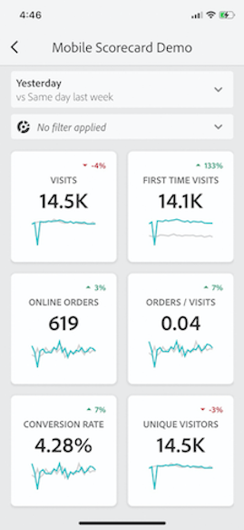
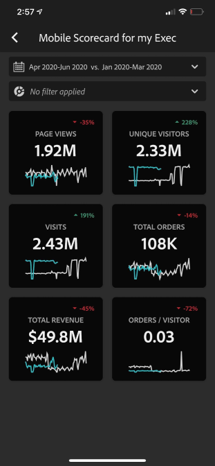

# Configurar usuários executivos para usar painéis

Em alguns casos, os usuários executivos podem precisar de assistência adicional para acessar e usar o aplicativo. Esta seção fornece informações para ajudar curadores a prestarem essa assistência.

## Garantir que os usuários do aplicativo tenham acesso ao Adobe Analytics

1. Configure novos usuários no [Admin Console da Experience Cloud](https://experienceleague.adobe.com/docs/analytics/admin/admin-console/permissions/product-profile.html?lang=pt-BR).

1. Para compartilhar cartões de pontuação, você deve conceder permissões aos usuários do aplicativo para que acessem componentes do cartão de pontuação, como o Analysis Workspace, as visualizações de dados nas quais esses cartões são baseados, bem como filtros, métricas e dimensões.

## Pré-requisitos do sistema dos usuários do aplicativo

Para garantir que os usuários executivos tenham acesso aos seus cartões de pontuação no aplicativo, verifique se:

* Os requisitos mínimos do sistema operacional móvel dos dispositivos são iOS versão 10 ou superior ou Android versão 4.4 (KitKat) ou superior.
* Eles possuem um logon válido no Customer Journey Analytics.
* Você criou corretamente os cartões de pontuação para dispositivos móveis para eles e compartilhou esses cartões de pontuação com eles.
* Eles têm acesso aos Componentes incluídos no cartão de pontuação. Observe que você pode selecionar uma opção ao compartilhar seus cartões de pontuação para **[!UICONTROL Compartilhar componentes integrados]**.

## Ajudar os executivos a baixar e instalar o aplicativo

>[!NOTE]
>
>Embora o aplicativo móvel seja chamado de painel do Adobe Analytics na loja de aplicativos, ele pode ser usado igualmente com cartões de pontuação móveis Customer Journey Analytics.

**Para usuários executivos no iOS:**

Clique no link a seguir (ele também está disponível no Customer Journey Analytics em **[!UICONTROL Ferramentas]** > **[!UICONTROL Painéis do Analytics (opp móvel)]**) e siga as instruções para baixar, instalar e abrir o aplicativo:

`[iOS link](https://apple.co/2zXq0aN)`

**Para usuários executivos no Android:**

Clique no link a seguir (ele também está disponível no Customer Journey Analytics em **[!UICONTROL Ferramentas]** > **[!UICONTROL Painéis do Analytics (aplicativo móvel)]**) e siga as instruções para baixar, instalar e abrir o aplicativo:

`[Android link](https://bit.ly/2LM38Oo)`

Após o download e a instalação, os usuários executivos podem fazer logon no aplicativo usando suas credenciais de Customer Journey Analytics existentes. Oferecemos suporte para Adobe e Enterprise/Federated ID.

## Ajudar os executivos a acessar seu cartão de pontuação

1. Faça com que os usuários executivos façam logon no aplicativo.

   A tela **[!UICONTROL Escolher uma empresa]** é exibida. Essa tela lista as empresas de logon às quais o usuário executivo pertence.

1. Faça com que eles toquem no nome da empresa de logon ou na Experience Cloud Org que se aplica ao cartão de pontuação que você compartilhou.

   A lista do cartão de pontuação mostra todos os cartões de pontuação que foram compartilhados com o executivo na empresa de logon.

1. Faça com que eles classifiquem essa lista por **[!UICONTROL Modificado mais recentemente]**, se aplicável.

1. Faça com que eles toquem no nome do cartão de pontuação para visualizá-lo.

   

### Explicar a interface do cartão de pontuação

Explique ao usuário executivo como os blocos são exibidos nos cartões de pontuação que você compartilha.

Informações adicionais sobre blocos:

* A granularidade dos minigráficos depende da duração do intervalo de datas:
* Um dia mostra uma tendência horária
   * Mais de um dia e menos de um ano mostra uma tendência diária.
   * Um ano ou mais mostra uma tendência semanal.
   * A fórmula de alteração do valor percentual é o total da métrica (intervalo de datas atual) - total da métrica (intervalo de datas de comparação) / total da métrica (intervalo de datas de comparação).
   * Você pode puxar a tela para baixo para atualizar o Scorecard.

1. Toque em um bloco para mostrar como funciona um detalhamento minucioso do bloco.

   

   * Toque em qualquer ponto em um minigráfico para ver os dados associados a esse ponto na linha.

   * Uma tabela é incluída para exibir dados de dimensões adicionadas ao bloco. Toque na seta para baixo para selecionar dimensões. Se nenhuma dimensão tiver sido adicionada ao bloco, a tabela exibirá os dados do gráfico.

1. Para alterar os intervalos de datas do cartão de pontuação, toque no cabeçalho Data e selecione a combinação de intervalo de datas principal e de comparação que você deseja visualizar.

   

## Alterar preferências do aplicativo

Para alterar as preferências, toque na opção **[!UICONTROL Preferências]** mostrada acima. Em preferências, você pode ativar o logon biométrico ou pode definir o aplicativo para o modo escuro, como mostrado abaixo:

## Solução de problemas

Se o usuário executivo fizer logon e vir uma mensagem dizendo que nada foi compartilhado:

* O usuário executivo pode ter selecionado a sandbox de Customer Journey Analytics incorreta ou
* O cartão de pontuação pode não ter sido compartilhado com o usuário executivo.

Verifique se o usuário executivo pode fazer logon na sandbox de Customer Journey Analytics direita e se o cartão de pontuação foi compartilhado.
