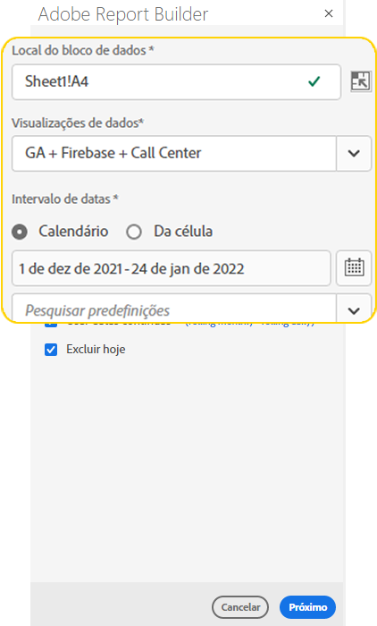
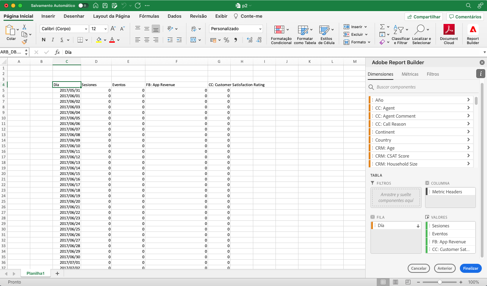
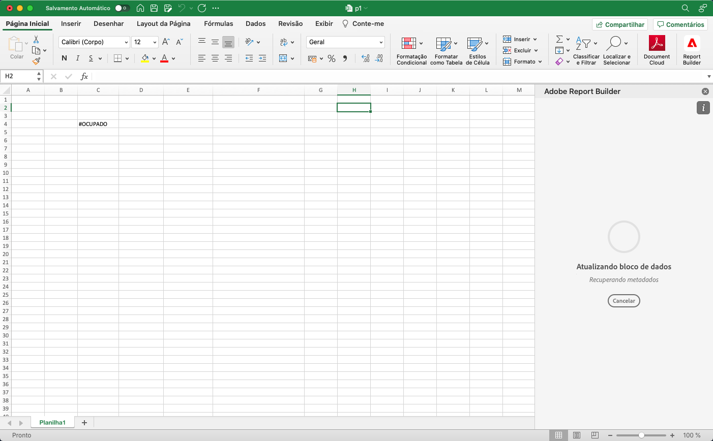
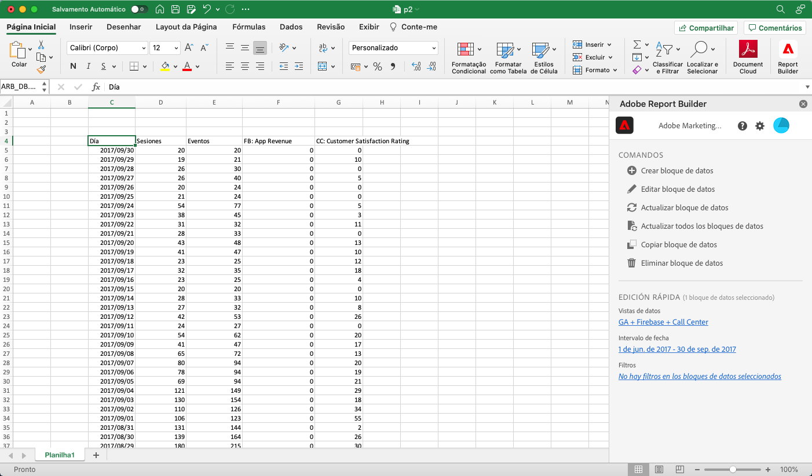

# Criar um bloco de dados

Um *bloco de dados* é a tabela de dados criada por uma única solicitação de dados. Uma pasta de trabalho Report Builder pode conter vários blocos de dados. Ao criar um bloco de dados, primeiro configure o bloco de dados e, em seguida, crie o bloco de dados.

## Configurar o bloco de dados

Configure os parâmetros do bloco de dados inicial para o Local do bloco de dados, Visualizações de dados e um Intervalo de datas.

1. Selecione  **[!UICONTROL Create]**.

   {zoomable="yes"}

1. Defina a **[!UICONTROL localização do bloco de dados]**.

   A opção de localização do bloco de dados define o local da planilha no qual o Report Builder adiciona os dados à planilha.

   Para especificar o local do bloco de dados, selecione uma única célula na planilha ou insira um endereço de célula, como `a3`, `\\\$a3`, `a\\\$3` ou `sheet1!a2`. A célula especificada se torna o canto superior esquerdo do bloco de dados quando os dados são recuperados.

   Use  para escolher um local de bloco de dados na célula selecionada na planilha.

1. Escolha a **[!UICONTROL Visualizações de dados]**.

   A opção Visualizações de dados permite escolher uma visualização de dados a partir de um menu suspenso ou referenciar uma visualização de dados a partir do local de uma célula.

   Selecione  para criar uma exibição de dados a partir de uma célula.

1. Defina o **[!UICONTROL Intervalo de datas]**.

   A opção **[!UICONTROL Intervalo de datas]** permite escolher um intervalo de datas. Os intervalos de datas podem ser fixos ou contínuos.

   Selecione **[!UICONTROL Calendário]** para escolher um intervalo de dados usando  ou insira um intervalo de datas manualmente. Como opção, você pode escolher uma predefinição no menu suspenso **[!UICONTROL _Predefinições de pesquisa_]**.

   Selecione **[!UICONTROL Da célula]** para definir dados iniciais e finais com base em uma célula na planilha atual.

   Para obter informações sobre opções de intervalo de datas, consulte [Selecionar um intervalo de datas](select-date-range.md).

1. Selecione **[!UICONTROL Próximo]**.

   

   Após configurar o bloco de dados, é possível selecionar dimensões, métricas e segmentos para criar seu bloco de dados. As guias **[!UICONTROL Dimensões]**, **[!UICONTROL Métricas]** e **[!UICONTROL Segmentos]** são exibidas acima do painel **[!UICONTROL Tabela]**.

## Criar o bloco de dados

Para criar o bloco de dados, selecione componentes do relatório e personalize o layout.

1. Adicionar componentes de **[!UICONTROL Dimensões]**, **[!UICONTROL Métricas]** e **[!UICONTROL Segmentos]**.

   Rolar as listas de componentes ou usar o campo  **[!UICONTROL _Pesquisar componentes_]** para localizar componentes. Arraste e solte componentes no painel [!UICONTROL Tabela] ou selecione duas vezes um nome de componente na lista para adicionar o componente ao painel [!UICONTROL Tabela].

   Selecione duas vezes um componente para adicioná-lo a uma seção padrão da tabela.

   - Os componentes do Dimension são adicionados à seção  **[!UICONTROL Row]** ou à seção  **[!UICONTROL Column]** se você já tiver uma dimensão nas colunas.
   - Os componentes de data são adicionados à seção  **[!UICONTROL Column]**.
   - Componentes de segmento são adicionados à seção  **[!UICONTROL Segmentos]**.
   - Os componentes de métricas são adicionados à seção  de **[!UICONTROL de]** Eventos.

1. Organize os itens no painel Tabela para personalizar o layout do bloco de dados.

   Arraste e solte componentes em cada lista no painel Tabela para reordenar componentes ou selecione  e selecione  Mover para cima,  Mover para baixo e muito mais para mover componentes dentro de uma lista.

   Quando você adiciona componentes à tabela, uma pré-visualização do bloco de dados é exibida no local do bloco de dados na planilha. O layout da pré-visualização do bloco de dados é atualizado automaticamente à medida que você adiciona, move ou remove itens na tabela.

   

1. Opcionalmente, defina a **[!UICONTROL Data inicial]** como uma dimensão para identificar a data inicial do bloco de dados. Adicionar os dados iniciais como uma dimensão é útil se você tiver um relatório agendado regularmente que tenha um intervalo de datas em andamento. Ou se você tiver um intervalo de datas não convencional e precisar ser explícito sobre a data de início.

   

1. Opcionalmente, exibir ou ocultar cabeçalhos de linha e coluna. Para fazer isso:

   1. Selecione o ícone de configurações **[!UICONTROL Tabela]** configurações.

      

   1. Marque ou desmarque a opção para **[!UICONTROL Exibir cabeçalhos de linha e coluna]**. Os cabeçalhos são exibidos por padrão.

1. Como opção, também é possível ocultar ou mostrar rótulos de dimensão e cabeçalhos de métrica. Para fazer isso:

   1. Selecione  no rótulo da dimensão ou no cabeçalho da coluna para exibir o menu de contexto.

      

   1. Selecione  **[!UICONTROL Hide]** ou  **[!UICONTROL Show]** para alternar o rótulo da dimensão ou o cabeçalho da coluna. Todos os rótulos são exibidos por padrão.

1. Selecione **[!UICONTROL Concluir]** para concluir a configuração do bloco de dados.

1. Uma mensagem de processamento **[!UICONTROL #BUSY]** é exibida enquanto os dados de análise são recuperados.

   

1. O Report Builder recupera os dados e exibe o bloco de dados concluído na planilha.

   

>[!MORELIKETHIS]
>
>[Selecione uma visualização de dados](select-data-view.md)
>&#x200B;>[Selecionar um intervalo de datas](select-date-range.md)
>&#x200B;>[Filtrar dimensões](filter-dimensions.md)
>&#x200B;>[Trabalhar com segmentos](work-with-filters.md)
>
