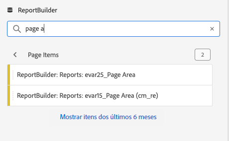
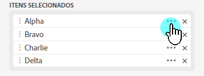
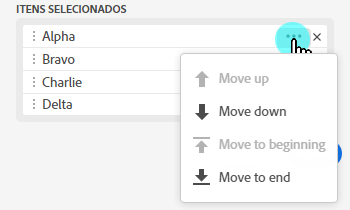
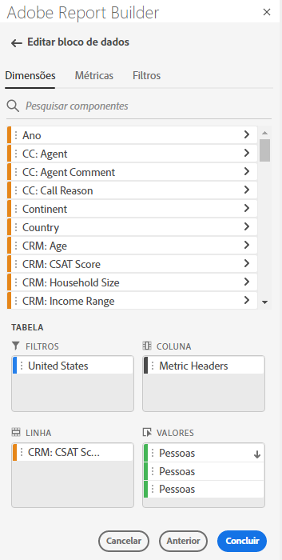

# Filtrar dimensões

Por padrão, cada item de dimensão na tabela retorna os 10 itens principais para essa dimensão.

Para alterar os itens de dimensão retornados para cada dimensão

1. Selecione um bloco de dados e clique em Editar bloco de dados no painel COMANDOS .

1. Clique em Next para exibir a guia Dimension .

1. Clique no **...Ícone** ao lado do nome de um componente na tabela.

   

1. Selecione **Filter dimension** no menu pop-up para exibir o painel **Filter dimension**.

1. Selecione **Mais popular** ou **Específico**.

   

1. Selecione as opções apropriadas com base no tipo de filtro escolhido.

1. Clique em **Aplicar** para adicionar o filtro.

   O Report Builder exibe uma notificação para confirmar o filtro adicionado.

Para exibir os filtros aplicados, passe o mouse sobre uma dimensão. Dimension com filtros aplicados exibe um ícone de filtro à direita do nome do Dimension.

## Tipo de filtro

Há duas maneiras de filtrar itens de dimensão: Mais popular e específica.

## Mais popular

A opção Mais popular permite filtrar dinamicamente itens de dimensão com base em valores de métrica. A filtragem mais popular retorna os itens de dimensão classificados mais altos com base nos valores de métrica. Por padrão, os primeiros 10 itens de dimensão são listados, classificados pela primeira métrica adicionada ao bloco de dados.

### Opções de Página e Linhas

Use os campos **Page** e **Rows** para dividir os dados em grupos sequenciais ou páginas. Isso permite que você extraia valores de linhas classificadas diferentes dos valores mais altos em seu relatório. Esse recurso é especialmente útil para obter dados além do limite de 50.000 linhas.

#### Padrões de Página e Linhas

- Página = 1
- Linhas = 10

As configurações padrão de Página e Linhas identificam que cada página tem 10 linhas de dados. A página 1 retorna os 10 itens principais, a página 2 retorna os 10 itens seguintes e assim por diante.

A tabela abaixo lista exemplos de valores de página e linha e a saída resultante.

| Página | Linha | Saída |
|------|--------|----------------------|
| 1 | 10 | 10 itens principais |
| 2 | 10º | Rubricas 11-20 |
| 1 | 100 | 100 itens principais |
| 2 | 100 | Rubricas 101-200 |
| 2 | 50.000 | Itens 50.001-100.000 |

#### Valores mínimos e máximos

- Página inicial: Mín = 1, Máx.: 50 milhões
- Número de linhas: Mín = 1, Máx.: 50.000

### Incluir &quot;Nenhum valor&quot;

No Customer Journey Analytics, algumas dimensões coletam uma entrada &quot;sem valor&quot;. Esse filtro permite excluir esses valores dos relatórios. Por exemplo, você pode criar uma classificação como o Nome do produto com base na chave SKU do produto. Se um SKU de produto específico não tiver sido configurado com sua classificação de Nome de produto específica, seu valor de Nome de produto será definido como &quot;nenhum valor&quot;.

Incluir &quot;**Nenhum valor**&quot; é selecionado por padrão. Desmarque essa opção para excluir entradas sem valor.

### Filtrar por critérios

Você pode filtrar itens de dimensão com base em se todos os critérios são atendidos ou se qualquer critério é atendido.

Definição dos critérios de filtragem

1. Selecione um operador na lista suspensa.

   

1. Insira um valor no campo de pesquisa.

1. Clique em Adicionar linha para confirmar a seleção e adicionar outro item de critério.

1. Clique no ícone de exclusão para remover um item de critério.

   É possível incluir até 10 itens de critério.

### Alterar o filtro e a ordem de classificação

Uma seta é exibida ao lado da métrica usada para filtrar e classificar o bloco de dados. A direção da seta indica se a métrica é classificada do maior para o menor ou do menor para o maior.

Para alterar a direção da classificação, clique na seta ao lado da métrica. 

Para alterar a métrica usada para filtrar e classificar o bloco de dados,

1. Passe o mouse sobre o componente de métrica desejado no Criador de tabela para exibir opções adicionais.

2. Clique na seta na métrica preferida. 

   

## Filtragem específica

A opção Specific permite criar uma lista fixa de itens de dimensão para cada dimensão. Use o tipo de filtro **Specific** para especificar os itens de dimensão exatos a serem incluídos no filtro. Você pode selecionar itens de uma lista ou de várias células.

### Da lista

1. Selecione a opção **Da lista** para procurar e selecionar itens de dimensão.

   Ao selecionar a opção **Da lista**, a lista é preenchida com itens de dimensão com mais eventos primeiro.

   

   A lista **Available items** é ordenada de itens de dimensão com mais eventos para aqueles com menos.

1. Insira um termo de pesquisa no campo **Add item** para pesquisar a lista.

1. Para pesquisar um item não incluído nos últimos 90 dias dos dados, clique em **Mostrar itens nos últimos 6 meses** para estender a pesquisa.

   

   Após carregar os dados dos últimos seis meses, o Report Builder atualiza o link para **Mostrar itens dos últimos 18 meses**.

1. Selecione um item de dimensão.

   Os itens de dimensão selecionados são adicionados automaticamente à lista **Itens selecionados**.

   

   Para excluir um item da lista, clique no ícone excluir para remover o item da lista.

   Para mover um item na lista, arraste e solte o item ou clique em ... para exibir o menu de movimentação.

   

1. Clique em **Aplicar**

   O Report Builder atualiza a lista para mostrar a filtragem específica aplicada.

### De várias células

Selecione a opção **From range of cells** para escolher um intervalo de células que contém a lista de itens de dimensões a serem correspondidos.

Ao selecionar um intervalo de células, considere as seguintes restrições:

- O intervalo deve ter pelo menos uma célula.
- O intervalo não pode ter mais de 50.000 células.
- O intervalo deve estar em uma única linha ou coluna ininterrupta.

Sua seleção pode conter células vazias ou células com valores que não correspondem a um item de dimensão específico.

### Na guia Dimension no Criador de tabela

Na guia **Dimension**, clique no ícone de divisa ao lado de um nome de dimensão para exibir a lista de itens de dimensão.

Você pode arrastar e soltar itens na **Tabela** ou clicar duas vezes em um nome de item para adicioná-lo ao construtor **Tabela**.
