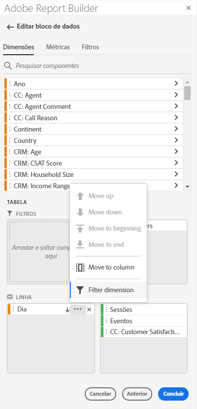
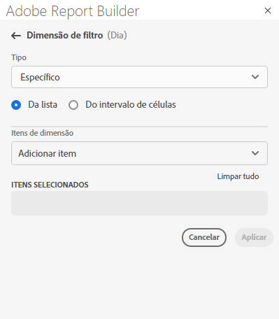
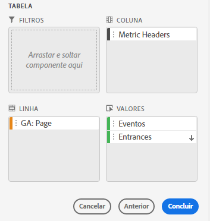
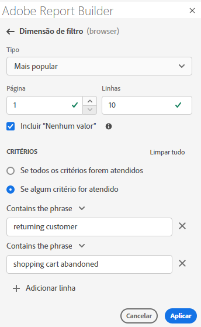
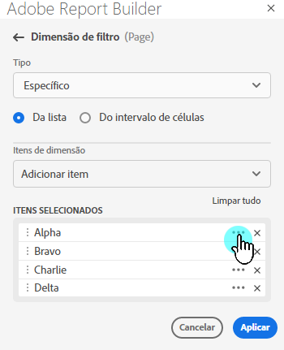
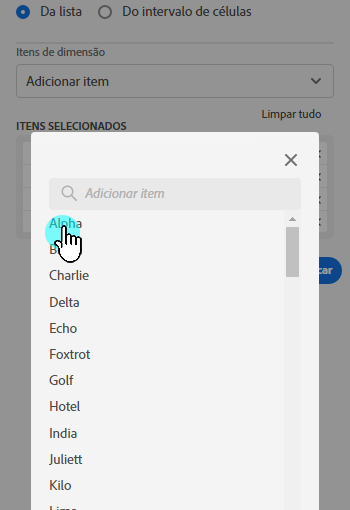
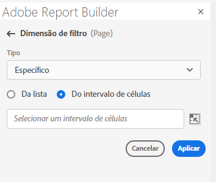

# Filtragem de dimensões

Por padrão, cada item de dimensão na tabela retorna os 10 itens principais para essa dimensão.

Para alterar os itens de dimensão retornados para cada dimensão:

1. Selecione uma célula no bloco de dados.

1. Selecione  **[!UICONTROL Editar bloco de dados]** no painel **[!UICONTROL Comandos]**.

1. Selecione **[!UICONTROL Avançar]** para exibir a guia **[!UICONTROL Dimensões]**.

1. Selecione  ao lado do nome de um componente na tabela.

   {zoomable="yes"}

1. Selecione **[!UICONTROL Filtrar dimensão]** no menu pop-up para exibir o painel **[!UICONTROL Filtrar dimensão]**.

1. Selecione **Mais popular** ou **Específico** como o **[!UICONTROL Tipo]**.

   {zoomable="yes"}

1. Selecione as opções apropriadas com base no [tipo de filtro](#filter-type) escolhido.

1. Selecione **[!UICONTROL Aplicar]** para adicionar o filtro.

1. O Report Builder exibe uma notificação para confirmar o filtro adicionado.

Para exibir os filtros aplicados, passe o mouse sobre uma dimensão. Dimensões com filtros aplicados exibem um ícone de filtro  ao lado do nome da dimensão.

## Alterar o filtro e a ordem de classificação

Uma  ou  aparece ao lado da métrica usada para filtrar e classificar o bloco de dados. A direção da seta indica se a métrica é classificada em ordem crescente ou decrescente.

Para alterar a ordem de classificação:

- Selecione  ou  ao lado da métrica para alternar a ordem de classificação.

Para alterar a métrica usada para filtrar e classificar o bloco de dados:

1. Passe o mouse sobre o componente de métrica desejado no Criador de tabela para exibir opções adicionais.

2. Selecione  para a métrica preferencial.

   {zoomable="yes"}

## Tipo de filtro

Há duas maneiras de filtrar itens de dimensão: [Mais popular](#most-popular) e [Específico](#specific-filtering)

### **[!UICONTROL Mais popular]**

A opção **[!UICONTROL Mais popular]** permite filtrar dinamicamente itens de dimensão com base em valores de métrica. Mais popular retorna os itens de dimensão com classificação mais alta com base nos valores de métrica. Por padrão, os primeiros 10 itens de dimensão são listados, classificados pela primeira métrica adicionada ao bloco de dados.

{zoomable="yes"}

#### Opções de Página e Linhas

Use os campos de **[!UICONTROL Página]** e **[!UICONTROL Linhas]** para dividir os dados em grupos sequenciais ou páginas. Esse recurso permite que você obtenha valores de linhas classificadas diferentes dos valores mais altos em seu relatório. E é especialmente útil para obter dados além do limite de 50.000 linhas.

O padrão para Página é `1` e para Linhas é `10`. Esses padrões implicam que cada página tem 10 linhas de dados. A página 1 retorna os 10 itens principais, a página 2 retorna os 10 itens seguintes e assim por diante.

A tabela abaixo lista exemplos de valores de página e linha e a saída resultante.

| Página | Linha | Saída |
|------|--------|----------------------|
| 1 | 10 | 10 itens principais |
| 2 | 10 | Itens 11-20 |
| 1 | 100 | 100 itens principais |
| 2 | 100 | Itens 101-200 |
| 2 | 50.000 | Itens 50.001-100.000 |

A tabela abaixo lista os valores mínimos e máximos para página e linhas.

|       | Valores mínimos | Valores máximos |
|-------|---------------:|---------------:|
| Página inicial | 1 | 50 milhões |
| Número de linhas | 1 | 50.000 |

#### Incluir &quot;Nenhum valor&quot;

No Customer Journey Analytics, algumas dimensões coletam uma entrada *Nenhum valor*. A configuração **[!UICONTROL Incluir &quot;Nenhum valor&quot;]** permite excluir esses valores dos relatórios. Por exemplo, é possível criar uma classificação como o Nome do produto com base na chave SKU do produto. Se um SKU de produto específico não tiver sido configurado com sua classificação de Nome de Produto específica, seu valor de Nome de Produto será definido como *Nenhum valor*.

**[!UICONTROL Incluir &quot;Nenhum valor&quot;]** está selecionado por padrão. Desmarque essa opção para excluir entradas sem valor.

#### Filtrar por critérios

Você pode filtrar itens de dimensão com base no fato de todos os critérios serem atendidos ou caso qualquer critério seja atendido.

Para definir critérios de filtragem:

1. Selecione um operador no menu suspenso de operadores. Por padrão, **[!UICONTROL Contém a frase]** está selecionada

   {zoomable="yes"}

1. Insira um termo de pesquisa.

1. Selecione  **[!UICONTROL Adicionar linha]** para confirmar a seleção e adicionar outro item de critério.

1. Selecione  para remover um item de critério.

É possível incluir até 10 itens de critério.

### **[!UICONTROL Específico]**

A opção **[!UICONTROL Específico]** permite criar uma lista fixa de itens de dimensão para cada dimensão. Use o tipo de filtro **[!UICONTROL Específico]** para especificar os itens de dimensão exatos a serem incluídos no filtro. É possível selecionar itens de uma lista ou de um intervalo de células.

{zoomable="yes"}

#### A partir da lista

1. Selecione a opção **[!UICONTROL Da lista]** para procurar e selecionar itens de dimensão.

   Ao selecionar a opção **Da lista**, a lista **[!UICONTROL Itens de Dimension]** é preenchida com itens de dimensão ordenados pelo número de eventos.

   {zoomable="yes"}

1. Insira um termo de pesquisa em  **[!UICONTROL _Adicionar item_]** para pesquisar na lista.

1. Para pesquisar um item não incluído nos últimos 90 dias de dados, selecione **[!UICONTROL Mostrar itens para os últimos 6 meses]** para estender a pesquisa. Após carregar os dados dos últimos 6 meses, o Report Builder atualiza o link para **[!UICONTROL Mostrar itens para os últimos 18 meses]**.

1. Para excluir um item da lista **[!UICONTROL Itens selecionados]**, selecione .

1. Para mover um item na lista **[!UICONTROL Itens selecionados]**, arraste e solte o item ou selecione  para exibir o menu de contexto e selecione nas opções de movimentação.

1. Selecione **[!UICONTROL Aplicar]**.

O Report Builder atualiza a lista para mostrar a filtragem específica aplicada.

#### A partir de intervalo de células

Selecione a opção **De intervalo de células** para escolher um intervalo de células que contenha a lista de itens de dimensões a serem correspondidos.

{zoomable="yes"}

Ao selecionar um intervalo de células, considere as seguintes restrições:

- O intervalo deve ter pelo menos uma célula.
- O intervalo não pode ter mais de 50.000 células.
- O intervalo deve estar em uma única linha ou coluna ininterrupta.

Sua seleção pode conter células vazias ou células com valores que não correspondem a um item de dimensão específico.

### Filtrar rapidamente uma dimensão

Para filtrar uma dimensão para a qual nenhum filtro é aplicado no momento:

1. Selecione  para uma dimensão. Por exemplo, **[!UICONTROL canal de interação]**.

1. Selecione duas vezes itens de dimensão para adicionar ao filtro. Como alternativa, selecione um ou mais itens de dimensão e arraste e solte a seleção na seção  **[!UICONTROL Row]**.

   {zoomable="yes"}

