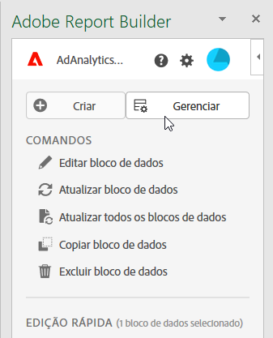
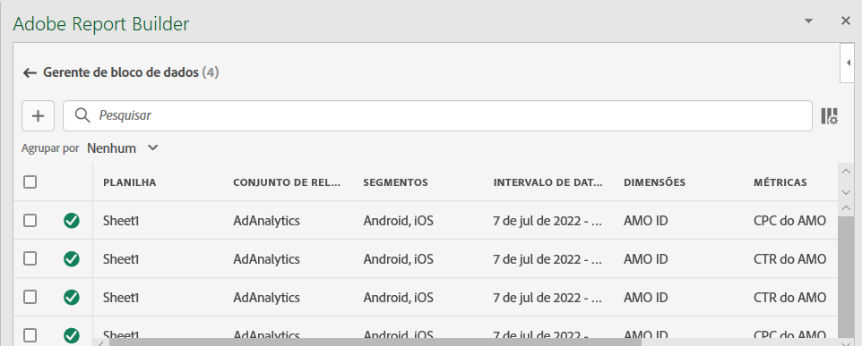
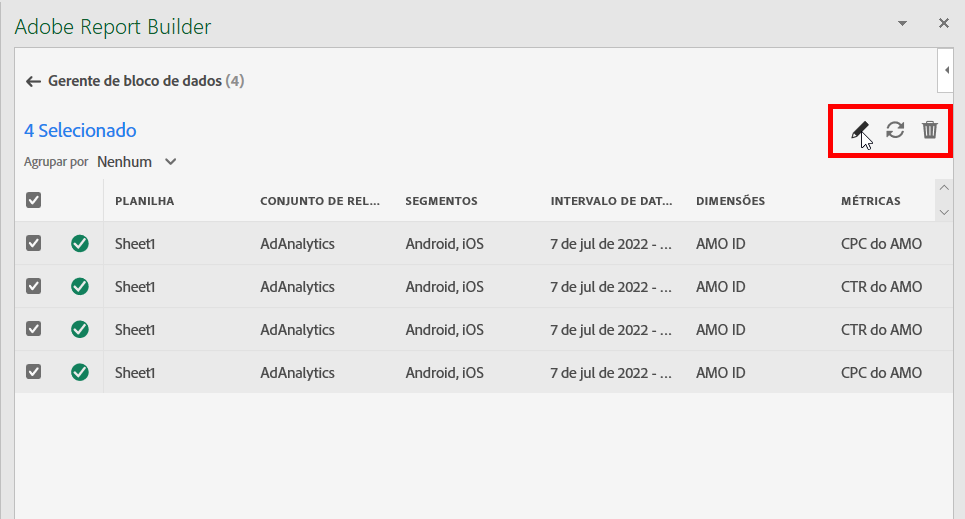
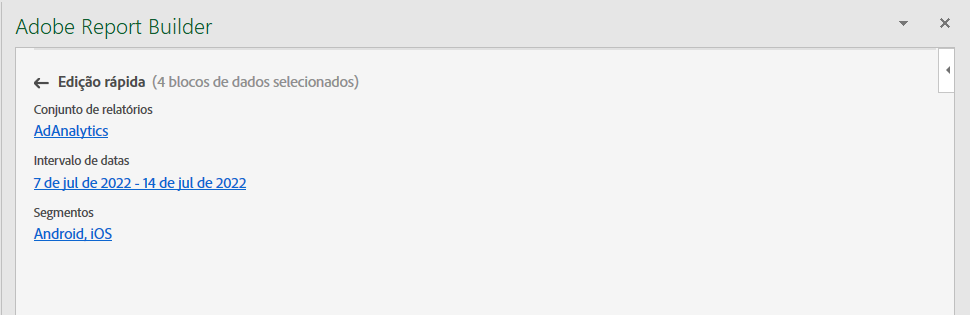
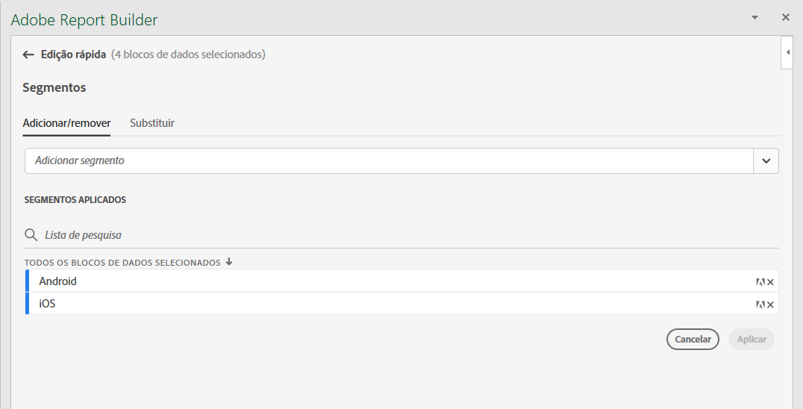
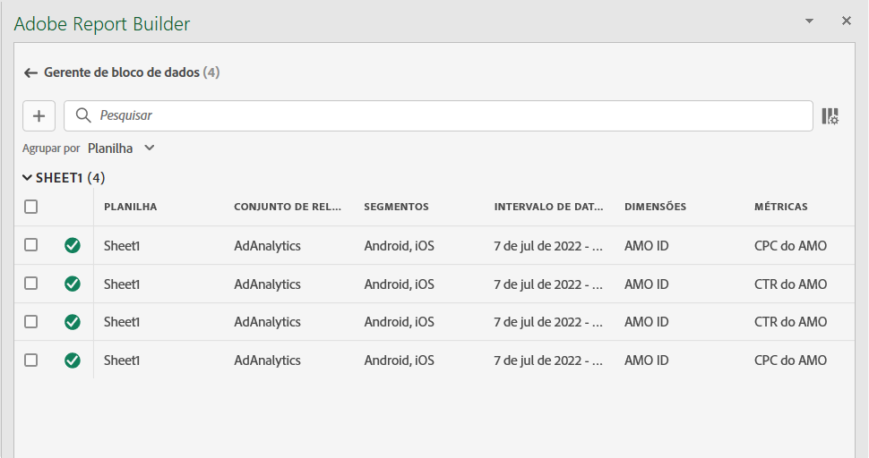

# Gerenciar blocos de dados

Você pode exibir e gerenciar todos os blocos de dados em uma pasta de trabalho usando o [!UICONTROL gerenciador de blocos de dados]. O [!UICONTROL gerenciador de bloco de dados] fornece recursos de pesquisa, filtro e classificação que permitem localizar blocos de dados específicos. Após selecionar um ou mais blocos de dados, você pode editar, excluir ou atualizar os blocos de dados selecionados.

## Exibir blocos de dados

Para exibir uma tabela que lista todos os blocos de dados em uma pasta de trabalho, selecione  **[!UICONTROL Manage]**.

{zoomable="yes"}

O **[!UICONTROL gerenciador de bloco de dados]** mostra uma tabela com todos os blocos de dados presentes em uma pasta de trabalho.

{zoomable="yes"}

Você pode usar  para selecionar quais colunas deseja exibir.

## Classificar blocos de dados

Você pode classificar a tabela de blocos de dados por uma coluna exibida. Por exemplo, você pode classificar blocos de dados por visualizações de dados, segmentos, intervalo de datas e outras variáveis.

Para classificar a tabela de blocos de dados, selecione um cabeçalho de coluna. Selecione o mesmo cabeçalho de coluna para inverter a ordem de classificação.

## Pesquisar blocos de dados

Use o campo  **[!UICONTROL _Pesquisa_]** para localizar qualquer item na tabela de blocos de dados. Por exemplo, você pode pesquisar métricas contidas nos blocos de dados ou na visualização de dados. Também é possível pesquisar datas que estejam aparecendo nas colunas intervalo de datas, data de modificação ou data da última execução.

## Editar blocos de dados

É possível editar visualizações de dados e intervalos de datas para blocos de dados. Ou os segmentos aplicados aos blocos de dados.

Por exemplo, você pode substituir um segmento existente por um novo segmento em um ou mais blocos de dados.

1. Selecione os blocos de dados que deseja atualizar. Você pode marcar a caixa de seleção de nível superior para selecionar todos os blocos de dados ou selecionar blocos de dados individuais.

   {zoomable="yes"}

1. Selecione  para exibir a janela **[!UICONTROL Edição rápida]**.

   {zoomable="yes"}

1. Selecione um link para atualizar visualizações de dados, intervalos de datas ou segmentos. Em **[!UICONTROL Edição Rápida]** - **[!UICONTROL Segmentos]**, você pode adicionar, remover ou atualizar os segmentos dos blocos de dados selecionados.

   {zoomable="yes"}

## Atualizar blocos de dados

Selecione  para atualizar a tabela de blocos de dados.

Para verificar se um bloco de dados é atualizado, exiba o ícone de status de atualização:

- Um bloco de dados atualizado com êxito exibe um .

- Um bloco de dados que não foi atualizado exibe um .

## Excluir blocos de dados

Para excluir um ou mais blocos de dados:

1. Selecione um ou mais blocos de dados.
1. Clique em .
1. Selecione **[!UICONTROL Excluir]** na caixa de diálogo **[!UICONTROL Excluir bloco de dados]** ou **[!UICONTROL Cancelar]** para cancelar a exclusão.

## Agrupar blocos de dados

Você pode agrupar blocos de dados usando o menu suspenso **[!UICONTROL Agrupar por]** ou pode selecionar um título de coluna.

Para classificar blocos de dados por coluna, selecione o título da coluna. Para agrupar blocos de dados por grupos, selecione um nome de grupo no menu suspenso **[!UICONTROL Agrupar por]**. Por exemplo, a captura de tela abaixo mostra blocos de dados agrupados por Visualização de dados.

Você pode usar o agrupamento para selecionar rapidamente blocos de dados para os quais deseja modificar um elemento comum, como um segmento.

{zoomable="yes"}

