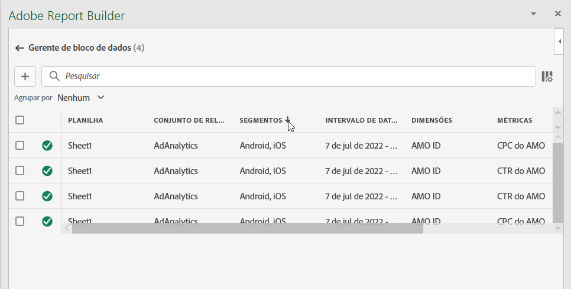
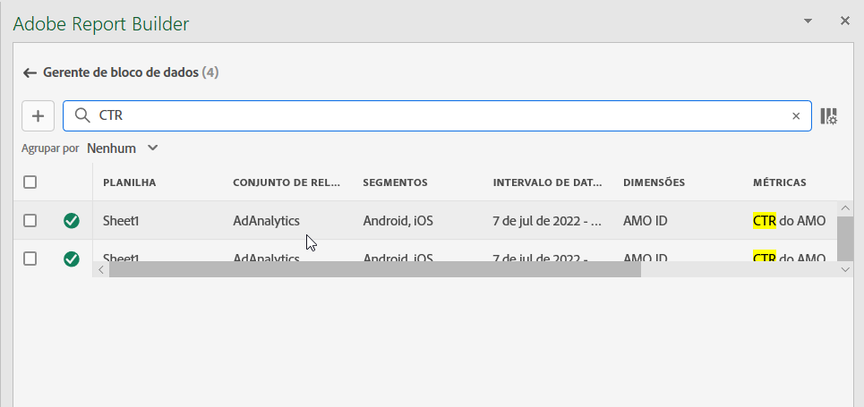
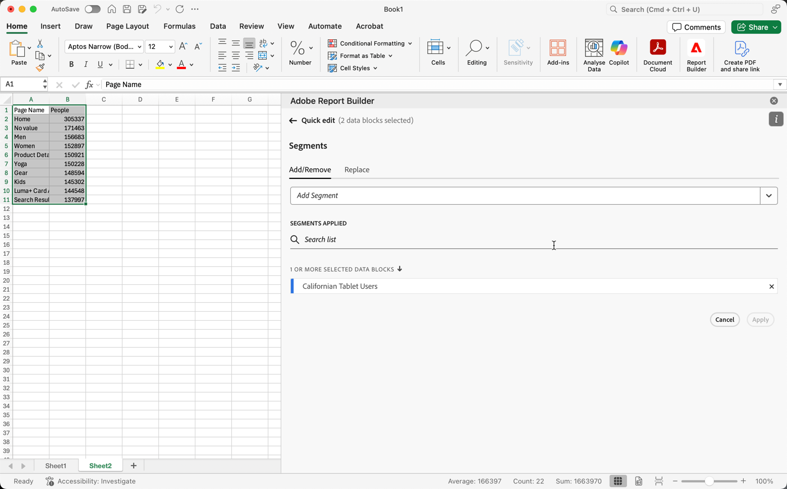
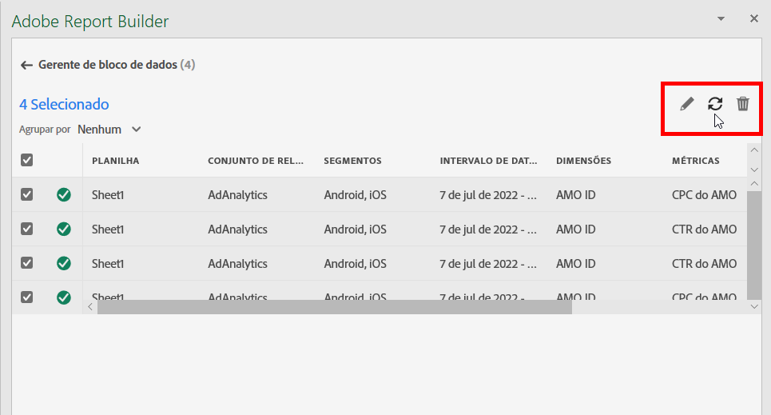
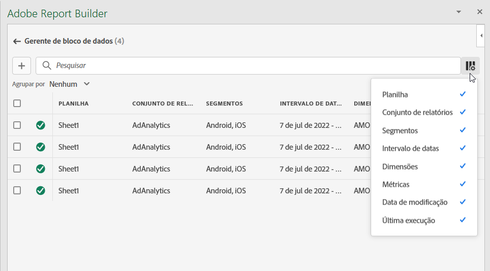

# Gerenciar blocos de dados no Report Builder

Você pode exibir e gerenciar todos os blocos de dados em uma pasta de trabalho usando o Gerenciador de blocos de dados. O Gerenciador de bloco de dados fornece recursos de pesquisa, filtro e classificação que permitem localizar rapidamente blocos de dados específicos. Após selecionar um ou mais blocos de dados, você pode editar, excluir ou atualizar os blocos de dados selecionados.

## Exibir blocos de dados

Clique em **Gerenciar** para exibir uma lista de todos os blocos de dados em uma pasta de trabalho.

O Gerenciador de bloco de dados lista todos os blocos de dados presentes em uma pasta de trabalho. 

## Classificar a lista de Blocos de dados

Você pode classificar a lista de blocos de dados por uma coluna exibida. Por exemplo, você pode classificar a lista de bloqueios de dados por visualizações de dados, Filtros, Intervalo de datas e outras variáveis.

Para classificar a lista de blocos de dados, clique em um cabeçalho de coluna.

## Pesquisar a Lista de blocos de dados

Use o campo Procurar para localizar qualquer item na tabela de blocos de dados. Por exemplo, você pode pesquisar métricas contidas nos blocos de dados ou na visualização de dados. Também é possível pesquisar datas que estejam aparecendo nas colunas intervalo de datas, data de modificação ou data da última execução.

## Editar blocos de dados

É possível editar a visualização de dados, o intervalo de datas ou os filtros aplicados a um ou mais blocos de dados.

Por exemplo, você pode substituir um filtro existente por um novo filtro em um ou mais blocos de dados.

1. Selecione os blocos de dados que deseja atualizar. Você pode marcar a caixa de seleção de nível superior para selecionar todos os blocos de dados ou selecionar blocos de dados individuais.

   

1. Clique no ícone de edição para exibir a janela Edição rápida.

   

1. Selecione um link de filtro para atualizar visualizações de dados, intervalos de datas ou filtros.

   

## Atualizar blocos de dados

Clique no ícone de atualização para atualizar os blocos de dados na lista.

Para verificar se um bloco de dados é atualizado, exiba o ícone de status de atualização.

Um bloco de dados atualizado com êxito exibe uma marca de seleção em um círculo verde: .

Um bloco de dados que não foi atualizado exibe um ícone de aviso: .Isso facilita a identificação de erros em blocos de dados.

## Excluir um bloco de dados

Clique no ícone de lixeira para excluir um bloco de dados selecionado.

## Blocos de dados do grupo

Você pode agrupar blocos de dados usando o menu suspenso **Agrupar por** ou você pode clicar em um título de coluna. Para classificar blocos de dados por coluna, clique no título da coluna. Para agrupar blocos de dados por grupos, selecione um nome de grupo no menu suspenso **Agrupar por**. Por exemplo, a captura de tela abaixo mostra blocos de dados agrupados por Folha. Ela mostra blocos de dados agrupados por Folha1 e Folha2.  Isso é útil, por exemplo, no caso de uso de substituição de filtro. Se tiver vários filtros aplicados a cada bloco de dados, é útil criar um grupo contendo todos os blocos de dados que você deseja substituir. Em seguida, é possível selecionar e editar facilmente todos ao mesmo tempo.

## Modificar a exibição do Gerenciador de bloco de dados

Você pode modificar quais colunas estão visíveis na janela Gerenciador de bloco de dados.

Clique na lista de colunas  ícone para selecionar quais colunas são listadas no Gerenciador de bloco de dados. Selecione um nome de coluna para exibir a coluna. Desmarque o nome da coluna para remover a coluna da exibição.

