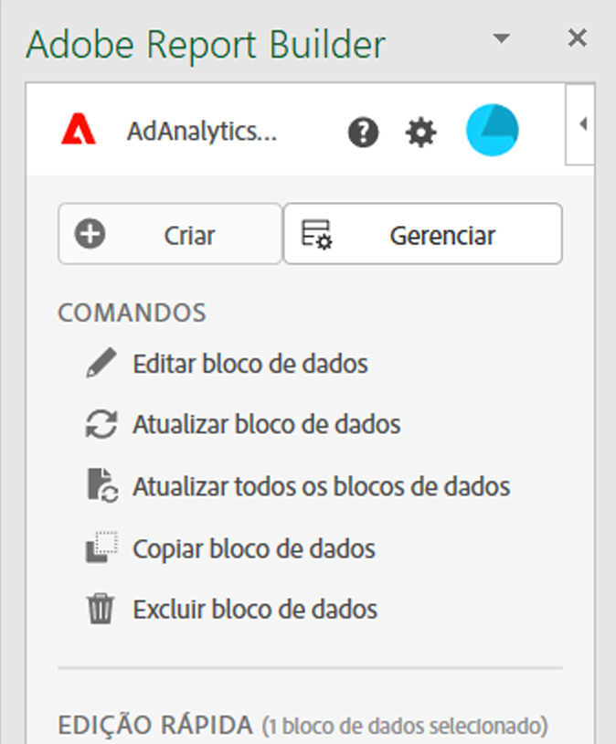

# Central do Report Builder

O hub do Report Builder é o painel direito exibido em sua pasta de trabalho do Excel quando você seleciona  **[!UICONTROL Report Builder]** na barra da faixa de opções do Excel.

Use o hub do Report Builder para criar, atualizar, excluir e gerenciar blocos de dados.

O hub do Report Builder contém os botões  **[!UICONTROL Create]**,  **[!UICONTROL Manage]** e  **[!UICONTROL Schedule]**, o painel **[!UICONTROL Commands]** e o painel **[!UICONTROL Edição rápida]**.

{zoomable="yes"}

Selecionar

*  **[!UICONTROL Create]** to [create new data blocks](create-a-data-block.md).
*  **[!UICONTROL Manage]** para [gerenciar blocos de dados existentes](manage-reportbuilder.md).
*  **[!UICONTROL Agendar]** para [gerenciar agendas para enviar sua pasta de trabalho por email](schedule-reportbuilder.md).

## Painel Comandos

Use o painel **[!UICONTROL Comandos]** para acessar comandos compatíveis com as células selecionadas ou uma ação anterior.

| Comandos | Disponível quando... | Propósito |
|------|------------------|--------|
|  **[!UICONTROL Editar bloco de dados]** | O intervalo de célula ou células selecionado faz parte de apenas um bloco de dados. | Use para editar um bloco de dados. |
|  **[!UICONTROL Atualizar bloco de dados]** | A seleção contém pelo menos um bloco de dados. O comando atualiza somente os blocos de dados na seleção. | Use para atualizar um ou mais blocos de dados. |
|  **[!UICONTROL Atualizar todos os blocos de dados]** | A pasta de trabalho contém um ou mais blocos de dados. | Usar para atualizar todos os blocos de dados na pasta de trabalho |
|  **[!UICONTROL Enviar pasta de trabalho]** | A pasta de trabalho contém um ou mais blocos de dados. | Use para enviar a pasta de trabalho como um arquivo por email. |
|  **[!UICONTROL Copiar bloco de dados]** | A célula ou o intervalo de células selecionado faz parte de um ou mais blocos de dados. | Use para copiar um bloco de dados. |
|  **[!UICONTROL Recortar bloco de dados]** | A célula ou o intervalo de células selecionado faz parte de um ou mais blocos de dados. | Use para recortar um bloco de dados. |
|  **[!UICONTROL Excluir bloco de dados]** | O intervalo de célula ou células selecionado faz parte de apenas um bloco de dados. | Usar para excluir um bloco de dados |

## Painel de edição rápida

Ao selecionar um ou mais blocos de dados em uma planilha, o Report Builder exibe o painel **[!UICONTROL Edição rápida]**. Você pode usar o painel **[!UICONTROL Edição rápida]** para alterar parâmetros em um ou mais blocos de dados ao mesmo tempo.

As alterações feitas ao usar as seções de **[!UICONTROL Edição Rápida]** se aplicam a todos os blocos de dados selecionados.

### Visualizações de dados

Os blocos de dados extraem dados de uma visualização selecionada. Se vários blocos de dados forem selecionados em uma planilha, e caso eles não extraiam dados da mesma visualização, o link **Visualizações de dados** exibe **[!UICONTROL _Vários_]**.

Quando você altera a visualização de dados, todos os blocos de dados na seleção adotam a nova visualização de dados. Os componentes no bloco de dados são correspondidos à nova visualização de dados com base na ID. Se um componente não for encontrado em um bloco de dados, ele será removido e substituído por **[!UICONTROL Valor inválido]** ou um  será exibido para o componente específico.

Para alterar a exibição de dados, selecione uma nova exibição de dados no menu suspenso **[!UICONTROL Exibição de dados]**.

### Intervalo de datas

**Intervalo de datas** mostra o intervalo de datas dos blocos de dados selecionados. Se vários blocos de dados forem selecionados com vários intervalos de datas, o link **[!UICONTROL Intervalo de datas]** exibirá **[!UICONTROL _Vários_]**.

### Segmentos

O link **Segmentos** exibe uma lista de resumo dos segmentos usados pelos blocos de dados selecionados. Se vários blocos de dados forem selecionados com vários segmentos aplicados, o link **Segmentos** exibirá **[!UICONTROL _Vários_]**.

>[!MORELIKETHIS]
>
>[Selecione uma visualização de dados](select-data-view.md)
>>[Selecionar um intervalo de datas](select-date-range.md)
>>[Trabalhar com filtros](work-with-filters.md)
>
