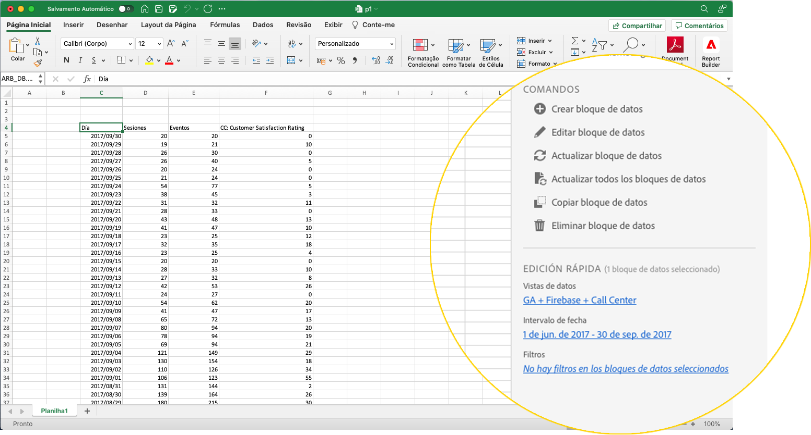

# Hub Report Builder

Use o hub Report Builder para criar, atualizar ou excluir blocos de dados.

O hub Report Builder contém os painéis COMANDOS e EDIT RÁPIDO.



## Painel COMANDOS

Use o painel COMANDOS para acessar comandos compatíveis com as células selecionadas ou uma ação anterior.


### Comandos

| Comandos exibidos | Disponível quando... | Propósito |
|------|------------------|--------|
| Criar bloco de dados | Uma ou mais células são selecionadas na pasta de trabalho. | Usado para criar um bloco de dados |
| Editar bloco de dados | O intervalo de células ou células selecionado faz parte de apenas um bloco de dados. | Usado para editar um bloco de dados |
| Atualizar bloco de dados | A seleção contém pelo menos um bloco de dados. O comando atualizará somente os blocos de dados na seleção. | Usado para atualizar um ou mais blocos de dados |
| Atualizar todos os blocos de dados | A pasta de trabalho contém um ou mais blocos de dados. | Usado para atualizar TODOS os blocos de dados na pasta de trabalho |
| Copiar bloco de dados | A célula ou o intervalo de células selecionado faz parte de um ou mais blocos de dados. | Usado para copiar um bloco de dados |
| Excluir bloco de dados | O intervalo de células ou células selecionado faz parte de apenas um bloco de dados. | Usado para excluir um bloco de dados |

## Painel EDIÇÃO RÁPIDA

Ao selecionar um ou mais blocos de dados em uma planilha, o Report Builder exibe o painel EDIÇÃO RÁPIDA. Você pode usar o painel EDIÇÃO RÁPIDA para alterar parâmetros em um único bloco de dados ou alterar parâmetros em vários blocos de dados ao mesmo tempo.


As alterações feitas usando as seções Edição rápida se aplicam a todos os blocos de dados selecionados.

### Exibições de dados

Os blocos de dados extraem dados de uma visualização selecionada. Se vários blocos de dados forem selecionados em uma planilha e não extrair dados da mesma visualização de dados, o link **Data views** exibirá *Multiple*.

Quando você altera a visualização de dados, todos os blocos de dados na seleção adotam a nova visualização de dados. Os componentes no bloco de dados são correspondidos à nova visualização de dados com base na ID, por exemplo, correspondendo a ```evars```). Se um componente não for encontrado em um bloco de dados, uma mensagem de aviso será exibida e o componente será removido do bloco de dados.

Para alterar a visualização de dados, selecione uma nova visualização de dados no menu suspenso.


### Intervalo de datas

**Intervalos de datas** mostra o intervalo de datas dos blocos de dados selecionados. Se vários blocos de dados forem selecionados com vários intervalos de datas, o link **Data range** exibirá *Multiple*.

### Filtros

O link **Filters** exibe uma lista de resumo dos filtros usados pelos blocos de dados selecionados. Se vários blocos de dados forem selecionados com vários filtros aplicados, o link **Filters** exibirá *Multiple*.
