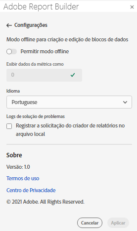
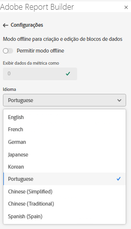

# Configurações do Report Builder

Use o painel **Settings** para definir as configurações no nível do aplicativo, como o idioma exibido pela interface do usuário ou se deseja ou não trabalhar no modo offline. As configurações são aplicadas imediatamente e são definidas para todas as sessões futuras até serem alteradas.

Para alterar as configurações de Report Builder

1. Clique no ícone **Settings**.

1. Faça alterações no modo Ativar offline, selecione um Idioma ou ative as configurações do log de solução de problemas.

1. Clique em **Aplicar**.

   

## Modo offline

Ao criar e editar um bloco de dados no modo off-line, os dados não são recuperados. Em vez disso, os dados de simulação são usados para que você possa criar e editar rapidamente um bloco de dados sem esperar a execução da solicitação. Quando estiver novamente online, o comando *Refresh data block* ou *Refresh all data blocks* atualiza os blocos de dados criados com os dados reais.

Para ativar o modo off-line

1. Clique no ícone **Settings**.

1. Selecione **Ativar modo offline**.

1. Insira um inteiro positivo no campo **Display metric data as** .

1. Clique em **Aplicar**.

## Idioma

Você pode escolher o idioma para a interface do usuário do Report Builder. Todos os idiomas Adobe Analytics compatíveis estão disponíveis.

Para selecionar o idioma usado na interface do usuário do Report Builder

1. Clique em Configurações.

1. Selecione um idioma no menu suspenso **Language**.

   

1. Clique em **Aplicar.**

## Solução de problemas

Use a configuração Solução de problemas para registrar todos os dados do cliente/servidor em um arquivo local. Use essa opção para ajudar a resolver tíquetes de suporte.

Para ativar a opção Solução de problemas, selecione **Registrar solicitação do construtor de relatórios no arquivo local**.
