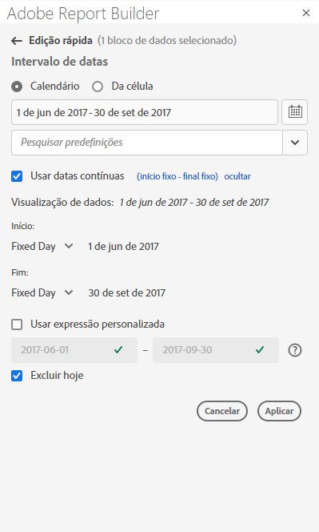
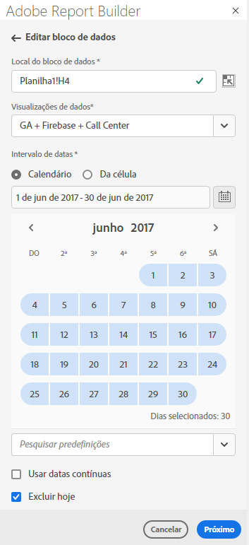
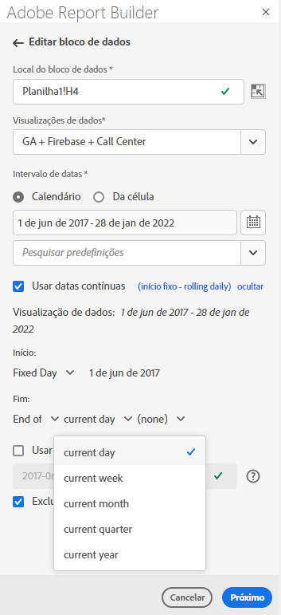
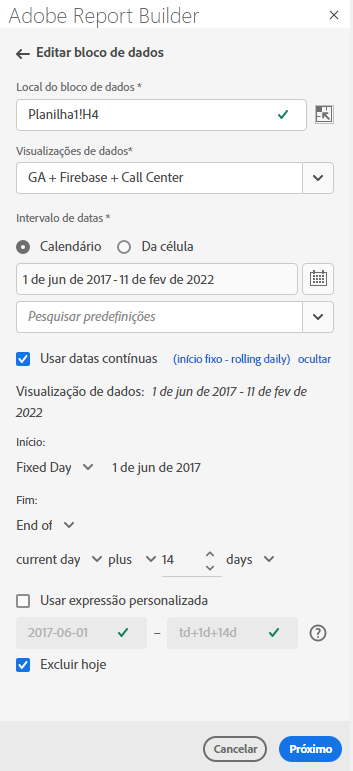
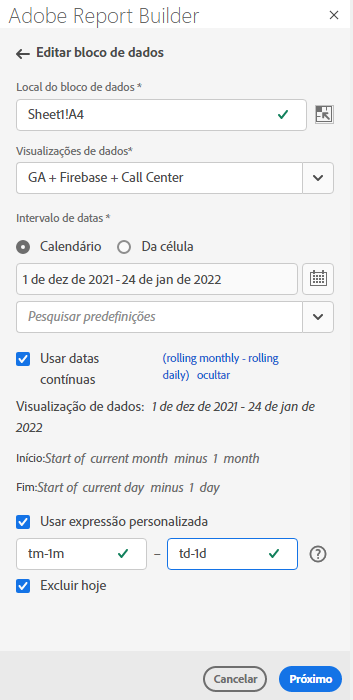
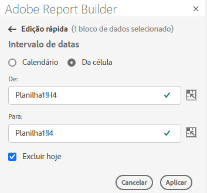

# Selecionar um intervalo de datas

Para alterar o intervalo de datas de um bloco de dados existente, selecione Editar um bloco de dados ou use o painel EDIÇÃO RÁPIDA .

Use as seguintes opções para alterar um intervalo de datas para um bloco de dados.

**Calendário**

O Calendário permite criar datas estáticas ou acumuladas usando as seguintes opções:

- Campo de intervalo de datas
- Calendário
- Menu suspenso Predefinição
- Modo de data do acumulado
- Personalizar expressões


**Da célula**

A opção Da célula permite fazer referência às datas inseridas em células da planilha.

Você tem a opção de excluir hoje em qualquer intervalo de datas selecionado.



## Usar o calendário

Quando você usa o **Calendário**, o campo de intervalo de datas exibe o intervalo de datas atual para a solicitação de bloco de dados. Você pode inserir datas diretamente no campo de intervalo de datas ou usar uma opção de seleção de intervalo de dados.

### Campo de intervalo de datas

Inserção de datas diretamente no campo de intervalo de datas

1. Clique no campo de intervalo de datas ao lado do ícone do calendário.

1. Insira datas de início e término para o intervalo de datas.

### Calendário

Para selecionar datas usando o calendário

1. Clique no ícone de calendário para exibir um calendário mensal.

1. Clique em uma data de início.

1. Clique em uma data de término.

Para definir um intervalo de datas invertido, clique primeiro na data final e, em seguida, clique na data inicial.



### Menu suspenso Predefinição

O menu suspenso predefinido inclui um conjunto padrão de intervalos de datas predefinidos e componentes de intervalo de datas para uma visualização de dados salva ou uma visualização de dados compartilhada com você.

### Datas do acumulado

A opção Datas do acumulado permite selecionar um intervalo de datas usando datas do acumulado.

1. Selecione **Usar datas do acumulado**.

1. Selecione uma expressão do acumulado para a data de início e/ou de término.

   

   **Início do** — Permite que você selecione o início de um dia, semana, mês, trimestre ou ano.

   **Fim do** — Permite selecionar o fim de um dia, semana, mês, trimestre ou ano.

   **Dia**  fixo— Permite que você corrija uma data de início ou término enquanto a outra data está em andamento.

1. Escolha dia, semana, mês, trimestre ou ano como o período do acumulado.

   

1. Adicione ou subtraia dias, semanas, meses, trimestres ou anos a partir da data do acumulado.

   

1. Clique em Next para definir o intervalo de dados.

   Use a visualização de data para confirmar se o intervalo de datas resultante é o intervalo desejado.

### Expressões personalizadas

A opção de expressão personalizada permite alterar o intervalo de datas criando uma expressão personalizada ou inserir uma fórmula aritmética.

1. Selecione **Usar datas do acumulado**.

1. Selecione **Usar expressão personalizada**.

   Quando você seleciona a opção **Use custom expression**, os controles padrão do intervalo de datas do acumulado são desativados.

   

1. Insira uma expressão personalizada.

   Para obter uma lista de amostras de expressões personalizadas, consulte **Expressões de datas**.

1. Use a visualização de data para verificar se o intervalo de datas resultante é o intervalo desejado.

#### Criar uma expressão personalizada

1. Insira um **Date reference**.

1. Adicione **Date operators** para mover a data para o passado ou futuro.

Você pode inserir uma expressão de data personalizada que inclui vários operadores, como ```tm-11m-1d```.

#### Referências de data

A tabela a seguir lista exemplos de referência de data.

| Referência de data | Tipo | Descrição |
|----------------|--------------|----------------------------|
| 1°/1/10 | Data estática | Inserido no formato de Data ISO |
| td | Data do acumulado | Início do dia atual |
| tw | Data do acumulado | Início da semana atual |
| tm | Data do acumulado | Início do mês atual |
| tq | Data do acumulado | Início do trimestre atual |
| ty | Data do acumulado | Início do ano atual |

#### Operadores de data

A tabela a seguir lista exemplos de operadores de data.

| Operadores de data | Unidade | Descrição |
|----------------|---------|--------------------|
| +6d | Dia | Adicionar 6 dias à referência de data |
| +1w | Semana | Adicionar uma semana inteira à referência de data |
| -2m | Mês | Subtrair 2 meses completos para a referência da data |
| -4q | Trimestre | Subtrair 4 trimestres à Referência de data |
| -1y | Ano | Subtrair um ano à Referência de data |

#### Expressões de datas

A tabela a seguir lista exemplos de expressão de data.

| Expressão de data | Significado |
|-----------------|--------------------------------------|
| td-1w | Primeiro dia da semana passada |
| tm-1d | Último dia do mês anterior |
| td-52w | Mesmo dia, 52 semanas atrás |
| tm-11m-1d | Último dia do mesmo mês do ano passado |
| &quot;2020-09-06&quot; | 9 de setembro de 2020 |

## Intervalo de datas da célula

O intervalo de datas pode ser especificado em células da planilha. Use a opção **Date range from cell** para escolher a data inicial e final do bloco de dados das células selecionadas. Quando você seleciona a opção **Da célula**, o painel exibe os campos **De** e **Para** onde você pode inserir um local de célula.



## Excluir hoje

Escolha a opção **Exclude today** para excluir hoje de um intervalo de datas selecionado. Optar por incluir hoje pode extrair dados incompletos por hoje.

Quando selecionada, a opção **Excluir hoje** exclui o dia atual de todos os modos de intervalo de datas, incluindo calendário, datas do acumulado ou expressões personalizadas.

## Intervalos de datas válidos

A lista a seguir descreve formatos válidos de intervalo de datas.

- As datas de início e término devem estar no seguinte formato: AAAA-MM-DD

- A data de início deve ser anterior ou igual à data de término. Ambas as datas podem ser definidas como no futuro.

- Ao usar datas do acumulado, a data de início deve ser hoje ou no passado. Deve estar no passado se **Excluir hoje** estiver marcado.

- Você pode criar um intervalo de datas estático para o futuro. Por exemplo, talvez seja necessário definir uma data futura para um lançamento de campanha de marketing na próxima semana. Essa opção cria um monitoramento de pasta de trabalho para uma campanha antecipadamente.

## Alterar intervalo de datas

Você pode editar o intervalo de datas de um bloco de dados existente selecionando Editar bloco de dados no painel COMANDOS ou selecionando o link de intervalo de datas no painel EDIÇÃO RÁPIDA.

**Editar bloco de dados** — Permite editar vários parâmetros de bloco de dados, incluindo intervalo de datas, para um único bloco de dados.

**Edição Rápida: Intervalo de datas** — Permite editar o intervalo de datas de um ou mais blocos de dados.

Para editar o intervalo de datas no painel EDIÇÃO RÁPIDA

1. Selecione células dentro de um ou mais blocos de dados em uma planilha.

1. Clique no link **Intervalo de datas** no painel EDIÇÃO RÁPIDA.

1. Selecione o intervalo de datas usando qualquer uma das opções de seleção de data.

1. Clique em **Aplicar**.


O Report Builder aplica o novo intervalo de datas a todos os blocos de dados na seleção.
