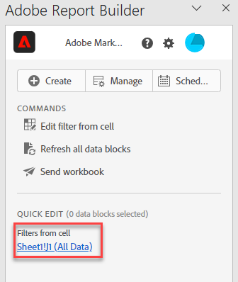

# Trabalhar com filtros no Report Builder

É possível aplicar Filtros ao criar um novo bloco de dados ou ao selecionar a opção **Editar bloco de dados** no painel COMANDOS.

## Aplicar filtros a um bloco de dados

Para aplicar um filtro a todo o bloco de dados, clique duas vezes em um filtro ou arraste e solte os filtros da lista de componentes na seção Filtros da Tabela.

## Aplicar filtros a métricas individuais

Para aplicar filtros a métricas individuais, arraste e solte um filtro em uma métrica na tabela. Você também pode clicar no **...** ícone à direita de uma métrica no painel Tabela e selecionar **Filtrar métrica**. Para exibir os filtros aplicados, selecione uma métrica no painel Tabela ou passe o mouse sobre ela. As métricas com filtros aplicados exibem um ícone de filtro.

## Filtros de edição rápida

É possível usar o painel Edição rápida para adicionar, remover ou substituir filtros de blocos de dados existentes.

Quando você seleciona um intervalo de células na planilha, o link **Filtros** no painel Edição rápida exibe uma lista de resumo dos filtros usados pelos blocos de dados nessa seleção.

Para editar filtros usando o painel Edição rápida

1. Selecione um intervalo de células de um ou vários blocos de dados.

   

1. Clique no link Filtros para iniciar o painel de Edição rápida - Filtros.

   

### Adicionar ou remover um filtro

É possível adicionar ou remover filtros usando as opções Adicionar/Remover.

1. Selecione a guia **Adicionar/Remover** no painel Edição rápida-filtros.

   Todos os filtros aplicados aos blocos de dados selecionados são listados no painel Edição rápida-filtros. Os filtros aplicados a todos os blocos de dados na seleção são listados sob o cabeçalho **Aplicado a todos os blocos de dados selecionados**. Os filtros aplicados a alguns, mas não a todos os blocos de dados, são listados sob o cabeçalho **Aplicado a um ou mais blocos de dados selecionados**.

   Quando vários filtros estiverem presentes nos blocos de dados selecionados, você poderá pesquisar por filtros específicos usando o campo de pesquisa **Adicionar filtro**.

   

1. Adicionar filtros selecionando filtros do menu suspenso **Adicionar filtro**.

   A lista de filtros pesquisáveis inclui todos os filtros acessíveis às visualizações de dados presentes em um ou mais blocos de dados selecionados, bem como todos os filtros disponíveis globalmente na organização.

   A adição de um filtro aplica o filtro a todos os blocos de dados na seleção.

1. Para remover filtros, clique no ícone excluir **x** à direita de filtros na lista **Filtros aplicados**.

1. Clique em **Aplicar** para salvar as alterações e retornar ao painel do hub.

   O Report Builder exibe uma mensagem para confirmar as alterações no filtro aplicado.

### Substituir um filtro

É possível substituir um filtro existente por outro para alterar a forma como os dados são filtrados.

1. Selecione a guia **Substituir** no painel Edição rápida-filtros.

   

1. Use o campo de pesquisa da **Lista de pesquisa** para localizar filtros específicos.

1. Escolha um ou mais filtros que deseja substituir.

1. Procure por um ou mais filtros no campo Substituir por.

   Selecionar um filtro o adiciona à lista **Substituir por**...

   

1. Clique em **Aplicar**.

   O Report Builder atualiza a lista de filtros para refletir a substituição.

### Definir filtros de bloco de dados a partir da célula

Os blocos de dados podem fazer referência a filtros de uma célula. Vários blocos de dados podem fazer referência à mesma célula para filtros, permitindo que você alterne facilmente os filtros para vários blocos de dados de uma vez.

Para aplicar filtros de uma célula

1. Navegue até a Etapa 2 no processo de criação ou edição do bloco de dados. Consulte [Criar um bloco de dados](./create-a-data-block.md).
1. Clique na guia **Filtros** para definir filtros.
1. Clique em **Criar filtro da célula**.

   

1. Selecione a célula da qual deseja que os blocos de dados façam referência a um filtro.

1. Adicione a escolha dos filtros que deseja adicionar à célula clicando duas vezes no filtro ou arrastando e soltando na seção Filtros incluídos.

   Observação: apenas uma opção pode ser selecionada para a célula em questão de cada vez.

   

1. Clique em **Aplicar** para criar a célula de referência.

1. Na guia **Filtros**, adicione o filtro de célula de referência recém-criado ao bloco de dados.

   

1. Clique em **Concluir**.

   Agora, essa célula pode ser referenciada por outros blocos de dados em seus filtros. Para aplicar a célula de referência como um filtro a outros blocos de dados, basta adicionar a referência da célula a seus filtros na guia filtros.

#### Usar a célula de referência para alterar filtros de blocos de dados

1. Selecione a célula de referência na planilha.

1. Clique no link em **Filtros da Célula** no menu Edição Rápida.

   

1. Selecione o filtro no menu suspenso.

   

1. Clique em **Aplicar**.
