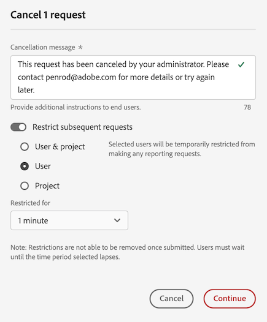

# Cancelar solicitações de relatórios no gerenciador de atividades de relatórios

O [!UICONTROL Gerenciador de atividades de relatórios] permite que os administradores diagnostiquem e cancelem rapidamente as solicitações de relatórios para corrigir problemas de capacidade de relatórios durante os horários de pico de relatórios.

Considere o seguinte ao cancelar solicitações de relatórios:

* Você pode cancelar solicitações específicas, cancelar todas as solicitações de um usuário específico ou cancelar todas as solicitações relacionadas a um projeto específico.

* Ao cancelar solicitações, você também pode optar por restringir solicitações seguintes por um determinado período.

  Quando você restringe uma solicitação seguinte, a ação é registrada no [Log de auditoria](/help/privacy/audit-log.md) com o nome da ação “EMBARGO”.

* Não será possível cancelar uma solicitação se a coluna [!UICONTROL **Usuário**] de uma solicitação estiver mostrando [!UICONTROL **Não reconhecido**]. Se isso ocorrer, significa que o usuário está em uma empresa de logon na qual você não tem permissões administrativas.

Para mais informações sobre o gerenciador de atividades de relatórios, incluindo os principais benefícios e requisitos de permissão, consulte [Visão geral do gerenciador de atividades de relatórios](/help/reporting-activity-manager/reporting-activity-overview.md).

## Cancelar solicitações específicas

Você pode cancelar solicitações individuais que estão consumindo uma grande quantidade de capacidade de relatórios. Ao cancelar uma solicitação, você pode optar por restringi-la ainda mais por um determinado período.

1. No Customer Journey Analytics, acesse **[!UICONTROL Ferramentas]** > **[!UICONTROL Gerenciador de atividades de relatórios]**.

1. Selecione a conexão na qual deseja cancelar as solicitações de relatórios. <!--double-check this step-->

   Para mais informações sobre os dados disponíveis nesta página, consulte [Exibir atividades de relatórios no gerenciador de atividades de relatórios](/help/reporting-activity-manager/reporting-activity.md).

1. Selecione a guia [!UICONTROL **Solicitações**] e escolha uma ou mais solicitações.

   <!-- add screenshot -->

1. Selecione [!UICONTROL **Cancelar solicitações**].

   A caixa de diálogo [!UICONTROL **Cancelar _x_ solicitações de relatórios**] é exibida.

1. O campo Mensagem de cancelamento mostra a mensagem que é exibida aos usuários quando suas solicitações são canceladas. Uma mensagem padrão é fornecida. É possível atualizar a mensagem padrão para fornecer detalhes adicionais.

1. (Opcional) Para restringir solicitações futuras em um determinado período:

   1. Habilite a opção de [!UICONTROL **Restringir solicitações seguintes**].

      

   1. Escolha entre as seguintes opções:

      | Opção | Função |
      |---------|----------|
      | [!UICONTROL **Usuário e projeto**] | Usuários(as) associados(as) às solicitações selecionadas serão temporariamente restringidos de executar solicitações de relatórios para os projetos associados. |
      | [!UICONTROL **Usuário**] | Usuários(as) associados(as) às solicitações selecionadas serão temporariamente restringidos(as) de fazer solicitações de relatórios. |
      | [!UICONTROL **Projeto**] | Os projetos associados às solicitações selecionadas ficarão temporariamente fechados a todas as solicitações de relatórios. |
      | [!UICONTROL **Restrito para**] | Escolha por quanto tempo as solicitações serão restringidas. Você pode escolher 1 minuto (padrão), 5 minutos, 10 minutos, 15 minutos ou 30 minutos. <!-- double-check this -->
Não é possível remover uma restrição antecipadamente após defini-la.
 |

      {style="table-layout:auto"}

1. Selecione [!UICONTROL **Prosseguir com o cancelamento**].

   Uma notificação é exibida no Analysis Workspace, informando aos usuários que a solicitação foi cancelada. Para mais informações sobre como isso aparece no Analysis Workspace, consulte [Experiência quando usuários acessam um relatório cancelado](#experience-when-users-access-a-cancelled-report).

## Cancelar solicitações por usuário

Você pode cancelar todas as solicitações associadas a um ou mais usuários. Ao cancelar solicitações associadas a um usuário, você pode optar por restringir ainda mais as solicitações desse usuário por um determinado período.

1. No Customer Journey Analytics, acesse **[!UICONTROL Ferramentas]** > **[!UICONTROL Gerenciador de atividades de relatórios]**.

1. Selecione a conexão na qual deseja cancelar as solicitações de relatórios. <!--double-check this step-->

   Para mais informações sobre os dados disponíveis nesta página, consulte [Exibir atividades de relatórios no gerenciador de atividades de relatórios](/help/reporting-activity-manager/reporting-activity.md).

1. Selecione a guia [!UICONTROL **Usuários**] e escolha um ou mais usuários.

   <!-- add screenshot -->

1. Selecione [!UICONTROL **Cancelar solicitações**].

   A caixa de diálogo [!UICONTROL **Cancelar _x_ solicitações de relatório de x usuários**] é exibida.

1. O campo Mensagem de cancelamento mostra a mensagem que é exibida aos usuários quando suas solicitações são canceladas. Uma mensagem padrão é fornecida. É possível atualizar a mensagem padrão para fornecer detalhes adicionais.

1. (Opcional) Para restringir solicitações futuras em um determinado período:

   1. Habilite a opção para [!UICONTROL **Restringir solicitações subsequentes**]

      

   1. Escolha entre as seguintes opções:

      | Opção | Função |
      |---------|----------|
      | [!UICONTROL **Usuário e projeto**] | Usuários(as) selecionados(as) serão temporariamente restringidos(as) de fazer solicitações de relatórios para os projetos associados. 
Esta é a opção menos restritiva.
 |
      | [!UICONTROL **Usuário**] | Usuários(as) selecionados(as) serão temporariamente restringidos(as) de fazer solicitações de relatórios. |
      | [!UICONTROL **Projeto**] | Os projetos associados a usuários(as) selecionados(as) ficarão fechados a quaisquer solicitações de relatórios feitas por um(a) usuário(a). |
      | [!UICONTROL **Restringir por**] | Escolha por quanto tempo as solicitações serão restringidas. É possível escolher as opções 1 minuto (padrão), 5 minutos, 10 minutos, 15 minutos ou 30 minutos. <!--double-check this--> 
Não é possível remover uma restrição antecipadamente após defini-la.
 |

      {style="table-layout:auto"}

1. Selecione [!UICONTROL **Continuar com cancelamento**].

   Uma notificação é exibida no Analysis Workspace, informando aos usuários que a solicitação foi cancelada. Para obter mais informações sobre como isso aparece no Analysis Workspace, consulte [Experiência quando usuários acessam um relatório cancelado](#experience-when-users-access-a-cancelled-report).

## Cancelar solicitações por projeto

É possível cancelar todas as solicitações associadas a um ou mais projetos. Ao cancelar solicitações associadas a um projeto, é possível optar por restringir ainda mais as solicitações associadas a esse projeto para um determinado período.

1. No Customer Journey Analytics, vá para **[!UICONTROL Ferramentas]** > **[!UICONTROL Gerenciador de atividades de relatórios]**.

1. Selecione a conexão na qual deseja cancelar solicitações de relatórios. <!--double-check this step-->

   Para obter mais informações sobre os dados disponíveis nesta página, consulte [Exibir atividade de relatório no Gerenciador de atividades de relatórios](/help/reporting-activity-manager/reporting-activity.md).

1. Selecione a guia [!UICONTROL **Projetos**] e escolha um ou mais projetos.

   <!-- add screenshot -->

1. Selecione [!UICONTROL **Cancelar solicitações**].

   A caixa de diálogo [!UICONTROL **Cancelar _x_ solicitações de relatório de x projetos**] é exibida.

1. O campo Mensagem de cancelamento mostra a mensagem que é exibida aos usuários quando suas solicitações são canceladas. Uma mensagem padrão é fornecida. É possível atualizar a mensagem padrão para fornecer detalhes adicionais.

1. (Opcional) Para restringir solicitações futuras em um determinado período:

   1. Habilite a opção para [!UICONTROL **Restringir solicitações subsequentes**].

      

   1. Escolha entre as seguintes opções:

      | Opção | Função |
      |---------|----------|
      | [!UICONTROL **Usuário e projeto**] | Os projetos selecionados ficarão temporariamente fechados a solicitações de relatórios feitas por usuários(as) associados(as).
Esta é a opção menos restritiva.
 |
      | [!UICONTROL **Usuário**] | Usuários(as) associados(as) aos projetos selecionados serão restringidos(as) de fazer solicitações de relatórios. |
      | [!UICONTROL **Projeto**] | Os projetos selecionados ficarão temporariamente fechados a qualquer solicitação de relatório feita por usuários. |
      | [!UICONTROL **Restringido por**] | Escolha por quanto tempo as solicitações serão restringidas. É possível escolher as opções 1 minuto (padrão), 5 minutos, 10 minutos, 15 minutos ou 30 minutos. <!--double-check this--> 
Não é possível remover uma restrição antecipadamente após defini-la.
 |

      {style="table-layout:auto"}

1. Selecione [!UICONTROL **Continuar com cancelamento**].

   Uma notificação é exibida no Analysis Workspace, informando aos usuários que a solicitação foi cancelada. Para obter mais informações sobre como isso aparece no Analysis Workspace, consulte [Experiência quando usuários acessam um relatório cancelado](#experience-when-users-access-a-cancelled-report).

## Cancelar solicitações por aplicativo

É possível cancelar todas as solicitações associadas a um ou mais aplicativos. Ao cancelar solicitações associadas a um aplicativo, é possível optar por restringir ainda mais as solicitações associadas a esse aplicativo para um determinado período.

Os aplicativos incluem:

* Interface do Analysis Workspace
* Projetos agendados do Espaço de trabalho.
* Report Builder
* Interfaces do construtor: segmento, métricas calculadas, anotações, públicos etc.
* Chamadas de API da API 2.0
* Alertas
* Exportação de tabela completa
* Links para compartilhar com qualquer pessoa
* Análise guiada
* Qualquer outro aplicativo que consulte o mecanismo de relatórios do Analytics

Para cancelar solicitações por aplicativo:

1. No Customer Journey Analytics, vá para **[!UICONTROL Ferramentas]** > **[!UICONTROL Gerenciador de atividades de relatórios]**.

1. Selecione a conexão na qual deseja cancelar solicitações de relatórios. <!--double-check this step-->

   Para obter mais informações sobre os dados disponíveis nesta página, consulte [Exibir atividade de relatório no Gerenciador de atividades de relatórios](/help/reporting-activity-manager/reporting-activity.md).

1. Selecione a guia [!UICONTROL **Aplicativos**] e escolha um ou mais aplicativos.

   <!-- add screenshot -->

1. Selecione [!UICONTROL **Cancelar solicitações**].

   A caixa de diálogo [!UICONTROL **Cancelar _x_ solicitações de relatório de x projetos**] é exibida.

1. O campo Mensagem de cancelamento mostra a mensagem que é exibida aos usuários quando suas solicitações são canceladas. Uma mensagem padrão é fornecida. É possível atualizar a mensagem padrão para fornecer detalhes adicionais.

1. (Opcional) Para restringir solicitações futuras em um determinado período:

   1. Habilite a opção para [!UICONTROL **Restringir solicitações subsequentes**]

      

   1. Escolha entre as seguintes opções:

      | Opção | Função |
      |---------|----------|
      | [!UICONTROL **Usuário e projeto**] | Os aplicativos selecionados ficarão temporariamente fechados a qualquer solicitação de relatório feita por usuários associados e projetos.
Esta é a opção menos restritiva.
 |
      | [!UICONTROL **Usuário**] | Usuários associados aos aplicativos selecionados serão impedidos de fazer qualquer solicitação de relatório. |
      | [!UICONTROL **Projeto**] | Os projetos associados aos aplicativos selecionados ficarão fechados a qualquer solicitação de relatório feita por usuários. |
      | [!UICONTROL **Restringido por**] | Escolha por quanto tempo as solicitações serão restringidas. É possível escolher as opções 1 minuto (padrão), 5 minutos, 10 minutos, 15 minutos ou 30 minutos. <!--double-check this--> 
Não é possível remover uma restrição antecipadamente após defini-la.
 |

      {style="table-layout:auto"}

1. Selecione [!UICONTROL **Continuar com cancelamento**].

   Uma notificação é exibida no aplicativo (como no Analysis Workspace), informando aos usuários que a solicitação foi cancelada. Para obter mais informações sobre como isso aparece no Analysis Workspace, consulte [Experiência quando usuários acessam um relatório cancelado](#experience-when-users-access-a-cancelled-report).

## Experiência quando usuários acessam um relatório cancelado

No Analysis Workspace, os usuários veem as seguintes mensagens ao tentar acessar um relatório ou uma visualização afetada por um cancelamento:

### Mensagem no projeto

Quando usuários tentam acessar um projeto afetado por um cancelamento, veem uma mensagem informando que o relatório foi temporariamente restringido:

### Mensagem na visualização

Quando usuários tentam acessar uma visualização afetada por um cancelamento, veem uma mensagem informando que o processamento de dados do relatório foi temporariamente restringido:

