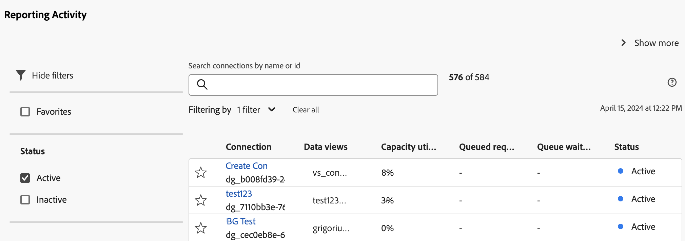
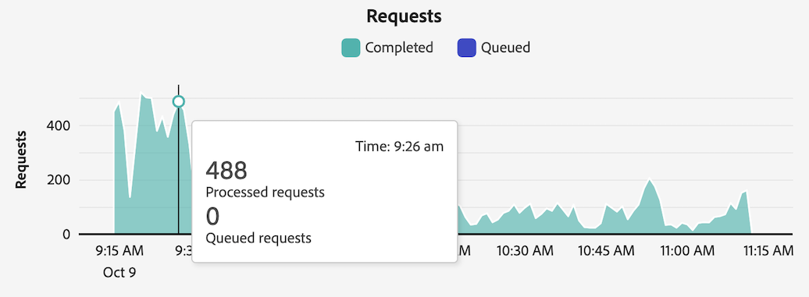

# Exibir atividade de relatório {#view-reporting-activity}

O [!UICONTROL Gerenciador de atividades de relatórios] permite que admins diagnostiquem e corrijam rapidamente problemas de capacidade durante os horários de pico de relatórios.

Para obter mais informações sobre o Gerenciador de atividades de relatórios, incluindo os principais benefícios e permissões necessárias, consulte [Visão geral do Gerenciador de atividades de relatórios](/help/reporting-activity-manager/reporting-activity-overview.md).

## Para todas as conexões {#view-all-report-suites}

<!-- markdownlint-disable MD034 -->

>[!CONTEXTUALHELP]
>id="cja_tools_reportingactivitymanager_connections"
>title="Conexões"
>abstract="Esta tabela mostra as conexões para as quais você tem direitos de gerenciar a atividade de relatórios. As informações sobre cada conexão estão disponíveis em cada coluna da tabela."

<!-- markdownlint-enable MD034 -->

<!-- markdownlint-disable MD034 -->

>[!CONTEXTUALHELP]
>id="tools_reportingactivitymanager_connections"
>title="Conexões"
>abstract="Esta tabela mostra as conexões para as quais você tem direitos de gerenciar a atividade de relatórios. As informações sobre cada conexão estão disponíveis em cada coluna da tabela."

<!-- markdownlint-enable MD034 -->

1. No Customer Journey Analytics, acesse **[!UICONTROL Ferramentas]** > **[!UICONTROL Gerenciador de atividades de relatórios]**.

   Uma lista de suas conexões base habilitadas é exibida.

   

1. Para exibir o número total de solicitações de relatórios de todas as conexões em sua organização, expanda [!UICONTROL **Mostrar mais**] para exibir o gráfico de [!UICONTROL **Solicitações de relatórios mensais**].

   É possível visualizar o número de solicitações de relatórios em sua organização para o mês atual e o mês anterior.

   

1. (Opcional) É possível pesquisar ou filtrar a lista de conexões:

   * Use o campo de pesquisa para procurar uma conexão específica. Comece a digitar o nome ou ID da conexão e a lista de conexões será atualizada conforme você digita.

   * Selecione  para expandir a lista de opções de filtro. Você pode filtrar por [!UICONTROL **Favoritos**] ou [!UICONTROL **Status**].

     Para marcar uma conexão como favorita, selecione o ícone de estrela à esquerda do nome da conexão.

     <!-- (does this option still exist?) 1. (Optional) Select **[!UICONTROL Refresh]** at the top-right to refresh the data. -->

1. Exibir informações de utilização sobre cada conexão. Os dados mostrados na tabela representam a atividade de relatórios da conexão no momento em que a página foi carregada pela última vez.

   As seguintes colunas estão disponíveis:

   | Elemento da interface | Descrição |
   | --- | --- |
   | **[!UICONTROL Conexão]** | A conexão em que você está monitorando a atividade de relatórios. |
   | **[!UICONTROL Visualizações de dados]** | Mostra todas as visualizações de dados que usam a conexão. A configuração da visualização de dados pode adicionar complexidade às solicitações de relatórios. |
   | **[!UICONTROL Utilização da capacidade]** | A porcentagem da capacidade de relatórios da conexão que está sendo usada, em tempo real. 
**Observação**: uma capacidade de uso de 100% não necessariamente sugere que você deve começar a cancelar imediatamente as solicitações de relatórios. A capacidade de uso de 100% pode ser íntegra se o tempo médio de espera for razoável. Por outro lado, a capacidade de uso de 100% pode sugerir um problema se o número de solicitações em fila também estiver crescendo.
 |
   | **[!UICONTROL Solicitações na fila]** | O número de solicitações aguardando para serem processadas. <!-- ??? --> |
   | **[!UICONTROL Tempo de espera na fila]** | O tempo médio de espera antes do início do processamento das solicitações. <!-- ???? --> |
   | **[!UICONTROL Status]** | Os possíveis status são: <ul><li>[!UICONTROL **Ativo**] (azul): os relatórios foram executados na conexão nas últimas 2 horas. Os dados mostrados na tabela representam a capacidade de relatório da conexão no momento em que a página foi carregada pela última vez.</li><li>[!UICONTROL **Inativo**] (cinza): nenhum relatório foi executado na conexão nas últimas 2 horas, portanto, nenhum dado será exibido para a conexão.</li></ul> |

   {style="table-layout:auto"}

## Para uma única conexão

1. No Customer Journey Analytics, selecione [!UICONTROL **Ferramentas**] > [!UICONTROL **Gerenciador de atividades de relatórios**].

1. Selecione o título vinculado da conexão para a qual deseja exibir detalhes.

   Os dados de atividade de relatórios são exibidos para a conexão selecionada.

1. (Opcional) Quando uma conexão é carregada pela primeira vez no Gerenciador de atividades de relatórios, os dados exibidos representam as métricas de utilização atuais. Para ver as métricas atualizadas após o carregamento inicial, clique no botão [!UICONTROL **Atualizar**] para atualizar a página manualmente.

   <!-- Need to update this screenshot:  -->

1. Use os gráficos e tabelas disponíveis para entender a atividade de relatórios na conexão.

   * [Exibir gráficos](#view-graphs)

   * [Exibir tabela](#view-table)

### Exibir gráficos

Os gráficos a seguir estão disponíveis para ajudá-lo a entender melhor a atividade que ocorre na conexão.

Se os gráficos não estiverem visíveis, clique no botão [!UICONTROL **Mostrar gráficos**].

#### Gráfico de utilização {#utilization}

O gráfico de utilização mostra a utilização de relatórios para a conexão selecionada nas últimas 2 horas.

Passe o mouse sobre o gráfico para exibir os pontos no tempo em que a porcentagem de capacidade de uso foi mais alta naquele minuto.

* **Eixo X**: a capacidade de uso dos relatórios nas últimas 2 horas.
* **Eixo Y**: a porcentagem da capacidade de uso do relatório por minuto.

  

#### Gráfico de usuários distintos

O gráfico de Usuários distintos mostra a atividade de relatórios da conexão selecionada nas últimas 2 horas.

Passe o mouse sobre o gráfico para exibir os pontos no tempo em que o número máximo de usuários foi maior naquele minuto.

* **Eixo X**: a atividade de relatório no último intervalo de tempo de 2 horas.
* **Eixo Y**: o número de usuários que fizeram solicitações de relatórios, por minuto.

  

#### Gráfico de solicitações

O gráfico Solicitações mostra o número de solicitações processadas e em fila para a conexão selecionada nas últimas 2 horas.

Passe o mouse sobre o gráfico para exibir os pontos no tempo em que o número máximo de solicitações foi mais alto naquele minuto.

* **Eixo X**: o número de solicitações processadas e em fila durante o último intervalo de tempo de 2 horas.
* **Eixo Y**: o número de solicitações processadas (em verde) e solicitações em fila (em roxo), por minuto.

  

#### Gráfico de enfileiramento

O gráfico Enfileiramento mostra o tempo médio de espera da fila (em segundos) para as solicitações de relatório da conexão selecionada nas últimas 2 horas.

Passe o mouse sobre o gráfico para exibir os pontos no tempo em que o tempo médio máximo de espera foi mais alto para esse minuto.

* **Eixo X**: o tempo médio de espera na fila para solicitações de relatórios durante o último intervalo de tempo de 2 horas.
* **Eixo Y**: o tempo médio de espera (em segundos).

  

### Exibir tabela {#view-table}

Ao exibir a tabela, considere o seguinte:

* Você pode optar por exibir dados escolhendo qualquer uma das seguintes guias na parte superior da tabela de dados: [!UICONTROL **Solicitação**], [!UICONTROL **Usuário**], [!UICONTROL **Projeto**] ou [!UICONTROL **Aplicativo**].

* Você pode pesquisar ou filtrar a lista de conexões:

   * Use o campo de pesquisa para procurar uma conexão específica. Comece a digitar o nome ou ID da conexão e a lista de conexões será atualizada conforme você digita.

   * Selecione o ícone [!UICONTROL **Filtro**]  para expandir a lista de opções de filtro. Você pode filtrar por [!UICONTROL **Status**], [!UICONTROL **Complexidade**], [!UICONTROL **Aplicativo**], [!UICONTROL **Usuário**] ou [!UICONTROL **Projeto**].

   * Você pode selecionar [!UICONTROL **Ocultar gráficos**] para mostrar apenas a tabela.

#### Exibir dados mediante solicitação

Ao selecionar a guia [!UICONTROL **Solicitação**], as seguintes colunas ficam disponíveis na tabela:

| Coluna | Descrição |
| --- | --- |
| [!UICONTROL **ID da solicitação**] | Um identificador exclusivo que pode ser usado para fins de solução de problemas. Para copiar a ID, selecione a solicitação e a opção [!UICONTROL **Copiar IDs de solicitação**]. |
| [!UICONTROL **Tempo de execução**] | Há quanto tempo a solicitação está em execução. |
| [!UICONTROL **Hora de início**] | Quando a solicitação iniciou o processamento (com base no horário local do administrador). |
| [!UICONTROL **Tempo de espera**] | Quanto tempo a solicitação ficou aguardando antes de ser processada. Este valor geralmente fica em “0” quando há capacidade suficiente. |
| [!UICONTROL **Aplicativo**] | Os aplicativos compatíveis com o [!UICONTROL Gerenciador de Atividades de relatórios] são: <ul><li>Interface do Analysis Workspace</li><li>Projetos agendados do Espaço de trabalho.</li><li>Report Builder</li><li>Interfaces do construtor: Segmento, Métricas calculadas, Anotações, Públicos-alvo etc.</li><li>Chamadas de API da API 2.0</li><li>Alertas<li>Exportação de tabela completa</li><li>Links para compartilhar com qualquer pessoa</li><li>Análise guiada</li><li>Qualquer outro aplicativo que consulte o mecanismo de relatórios do Analytics</li></li></ul>
**Observação:** se o valor desta coluna for [!UICONTROL **Desconhecido**], significa que os metadados da solicitação não estão disponíveis para o usuário.
 |
| [!UICONTROL **Usuário**] | O usuário que iniciou a solicitação. 
**Observação:** se o valor desta coluna for [!UICONTROL **Desconhecido**], significa que os metadados da solicitação não estão disponíveis para o usuário.
 |
| [!UICONTROL **Projeto**] | Nomes de projeto do espaço de trabalho salvos, IDs de relatório da API e assim por diante. (Os metadados podem variar em vários aplicativos.)
**Observação:** se o valor desta coluna for [!UICONTROL **Desconhecido**], significa que o projeto não foi salvo ou que os metadados da solicitação não estão disponíveis para o usuário.
 |
| [!UICONTROL **Status**] | Indicadores de status: <ul><li>**Em execução**: a solicitação está sendo atualmente processada.</li><li>**Pendente**: a solicitação está aguardando para ser processada.</li></ul> |
| [!UICONTROL **Complexidade**] | Nem todas as solicitações exigem o mesmo tempo para serem processadas. A complexidade da solicitação pode ajudar a fornecer uma ideia geral sobre o tempo necessário para processar a solicitação. 
Os valores possíveis incluem:
 <ul><li>[!UICONTROL **Baixa**]</li><li>[!UICONTROL **Média**]</li><li>[!UICONTROL **Alta**]</li></ul>Esse valor é influenciado pelos valores nas seguintes colunas:<ul><li>[!UICONTROL **Limites mensais**]</li><li>[!UICONTROL **Colunas**]</li><li>[!UICONTROL **Segmentos**]</li></ul> |
| [!UICONTROL **Limites mensais**] | O número de meses incluídos em uma solicitação. Mais limites mensais aumentam a complexidade da solicitação. |
| [!UICONTROL **Colunas**] | O número de métricas e detalhamentos na solicitação. Mais colunas aumentam a complexidade da solicitação. |
| [!UICONTROL **Segmentos**] | O número de segmentos aplicados à solicitação. Mais segmentos aumentam a complexidade da solicitação. |

{style="table-layout:auto"}

#### Exibir dados por usuário

Ao selecionar a guia [!UICONTROL **Usuário**], as seguintes colunas ficam disponíveis na tabela:

| Coluna | Descrição |
| --- | --- |
| [!UICONTROL **Usuário**] | O usuário que iniciou a solicitação. Se o valor desta coluna for [!UICONTROL **Não reconhecido**], significa que o usuário está em uma empresa de logon onde você não tem permissões administrativas. |
| [!UICONTROL **Número de solicitações**] | O número de solicitações iniciadas pelo usuário. |
| [!UICONTROL **Número de projetos**] | O número de projetos associados ao usuário. <!-- ??? --> |
| [!UICONTROL **Aplicativo**] | Os aplicativos compatíveis com o [!UICONTROL Gerenciador de Atividades de relatórios] são: <ul><li>Interface do Analysis Workspace</li><li>Projetos agendados do Espaço de trabalho.</li><li>Report Builder</li><li>Interfaces do construtor: Segmento, Métricas calculadas, Anotações, Públicos-alvo etc.</li><li>Chamadas de API da API 2.0</li><li>Alertas<li>Exportação de tabela completa</li><li>Links para compartilhar com qualquer pessoa</li><li>Análise guiada</li><li>Qualquer outro aplicativo que consulte o mecanismo de relatórios do Analytics</li></li></ul> |
| [!UICONTROL **Média de complexidade**] | A média de complexidade das solicitações iniciadas pelo usuário. 
Nem todas as solicitações exigem o mesmo tempo para serem processadas. A complexidade da solicitação pode ajudar a fornecer uma ideia geral sobre o tempo necessário para processar a solicitação.

O valor desta coluna é baseado em uma pontuação determinada pelos valores das seguintes colunas:
<ul><li>[!UICONTROL **Média de limites mensais**]</li><li>[!UICONTROL **Média de colunas**]</li><li>[!UICONTROL **Média de segmentos**]</li></ul> |
| [!UICONTROL **Média de limites mensais**] | O número médio de meses incluídos nas solicitações. Mais limites mensais aumentam a complexidade da solicitação. |
| [!UICONTROL **Média de colunas**] | O número médio de métricas e detalhamentos nas solicitações incluídas. Mais colunas aumentam a complexidade da solicitação. |
| [!UICONTROL **Média de segmentos**] | O número médio de segmentos aplicados às solicitações incluídas. Mais segmentos aumentam a complexidade da solicitação. |

{style="table-layout:auto"}

#### Exibir dados por projeto

Ao selecionar a guia [!UICONTROL **Projeto**], as seguintes colunas ficam disponíveis na tabela:

| Coluna | Descrição |
| --- | --- |
| [!UICONTROL **Projeto**] | O projeto em que as solicitações foram iniciadas. |
| [!UICONTROL **Número de solicitações**] | O número de solicitações associadas ao projeto. |
| [!UICONTROL **Número de usuários**] | O número de usuários associados ao projeto. <!-- ??? --> |
| [!UICONTROL **Aplicativo**] | Os aplicativos compatíveis com o [!UICONTROL Gerenciador de Atividades de relatórios] são: <ul><li>Interface do Analysis Workspace</li><li>Projetos agendados do Espaço de trabalho.</li><li>Report Builder</li><li>Interfaces do construtor: Segmento, Métricas calculadas, Anotações, Públicos-alvo etc.</li><li>Chamadas de API da API 2.0</li><li>Alertas<li>Exportação de tabela completa</li><li>Links para compartilhar com qualquer pessoa</li><li>Análise guiada</li><li>Qualquer outro aplicativo que consulte o mecanismo de relatórios do Analytics</li></li></ul> |
| [!UICONTROL **Média de complexidade**] | A média de complexidade das solicitações incluídas no projeto. 
Nem todas as solicitações exigem o mesmo tempo para serem processadas. A complexidade da solicitação pode ajudar a fornecer uma ideia geral sobre o tempo necessário para processar a solicitação.

O valor desta coluna é baseado em uma pontuação determinada pelos valores das seguintes colunas:
<ul><li>[!UICONTROL **Média de limites mensais**]</li><li>[!UICONTROL **Média de colunas**]</li><li>[!UICONTROL **Média de segmentos**]</li></ul> |
| [!UICONTROL **Média de limites mensais**] | O número médio de meses incluídos nas solicitações. Mais limites mensais aumentam a complexidade da solicitação. |
| [!UICONTROL **Média de colunas**] | O número médio de métricas e detalhamentos nas solicitações incluídas. Mais colunas aumentam a complexidade da solicitação. |
| [!UICONTROL **Média de segmentos**] | O número médio de segmentos aplicados às solicitações incluídas. Mais segmentos aumentam a complexidade da solicitação. |

{style="table-layout:auto"}

#### Exibir dados por aplicativo

Ao selecionar a guia [!UICONTROL **Aplicativo**], as seguintes colunas ficam disponíveis na tabela:

| Coluna | Descrição |
| --- | --- |
| [!UICONTROL **Aplicativo**] | O aplicativo em que as solicitações foram iniciadas. |
| [!UICONTROL **Número de solicitações**] | O número de solicitações associadas ao aplicativo. |
| [!UICONTROL **Número de usuários**] | O número de usuários associados ao aplicativo. <!--???--> |
| [!UICONTROL **Número de projetos**] | O número de projetos associados ao aplicativo. <!--???--> |
| [!UICONTROL **Média de complexidade**] | A média de complexidade das solicitações associadas ao aplicativo. 
Nem todas as solicitações exigem o mesmo tempo para serem processadas. A complexidade da solicitação pode ajudar a fornecer uma ideia geral sobre o tempo necessário para processar a solicitação.

O valor desta coluna é baseado em uma pontuação determinada pelos valores das seguintes colunas:
O valor desta coluna é baseado em uma pontuação determinada pelos valores das seguintes colunas:<ul><li>[!UICONTROL **Média de limites mensais**]</li><li>[!UICONTROL **Média de colunas**]</li><li>[!UICONTROL **Média de segmentos**]</li></ul> |
| [!UICONTROL **Média de limites mensais**] | O número médio de meses incluídos nas solicitações. Mais limites mensais aumentam a complexidade da solicitação. |
| [!UICONTROL **Média de colunas**] | O número médio de métricas e detalhamentos nas solicitações incluídas. Mais colunas aumentam a complexidade da solicitação. |
| [!UICONTROL **Média de segmentos**] | O número médio de segmentos aplicados às solicitações incluídas. Mais segmentos aumentam a complexidade da solicitação. |

{style="table-layout:auto"}

<!-- 

## Frequently asked questions {#faq}

| Question | Answer |
| --- | --- |
| | |

{style="table-layout:auto"}

-->
