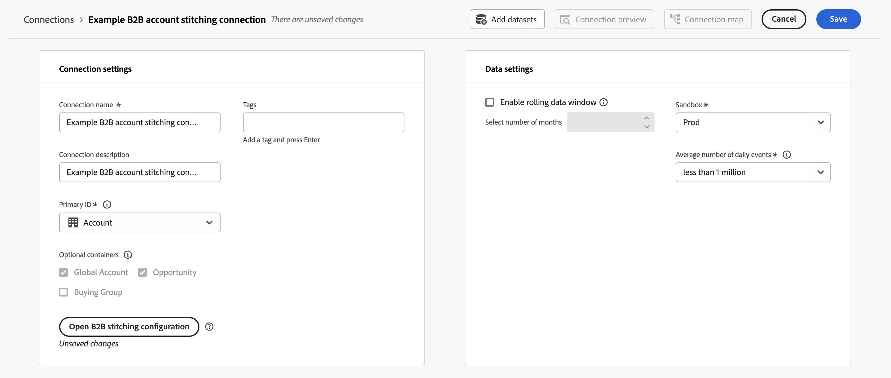
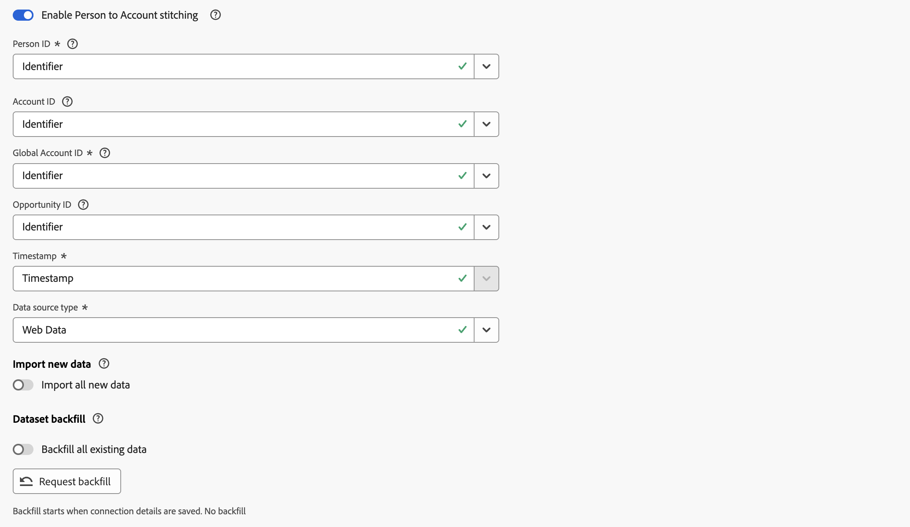

# Compilação de conta B2B

A compilação de conta B2B enriquece seus conjuntos de dados de evento com informações de conta e permite a análise completa da jornada completa do cliente no Customer Journey Analytics. Quando os eventos não têm uma ID de conta, que o Customer Journey Analytics B2B edition exige para assimilação, a compilação de conta deriva e adiciona essas informações automaticamente usando um [conjunto de dados de mapeamento de pessoa para conta](#prerequisites) fornecido por você.

Sem a compilação de conta, qualquer evento que não contenha uma ID de conta será descartado durante a assimilação. A compilação de conta elimina essa barreira ao pesquisar a conta associada à pessoa em cada evento, adicionando a ID da conta à medida que o evento é assimilado e retroativamente.

>[!NOTE]
>
>A compilação de conta B2B requer que você tenha direito ao [Customer Journey Analytics B2B edition](/help/getting-started/cja-b2b-edition.md) em seu ambiente para poder configurar a funcionalidade.

A compilação de conta executa as seguintes operações em seus conjuntos de dados:

* **Elevar a identidade da pessoa**: a ID da pessoa em cada evento é elevada ao namespace de identidade configurado usando o gráfico de identidade.
* **Adicionar informações de conta ausentes**: para eventos que contêm uma ID de pessoa, o [mapeamento de pessoa para conta](#prerequisites) é usado para derivar e adicionar as informações de conta. Qualquer informação de conta no próprio evento é usada como um método de fallback.

## Pré-requisitos

Antes de ativar a compilação de conta B2B, prepare os seguintes conjuntos de dados no Adobe Experience Platform:

| Conjunto de dados | Obrigatório | Descrição |
|---|---|---|
| **conjunto de dados de pessoa para conta** | Obrigatório | Um conjunto de dados de pesquisa (registro, sem série temporal) que contenha no mínimo uma ID de pessoa (com namespace) e uma ID de conta. Essas IDs são usadas para derivar o mapa de relacionamento entre pessoas e contas. |

>[!IMPORTANT]
>
>O campo de ID de pessoa no seu conjunto de dados de **[!UICONTROL pessoa para conta]** deve ser marcado como uma identidade no esquema.

## Ativar compilação de conta {#enable-account-stitching}

Você ativa e configura a compilação de conta B2B no nível da conexão e, em seguida, ativa a compilação de conta em conjuntos de dados de evento individuais nessa conexão.

### Definir configurações de compilação B2B {#configure-b2b-stitching-settings}

>[!CONTEXTUALHELP]
>id="connection_b2b_stitching_open_configuration"
>title="Configurar a compilação de conta B2B"
>abstract="Selecione **[!UICONTROL Abrir configuração de compilação B2B]** para configurar a compilação de conta B2B. Se a conexão ainda não tiver sido salva, a configuração será rotulada com **[!UICONTROL _Alterações não salvas_]**."

>[!CONTEXTUALHELP]
>id="connection_b2b_stitching_person_identifier_namespace"
>title="Namespace do identificador de pessoa"
>abstract="Selecione um namespace de identificador de pessoa, por exemplo, Email, para o qual você deseja que qualquer ID de pessoa seja elevada."

>[!CONTEXTUALHELP]
>id="connection_b2b_stitching_person_to_account_dataset"
>title="Conjunto de dados de pessoa para conta"
>abstract="Selecione o conjunto de dados de pesquisa que mapeia IDs de pessoa para IDs de conta."

>[!CONTEXTUALHELP]
>id="connection_b2b_stitching_person"
>title="Pessoa"
>abstract="Selecione o campo no conjunto de dados que contém a ID de pessoa. Este campo deve ser marcado como uma identidade e não pode ser igual ao campo **[!UICONTROL Conta]** ou ao campo **[!UICONTROL Hora de início]**."

>[!CONTEXTUALHELP]
>id="connection_b2b_stitching_account"
>title="Conta"
>abstract="Selecione o campo no conjunto de dados que contém a ID da conta. Este campo não pode ser igual ao campo **[!UICONTROL Pessoa]** ou ao campo **[!UICONTROL Hora de início]**."

>[!CONTEXTUALHELP]
>id="connection_b2b_stitching_start_time"
>title="Hora de início"
>abstract="Selecione um campo de carimbo de data e hora que indique quando o relacionamento entre pessoa e conta se tornou ativo."
>additional-url=""
additional-url=""

1. No Customer Journey Analytics, navegue até **[!UICONTROL Conexões]** e [crie uma nova conexão](/help/connections/create-connection.md#create-a-connection) ou [edite uma conexão existente](/help/connections/create-connection.md#edit-a-connection).

1. Em **[!UICONTROL Configurações de conexão]**, defina a **[!UICONTROL ID Primária]** como  **[!UICONTROL Conta]**.

1. Selecione **[!UICONTROL Abrir configuração de compilação B2B]**.

   

   >[!NOTE]
   >
   >Uma configuração de compilação B2B configurada anteriormente para uma conexão não salva é indicada com **[!UICONTROL _alterações não salvas_]**. Você não pode modificar **[!UICONTROL Contêineres opcionais]** para uma configuração de compilação B2B configurada anteriormente.

1. Na caixa de diálogo **[!UICONTROL Configuração de compilação B2B]**:

   

   1. Configurar a seção **[!UICONTROL Pessoa]**:

      * Selecione um **[!UICONTROL Namespace de identificador de pessoa]**, por exemplo **[!UICONTROL Email]**, para o qual você deseja que qualquer ID de pessoa seja elevada. Este campo é obrigatório.

   1. Configure a seção **[!UICONTROL Conta]** abaixo de **[!UICONTROL Pessoa para Conta]**.

      | Campo | Obrigatório | Descrição |
      |---|:---:|---|
      | **[!UICONTROL Conjunto de dados de Pessoa para Conta]** |  | Selecione a pesquisa (conjunto de dados de série não temporal ou de registro) que mapeia pessoas para contas. |
      | **[!UICONTROL Pessoa]** |  | Selecione o campo no conjunto de dados que contém a ID de pessoa. Este campo deve ser marcado como uma identidade e não pode ser igual ao campo **[!UICONTROL Conta]** ou ao campo **[!UICONTROL Hora de início]**. |
      | **[!UICONTROL Conta]** |  | Selecione o campo no conjunto de dados que contém a ID da conta. Este campo não pode ser igual ao campo **[!UICONTROL Pessoa]** ou ao campo **[!UICONTROL Hora de início]**. |
      | **Hora de início** | | Selecione um campo de carimbo de data e hora que indique quando o relacionamento entre pessoa e conta se tornou ativo. |

      >[!NOTE]
      >
      >Se ocorrer um erro ao carregar as opções de campo, os menus suspensos aparecerão vazios e um indicador de erro aparecerá abaixo de cada campo afetado. Verifique o esquema do conjunto de dados e tente novamente.

   1. Selecione **[!UICONTROL Salvar]** para fechar a caixa de diálogo **[!UICONTROL Configuração de compilação B2B]** e retornar às configurações de conexão.

   1. O indicador **[!UICONTROL _Alterações não salvas_]** é exibido ao lado do botão **Abrir configuração de compilação B2B** até que você [salve](#save) a conexão.

### Ativar a compilação B2B em conjuntos de dados do evento

>[!CONTEXTUALHELP]
>id="connection_b2b_stitching_enable_person_to_account"
>title="Permitir que a pessoa realize a compilação de conta"
>abstract="Se ativado, esse conjunto de dados usa a compilação de conta B2B. Selecione uma **[!UICONTROL ID de pessoa]** necessária para pesquisar a ID da conta com base no conjunto de dados de pessoa para conta. Se desabilitado, este conjunto de dados *não* usa a compilação de contas B2B e você precisa selecionar uma **[!UICONTROL ID de Conta]** necessária."
>additional-url=""
additional-url=""

Depois de configurar a compilação B2B no nível da conexão, você deve ativar a compilação de conta B2B individualmente para cada conjunto de dados de evento que você deseja compilar.

1. Nas configurações de Conexão, selecione **[!UICONTROL Adicionar conjuntos de dados]** ou abra as configurações para um conjunto de dados de evento existente. Consulte [Adicionar conjuntos de dados](/help/connections/create-connection.md#add-datasets) ou [Editar um conjunto de dados](/help/connections/create-connection.md#edit-a-dataset) para obter mais informações.

1. Para o conjunto de dados de evento específico para o qual você deseja configurar a compilação de conta B2B, alterne **[!UICONTROL Habilitar compilação de Pessoa para Conta]** em.

>[!BEGINTABS]

>[!TAB Em]

Quando **[!UICONTROL Habilitar identificação de Pessoa por Conta]** estiver **ativado**, você configurou a identificação de conta B2B para o conjunto de dados.

* A configuração de uma ID de pessoa é obrigatória. Essa ID de pessoa é usada para pesquisar a ID da conta com base no [conjunto de dados de pessoa para conta](#prerequisites).
* A configuração de uma ID de conta é opcional.

>[!TAB Desligado]

Quando **[!UICONTROL Habilitar a compilação de Pessoa para Conta]** está **desativado**, você tem *não* configurado a compilação de conta B2B para o conjunto de dados.

* A configuração de uma ID de conta é obrigatória.
* A configuração de uma ID de pessoa é opcional.

>[!ENDTABS]

### Salvar

Depois de definir a configuração de compilação B2B e terminar de adicionar ou editar conjuntos de dados, selecione **[!UICONTROL Salvar]** para salvar a conexão.

>[!IMPORTANT]
>
>Depois que uma conexão é salva, a configuração de compilação B2B se torna imutável. Para exibir suas configurações depois de salvar, selecione **Abrir configuração de compilação B2B**. Todos os campos serão mostrados em um estado somente leitura. Além disso, se o conjunto de dados usado para [mapeamento de pessoa para conta](#prerequisites) for excluído no Experience Platform, essa conexão será excluída.

## Agendamento de atualização de dados

A compilação de conta deriva o mapa de identidade do seu [conjunto de dados de pessoa para conta](#prerequisites) diariamente e usa essas informações para atualizar conjuntos de dados habilitados para compilação, de acordo com a seguinte programação:

| Reproduzir novamente | Frequência | Janela de dados |
|---|---|---|
| Curto prazo | Semanalmente | Últimos 7 dias |
| Longo prazo | Mensalmente | Últimos 3 meses |

## Privacidade e higiene dos dados

A compilação de conta atende às solicitações padrão de privacidade e higiene para identidades de pessoas, de acordo com o comportamento de compilação B2C. Se uma ID de pessoa for removida posteriormente por meio de uma solicitação de Privacidade ou Higiene, a compilação associada executada usando o gráfico de identidade será revertida.

Entidades B2B, como contas, IDs de conta e IDs de conta globais que são adicionadas aos eventos por meio da compilação, não são removidas como parte das solicitações de privacidade ou higiene. Esses valores não contêm informações de identificação pessoal, portanto, não há obrigação legal de remover esses valores.

>[!MORELIKETHIS]
>
>* [Visão geral da compilação](overview.md)
>* [Configurar uma conexão para B2B](../connections/create-connection.md)
>* [Perguntas frequentes sobre compilação](faq.md)

