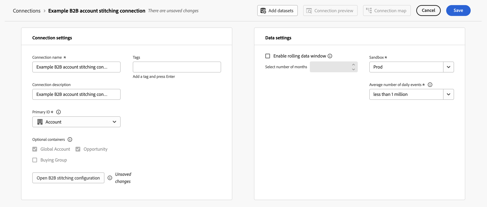

# Compilação de pessoa B2B para conta

A compilação de pessoa para conta B2B enriquece seus conjuntos de dados de evento com identidades de conta e permite a análise completa da jornada completa do cliente no Customer Journey Analytics. Quando os eventos não têm uma ID de conta, que o Customer Journey Analytics B2B edition requer para assimilação, a compilação de pessoa para conta deriva e adiciona essas informações automaticamente usando um [conjunto de dados de mapeamento de pessoa para conta](#prerequisites) fornecido por você.

Sem a identificação de pessoa por conta, qualquer evento que não contenha uma ID de conta será descartado durante a assimilação. A compilação de pessoa para conta resolve essa limitação procurando a conta associada à pessoa em cada evento, adicionando a ID da conta à medida que o evento é assimilado e retroativamente.

>[!NOTE]
>
>A compilação de contas de pessoas B2B requer que você tenha direito ao [Customer Journey Analytics B2B edition](/help/getting-started/cja-b2b-edition.md) em seu ambiente para poder configurar a funcionalidade.

A compilação de pessoa para conta executa as seguintes operações em seus conjuntos de dados:

* **Elevar a identidade da pessoa**: assim como a [abordagem de compilação B2C](/help/stitching/overview.md), você configurará um campo contendo IDs de pessoa persistentes. Usando o gráfico de identidade, a ID de pessoa persistente em cada evento é elevada a uma ID de pessoa a partir do namespace do identificador de pessoa configurado.
* **Adicionar identidades de conta ausentes**: depois de obter as informações de ID de pessoa para um evento, o [mapeamento de pessoa para conta](#prerequisites) é usado para derivar e adicionar as informações de identidade da conta. Qualquer identidade de conta disponível no próprio evento é usada como um método de fallback.

## Como funciona a compilação de pessoa B2B para conta

Para ilustrar como a compilação de pessoa B2B funciona, o conjunto de dados mostrado abaixo é usado como ponto de partida.

### Conjunto de dados do evento base

No Customer Journey Analytics B2B edition, os eventos sem ID de conta neste conjunto de dados de exemplo não compilado são ignorados e não são assimilados ().

| Ação | Carimbo de data e hora | ID persistente | ID de conta | ID de pessoa | Tipo de evento |
|:---:|--:|--|---|---|---|
|  | 1/3/25 | 1234 | Adobe | matt@adobe.com | Page view |
|  | 1/3/25 | 5678 |  | | |
|  | 3/4/25 | 9012 | Ubiquidade | cory@sky.com |  |
|  | 3/7/25 | 4321 | Céu | emily@sky.com | Central de atendimento |
|  | 5/5/25 | 6106 | | carmen@adobe.com |  |
|  | 6/1/25 | 8989 | Ubiquidade | cassidy@ubiquity.com | |
|  | 6/2/25 | 1111 |  | | |

A compilação de pessoa B2B para conta impede que os eventos sejam ignorados e não assimilados usando as seguintes operações:

* [Elevar identidades de pessoas](#elevate-person-identities).
* [Adicionar identidades de conta ausentes](#add-missing-account-identitiers).

### Elevar identidades de pessoas

+++ Detalhes

Para oferecer suporte a pessoas B2B para a compilação de conta, você fornece uma pessoa para o conjunto de dados de mapeamento de conta. Por exemplo:

| ID do CRM | ID de conta |
|---|---|
| 12hsd123 | Adobe |
| f82jsd32 | Céu |
| hg2023m2 | Céu |
| b978bbw9 | Ubiquidade |
| fs453ghi | Adobe |

Esse conjunto de dados de mapeamento de pessoa para conta é elevado usando a compilação baseada em gráfico. Por exemplo, você fornece o email como o namespace a ser usado. O resultado é um conjunto de dados de mapeamento de pessoa para conta atualizado com IDs de pessoa elevadas.

| ID do CRM | ID de pessoa elevada | ID de conta |
|---|---|---|
| 12hsd123 | matt@adobe.com | Adobe |
| f82jsd32 | emily@sky.com | Céu |
| hg2023m2 | cory@sky.com | Céu |
| b978bbw9 | cassidy@ubiquity.com | Ubiquidade |
| fs453ghi | carmen@adobe.com | Adobe |

A compilação baseada em gráfico também é usada para elevar as IDs de pessoa no conjunto de dados do evento de experiência. Por exemplo, consulte o valor atualizado de **emily@adobe.com**.

A compilação baseada em gráfico também é usada para elevar as IDs de pessoa no conjunto de dados do evento de experiência. Por exemplo, você configura o campo ID persistente (ECID) para ser usado como ID de pessoa persistente quando [habilita a compilação no conjunto de dados](#enable-b2b-person-to-account-stitching-on-event-datasets). Com base em `5678` como valor de ECID e `emily@adobe.com` como valor de Email, `emily@adobe.com` é definido como ID de pessoa elevada no evento relacionado.

| Carimbo de data e hora | ID persistente | ID da conta original | ID de pessoa original | ID de pessoa elevada |
|--|--|---|---|---|
| 1/3/25 | 1234 | Adobe | matt@adobe.com | matt@adobe.com |
| 1/3/25 | 5678 |  | | **emily@adobe.com** |
| 3/4/25 | 9012 | Ubiquidade | cory@sky.com | cory@sky.com |
| 3/7/25 | 4321 | Céu | emily@sky.com | emily@sky.com |
| 5/5/25 | 6106 | | carmen@adobe.com | carmen@adobe.com |
| 6/1/25 | 8989 | Ubiquidade | cassidy@ubiquity.com | cassidy@ubiquity.com |
| 6/2/25 | 1111 |  | 111 | 111 |

+++

### Adicionar identificadores de conta ausentes

+++ Detalhes

O conjunto de dados de pessoa para conta é usado mais uma vez para elevar as IDs de conta no conjunto de dados do evento de experiência. Por exemplo, consulte o valor adicionado **Sky** para emily@sky.com e **Adobe** para carmen@adobe.com. E o valor atualizado **Sky** (da Ubiquity) para cory@sky.com.

| Carimbo de data e hora | ID persistente | ID da conta original | ID de pessoa original | ID da Conta com Elevação | ID de pessoa elevada |
|---|---|---|---|---|---|
| 1/3/25 | 1234 | Adobe | matt@adobe.com | Adobe | matt@adobe.com |
| 1/3/25 | 5678 | | | **Céu** | **emily@sky.com** |
| 3/4/25 | 9012 | Ubiquidade | cory@sky.com | **Céu** | cory@sky.com |
| 3/7/25 | 4321 | Céu | emily@sky.com | Céu | emily@sky.com |
| 5/5/25 | 6106 | | carmen@adobe.com | **Adobe** | carmen@adobe.com |
| 6/1/25 | 8989 | Ubiquidade | cassidy@ubiquity.com | Ubiquidade | cassidy@ubiquity.com |
| 6/2/25 | 1111 |  | 1111 |  | 1111 |

+++

### Resultado

Este exemplo mostra como a compilação de pessoa B2B para conta atualiza seus dados de evento de experiência com identificadores de pessoa ausentes ou identificadores de conta ausentes e incorretos, com base no conjunto de dados de mapeamento de pessoa para conta fornecido como entrada.

## Pré-requisitos

Antes de ativar a compilação de conta por uma pessoa B2B, prepare os seguintes conjuntos de dados no Adobe Experience Platform:

| Conjunto de dados | Obrigatório | Descrição |
|---|---|---|
| **conjunto de dados de pessoa para conta** | Obrigatório | Um conjunto de dados de pesquisa (registro, sem série temporal) que contenha no mínimo uma ID de pessoa (com namespace) e uma ID de conta. Essas IDs são usadas para derivar o mapa de relacionamento entre pessoas e contas. |

>[!IMPORTANT]
>
>O campo de ID de pessoa no seu conjunto de dados de **[!UICONTROL pessoa para conta]** deve ser marcado como uma identidade no esquema.

## Habilitar compilação entre pessoa e conta {#enable-account-stitching}

Primeiro, você ativa e configura a compilação B2B no nível da conexão. Quando a compilação B2B é configurada para uma conexão, você pode ativar a pessoa para compilar a conta em conjuntos de dados de evento individuais nessa conexão.

### Configurar pessoa B2B para configurações de compilação da conta {#configure-b2b-stitching-settings}

>[!CONTEXTUALHELP]
>id="connection_b2b_stitching_open_configuration"
>title="Configurar a compilação B2B"
>abstract="Selecione **[!UICONTROL Abrir configuração de compilação B2B]** para configurar pessoa B2B para compilação de conta. Se a conexão ainda não tiver sido salva, a configuração será rotulada com **[!UICONTROL _Alterações não salvas_]**."

>[!CONTEXTUALHELP]
>id="connection_b2b_stitching_person_identifier_namespace"
>title="Namespace do identificador de pessoa"
>abstract="Selecione o namespace de identidade de pessoa mais relevante para seus relatórios. Por exemplo, Email. Qualquer conjunto de dados de evento com a **[!UICONTROL compilação de Pessoa para Conta]** habilitada tem a ID de pessoa persistente elevada a este namespace de identificador de pessoa."

>[!CONTEXTUALHELP]
>id="connection_b2b_stitching_person_to_account_dataset"
>title="Conjunto de dados de pessoa para conta"
>abstract="Selecione o conjunto de dados de pesquisa que mapeia IDs de pessoas para IDs de contas."

>[!CONTEXTUALHELP]
>id="connection_b2b_stitching_person"
>title="ID de pessoa"
>abstract="Selecione o campo no conjunto de dados que contém as IDs de pessoa. O namespace deste campo pode ser diferente ou igual ao namespace do identificador de pessoa selecionado. Se forem diferentes, os dois namespaces precisam ser vinculados no gráfico de identidade."

>[!CONTEXTUALHELP]
>id="connection_b2b_stitching_account"
>title="ID de conta"
>abstract="Selecione o campo no conjunto de dados que contém os valores do identificador exclusivo de conta. As informações da ID da conta serão disponibilizadas nas linhas de qualquer conjunto de dados de evento com a **[!UICONTROL compilação de Pessoa para Conta]** habilitada."

>[!CONTEXTUALHELP]
>id="connection_b2b_stitching_start_time"
>title="Hora de início"
>abstract="Selecione um campo de carimbo de data e hora que indique quando o relacionamento entre pessoa e conta se tornou ativo."

>[!CONTEXTUALHELP]
>id="connection_b2b_stitching_mapping_creation_time"
>title="Tempo de criação do mapeamento"
>abstract="Opcionalmente, selecione o campo que representa a data e a hora em que o mapeamento de pessoa para conta foi criado. Útil para cenários em que uma pessoa troca várias contas ao longo do tempo."

1. No Customer Journey Analytics, navegue até **[!UICONTROL Conexões]** e [crie uma nova conexão](/help/connections/create-connection.md#create-a-connection).

1. Em **[!UICONTROL Configurações de conexão]**, defina a **[!UICONTROL ID Primária]** como  **[!UICONTROL Conta]**.

1. Selecione os **[!UICONTROL Contêineres opcionais]** que deseja usar na conexão B2B. Não é possível modificar a seleção desses contêineres depois de salvar uma pessoa B2B na configuração de compilação da conta.

1. Selecione **[!UICONTROL Abrir configuração de compilação B2B]**.

   

   >[!NOTE]
   >
   >Uma pessoa B2B configurada anteriormente para configurar a compilação de conta para uma conexão não salva é indicada com **[!UICONTROL _Alterações não salvas_]**. Você não pode modificar **[!UICONTROL Contêineres opcionais]** de uma pessoa B2B configurada anteriormente para a configuração de compilação da conta.

1. Na caixa de diálogo **[!UICONTROL Configuração de compilação B2B]**:

   

   1. Configurar a seção **[!UICONTROL Pessoa]**:

      * Selecione o namespace de identidade da pessoa mais relevante para seu relatório, como Email. Qualquer conjunto de dados de evento com compilação de Pessoa para conta ativada tem a ID de pessoa persistente elevada para esse namespace de identificador de pessoa. Este campo é obrigatório.

   1. Configure a seção **[!UICONTROL Conta]** abaixo de **[!UICONTROL Pessoa para Conta]**.

      | Campo | Obrigatório | Descrição |
      |---|:---:|---|
      | **[!UICONTROL Conjunto de dados de Pessoa para Conta]** |  | Selecione a pesquisa (conjunto de dados de série não temporal ou de registro) que mapeia pessoas para contas. |
      | **[!UICONTROL ID de pessoa]** |  | Selecione o campo no conjunto de dados que contém a ID de pessoa. Este campo deve ser marcado como uma identidade e não pode ser igual ao campo **[!UICONTROL ID da Conta]** ou ao campo **[!UICONTROL Hora de início]**. |
      | **[!UICONTROL ID de conta]** |  | Selecione o campo no conjunto de dados que contém a ID da conta. Este campo não pode ser igual ao campo **[!UICONTROL ID da pessoa]** ou ao campo **[!UICONTROL Hora de início]**. |
      | **Tempo de criação do mapeamento** | | Opcionalmente, selecione o campo que representa a data e a hora em que o mapeamento de pessoa para conta foi criado. Útil para cenários em que uma pessoa troca várias contas ao longo do tempo.  **Exemplo** (quando o campo **update_date** está selecionado):<table><thead><tr><th>update_date</th><th>pessoa</th><th>account</th></tr></thead><tbody><tr><td>20260401</td><td>a@b.com</td><td>Apple</td></tr><tr><td>20260501</td><td>a@b.com</td><td>Adobe</td></tr></tbody></table><ul><li>Para todos os eventos com um carimbo de data e hora no campo **[!UICONTROL update_date]** antes de 1º de maio de 2026: a@b.com é mapeado para o Apple.</li><li>Para todos os eventos com carimbo de data e hora no campo **[!UICONTROL update_date]** em ou após 1º de maio de 2026: a@b.com é mapeado para o Adobe.</li></ul>Quando nenhum tempo de mapeamento é especificado, a primeira conta lexicográfica é usada. Esse mesmo algoritmo também é usado quando dois nomes de conta diferentes têm exatamente o mesmo valor **[!UICONTROL update_date]** e uma hora de criação de mapeamento é especificada. |

      >[!NOTE]
      >
      >Se ocorrer um erro ao carregar as opções de campo, os menus suspensos aparecerão vazios e um indicador de erro aparecerá abaixo de cada campo afetado. Verifique o esquema do conjunto de dados e tente novamente.

   1. Selecione **[!UICONTROL Salvar]** para fechar a caixa de diálogo **[!UICONTROL Configuração de compilação B2B]** e retornar às configurações de conexão.

   1. O indicador **[!UICONTROL _Alterações não salvas_]** é exibido ao lado do botão **Abrir configuração de compilação B2B** até que você [salve](#save) a conexão.

### Permitir que a pessoa B2B contabilize a compilação em conjuntos de dados do evento

>[!CONTEXTUALHELP]
>id="connection_b2b_stitching_enable_person_to_account"
>title="Habilitar compilação entre pessoa e conta"
>abstract="Se habilitada, esse conjunto de dados usa a compilação de Pessoa para Conta B2B. Os valores de **[!UICONTROL ID de Pessoa Persistente]** serão elevados para os valores do **[!UICONTROL Namespace do identificador de pessoa]** configurado, em seguida, usados para pesquisar a ID da conta com base no conjunto de dados de pessoa para conta. Se desabilitado, este conjunto de dados não usa a compilação de Pessoa B2B para Conta e você precisa selecionar uma **[!UICONTROL ID de Conta]** necessária."
>additional-url="https://experienceleague.adobe.com/pt-br/docs/analytics-platform/using/stitching/b2b/b2b-person-to-account-stitching#configure-b2b-stitching-settings" text="Configurar pessoa B2B para configurações de compilação da conta"

Depois de configurar a compilação B2B no nível da conexão, você deve permitir que a pessoa B2B contabilize a compilação individualmente para cada conjunto de dados de evento que você deseja compilar.

1. Nas configurações de Conexão, selecione **[!UICONTROL Adicionar conjuntos de dados]** ou abra as configurações para um conjunto de dados de evento existente. Consulte [Adicionar conjuntos de dados](/help/connections/create-connection.md#add-datasets) ou [Editar um conjunto de dados](/help/connections/create-connection.md#edit-a-dataset) para obter mais informações.

1. Para o conjunto de dados de evento específico para o qual você deseja configurar a pessoa B2B para a compilação de conta, alterne **[!UICONTROL Habilitar compilação de Pessoa para Conta]** em.

>[!BEGINTABS]

>[!TAB Em]

Quando **[!UICONTROL Habilitar compilação de Pessoa para Conta]** está **ativado**, você configurou a pessoa B2B para compilar a conta para o conjunto de dados.

* A configuração de uma ID de pessoa é obrigatória. Essa ID de pessoa é usada para pesquisar a ID da conta com base no [conjunto de dados de pessoa para conta](#prerequisites).
* A configuração de uma ID de conta é opcional.

>[!TAB Desligado]

Quando **[!UICONTROL Habilitar a compilação de Pessoa para Conta]** está **desativado**, você tem *não* configurado a pessoa B2B para compilar a conta para o conjunto de dados.

* A configuração de uma ID de conta é obrigatória.
* A configuração de uma ID de pessoa é opcional.

>[!ENDTABS]

### Salvar

Depois de configurar a pessoa B2B para configuração de compilação de conta e terminar de adicionar ou editar conjuntos de dados, selecione **[!UICONTROL Salvar]** para salvar a conexão.

>[!IMPORTANT]
>
>Depois que uma conexão é salva, a configuração de compilação da pessoa B2B para conta se torna imutável. Para exibir suas configurações depois de salvar, selecione **Abrir configuração de compilação B2B**. Todos os campos aparecem em um estado somente leitura. Além disso, se o conjunto de dados usado para [mapeamento de pessoa para conta](#prerequisites) for excluído no Experience Platform, a configuração de compilação será excluída e a conexão entrará em um estado inválido, sinalizado com uma mensagem de aviso na interface do usuário.

## Agendamento de atualização de dados

A compilação de conta deriva o mapa de identidade do seu [conjunto de dados de pessoa para conta](#prerequisites) diariamente e usa essas informações para atualizar conjuntos de dados habilitados para compilação a curto e longo prazo no seguinte agendamento:

| Reproduzir novamente | Frequência | Janela de dados |
|---|---|---|
| Curto prazo | Semanalmente | Últimos 7 dias |
| Longo prazo | Mensalmente | Últimos 3 meses (pacote do Prime) Últimos 6 meses (pacote do Ultimate) |

## Privacidade e higiene dos dados

A compilação de conta atende às solicitações padrão de privacidade e higiene para identidades de pessoas, de acordo com o comportamento de compilação B2C. Se uma ID de pessoa for removida posteriormente por meio de uma solicitação de Privacidade ou Higiene, a compilação associada executada usando o gráfico de identidade será revertida.

Entidades B2B, como contas, IDs de conta e IDs de conta global adicionadas aos eventos por meio da compilação, não são removidas durante solicitações de privacidade ou higiene. Esses valores não contêm informações de identificação pessoal, portanto, não há obrigação legal de remover esses valores.

>[!MORELIKETHIS]
>
>* [Visão geral da compilação](../overview.md)
>* [Configurar uma conexão para B2B](/help/connections/create-connection.md)
>* [Perguntas frequentes sobre compilação](../faq.md)

