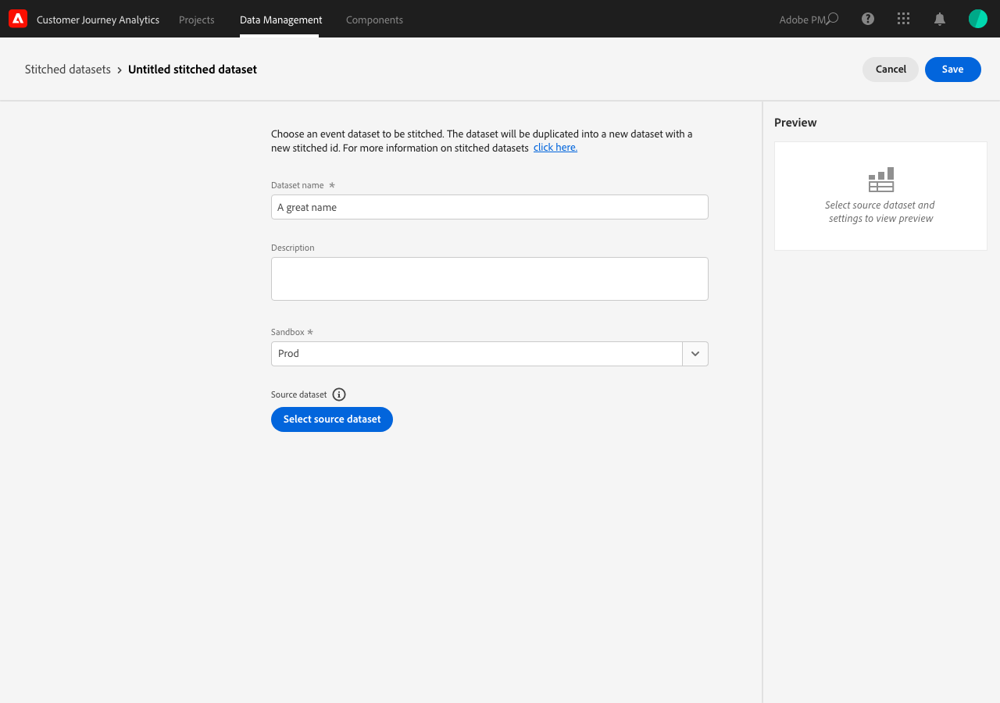

# Criar e gerenciar conjuntos de dados compilados

{{select-package}}

A compilação permite que os administradores compilem identidades em conjuntos de dados disponíveis no Customer Journey Analytics. A compilação de conjuntos de dados aumenta a precisão da representação de um perfil, resultando em uma melhor análise e relatórios.

O processo de compilação permite definir uma **ID persistente** existente em um conjunto de dados. Em seguida, junte esse identificador persistente em uma janela de repetição especificada (diariamente, semanalmente) com a **ID de pessoa** mais precisa (pessoa ou identificador autenticado) disponível para esse conjunto de dados. Exemplos de identificadores de pessoa são email, número de telefone, ID de CRM ou outras identidades armazenadas no gráfico. Consulte [Visão geral](overview.md) para obter mais informações sobre compilação.

## Criar

Para iniciar a compilação, crie um ou mais conjuntos de dados compilados. Para criar um conjunto de dados compilado:

1. Selecione **[!UICONTROL ** Compilação **]** em **[!UICONTROL **&#x200B; Gerenciamento de Dados &#x200B;**]** na barra superior.

2. Na tela [!UICONTROL Conjuntos de dados compilados], selecione **[!UICONTROL **&#x200B; Criar conjunto de dados compilado &#x200B;**]**.

   Será apresentado um diálogo explicando suas responsabilidades.

3. Selecione **[!UICONTROL **&#x200B; Continuar &#x200B;**]** se você aceitar essas responsabilidades.

   >[!NOTE]
   >
   >    Se você selecionar **[!UICONTROL **&#x200B; Cancelar &#x200B;**]**, não poderá criar um conjunto de dados compilado.

4. Na tela [!UICONTROL Conjuntos de dados compilados > Conjunto de dados compilado sem título]:

   1. Definir um **[!UICONTROL ** Nome do conjunto de dados **]** e (opcional) **[!UICONTROL **&#x200B; Descrição &#x200B;**]**,

   2. Selecione a sandbox na lista **[!UICONTROL **&#x200B; Sandbox &#x200B;**]** onde o conjunto de dados do evento está armazenado.

      

   3. Selecione o botão **[!UICONTROL **&#x200B; Selecionar conjunto de dados de origem &#x200B;**]**.

      Na janela pop-up [!UICONTROL Selecione um conjunto de dados para compilar]:

      

      - Selecione um conjunto de dados e selecione **[!UICONTROL **&#x200B; Selecionar &#x200B;**]** para continuar.

   4. Selecione um identificador persistente na lista **[!UICONTROL **&#x200B; ID persistente &#x200B;**]**.

   5. Selecione um identificador de pessoa na lista **[!UICONTROL **&#x200B; ID transitória &#x200B;**]**.

      Observe que um painel de visualização parece calcular as taxas de saturação (número de vezes que há um valor para cada um dos identificadores especificados sobre o número de eventos) para os últimos sete dias. Quando terminar de calcular, o painel visualiza com cores se as condições mínimas para compilação foram atendidas (verde) ou não (vermelho).

      

      As condições mínimas são:

      - saturação persistente do identificador: taxa >= 95%

      - saturação do identificador de pessoa: taxa >= 5%

        Se as condições mínimas forem atendidas, você poderá experimentar com valores de amostra.

      - Selecione **[!UICONTROL **&#x200B; Criar IDs de demonstração compiladas &#x200B;**]**.

        Na caixa de diálogo [!UICONTROL Experimento com valores de amostra], uma tabela é mostrada com um valor de exemplo para [!UICONTROL carimbo de data/hora], [!UICONTROL ID Persistente], [!UICONTROL ID Transitória], [!UICONTROL ID Compilada (Ao Vivo)], [!UICONTROL ID Compilada (repetição de 1 dia)] e [!UICONTROL ID Compilada (repetição de 7 dias)].

            
            
            1. Insira um valor para a **[!UICONTROL **ID persistente**]**.
            
            2. Selecione **[!UICONTROL **Atualizar IDs compiladas**]** para ver o efeito do processo de compilação nos dados do conjunto de dados.
            
            3. Selecione **[!UICONTROL **Fechar**]** quando terminar de testar valores de amostra.
        

        De volta à tela [!UICONTROL Conjuntos de dados compilados > _Nome do conjunto de dados_]:

   6. Selecione uma opção para a frequência e o período de reinicialização de dados históricos na lista **[!UICONTROL **&#x200B; Janela de repetição &#x200B;**]**.

      Você pode selecionar entre o valor padrão **[!UICONTROL ** Dia anterior, diariamente **]** ou **[!UICONTROL **&#x200B; Dias anteriores, semanalmente &#x200B;**]**.

   7. Selecione um valor na lista **[!UICONTROL **&#x200B; Número médio de eventos diários &#x200B;**]**.

   8. Insira um valor (entre `0` e `12`) em **[!UICONTROL **&#x200B; Número de meses para preenchimento retroativo &#x200B;**]**.

   9. Selecione **[!UICONTROL **&#x200B; Salvar &#x200B;**]** para salvar o conjunto de dados compilado e iniciar a compilação.

## Exibir status

Você pode visualizar o status da compilação na lista [!UICONTROL Conjuntos de dados compilados].

- Selecione **[!UICONTROL ** Compilação **]** em **[!UICONTROL **&#x200B; Gerenciamento de Dados &#x200B;**]** na barra superior.

  Você verá uma lista de conjuntos de dados compilados, cada um identificado com [!UICONTROL Sandbox], [!UICONTROL Conjunto de dados do Source], [!UICONTROL Status], [!UICONTROL Status de preenchimento retroativo], [!UICONTROL Proprietário] e [!UICONTROL Data de criação].

  

  Os valores possíveis para [!UICONTROL Status] são:

  | Valor | Explicação |
  |-----|-----|
  | **[!UICONTROL **&#x200B; Em fila &#x200B;**]** | A solicitação é recebida e processada em breve. |
  | **[!UICONTROL **&#x200B; Criação &#x200B;**]** em andamento | Os recursos e o conjunto de dados recém-compilado estão sendo criados. |
  | **[!UICONTROL **&#x200B; Configuração em andamento &#x200B;**]** | Há recursos e conjunto de dados compilado e a compilação está em andamento |
  | **[!UICONTROL **&#x200B; Erro &#x200B;**] **&#x200B; | Há um problema com a compilação. Talvez um esquema tenha sido alterado entre o conjunto de dados de origem e o conjunto de dados compilado, o volume diário seja muito grande ou... (_**&#x200B;precisa de mais informações aqui...**_) |

  >[!INFO]
  >
  >    Sempre que um status é alterado, uma notificação é enviada com a mensagem **[!UICONTROL **&#x200B; O conjunto de dados compilado _nome do conjunto de dados_ foi alterado para o status _nome do status _**]**.

  O [!UICONTROL status de preenchimento retroativo] pode ter os seguintes valores: 0%, 25%, 50%, 75% ou 100%.

  Você pode selecionar o ícone de informações para exibir um pop-up com mais detalhes sobre o conjunto de dados compilado selecionado.

## Excluir

>[!NOTE]
>
>Você só pode excluir conjuntos de dados com o status [!UICONTROL Configuração em andamento], [!UICONTROL Erro] ou [!UICONTROL Em fila].

Para excluir um único conjunto de dados compilado:

- Selecione **[!UICONTROL **...**]** para o conjunto de dados compilado e selecione **[!UICONTROL **&#x200B; Excluir &#x200B;**]** no menu.

  

Para excluir vários dados compilados:

- Selecione vários conjuntos de dados compilados usando a caixa de seleção no início de cada conjunto de dados listado.

- Selecione **[!UICONTROL **...**]** de um dos conjuntos de dados compilados selecionados e selecione **[!UICONTROL **&#x200B; Excluir &#x200B;**]** no menu.
