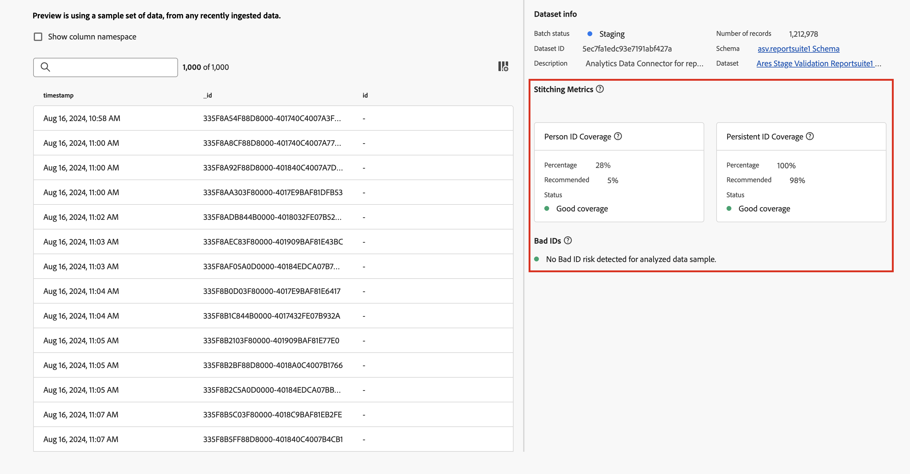

# Habilitar compilação

Você pode ativar a compilação em um ou mais conjuntos de dados de evento configurados como parte da conexão. O pacote do Customer Journey Analytics que você licenciou determina o número de conjuntos de dados de evento que podem ser habilitados para compilação.

Você habilita a compilação como parte das [configurações do conjunto de dados](/help/connections/create-connection.md#dataset-settings) para um conjunto de dados de evento quando [cria uma conexão](/help/connections/create-connection.md) ou quando [edita uma conexão](/help/connections/manage-connections.md#edit-a-connection).

## Pré-requisitos

Você precisa verificar e atender aos pré-requisitos do método de compilação especificado: [compilação em campo](fbs.md#prerequisites) ou [compilação em gráfico](gbs.md#prerequisites).

## Verificações de comprovação

Se você atender aos pré-requisitos, execute algumas verificações de comprovação nos dados no conjunto de dados do evento antes de ativar a compilação de identidade:

* Se você usar os campos [Esquema do Experience Data Model (XDM)](https://experienceleague.adobe.com/pt-br/docs/experience-platform/xdm/home) para ID persistente ou ID de pessoa, verifique se as identidades estão marcadas corretamente no esquema para o conjunto de dados do evento. [Consulte Visão geral do namespace de identidade](https://experienceleague.adobe.com/pt-br/docs/experience-platform/identity/features/namespaces).
* Verifique a cobertura de identidade para ID persistente e ID de pessoa:

  * **[!UICONTROL ID Persistente]**

    Consulte 7 dias de dados nos quais o campo de ID persistente não é nulo e divida por uma consulta de 7 dias de dados para todos os eventos no conjunto de dados. Esse percentual deve estar acima de 95%.

    Exemplo de consulta para verificação:

    ```sql
    SELECT
      COUNT(*) AS total_events,
      COUNT({PERSISTENT_ID_FIELD}) AS events_with_persistentid,
      ROUND(COUNT({PERSISTENT_ID_FIELD}) / COUNT(*), 2) AS percent_with_persistentid_not_null
    FROM 
      {DATASET_TABLE_NAME}
    WHERE
      TO_TIMESTAMP(timestamp, '{FORMAT_STRING}') >= TIMESTAMP '{START_DATE}'
      AND TO_TIMESTAMP(timestamp, '{FORMAT_STRING}') < TIMESTAMP '{END_DATE}';
    ```

    Em que:

    * `{PERSISTENT_ID_FIELD}` é o campo para a ID persistente. Por exemplo: `identityMap.ecid[0]`.
    * `{DATASET_TABLE_NAME}` é o nome da tabela para o conjunto de dados do evento.
    * `{FORMAT_STRING}` é a cadeia de caracteres de formato do campo de carimbo de data/hora. Por exemplo: `MM/DD/YY HH12:MI AM`.
    * `{START_DATE}`é a data de início. Por exemplo: `2024-01-01 00:00:00`.
    * `{END_DATE}` é a data de término em formato padrão. Por exemplo: `2024-01-08 00:00:00`.


  * **[!UICONTROL ID de pessoa]**
    * Para a compilação baseada em gráficos, verifique se o gráfico de identidade contém fragmentos que vinculam valores de ID do namespace de ID persistente e do namespace de ID de pessoa escolhidos. Vá para o [visualizador de gráficos da Experience Platform Identity](https://experienceleague.adobe.com/pt-br/docs/experience-platform/identity/features/identity-graph-viewer){target="_blank"} e consulte o gráfico usando alguns valores de ID persistentes de exemplo. Para verificar, verifique se esses valores de ID persistentes estão vinculados aos valores de ID de pessoa no gráfico.
    * Para a compilação em campo, consulte 7 dias de dados nos quais o campo de ID de pessoa não é nulo e divida por uma consulta de 7 dias de dados para todos os eventos no conjunto de dados. Idealmente, essa porcentagem deve estar acima de 5%.

      Exemplo de consulta para verificação:

      ```sql
      SELECT
        COUNT(*) AS total_events,
        COUNT({PERSON_ID_FIELD}) AS events_with_personid,
        ROUND(COUNT({PERSON_ID_FIELD}) / COUNT(*), 2) AS percent_with_personid_not_null
      FROM 
        {DATASET_TABLE_NAME}
      WHERE
        TO_TIMESTAMP(timestamp, '{FORMAT_STRING}') >= TIMESTAMP '{START_DATE}'
        AND TO_TIMESTAMP(timestamp, '{FORMAT_STRING}') < TIMESTAMP '{END_DATE}';
      ```

      Em que:

      * `{PERSON_ID_FIELD}` é o campo para a ID de pessoa. Por exemplo: `identityMap.crmId[0]`.
      * `{DATASET_TABLE_NAME}` é o nome da tabela para o conjunto de dados do evento.
      * `{FORMAT_STRING}` é a cadeia de caracteres de formato do campo de carimbo de data/hora. Por exemplo: `MM/DD/YY HH12:MI AM`.
      * `{START_DATE}` é a data de início. Por exemplo: `2024-01-01 00:00:00`.
      * `{END_DATE}` é a data de término em formato padrão. Por exemplo: `2024-01-08 00:00:00`.


## Habilitar compilação de identidades {#enable-identity-stitching}

Você pode habilitar a identificação de identidade ao [adicionar](/help/connections/create-connection.md#add-datasets) ou [editar](/help/connections/create-connection.md#edit-a-dataset) um conjunto de dados de evento em uma conexão baseada em pessoa. A identificação de identidade não está disponível para conexões baseadas em conta.

>[!CONTEXTUALHELP]
>id="connection_changeto_identitygraph"
>title="Alterar para gráfico de identidade"
>abstract="Verifique se concluiu a configuração do gráfico de identidade antes de usá-lo para compilação."
>additional-url="https://experienceleague.adobe.com/pt-br/docs/analytics-platform/using/stitching/gbs" text="Compilação baseada em gráfico"

>[!CONTEXTUALHELP]
>id="connection_stitching_personid"
>title="ID da pessoa"
>abstract="Selecione uma ID de pessoa (o identificador exclusivo de uma pessoa) entre as identidades disponíveis. Caso sua licença inclua a compilação em gráfico e você queira usar esse método de compilação, selecione **[!UICONTROL Gráfico de identidade]**."

>[!CONTEXTUALHELP]
>id="connection_stitchingmetrics"
>title="Unificação de métricas"
>abstract="As métricas de unificação são calculadas usando um conjunto de amostras de dados com carimbos de data e hora de evento dos últimos 7 dias.<br>Este conjunto de amostras de dados geralmente difere dos dados de amostra usados na tabela de **[!UICONTROL Visualização]**."

>[!CONTEXTUALHELP]
>id="connection_stitchingmetrics_gbs_personidcoverage"
>title="Cobertura da ID da pessoa"
>abstract="A cobertura da ID de pessoa selecionada é usada para identificação durante o processo de unificação (em tempo real e repetição).<br/>Para obter os melhores resultados de unificação, uma relação (ID persistente, ID de pessoa) deve estar presente no gráfico de identidade para cada ID persistente."

>[!CONTEXTUALHELP]
>id="connection_stitchingmetrics_fbs_personidcoverage"
>title="Cobertura da ID da pessoa"
>abstract="A cobertura da ID de pessoa selecionada é usada para identificação durante o processo de unificação (em tempo real e repetição).<br/>Para obter os melhores resultados de unificação, a ID de pessoa (informações do usuário) deve ser enviada em pelo menos um evento para cada ID persistente (informações do dispositivo)."

>[!CONTEXTUALHELP]
>id="connection_stitchingmetrics_persistentidcoverage"
>title="Cobertura de ID persistente"
>abstract="Esse valor é usado para identificação durante o processo de unificação (em tempo real e repetição), caso um valor de ID de pessoa não possa ser detectado. <br/>Eventos sem ID persistente e sem ID de pessoa são descartados dos dados. Para obter melhores resultados da unificação, uma ID persistente deve estar presente em todos os eventos."


>[!CONTEXTUALHELP]
>id="connection_stitchingmetrics_badids"
>title="IDs inválidas"
>abstract="IDs inválidas são valores que afetam seriamente os dados de relatórios."
>additional-url="https://experienceleague.adobe.com/pt-br/docs/analytics-platform/using/technotes/badids" text="IDs inválidas"


### Configurações do conjunto de dados

Para habilitar a compilação, use a seção **[!UICONTROL Configurações de conjuntos de dados]** do **[!UICONTROL Caixa de diálogo Adicionar conjuntos de dados]** ou **[!UICONTROL Editar conjunto de dados]**.


1. Selecione **[!UICONTROL Habilitar identificação de identidade]**.

   Se você habilitar ou desabilitar a compilação de um conjunto de dados de evento salvo na conexão, a caixa de diálogo **[!UICONTROL Alterar ID de pessoa]** exibirá as implicações de uma alteração da ID de pessoa. Selecione **[!UICONTROL Continuar]** para continuar.

   A caixa de diálogo **[!UICONTROL Habilitar identificação de identidade]** resume as consequências da identificação. Selecione **[!UICONTROL Continuar]** para continuar.

1. Selecione uma ID persistente no menu suspenso **[!UICONTROL ID persistente]**.

   Se você selecionar **[!UICONTROL Mapa de identidade]** para a ID persistente, selecione um namespace. Você tem duas opções:

   * Selecione **[!UICONTROL Usar namespace de identidade primário]** para usar o namespace de identidade primário.
   * Selecione um namespace no menu suspenso **[!UICONTROL Namespace]**.

1. Selecione uma ID de pessoa no menu suspenso **[!UICONTROL ID de pessoa]**.

   Se você selecionar **[!UICONTROL Mapa de identidade]** para a ID de pessoa, selecione um namespace. Você tem duas opções:

   * Selecione **[!UICONTROL Usar namespace de identidade primário]** para usar o namespace de identidade primário.
   * Selecione um namespace no menu suspenso **[!UICONTROL Namespace]**.

   Se você selecionar **[!UICONTROL Gráfico de identidade]** para a ID de pessoa (para usar a [compilação baseada em gráfico](/help/stitching/gbs.md)), será necessário selecionar um namespace.

   >[!NOTE]
   >
   >Certifique-se de que você esteja autorizado a usar o gráfico de identidade.
   >

   Antes disso, uma caixa de diálogo **[!UICONTROL Alterar para gráfico de identidade]** é exibida para garantir que você concluiu a configuração do gráfico de identidade para o conjunto de dados. Esta configuração faz parte dos [pré-requisitos baseados em gráficos](/help/stitching/gbs.md#prerequisites) antes que você possa usar o gráfico de identidade para compilação. Selecione **[!UICONTROL Continuar]** para continuar.

   * Selecione um namespace no menu suspenso **[!UICONTROL Namespace]**.

1. Selecione uma janela de repetição no menu suspenso **[!UICONTROL Janela de repetição]**. As opções disponíveis dependem do pacote do Customer Journey Analytics ao qual você está habilitado.

1. Selecione **[!UICONTROL Avançar]** para visualizar o conjunto de dados do evento que está sujeito à compilação.


### Pré-visualização de conjuntos de dados

Além da interface padrão de **[!UICONTROL visualização de conjuntos de dados]**, ao [adicionar](/help/connections/create-connection.md#add-datasets) ou [editar](/help/connections/create-connection.md#edit-a-dataset) conjuntos de dados em uma conexão baseada em pessoa, dois painéis de informações adicionais estão disponíveis.



#### Unificação de métricas

>[!AVAILABILITY]
>
>As métricas de compilação não estão disponíveis para compilação baseada em gráfico.
>

**[!UICONTROL As métricas de compilação]** são calculadas usando um conjunto de amostras de dados com carimbos de data/hora de eventos dos últimos 7 dias. Este conjunto de amostras de dados geralmente difere dos dados de amostra usados na tabela **[!UICONTROL Preview]**. As métricas de compilação fornecem detalhes para:

* **[!UICONTROL Cobertura da ID de pessoa]**: a cobertura da ID de pessoa selecionada usada para identificação durante o processo de compilação (em tempo real e repetição).
  * Para obter os melhores resultados de compilação em campo, uma ID de pessoa (informações do usuário) deve ser enviada em pelo menos um evento para cada ID persistente (informações do dispositivo).
  * Para obter os melhores resultados de compilação com base em gráfico, uma relação (ID persistente, ID de pessoa) deve estar presente no gráfico de identidade para cada ID persistente.

  A cobertura de ID de pessoa é mostrada como uma porcentagem e comparada com o que é recomendado em um desenvolvimento estável ou em uma configuração de produção. Quanto maior for o valor dessa cobertura, melhores resultados de compilação serão obtidos com a ID de pessoa selecionada.

* **[!UICONTROL Cobertura de ID persistente]**: esse valor é usado para identificação durante o processo de compilação (em tempo real e repetição), caso um valor de ID de pessoa não possa ser detectado. Eventos sem ID persistente e de pessoa são descartados dos dados. Para obter melhores resultados da unificação, uma ID persistente deve estar presente em todos os eventos.

  A cobertura de ID persistente é mostrada como uma porcentagem e comparada com o mínimo recomendado em um desenvolvimento estável ou em uma configuração de produção.

#### IDs inválidas

>[!AVAILABILITY]
>
>IDs inválidas não estão disponíveis para compilação baseada em gráfico.
>

>[!INFO]
>
>IDs inválidas também são chamadas de BAVIDs na interface do Customer Journey Analytics.
> 

No Customer Journey Analytics, uma ID incorreta é um identificador:

* com um valor de ID específico que se origina de uma ID persistente ou de um campo de ID de pessoa em conjuntos de dados habilitados para compilação, **e**
* aparece em mais de um milhão (1.000.000) de eventos nos dados de conexão mensalmente.

Quando um valor de ID é marcado como uma ID incorreta, os eventos futuros que contêm esse valor de ID são descartados dos dados de conexão e não são exibidos no relatório.

Exemplos de casos de uso de IDs inválidas:

* Você tem valores personalizados ou de espaço reservado no campo de ID de pessoa (por exemplo, `undefined`). Esses valores também podem afetar a [compilação e relatório da qualidade dos dados](/help/stitching/faq.md#undefined-person-id-values).
* Em uma configuração de compilação em campo, se várias pessoas compartilharem um dispositivo e o número total de transições entre usuários exceder 50.000. Nesse cenário, o processo de compilação para de usar as informações de ID de pessoa para esse dispositivo e, em vez disso, usa apenas informações de ID persistentes. Consequentemente, todos os eventos do conjunto de dados desse dispositivo são enviados para os dados de conexão com a identidade de ID persistente, provavelmente causando uma situação de IDs inválidas.


>[!NOTE]
>As **[!UICONTROL Métricas de compilação]**, incluindo **[!UICONTROL IDs inválidas]**, são calculadas com base em um conjunto limitado de dados. Para identificar a presença de IDs inválidas em um conjunto de dados que você planeja usar para compilação, consulte a [nota técnica de IDs inválidas](/help/technotes/badids.md).
>


### Salvar


Depois de salvar uma conexão, o processo de habilitação da compilação nos conjuntos de dados configurados é acionado. Quando a compilação for configurada, o serviço de compilação processará todos os dados transmitidos em tempo real e iniciará o preenchimento retroativo dos conjuntos de dados do evento no Experience Platform e assimilará os dados na conexão do Customer Journey Analytics.

Cada parte do processo adiciona alguns atrasos. Os tempos de processamento abaixo são medidas de proteção, não contratos de nível de serviço (SLAs).

Para uma configuração de conexão inicial válida que é salva e contém um conjunto de dados habilitado para compilação:

* Os dados ao vivo são exibidos inicialmente no Customer Journey Analytics após algumas horas (menos de 17 horas). Os dados em tempo real começam com valores de carimbo de data e hora do evento que correspondem ao momento real em que a ativação da compilação foi concluída.

  Para garantir que os dados em tempo real comecem a fluir, habilite a opção **[!UICONTROL Importar todos os novos dados]** para o conjunto de dados.

  Quaisquer novos dados assimilados no conjunto de dados do evento de origem no Experience Platform aparecem no Customer Journey Analytics dentro de quatro horas.

* Os dados preenchidos retroativamente (se solicitados inicialmente) são exibidos no Customer Journey Analytics quase ao mesmo tempo que os dados em tempo real, mas levam dias ou semanas (menos de 4 semanas) para serem processados, dependendo dos volumes envolvidos. Os dados preenchidos retroativamente começam com os valores de carimbo de data e hora do evento mais antigos.

>[!CAUTION]
>
>Para conjuntos de dados habilitados para compilação na interface de Conexões, o status de preenchimento retroativo não pode ser relatado no momento devido a uma limitação conhecida. Use outras maneiras de verificar se os dados do conjunto de dados compilado são preenchidos retroativamente.
>


## Limitações

Além das [limitações de compilação em campo](/help/stitching/fbs.md#limitations) e das [limitações de compilação em gráfico](/help/stitching/gbs.md#limitations), as seguintes limitações se aplicam quando você habilita a compilação na interface Conexões:

* Você só pode compilar um conjunto de dados de evento uma vez como parte de uma única conexão. Não é possível definir o mesmo conjunto de dados de evento mais de uma vez e usar uma configuração de compilação separada para cada instância. Se quiser aplicar configurações de compilação diferentes no mesmo conjunto de dados, use uma conexão separada para cada configuração.


## Migração

A compilação habilitada na interface de Conexões pode coexistir sem problemas com a compilação baseada em solicitação.

Por exemplo, você tem conjuntos de dados compilados com base na Web no lago de dados como resultado de solicitações de compilação anteriores ou atuais. Você pode adicionar dados compilados de um conjunto de dados da central de atendimento usando a interface Conexões para combinar esses dados com os dados baseados na Web.

Eventualmente, o Adobe migra seus conjuntos de dados compilados com base em solicitação para a nova experiência de compilação em conexões.

