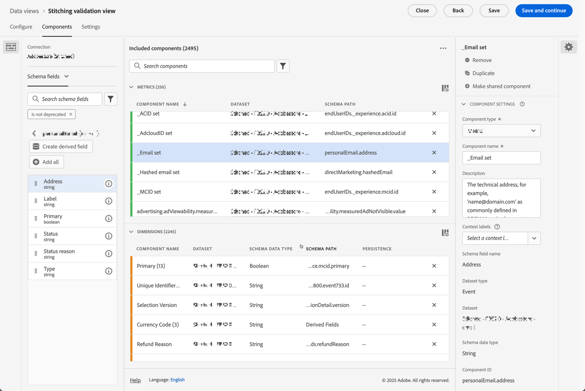

# Validar compilação

O objetivo da [compilação de identidade](/help/stitching/overview.md) (ou simplesmente, compilação) é elevar a adequação de um conjunto de dados de evento para análise entre canais. Essa elevação é obtida quando todas as linhas de dados no conjunto de dados contêm a ordem mais alta desejada de identidade disponível. Essa elevação permite então:

* Crie relatórios centrados em pessoas, sem deixar de fora pessoas anônimas.
* Conecte vários dispositivos a uma única pessoa.
* Conectar uma pessoa através de canais.

Este artigo descreve métodos de análise para medir a elevação em um ou mais conjuntos de dados compilados recém-criados e para fornecer confiança de que a compilação está oferecendo esses benefícios.

Os métodos de análise envolvem [configurações do componente de Visualização de dados](/help/data-views/component-settings/overview.md) que normalmente são acessíveis para administradores. Os métodos também exigem que os analistas, que trabalham em um projeto do Analysis Workspace, criem métricas calculadas e visualizações.

Embora esses métodos de análise possam ser usados para a compilação em campo e a compilação em gráfico, alguns elementos podem não estar presentes no conjunto de dados, especialmente em um cenário de compilação em gráfico. Esses elementos ausentes podem dificultar o cálculo do aumento diretamente no Analysis Workspace.

>[!NOTE]
>
>A (validação da) compilação de um ou mais conjuntos de dados contribui, em última análise, para melhorar a análise e os insights. No entanto, este artigo não discute o valor geral de uma configuração do Customer Journey Analytics que tem todos os conjuntos de dados no Experience Platform alinhados ao mesmo namespace de identidade. E que todos esses conjuntos de dados estejam bem unidos para realizar análises em toda a jornada do cliente.

>[!BEGINSHADEBOX]

Consulte  [Habilitação e validação de compilação](https://video.tv.adobe.com/v/3478125?captions=por_br&quality=12&learn=on){target="_blank"} para ver um vídeo de demonstração.

>[!ENDSHADEBOX]

## Pré-requisitos da visualização de dados

Para o plano de medição de validação de compilação, é necessário garantir que você tenha todas as dimensões e métricas necessárias do seu conjunto de dados compilado definidas em uma visualização de dados. Você precisa verificar se os campos `stitchedID.id` e `stitchedId.namespace.code` são adicionados como dimensões. Embora o conjunto de dados compilado seja uma cópia exata do conjunto de dados original, o processo de compilação adiciona essas duas novas colunas ao conjunto de dados:

* Use `stitchedID.namespace.code` para definir uma dimensão de **[!UICONTROL Namespace compilado]**. Esta dimensão contém o namespace da identidade para a qual a linha foi elevada, por exemplo `Email`, `Phone`. Ou o namespace para o qual o processo de compilação reverte, como `ECID`.
  

* Use `stitchedID.id` para definir uma dimensão de **[!UICONTROL Valor de ID compilado]**. Essa dimensão contém o valor bruto da identidade. Por exemplo: email com hash, telefone com hash, ECID. Este valor é usado com **[!UICONTROL Namespace Compilado]**.
  

Além disso, é necessário adicionar duas métricas de compilação que são baseadas na presença de valores em uma dimensão.

1. Use o campo que contém a ID de pessoa do conjunto de dados compilado para configurar uma métrica que define se uma ID de pessoa está definida. Adicione essa ID de pessoa mesmo se estiver usando a compilação baseada em gráfico, pois a ID de pessoa ajuda a estabelecer uma linha de base. Caso a ID da pessoa não esteja contida no conjunto de dados, sua linha de base é 0%.

   No exemplo abaixo, `personalEmail.address` serve como a identidade e é usado para criar a métrica **[!UICONTROL _Conjunto de emails]**.
   

1. Use o campo `stitchedID.namespae.code` para criar uma dimensão de **[!UICONTROL Namespace compilado por email]**. Certifique-se de especificar [Configurações do componente de valores de Inclusão e Exclusão](/help/data-views/component-settings/include-exclude-values.md), de modo que você considere apenas valores do namespace para o qual está tentando elevar linhas de dados.
   1. Selecione **[!UICONTROL Definir inclusão/exclusão de valores]**.
   1. Selecione **[!UICONTROL Se todos os critérios forem atendidos]** como **[!UICONTROL Correspondência]**.
   1. Especifique **[!UICONTROL Igual]** `email` como o **[!UICONTROL Critério]** para selecionar eventos que foram elevados para o namespace de email.

   

## Dimensões compiladas

Com ambas as dimensões adicionadas à visualização de dados, use as [tabelas de forma livre](/help/analysis-workspace/visualizations/freeform-table/freeform-table.md) no Analysis Workspace para verificar os dados que cada dimensão tem.

Na tabela **[!UICONTROL Dimensão de namespace compilada**], você normalmente vê duas linhas para cada conjunto de dados. Uma linha que representa quando o processo de compilação precisou usar o método de fallback (ECID). A outra linha mostra eventos associados ao namespace de identidade desejado (email).

Para a tabela **[!UICONTROL Dimensão de ID compilada**], você verá os valores brutos provenientes dos eventos. Nessa tabela, você vê que os valores oscilam entre a ID persistente e a ID de pessoa desejada.

## Relatórios centrados em dispositivos ou pessoas

Ao criar uma conexão, você precisa definir qual campo ou identidade é usada para a ID de pessoa. Por exemplo, em um conjunto de dados da Web, se você escolher uma ID de dispositivo como a ID de pessoa, você criará relatórios centrados no dispositivo e perderá a capacidade de unir esses dados a outros canais offline. Se você selecionar um campo ou uma identidade entre canais, por exemplo, email, você perderá todos os eventos não autenticados. Para entender esse impacto, você precisa descobrir quanto do tráfego não é autenticado e quanto do tráfego é autenticado.

1. Criar uma métrica calculada **[!UICONTROL Eventos não autenticados no total]**. Defina a regra no construtor de regras conforme abaixo:
   

1. Crie uma métrica calculada **[!UICONTROL Taxa de autenticação de email]**, com base na métrica **[!UICONTROL _Conjunto de email]** definida anteriormente. Defina a regra no construtor de regras conforme abaixo:
   

1. Use a métrica calculada **[!UICONTROL Eventos não autenticados no total]**, juntamente com a métrica calculada **[!UICONTROL Taxa de autenticação de email]**, para criar uma visualização de [Rosca](/help/analysis-workspace/visualizations/donut.md). A visualização mostra o número de eventos no conjunto de dados que não estão autenticados e estão autenticados.

   

## Costura das taxas de identificação

Você deseja medir o desempenho de identificação antes e depois da compilação. Para fazer isso, crie três métricas calculadas adicionais:

1. Uma **[!UICONTROL métrica calculada da taxa de autenticação compilada]** que calcula o número de eventos em que o namespace compilado é definido como a identidade desejada sobre o número total de eventos. Ao configurar a visualização de dados, você criou uma métrica **[!UICONTROL Namespace compilado por email]** que incluía um filtro para contar somente quando um evento tivesse um namespace definido como email. A métrica calculada usa esta métrica de **[!UICONTROL Namespace compilado de email]** para fornecer uma indicação de qual porcentagem dos dados tem a identidade desejada.
   

1. Uma métrica calculada de **[!UICONTROL Aumento percentual]** que calcula a alteração percentual bruta entre a taxa de identificação atual e a compilada.
   

1. Uma métrica calculada **[!UICONTROL Lift]** que calcula o aumento entre a taxa de identificação atual e a taxa de identificação compilada.
   

## Conclusão

Se você combinar todos os dados em uma tabela de forma livre do Analysis Workspace, poderá começar a ver o impacto e o valor fornecidos pela compilação, inclusive:

* Taxa de autenticação atual: a linha de base do número de eventos que já tinham a ID de pessoa correta em relação ao número total de eventos.
* Taxa de autenticação compilada: o novo número de eventos que têm a ID de pessoa correta em relação ao número total de eventos.
* Aumento percentual: o aumento percentual bruto da taxa de autenticação compilada menos a taxa de autenticação atual da linha de base.
* Aumento: a alteração percentual sobre a taxa de autenticação atual da linha de base.

A principal vantagem deste artigo é que esse tipo de validação e análise de compilação oferece suporte a você para:

* Forneça uma visualização personalizada abrangente da eficácia da autenticação comparando as taxas atuais e as compiladas.
* Permita uma medição clara da melhoria por meio de aumentos de porcentagem e métricas de aumento.
* Ajude a identificar o verdadeiro impacto da implementação da compilação na autenticação de usuário.
* Crie uma maneira padronizada para comunicar o desempenho de autenticação entre equipes.
* Permita decisões orientadas por dados sobre estratégia e otimização de autenticação.

Essas métricas juntas fornecem às partes interessadas uma imagem completa de como a compilação do Customer Journey Analytics afeta as taxas de sucesso de autenticação e o desempenho geral da identificação de pessoas.

