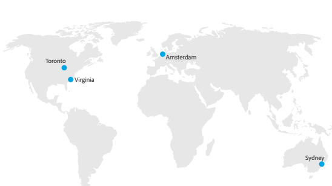

# Locais de hospedagem do Customer Journey Analytics

O Adobe Customer Journey Analytics é hospedado em data centers corporativos de provedores de serviços de nuvem pública da América do Norte (Virgínia, Ontário, Canadá), Europa (Holanda) e APAC (Austrália).

Após o provisionamento, os clientes designam a região em que seus dados do Adobe Experience Platform residirão. Os dados assimilados no CJA a partir do data lake do Experience Platform serão armazenados na mesma região.

