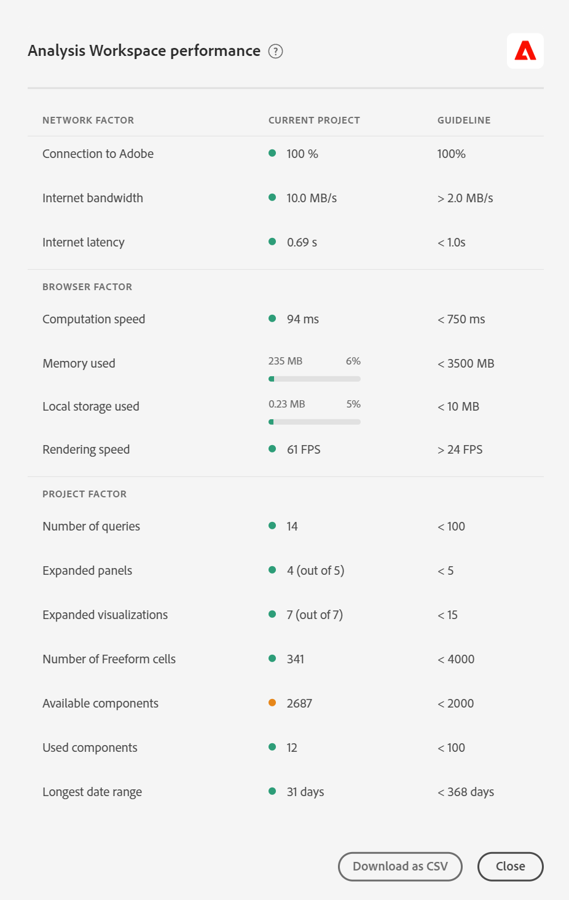

# Otimizar o desempenho do Customer Journey Analytics e do [!UICONTROL Analysis Workspace]

Vários fatores podem influenciar o desempenho geral do Customer Journey Analytics, bem como o desempenho de um projeto no Analysis Workspace. No Workspace, você pode receber uma mensagem de erro com a seguinte mensagem:

`This query is too complex. Please review best practices for building Analysis Workspace queries.`

Essas práticas recomendadas discutem quais fatores podem levar a esse erro e como simplificar o relatório/projeto.

## Fatores de consulta {#query}

Esses são os fatores de consulta mais comuns que influenciam o desempenho geral do Customer Journey Analytics:

| Fator | Definição | Influenciado por | Otimização |
| --- | --- | --- | --- |
| **Número de linhas e colunas de forma livre** | O número total de células da tabela de forma livre no projeto, calculado por linhas * colunas em todas as tabelas. Exclui fontes de dados ocultas. A orientação é 4000. | | Reduza o número de colunas na tabela somente para os pontos de dados mais relevantes. Reduza o número de linhas na tabela ajustando o número de linhas exibidas, aplicando um segmento de tabela ou aplicando um segmento. |
| **Componentes usados** | O número total de componentes usados no projeto. A orientação é 100. | O número de componentes usados não é um influenciador direto do desempenho. No entanto, a complexidade desses componentes contribuirá para o desempenho do projeto. Consulte as otimizações na seção “Fatores adicionais” abaixo. |
| **Intervalo de datas mais longo** | Esse fator exibe o intervalo de datas mais longo usado no projeto. A orientação é de 1 ano. |  | Quando possível, não insira mais dados do que o necessário. Restrinja o calendário do painel às datas relevantes para a sua análise ou use componentes de intervalo de datas (componentes roxos) nas tabelas de forma livre. Os intervalos de datas usados em uma tabela substituem o intervalo de datas do painel. Por exemplo, você pode adicionar mês passado, semana passada e ontem às colunas da tabela para solicitar esses intervalos de dados específicos. Para obter mais informações sobre o uso de intervalos de datas no Analysis Workspace, assista a [este vídeo](https://experienceleague.adobe.com/docs/analytics-learn/tutorials/analysis-workspace/calendar-and-date-ranges/date-ranges-and-calendar-in-analysis-workspace.html?lang=pt-BR).   Além disso, minimize o número de comparações ano a ano usadas no projeto. Quando uma comparação ano a ano é calculada, ela analisa os 13 meses completos de dados entre os meses de interesse. Essa ação tem o mesmo impacto que alterar o intervalo de datas do painel para durar 13 meses. |
| **Complexidade de segmentos** | Segmentos intricados podem ter um impacto significativo no desempenho do projeto. | Veja a seguir alguns fatores que adicionam complexidade a um segmento (em uma ordem aproximada de impacto): <ul><li>Operadores de “contém”, “contem qualquer um de”, “corresponde”, “começa com” ou “termina com” </li><li>Segmentação sequencial, especialmente quando restrições de dimensão (Dentro/Depois de) são usadas </li><li>Número de itens de dimensão exclusivos em dimensões usadas no segmento (por exemplo, Página = “A” quando a Página tem 10 itens exclusivos será mais rápida que a Página = “A” quando a Página tiver 100000 itens exclusivos) </li><li>O número de diferentes dimensões usadas (por exemplo, Página = “Home” e Página = “Search results” será mais rápido que eVar 1 = “red” e eVar 2 = “blue”)</li><li>Muitos operadores OR (em vez de AND)</li><li>Contêineres aninhados que variam no escopo (por exemplo, &quot;Evento&quot; dentro de &quot;Sessão&quot; dentro de &quot;Pessoa&quot;)</li></ul> | Embora alguns dos fatores de complexidade não possam ser evitados, procure por oportunidades para reduzir a complexidade de seus segmentos. Em geral, quanto mais específico você puder ser com os critérios do seu segmento, melhor. Por exemplo:<ul><li>Com contêineres, usar um único contêiner na parte superior do segmento é mais rápido que uma série de contêineres aninhados.</li><li>Com operadores, &quot;igual&quot; é mais rápido que &quot;contém&quot; e &quot;igual a qualquer um&quot; é mais rápido que &quot;contém qualquer um&quot;.</li><li>Com muitos critérios, operadores AND são mais rápidos que uma série de operadores OR.</li></ul> Procure oportunidades para reduzir muitas declarações OR em uma única declaração &quot;é igual a qualquer um de&quot;.  |
| **Complexidade de visualização** (segmentos, métricas, filtros) | O tipo de visualização (por exemplo, fallout ou tabela de forma livre) adicionado a um projeto não influencia muito o desempenho do projeto. É a complexidade da visualização que aumenta o tempo de processamento. | Fatores que adicionam complexidade à visualização incluem:<ul><li>Intervalo de dados solicitado</li><li>Números de segmentos aplicados, por exemplo, segmentos usados como linhas de uma tabela de forma livre</li><li>Uso de segmentos complexos</li><li>Linhas ou colunas de [itens estáticas](/help/analysis-workspace/visualizations/freeform-table/column-row-settings/manual-vs-dynamic-rows.md) em tabelas de forma livre</li><li>Segmentos aplicados a linhas em tabelas de forma livre</li><li>Número de métricas incluídas, especialmente métricas calculadas que usam segmentos</li></ul> |
| **Capacidade do data center** | A capacidade de geração de relatórios que você e outros clientes compartilham em um data center da Adobe. | Isso é afetado pelo número de queries simultâneas feitas pela sua organização e outras organizações em seu data center. | Sua organização tem direito a uma capacidade definida e, se o sistema não estiver sobrecarregado, a Adobe transferirá mais capacidade para você, acima e além da capacidade permitida a você. |
| **Número de consultas simultâneas** | O número de consultas que estão sendo solicitadas pela organização ao mesmo tempo. Cada organização tem direito a no mínimo 5 queries simultâneas. Se um relatório está demorando muito, normalmente é devido ao fato de estar em uma fila com outros relatórios. Isso significa que sua organização está tentando executar muitas solicitações simultâneas em relação a uma visualização de dados específica. | Os queries podem vir de solicitações de API, interfaces do usuário de relatórios (Analysis Workspace, Report Builder etc.), projetos agendados, alertas agendados e usuários simultâneos que fazem solicitações de relatórios. | Espalhe suas solicitações e agendamentos para a visualização de dados de forma mais uniforme ao longo do dia. Além disso, mude suas solicitações para fora do horário de pico, quando possível. Segunda-feira de manhã, terça-feira de manhã e o primeiro de cada mês são horas de pico de relatórios. |
| **Tamanho da conexão** | A quantidade de dados coletados em sua conexão. |  | Consulte sua equipe de implementação ou um especialista da Customer Journey Analytics para determinar se há melhorias de implementação que podem ser feitas para melhorar a experiência geral no Customer Journey Analytics. |
| **Complexidade das configurações de dimensão** | Dimensões altamente complexas podem ter um impacto significativo no desempenho do projeto, especificamente dimensões ou métricas baseadas em campos personalizados complexos. | | Reduza o número de campos personalizados ou crie dimensões separadas. |
| **Dimensões com muitos valores únicos** | Também conhecidas como dimensões de alta cardinalidade, essas dimensões podem afetar o desempenho do relatório. | Consulte [dimensões de alta cardinalidade](/help/components/dimensions/high-cardinality.md) | Consulte [dimensões de alta cardinalidade](/help/components/dimensions/high-cardinality.md) |

## [!UICONTROL Ajuda] > [!UICONTROL Desempenho] no Analysis Workspace

Vários fatores podem influenciar o desempenho de um projeto no Analysis Workspace. É importante saber quais são os contribuidores antes de iniciar a criação de um projeto, para planejar e criar o projeto da melhor maneira. Esta seção inclui uma lista de fatores que afetam o desempenho e as otimizações que você pode fazer para garantir o desempenho máximo no Analysis Workspace.

Em **Analysis Workspace > [!UICONTROL Ajuda] > [!UICONTROL Desempenho]**, você pode ver fatores que afetam o desempenho do seu projeto, incluindo fatores de rede, navegador e projeto. Para obter os resultados mais precisos, deixe o projeto carregar totalmente antes de abrir a página Desempenho.

* A coluna Projeto atual exibe os resultados do seu projeto atual e do ambiente do usuário.
* A coluna Orientação exibe o limite recomendado da Adobe para cada fator.

Além disso, você pode **Baixar como CSV** o conteúdo de desempenho para compartilhar facilmente com o Atendimento ao cliente da Adobe ou com suas equipes internas de TI.

>[!NOTE]
>
>As informações na página Desempenho variam cada vez que o modal é aberto, já que os fatores estão sujeitos a alterações. Além disso, a Adobe continuará refinando as diretrizes fornecidas à medida que mais dados estiverem disponíveis.

### Fatores de rede

Os fatores de rede [!UICONTROL Ajuda] > [!UICONTROL Desempenho] incluem:

| Fator | Definição | Influenciado por | Otimização |
| --- | --- | --- | --- |
| **Conexão com o Adobe** | A Adobe envia 10 chamadas de teste quando a página de desempenho é aberta. Representa a porcentagem dessas chamadas para a Adobe que tiveram sucesso. | Problemas de rede local ou problemas da Adobe afetarão esse fator. | Acesse status.adobe.com para verificar se há problemas de serviço conhecidos. Em seguida, valide a conexão de rede local. |
| **Largura de banda da Internet** | Disponível somente para o Google Chrome. A estimativa do navegador sobre a largura de banda em sua localização. A diretriz é de 2,0 MB/s. | A conexão de rede local afetará esse fator. | Valide a conexão de rede local. |
| **Latência da Internet** | A Adobe envia 10 chamadas de teste quando a página de desempenho é aberta. Representa o tempo médio necessário para cada solicitação ir para a Adobe e retornar. Em termos mais simples, é uma medida da velocidade da Internet entre a sua localização e a Adobe. A orientação é &lt; 1 segundo. | Problemas de rede local, muitas guias de navegador abertas ou problemas da Adobe afetarão esse fator. | Acesse status.adobe.com para verificar se há problemas de serviço conhecidos. Em seguida, valide a conexão de rede local e feche guias do navegador não usadas. |

### Fatores do navegador

Os fatores do navegador [!UICONTROL Ajuda] > [!UICONTROL Desempenho] incluem:

| Fator | Definição | Influenciado por | Otimização |
| --- | --- | --- | --- |
| **Velocidade de computação** | A velocidade com que o computador executa um teste de processamento. A orientação é &lt; 750 ms. | O hardware e programas simultâneos afetarão esse fator. | Abra o Gerenciador de tarefas (PC) ou o Monitor de atividades (Mac) do seu computador para determinar se algum programa pode ser fechado. Em seguida, feche guias de navegador ou outros programas não usados.   Se essas ações não ajudarem, discuta os detalhes de hardware com a equipe de TI. |
| **Memória usada** | Disponível somente para o Google Chrome. Cada guia do Espaço de trabalho em um navegador Google Chrome compartilha 4 GB de memória no total. Representa a porcentagem da redução de memória que está sendo consumida pelo projeto atual. A diretriz é de 3500 MB, que é o ponto em que o Espaço de trabalho começará a detectar erros de memória. | Trabalhar em várias guias ou baixar 50000 linhas de dados contribuirá para o aumento do uso da memória. | Se você receber um erro de memória, feche outras guias do Espaço de trabalho e/ou execute o download de linha 50000 uma de cada vez. |
| **Armazenamento local usado** | Dados armazenados localmente em seu computador para uso no navegador. Cada origem (por exemplo, experience.adobe.com) tem uma alocação de 10 MB. | O Analysis Workspace usa o armazenamento local para várias funções, inclusive para armazenar projetos salvos automaticamente (existentes), configurações do usuário e sinalizadores de recursos. | Para garantir que as funções do Analysis Workspace não sejam interrompidas, limpe o armazenamento local do domínio experience.adobe.com. |
| **Velocidade de renderização** | FPS significa Quadros por segundo, que é quantas vezes por segundo o navegador desenha a página em sua tela. 24 FPS é normalmente o que o olho humano pode observar; se o FPS for menor que isso, você observará problemas de renderização no Espaço de trabalho. | O FPS é afetado ao fazer diversas tarefas em vários projetos do Espaço de trabalho de uma só vez e pelo tamanho do projeto que está sendo visualizado. Outros programas em execução no computador podem causar impacto, como streaming, scanners em segundo plano etc. Além disso, o hardware afetará esse fator. | Abra o Gerenciador de tarefas (PC) ou o Monitor de atividades (Mac) do seu computador para determinar se algum programa pode ser fechado. Em seguida, feche guias de navegador ou outros programas não usados.   Se essas ações não ajudarem, discuta os detalhes de hardware com a equipe de TI. |

### Fatores de projeto

Os fatores de projeto [!UICONTROL Ajuda] > [!UICONTROL Desempenho] incluem:

| Fator | Definição | Otimização |
| --- | --- | --- |
| **Número de consultas** | O número total de queries (solicitações) feitos à Adobe para recuperar dados exibidos no projeto. As queries incluem solicitações classificadas para tabelas, detecção de anomalias, linhas cintilantes, componentes mostrados no painel esquerdo e muito mais. Exclui painéis e visualizações recolhidos. A orientação é 100. | Sempre que possível simplifique o projeto dividindo dados em vários projetos que atendem a uma finalidade específica ou a um grupo de participantes. Use tags para organizar projetos em temas e use [links diretos](https://experienceleague.adobe.com/docs/analytics/analyze/analysis-workspace/curate-share/shareable-links.html?lang=pt-BR) para criar um sumário interno, de modo que as partes interessadas possam encontrar mais facilmente o que precisam. |
| **Painéis expandidos (do total de painéis)** | O número de painéis expandidos do número total de painéis no projeto. A orientação é 5. | Depois de seguir as etapas para simplificar seu projeto, recolha os painéis no projeto que não precisam ser exibidos quando carregados. Quando o projeto for aberto, somente os painéis expandidos serão processados. Os painéis recolhidos não serão processados até que o usuário os expanda. |
| **Visualizações expandidas (do total de visualizações)** | O número de tabelas expandidas e visualizações do total no projeto, incluindo fontes de dados ocultas. A orientação é 15. | Depois de seguir as etapas para simplificar o projeto, recolha as visualizações no projeto que não precisam ser visualizadas quando carregadas. Priorize os recursos visuais mais importantes para o consumidor do relatório e separe os recursos visuais de suporte em um painel ou projeto separado e mais detalhado, se necessário. |
| **Número de células de forma livre** | Consulte a tabela &quot;Fatores de consulta&quot; acima. | |
| **Componentes usados** | Consulte a tabela &quot;Fatores de consulta&quot; acima. | |
| **Intervalo de datas mais longo** | Consulte a tabela &quot;Fatores de consulta&quot; acima. | |

## Fatores de solicitação

[!UICONTROL Ajuda] > [!UICONTROL Desempenho] fatores de solicitação

Use o diagrama e os termos a seguir para saber como as solicitações são processadas e os vários fatores que influenciam os tempos de processamento:

>[!NOTE]
>
>As diretrizes recomendadas para esses fatores se baseiam em uma pontuação de complexidade do Medium para solicitações de relatórios.

### Diagrama de processamento de solicitações

### Termos de processamento de solicitação

| Fator | Definição | Otimização |
| --- | --- | --- |
| [!UICONTROL **Tempo médio de solicitação**] | O tempo necessário, desde o momento em que a solicitação é iniciada até o momento em que é concluída. A orientação é de 15 segundos. 
No diagrama [Processamento da solicitação](#request-processing-diagram) acima, o tempo de solicitação representa o processo completo, desde **solicitação do Analysis Workspace iniciada** até **solicitação do Analysis Workspace concluída**.
 |  |
| [!UICONTROL **Tempo de solicitação mais longo**] | O tempo necessário, desde o momento em que a solicitação é iniciada até o momento em que é concluída. 
No diagrama [Processamento da solicitação](#request-processing-diagram) acima, o tempo de solicitação representa o processo completo, desde **solicitação do Analysis Workspace iniciada** até **solicitação do Analysis Workspace concluída**.
 |  |
| [!UICONTROL **Tempo médio de pesquisa**] | Como o Analysis Workspace armazena somente o hash para qualquer cadeia de caracteres usada em qualquer segmento, cada vez que você processa um projeto, **Pesquisas** são executadas para corresponder os hashes aos valores apropriados. A orientação é de menos de 2 segundos.
Esse processo pode consumir muitos recursos, dependendo do número de valores que podem corresponder ao hash. 

No diagrama [Processamento de solicitação](#request-processing-diagram) acima, o tempo de pesquisa é representado na fase **Pesquisas** (no momento da fase **Processamento do mecanismo de solicitação**).
 | Se as solicitações estiverem ficando lentas aqui, isso provavelmente se deve ao fato de você ter muitos segmentos de sequência em seu projeto ou cadeias de caracteres com valores excessivamente genéricos que têm muitas correspondências em potencial. |
| [!UICONTROL **Tempo médio da fila**] | O tempo total de espera na fila antes do processamento das solicitações. A orientação é de 5 segundos.
No diagrama acima, [Processamento de solicitação](#request-processing-diagram), o tempo de espera é representado na fase **Fila do mecanismo de solicitação** e na fase **Fila do servidor**.
 | Se as solicitações estiverem lentas aqui, talvez seja devido ao excesso de solicitações em execução simultaneamente em sua organização. Tente executar a solicitação fora do horário de pico. |
| [!UICONTROL **Tempo médio de processamento do servidor**] | A quantidade média de tempo que leva para processar a solicitação.
No diagrama acima, [Processamento de solicitação](#request-processing-diagram), o tempo médio de processamento do servidor é representado na fase **Fila do servidor** e **Processamento do servidor**. A orientação é de 10 segundos | Se as solicitações estiverem ficando lentas aqui, é provável que o projeto tenha intervalos de datas muito longos ou visualizações complexas. Tente reduzir o intervalo de datas do projeto para diminuir os tempos de processamento. |
| [!UICONTROL **Complexidade**] | Nem todas as solicitações exigem o mesmo tempo para serem processadas. A complexidade da solicitação pode ajudar a fornecer uma ideia geral sobre o tempo necessário para processar a solicitação. A diretriz é Medium ou inferior. 
Os valores possíveis incluem:
 <ul><li>[!UICONTROL **Baixa**]</li><li>[!UICONTROL **Média**]</li><li>[!UICONTROL **Alta**]</li></ul>Esse valor é influenciado pelos valores nas seguintes colunas:<ul><li>[!UICONTROL **Limites mensais**]</li><li>[!UICONTROL **Colunas**]</li><li>[!UICONTROL **Segmentos**]</li></ul> |  |
| [!UICONTROL **Limites mensais**] | O número de meses incluídos em uma solicitação. Mais limites de mês aumentam a complexidade da solicitação. A orientação é 6 ou menos. | Se as solicitações estiverem lentas aqui, pode ser porque os limites do mês no seu projeto são muito grandes. Tente reduzir o número de meses. |
| [!UICONTROL **Colunas**] | O número de métricas e detalhamentos na solicitação. Mais colunas aumentam a complexidade da solicitação. A orientação é 10 ou menos. | Se as solicitações estiverem lentas aqui, pode ser porque há muitas colunas em seu projeto. Tente reduzir o número de colunas. |
| [!UICONTROL **Segmentos**] | O número de segmentos aplicados à solicitação. Mais segmentos aumentam a complexidade da solicitação. A orientação é 5 ou menos. | Se as solicitações estiverem lentas aqui, pode ser porque há muitos segmentos em seu projeto. Tente reduzir o número de segmentos. |
