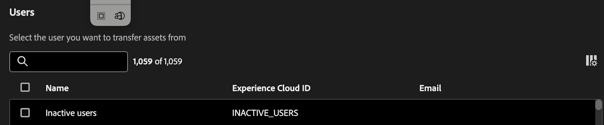

# Transferir ativos

A ferramenta Transferência de ativos permite transferir a propriedade dos ativos para outros usuários. O Assets pode incluir componentes como projetos, segmentos, intervalos de datas, métricas calculadas, anotações, alertas e projetos agendados.

Muitas vezes, o Assets é vinculado a um proprietário individual e, em alguns casos, como segmentos e métricas calculadas, não pode ser editado ou compartilhado nem mesmo pelos administradores. Quando os usuários saem da organização ou sua função muda, pode ser necessário transferir a propriedade desses ativos para outros usuários para garantir a continuidade e o acesso apropriado.

## Permissões

A transferência de ativos exige a permissão de Administrador de produto do Customer Journey Analytics.

## Transferir ativos

1. No CJA, navegue até **[!UICONTROL Ferramentas]** > **[!UICONTROL Transferência de ativos]**.

   

1. Na caixa de diálogo **[!UICONTROL Usuários]**, procure e selecione o usuário do qual deseja transferir ativos.

   >[!IMPORTANT]
   >
   >Você só pode fazer uma transferência 1:1 de um usuário para outro. Não há suporte para transferências um para muitos ou muitos para um.

1. Depois de selecionar um usuário, a opção Transferir ativos é exibida na parte inferior da tela.

   

1. Clique em **[!UICONTROL Transferir ativos]**.

1. Na tela **[!UICONTROL Transferir ativos]**, selecione primeiro o destinatário para o qual deseja transferir ativos.

1. Agora passe por cada pasta de componentes na navegação à esquerda para selecionar componentes individuais ou todos os ativos em uma pasta para transferir.

   >[!NOTE]
   >
   >A transferência de ativos de um administrador para um não administrador não atualiza o recipient para um administrador.

   >[!NOTE]
   >
   >    Ao transferir ativos que fazem referência a outros componentes (por exemplo, projetos que fazem referência a outros segmentos e métricas calculadas), os componentes não pertencentes ao proprietário atual do projeto só serão compartilhados com o recipient. A propriedade de todos os outros componentes será transferida para o recipient.

1. Para selecionar _todos_ ativos em uma pasta, marque a caixa ao lado de **[!UICONTROL Nome]** na parte superior da tabela.

   

1. Clique em **[!UICONTROL Transferir]** na parte superior direita depois de fazer todas as seleções.

1. Clique em **[!UICONTROL Confirmar]** quando a mensagem de confirmação for exibida.

   >[!IMPORTANT]
   >
   >Não feche a tela durante a transferência para evitar a interrupção do processo. Isso garante uma experiência de transferência perfeita.

## Transferir resultados

Há três resultados possíveis para uma transferência:

- **Transferência bem-sucedida**: &quot;Assets transferido com êxito.&quot;

- **Sucesso parcial**: &quot;Alguns ativos foram transferidos com êxito.&quot;

- **Falha na transferência**: &quot;Falha ao transferir ativos. Tente novamente.&quot;

### Possíveis motivos de falha na transferência de ativos

- Serviços dependentes que causam falhas: a transferência de ativos interage com um serviço diferente para cada tipo de componente (por exemplo, problemas de rede, problemas de serviço downstream), portanto, isso pode causar uma falha parcial ou completa ou falhas intermitentes.

- Componente ausente ou transferido por outro administrador: um componente foi excluído por outro usuário ou transferido por outro administrador para outra pessoa enquanto um trabalho de transferência de ativos ainda estava em andamento.

- O corpo POST da API não é preenchido corretamente: um componente pode não ser enviado no corpo POST da API quando vários tipos de componentes são selecionados.

- O usuário não existe: o usuário foi excluído no meio da transferência ou é inválido por outro motivo. Se o usuário for inválido antes do início da transferência, a ferramenta capturará isso e não processará o trabalho. Se o usuário foi excluído no meio da transferência, isso pode causar falhas parciais.

- Falha de conexão/rede: a conexão morre durante a transferência. Quaisquer lotes de trabalhos de transferência que já foram transmitidos ao backend ainda serão processados até a conclusão, mas o usuário não verá a mensagem do resultado da transferência com um resumo do que foi bem-sucedido e do que falhou.

- Transferência intermediária fechada da guia do navegador: para transferências muito grandes, se a guia do navegador for fechada ou a página for retirada da transferência intermediária, somente as solicitações de rede feitas antes da navegação de fechamento/página da guia ocorrerão transferirão os ativos corretamente. Se o usuário navegar de volta para a página, não receberá a mensagem de status de resposta indicando quais ativos foram transferidos e quais não.

## Transferir ativos durante a atualização do Adobe Analytics para o Customer Journey Analytics

Um dos principais casos de uso para a transferência de ativos é durante a atualização do Adobe Analytics para o Customer Journey Analytics.

O recurso [Migração de componentes](https://experienceleague.adobe.com/en/docs/analytics/admin/admin-tools/component-migration/component-migration) do Adobe Analytics permite migrar projetos de propriedade do administrador para outros administradores. Todos os componentes que compõem esses projetos são recriados no Customer Journey Analytics e o administrador do recipient é proprietário de todos esses componentes, independentemente de quem os criou.

Essa ferramenta de Transferência de ativos permite que os administradores reatribuam componentes aos proprietários legítimos, sejam eles administradores ou não.

>[!IMPORTANT]
>
>Embora seja possível transferir componentes usando essa ferramenta, você, como administrador, ainda precisará garantir que o recipient tenha acesso às visualizações de dados necessárias para exibir/usar esses componentes. Você pode exibir e atribuir permissões no [Admin Console](https://helpx.adobe.com/br/enterprise/using/admin-console.html).

## Exportar para CSV

A opção **[!UICONTROL Exportar para CSV]** permite que os administradores baixem apenas uma lista de usuários exibida para um arquivo .csv. Isso não permite exportar uma lista de ativos transferidos para um arquivo .csv.

## Usuários inativos

Todos os usuários excluídos anteriormente aparecem abaixo de uma entrada &quot;Usuários inativos&quot;, juntamente com todos os seus componentes órfãos. Esses componentes podem ser transferidos para um novo recipient. Esse recurso estará disponível em janeiro.

