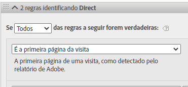
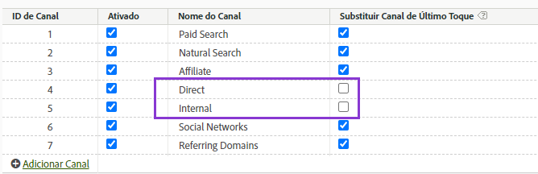

# Usar dimensões do canal de marketing

Se sua organização usar o [conector de origem do Analytics](https://experienceleague.adobe.com/docs/experience-platform/sources/connectors/adobe-applications/analytics.html?lang=pt-BR) para trazer dados do conjunto de relatórios para o Customer Journey Analytics, você poderá configurar uma conexão no Customer Journey Analytics para relatar as dimensões do Canal de marketing.

## Pré-requisitos

* Os dados do conjunto de relatórios já devem ter sido importados para o Adobe Experience Platform usando o [conector de origem do Analytics](https://experienceleague.adobe.com/docs/experience-platform/sources/connectors/adobe-applications/analytics.html?lang=pt-BR). Outras fontes de dados não são suportadas, pois os canais de marketing dependem das regras de processamento em um conjunto de relatórios do Analytics.
* As regras de processamento do canal de marketing já devem estar configuradas. Consulte [Regras de processamento para Canais de marketing](https://experienceleague.adobe.com/docs/analytics/admin/admin-tools/manage-report-suites/edit-report-suite/marketing-channels/c-rules.html?lang=pt-BR) no guia Componentes do Adobe Analytics.

## Elementos do esquema do Canal de marketing

Depois de estabelecer o conector de origem do Analytics em um conjunto de relatórios desejado, um esquema XDM será criado para você. Esse esquema contém todas as dimensões e métricas do Analytics como dados brutos. Esses dados brutos não contêm atribuição ou persistência. Em vez disso, cada evento é executado pelas regras de processamento do canal de marketing e registra a primeira regra correspondente. Especifique a atribuição e a persistência ao criar uma visualização de dados no Customer Journey Analytics.

1. [Crie uma conexão](/help/connections/create-connection.md) que inclua um conjunto de dados com base no conector de origem do Analytics.
2. [Crie uma visualização de dados](/help/data-views/create-dataview.md) que inclua as seguintes dimensões:
   * **`channel.typeAtSource`**: Equivalente à dimensão [Canal de marketing](https://experienceleague.adobe.com/docs/analytics/components/dimensions/marketing-channel.html?lang=pt-BR).
   * **`channel._id`**: Equivalente aos [detalhes do Canal de marketing](https://experienceleague.adobe.com/docs/analytics/components/dimensions/marketing-detail.html?lang=pt-BR)
3. Dê a cada dimensão o modelo de atribuição e a persistência desejados. Se desejar as dimensões de primeiro e último contato, arraste cada dimensão do canal de marketing para a área de componentes várias vezes. Dê a cada dimensão o modelo de atribuição e a persistência desejados. A Adobe também recomenda dar um nome de exibição a cada dimensão para facilitar o uso no Espaço de trabalho.
4. Crie a visualização de dados.

Suas dimensões do canal de marketing agora estão disponíveis para uso no Analysis Workspace.

>[!NOTE]
>
> O conector de origem do Analytics requer que o `channel.typeAtSource` (Canal de marketing) e o `channel._id` (Detalhe do canal de marketing) sejam preenchidos, caso contrário, nenhum será transportado para o ExperienceEvent XDM. Se o Detalhe do canal de marketing estiver em branco no conjunto de relatórios de origem, isso resultará em um `channel._id` em branco, e o conector de origem do Analytics ficará em branco `channel.typeAtSource` também. Isso pode resultar em diferenças de relatório entre o Adobe Analytics e o Customer Journey Analytics.

## Diferenças de processamento e arquitetura

>[!IMPORTANT]
>
>Há várias diferenças de dados fundamentais entre os dados do conjunto de relatórios e os dados da Plataforma. A Adobe recomenda que você ajuste as regras de processamento do canal de marketing do conjunto de relatórios para ajudar a facilitar a coleção de dados adequada na Plataforma.

>[!NOTE]
>
>Para maximizar a eficiência dos Canais de marketing para o Attribution IQ e o Customer Journey Analytics, publicamos algumas [práticas recomendadas revisadas](https://experienceleague.adobe.com/docs/analytics/components/marketing-channels/mchannel-best-practices.html?lang=pt-BR).

As configurações do canal de marketing operam de forma diferente entre os dados da Plataforma e os dados do conjunto de relatórios. Considere as seguintes diferenças ao configurar canais de marketing para o Customer Journey Analytics:

* **É a primeira página da visita**: esses critérios de regra são comuns em várias definições de canal de marketing padrão. Qualquer regra de processamento que contenha esse critério é ignorada na Plataforma (outros critérios na mesma regra ainda se aplicam). As sessões são determinadas no momento da consulta de dados, em vez de no momento da coleção de dados, impedindo a Plataforma de usar esse critério de regra específico. A Adobe recomenda reavaliar quaisquer regras de processamento de canal de marketing que contenham os critérios “É a primeira página da visita”, optando por abordagens alternativas que atinjam seus objetivos.

  

* **Substituir canal de último contato**: essa configuração no Gerenciador de canal de marketing normalmente impede que determinados canais obtenham crédito do canal de último contato. A Plataforma ignora essa configuração, permitindo que canais amplos como “Direto” ou “Interno” atribuam métricas de maneiras possivelmente indesejadas. A Adobe recomenda remover canais em que a opção “Substituir Canal de último contato” está desmarcada.
   * Você pode excluir o canal de marketing &quot;Direto&quot; no Gerenciador de canal de marketing e, em seguida, confiar no item de dimensão &quot;Nenhum valor&quot; da Customer Journey Analytics para esse canal. Também é possível renomear esse item de dimensão como “Direto” ou excluir o item de dimensão totalmente ao configurar uma visualização de dados.
   * Como alternativa, você pode criar uma classificação de canal de marketing, classificando cada valor para si mesmo, exceto os canais que você deseja excluir no Customer Journey Analytics. Você pode usar essa dimensão de classificação ao criar uma visualização de dados em vez de `channel.typeAtSource`.

  

* **Expiração do canal de marketing**: essa configuração de período de envolvimento determina o período de inatividade antes que uma pessoa possa obter um novo canal de primeiro contato nos dados do conjunto de relatórios. A plataforma usa suas próprias configurações de atribuição; portanto, essa configuração é ignorada totalmente no Customer Journey Analytics.

  

## Comparação de dados entre o Customer Journey Analytics e o Adobe Analytics

Como a arquitetura do Adobe Experience Platform é diferente de um conjunto de relatórios do Adobe Analytics, os resultados não têm garantia de correspondência. No entanto, você pode usar as seguintes dicas para facilitar essa comparação:

* Verifique se as diferenças de arquitetura listadas acima não afetam sua comparação. Isso inclui a remoção de canais que não substituem o canal de último contato e a remoção de critérios de regras que são o primeiro hit de uma visita (sessão).
* Verifique se sua conexão usa o mesmo conjunto de relatórios que o Adobe Analytics. Se sua conexão Customer Journey Analytics contiver vários conjuntos de relatórios com suas próprias regras de processamento do Canal de marketing, não haverá uma maneira fácil de compará-los com o Adobe Analytics. Você gostaria de criar uma conexão separada para cada conjunto de relatórios para comparar os dados.
* Compare os mesmos intervalos de datas e verifique se a configuração de fuso horário na visualização de dados é a mesma do fuso horário do conjunto de relatórios.
* Use um modelo de atribuição personalizado ao exibir dados do conjunto de relatórios. Por exemplo, use a dimensão [Canal de marketing](https://experienceleague.adobe.com/docs/analytics/components/dimensions/marketing-channel.html?lang=pt-BR) com métricas que usam um modelo de atribuição não padrão. A Adobe recomenda não comparar as dimensões padrão [Canal de primeiro contato](https://experienceleague.adobe.com/docs/analytics/components/dimensions/first-touch-channel.html?lang=pt-BR) ou [Canal de último contato](https://experienceleague.adobe.com/docs/analytics/components/dimensions/last-touch-channel.html?lang=pt-BR), pois dependem da atribuição coletada no conjunto de relatórios. O Customer Journey Analytics não depende dos dados de atribuição de um conjunto de relatórios; em vez disso, é calculado quando um relatório Customer Journey Analytics é executado.
* Algumas métricas não têm uma comparação razoável devido a diferenças arquitetônicas entre os dados do conjunto de relatórios e os dados da plataforma. Os exemplos incluem visitas/sessões, pessoas/pessoas e ocorrências/eventos.
