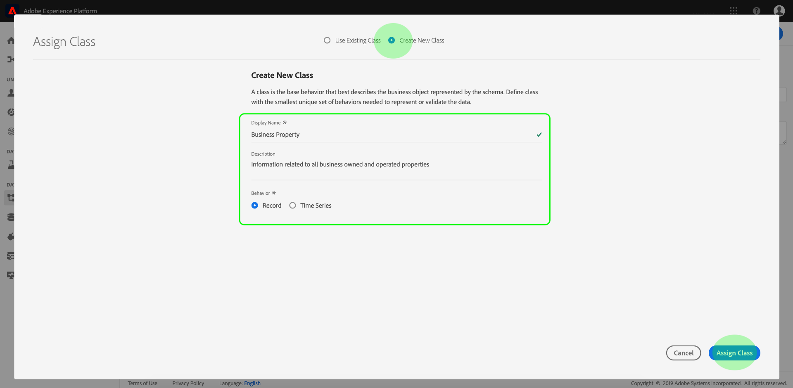

# (B2B) Adicionar dados em nível de conta como um conjunto de dados de pesquisa

Este caso de uso B2B mostra como especificar seus dados em um nível de conta em vez de um nível de pessoa para análise. A análise em nível de conta pode responder perguntas como

* Que nome de empresa corresponde a esta conta?
* Quantos funcionários estão associados a esta conta/empresa?
* Que funções estão representadas nesta conta?
* Como essa conta funciona como um todo em relação a uma campanha de marketing específica, em comparação com outra conta?
* Algumas funções (como o Gerente de TI) em uma conta estão se comportando de forma diferente da mesma função em uma conta diferente?

Você consegue tudo isso trazendo as informações no nível da conta como um [pesquisa](/help/getting-started/cja-glossary.md) conjunto de dados (semelhante às classificações no Adobe Analytics tradicional).

Primeiro, você cria um schema de pesquisa no Adobe Experience Platform e, em seguida, cria um conjunto de dados de tabela de pesquisa ao assimilar dados de nível de conta baseados em .csv. Em seguida, você continua a criar uma conexão CJA que combina diferentes conjuntos de dados, incluindo o conjunto de pesquisa que você criou. Em seguida, você cria uma visualização de dados e finalmente pode utilizar todos esses dados no Workspace.

>[!NOTE]
>
>As tabelas de pesquisa podem ter até 1 GB.

## 1. Criar schema de pesquisa (Experience Platform)

Criar seu próprio schema para a [pesquisa](/help/getting-started/cja-glossary.md) a tabela garante que o conjunto de dados usado estará disponível no CJA com a configuração correta (tipo de registro). A melhor prática é [criar uma classe de schema personalizada](https://docs.adobe.com/content/help/en/experience-platform/xdm/tutorials/create-schema-ui.html#create-new-class) chamado de &quot;Pesquisa&quot;, vazio de qualquer elemento, que pode ser reutilizado para todas as tabelas de pesquisa.

## 2. Criar conjunto de dados de pesquisa (Experience Platform)

Depois que o schema for criado, será necessário criar um conjunto de dados de pesquisa a partir desse schema, no Experience Platform. Este conjunto de dados de pesquisa contém informações de marketing em nível de conta, como: Nome da empresa, número total de funcionários, nome do domínio, a que setor eles pertencem, receita anual, se eles são clientes atuais do Experience Platform ou não, em que estágio de vendas eles estão, qual equipe dentro da conta está usando CJA etc.

1. No Adobe Experience Platform, vá para **[!UICONTROL gestão de dados > Conjuntos de dados]**.
1. Clique em **[!UICONTROL + Criar conjunto de dados]**.
1. Clique em **[!UICONTROL Criar conjunto de dados a partir do schema]**.
1. Selecione a classe de Schema de pesquisa que você criou.
1. Clique em **[!UICONTROL Próximo]**.
1. Nomeie o conjunto de dados (em nosso exemplo, Informações B2B) e forneça uma descrição.
1. Clique em **[!UICONTROL Concluir]**.

## 3. Combinar conjuntos de dados em uma conexão (Customer Journey Analytics)

Neste exemplo, estamos combinando 3 conjuntos de dados em uma conexão CJA:

| Nome do conjunto de dados | Descrição | Classe de Schema AEP | Detalhes do conjunto de dados |
|---|---|---|---|
| Impressão B2B | Contém dados de sequência de cliques e nível de evento no nível da conta. Por exemplo, ele contém a ID de email e a ID de conta correspondente, bem como o nome de marketing, para a execução de anúncios de marketing. Também inclui as impressões desses anúncios, por usuário. | Com base na classe de schema XDM ExperienceEvent | A variável `emailID` é usado como a identidade primária e recebe uma `Customer ID` namespace. Como resultado, será exibido como padrão **[!UICONTROL ID da pessoa]** em Customer Journey Analytics.  |
| Perfil B2B | Este conjunto de dados de perfil informa mais sobre os usuários em uma conta, como seu cargo, a qual conta eles pertencem, seu perfil do LinkedIn etc. | Com base na classe de schema de Perfil individual XDM | Não é necessário selecionar `emailID` como a ID primária neste schema. Certifique-se de ativar **[!UICONTROL Perfil]**; caso contrário, o CJA não será capaz de conectar a variável `emailID` no Perfil B2B com a variável `emailID` nos dados de impressão B2B. (Esse recurso é chamado de costura baseada em campo.)  |
| Informações de B2B | Consulte &quot;Criar conjunto de dados de pesquisa&quot; acima. | B2BAccount (classe de schema de pesquisa personalizada) | A relação entre `accountID` e o conjunto de dados de impressões B2B foi criado automaticamente ao conectar o conjunto de dados de informações B2B ao conjunto de dados de impressões B2B no CJA, conforme descrito nas etapas abaixo.  |

Veja como você combina os conjuntos de dados:

1. Na Customer Journey Analytics, selecione a variável **[!UICONTROL Conexões]** guia.
1. Selecione os conjuntos de dados (no nosso exemplo, os três acima) que deseja combinar.
1. (Não tenho certeza se esta é a etapa...) Para o conjunto de dados de Informações B2B, selecione a variável `accountID` chave que será usada na tabela de pesquisa. Em seguida, selecione sua chave correspondente (dimensão correspondente), também `accountID` no conjunto de dados do evento.
1. Clique em **[!UICONTROL Próximo]**.
1. Nomeie e descreva a conexão e configure-a de acordo com [estas instruções](/help/connections/create-connection.md).
1. Clique em **[!UICONTROL Salvar]**.

Agora os dados serão ingeridos. A integração dos dados e o estabelecimento da pesquisa levam de 2 a 4 horas, dependendo do tamanho da tabela de pesquisa.

## Criar uma visualização de dados a partir desta conexão

Siga as instruções em [criação de exibições de dados](/help/data-views/create-dataview.md).

* Adicione todos os componentes (dimensões e métricas) necessários dos conjuntos de dados.

## Analisar os dados no Workspace

Agora você pode criar projetos do Workspace com base nos dados de todos os três conjuntos de dados.

Por exemplo, você pode encontrar respostas para as respostas apresentadas na introdução:

* Analise emailID por accountID para descobrir a empresa à qual uma ID de email pertence.
* Quantos funcionários estão mapeados para uma ID de conta específica?
* A que setor uma ID de conta pertence?

