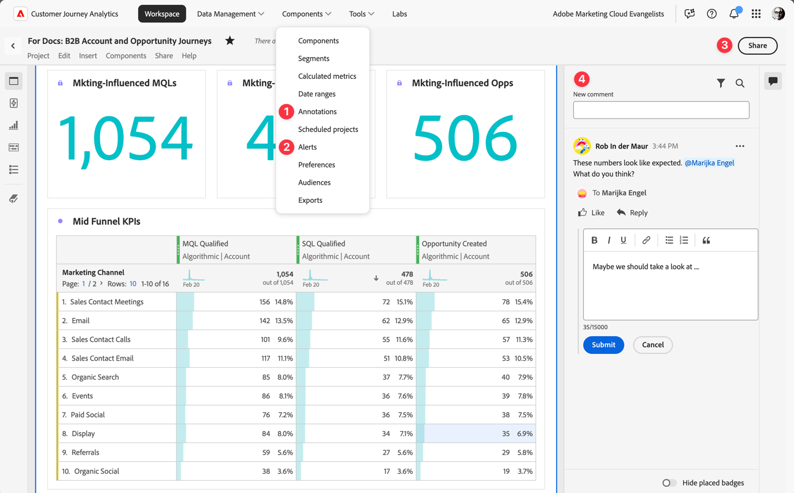

# Aumentar contas principais

{{draft-b2b}}

Aumentar e manter contas importantes é uma alta prioridade para empresas B2B. Um pré-requisito para garantir o progresso dos negócios é comunicar-se com as principais partes interessadas em suas contas de destino na hora certa.

Quando você considera como aumentar as contas principais por meio de novos movimentos de aquisição, retenção ou venda adicional, o Customer Journey Analytics B2B edition ajuda você (a equipe de vendas e os analistas de negócios) com insights mais profundos na progressão do estágio de vendas e na colaboração entre equipes. Consulte as seções a seguir para obter exemplos.

## Progressão do estágio de vendas

Você deseja gerar e distribuir relatórios de conversão de clientes potenciais ad hoc e entender como as contas avançam pelo funil de vendas.

A visualização [Fallout](/help/analysis-workspace/visualizations/fallout/fallout-flow.md) permite visualizar as taxas de conversão e distribuição entre etapas predefinidas em uma jornada sequencial.

### Exemplo

Você deseja ver o fallout da parte superior do funil de vendas (do lead para a oportunidade) para contas.

1. [Criar e configurar uma visualização de Fallout](/help/analysis-workspace/visualizations/fallout/configuring-fallout.md).
1. Selecione  para selecionar **[!UICONTROL Conta]** como o **[!UICONTROL Contêiner de fallout]**.
1. O primeiro ponto de contato deve ler **[!UICONTROL Todas as contas]**.
1. Adicione um novo ponto de contato: **[!UICONTROL Formulário de cliente em potencial: Concluído existe]**.
1. Adicione um novo ponto de contato: **[!UICONTROL O lead gerado existe]**.
1. Adicione um novo ponto de contato: **[!UICONTROL O MQL Qualificado existe]**.

   

## Colaboração

Você deseja melhorar a comunicação entre as equipes de vendas, marketing e produtos. As opções disponíveis para garantir que todas as partes interessadas tenham uma história de dados unificada são alertas, anotações, comentários no projeto e compartilhamento de relatórios e visualizações.

Você pode usar estes recursos do Customer Journey Analytics B2B edition:

1. [Anotações](/help/components/annotations/overview.md)
1. [Alertas inteligentes](/help/components/c-intelligent-alerts/intelligent-alerts.md)
1. [Compartilhar com usuários do espaço de trabalho ou com qualquer pessoa](/help/analysis-workspace/curate-share/share-projects.md)
1. [Comentários](/help/analysis-workspace/build-workspace-project/comment-projects.md)
