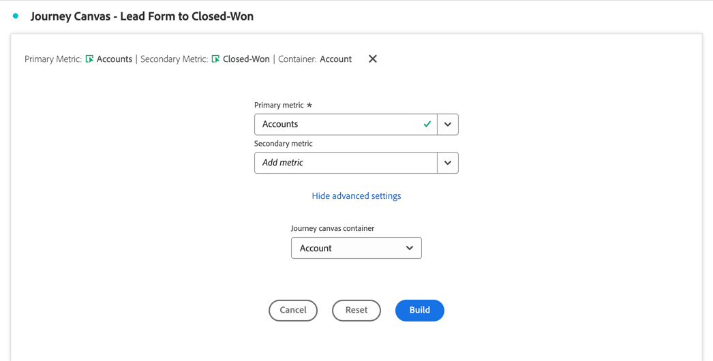

# Otimizar o marketing da conta

Um marketing baseado em conta eficiente requer uma compreensão profunda da jornada de compra no nível da conta. Assim, você pode determinar as atividades de marketing mais impactantes para fechar a negociação.

Para isso, você deseja analisar e explorar:

* Impacto de marketing:

   * Em campanhas, canais e conteúdo.
   * Em grupos de compras dentro de contas,

* Progressão do pipeline de vendas.
* oportunidades de venda adicional e venda cruzada.
* Integridade da conta do cliente.

O Customer Journey Analytics B2B edition pode ajudá-lo na otimização do marketing de conta. Consulte as seções a seguir para obter exemplos.

## Engajamento de marketing baseado em conta

Você deseja identificar quais experiências, on-line e off-line, são mais impactantes na geração de oportunidades fechadas.

Use a visualização da [tela de Jornada](/help/analysis-workspace/visualizations/journey-canvas/journey-canvas.md) para mapear cada interação entre contas, oportunidades, grupos de compra, campanhas e canais para obter insights sobre o que está funcionando no marketing da sua conta e onde você pode melhorar.

Uma visualização da tela de jornada ajuda a:

* Veja a história completa. Por exemplo, você pode mostrar um caminho detalhado de uma conta de alto valor *específica* ou grupo de compras que inclui todas as interações online e offline conhecidas.
* Contextualize os principais momentos que levam a marcos críticos ou seguem esses marcos (por exemplo: um acionador de lead qualificado de marketing ou criação de oportunidade).
* Oferece suporte à equipe de vendas por meio do histórico de interação da visualização em contas específicas. Essa visualização permite conversas relevantes.

### Exemplo

Você deseja visualizar a jornada de um formulário de cliente em potencial para um ganho fechado.

1. [Crie e configure uma visualização da tela de Jornada](/help/analysis-workspace/visualizations/journey-canvas/configure-journey-canvas.md).
1. Configurar a **[!UICONTROL Conta]** como a **[!UICONTROL métrica primária]**.
1. Selecione **[!UICONTROL Conta]** como o **[!UICONTROL contêiner de tela de Jornada]**.

   

1. Selecione **[!UICONTROL Criar]**.
1. Arraste e solte nós na tela e conecte os nós para ilustrar a jornada da conta. Por exemplo: de **[!UICONTROL formulário de cliente em potencial: etapa 1]** do formulário para **[!UICONTROL Opp. Criado]**.

   

## Segmentação de coorte

Você deseja identificar o grupo principal de compradores para ativar esses grupos de compradores para outros canais, como mídia paga, email, redes sociais.

Use a visualização da [Tabela de coorte](/help/analysis-workspace/visualizations/cohort-table/cohort-analysis.md) para agrupar entidades B2B (contas, oportunidades, grupos de compras) com base em um ponto de partida compartilhado (como uma data de lead de qualificação de mercado (MQL)). E acompanhar o progresso de cada uma dessas entidades ao longo do tempo em estágios subsequentes ou marcos.

Uma visualização de tabela de coorte ajuda a:

* Analise a rapidez com que coortes de contas ou oportunidades atingem marcos importantes (por exemplo: de um lead qualificado de marketing a um lead qualificado de vendas) em semanas ou meses.
* Identifique se determinadas coortes (por segmento, origem da campanha, tipo de grupo de compras) avançam mais rápido pelo ciclo de vendas do que outras coortes.
* Avalie se as iniciativas estratégicas (por exemplo: campanhas de marketing) estão correlacionadas com cronogramas de progressão mais curtos para coortes subsequentes.

### Exemplo

Você deseja ver coortes mensais de oportunidades fechadas.

1. [Criar e configurar uma visualização de tabela de coorte](/help/analysis-workspace/visualizations/cohort-table/t-cohort.md).
1. Use a métrica **[!UICONTROL Oportunidade criada]** como os **[!UICONTROL critérios de inclusão]**. Selecione **[!UICONTROL >=]** como operador e insira o valor `1`.
1. Use **[!UICONTROL Conquistado]** como a métrica **[!UICONTROL Critérios de retorno]**. Selecione **[!UICONTROL >=]** como operador e insira o valor `1`.
1. Selecione **[!UICONTROL Oportunidade]** como o container.

   

1. Selecione **[!UICONTROL Build]**. Consulte abaixo um exemplo de tabela de coorte.

   

## Eventos presenciais

Você deseja relatar sobre a conta engajada e visualizar a atividade em vários eventos ao vivo. Assim, você pode analisar e otimizar o impacto da participação no evento presencial.

Uma visualização de [fluxo](/help/analysis-workspace/visualizations/c-flow/flow.md) permite visualizar os caminhos que os usuários, mas agora também as contas ou grupos de compras, fazem entre interações ou estágios ao longo do tempo.

Uma visualização de fluxo ajuda a:

* Identifique as sequências mais frequentes de pontos de contato percorridos por entidades B2B (por exemplo: de *Visita do site* a *Download do Whitepaper* a *Solicitação de demonstração*).
* Visualize como as contas ou os grupos de compra navegam de forma não linear (por exemplo: retroceder, pular estágios ou seguir rotas inesperadas).
* Concentre-se no fluxo antes ou depois de uma interação crítica (por exemplo: uma solicitação de demonstração) para entender a quais fatores contribuem ou quais ações se seguem após a interação.

### Exemplo

Você deseja visualizar a influência na geração de MQLs (leads qualificados de marketing).

1. [Criar e configurar uma visualização de Fluxo](/help/analysis-workspace/visualizations/c-flow/create-flow.md).
1. Selecione **[!UICONTROL MQL Qualificado]** para **[!UICONTROL Terminar com]**.
1. Selecione **[!UICONTROL Tipo de conteúdo]** para **[!UICONTROL Dimensão do caminho]**.
1. Selecione **[!UICONTROL Mostrar configurações avançadas]**.
1. Digite `5` para **[!UICONTROL Número de colunas]**.
1. Selecione a **[!UICONTROL Conta]** para o **[!UICONTROL Contêiner de fluxo]**.

   

1. Selecione **[!UICONTROL Criar]**.

   
