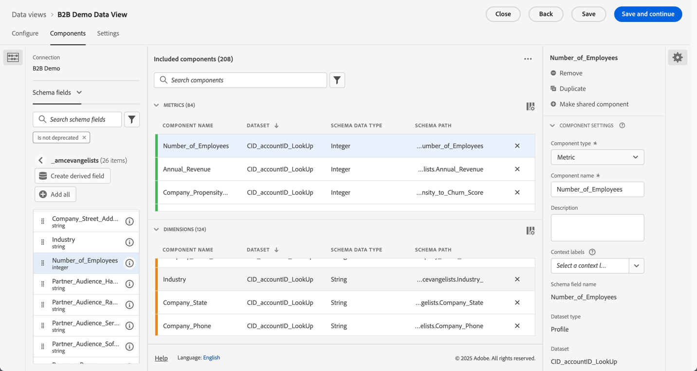
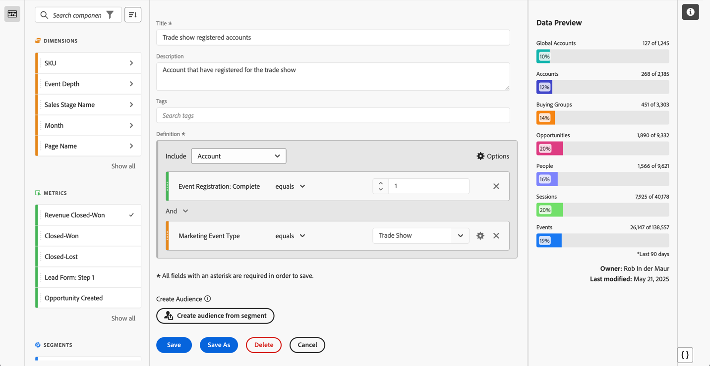

# Configuração para casos de uso do B2B edition

{{draft-b2b}}

Este artigo aborda uma configuração normal do Customer Journey Analytics B2B edition para oferecer suporte aos seguintes casos de uso:

* [Otimizar o marketing da conta](optimize-account-marketing.md)
* [Aumentar contas principais](grow-key-accounts.md)
* [Criar valor do produto](build-product-value.md)

>[!NOTE]
>
>Os dados de demonstração e as capturas de tela usados nesses casos de uso são apenas para fins de ilustração e não refletem dados do mundo real.

## Referência de design da solução

Antes de configurar o Customer Journey Analytics B2B edition, verifique se você tem uma referência de design de solução adequada em vigor que documente cada um dos campos coletados.

Um exemplo de referência de design de solução pode ser semelhante a:

+++ Dimensões de evento

| Nome do Dimension |
|---|
| ID da Conta |
| Nome da conta |
| ID do grupo de compra |
| Central de atendimento |
| ID de Representante da Central de Atendimento |
| ID de chamada |
| Código de rastreamento de campanha |
| ID de conteúdo |
| Tipo de conteúdo |
| Fonte de dados |
| Tipo de dispositivo |
| Detalhes do evento |
| Nome do evento |
| Funil |
| Canal de interação |
| ID do lead |
| Canal de marketing |
| ID do evento de marketing |
| Tipo de evento de marketing |
| ID de oportunidade |
| Página |
| Detalhes da página |
| Domínio de referência |
| ID do Representante de Vendas |
| Nome do estágio de vendas |
| Número do estágio de vendas |
| Seção do site |
| SKU |
| ID da conta subsidiária |
| ID da pesquisa |
| Pontuação de satisfação da pesquisa |
| Tipo de pesquisa |
| ID de usuário |

+++

+++ Métricas de evento

| Nome da métrica | Tipo de evento |
|---|---|
| Criação da conta: completa | Contador |
| Criação da conta: Início | Contador |
| Custo da chamada | Moeda |
| Duração da chamada | Contador |
| Pontuação de satisfação da chamada | Numérico |
| Pesquisas de Chamadas Concluídas | Contador |
| Chamadas | Contador |
| Perda/Fechamento | Contador |
| Conquistado | Contador |
| Visualizações de conteúdo | Contador |
| Click-throughs de exibição de moeda no tamanho do contrato | Contador |
| Impressões de exibição | Contador |
| Email rejeitado | Contador |
| Email clicado | Contador |
| Email entregue | Contador |
| Email aberto | Contador |
| Email enviado | Contador |
| Presença no evento | Contador |
| Registro de Evento: Concluído | Contador |
| Registro de evento: Etapa 1 | Contador |
| Registro de evento: Etapa 2 | Contador |
| Registro de evento: Etapa 3 | Contador |
| Chamada de entrada numérica de pontuação de satisfação global | Contador |
| Formulário de cliente em potencial: Completo | Contador |
| Formulário de cliente em potencial: Etapa 1 | Contador |
| Formulário de cliente em potencial: Etapa 2 | Contador |
| Lead gerado | Contador |
| Qualificação do lead | Contador |
| Encontros | Contador |
| MQL Desqualificado | Contador |
| Qualificado para MQL | Contador |
| Avaliação das necessidades | Contador |
| Negociação | Contador |
| Lidar com objeções | Contador |
| Oportunidades | Contador |
| Criação da oportunidade | Contador |
| Pedidos | Contador |
| Chamada de saída | Contador |
| Acompanhamento Pós-Venda | Contador |
| Envio de Proposta | Contador |
| Receita fechada perdida | Moeda |
| Receita Fechada-Ganha | Moeda |
| Chamadas de contato de vendas | Contador |
| Estágio de vendas iniciado | Contador |
| Click-throughs de SMS | Contador |
| SMS Enviado | Contador |
| Click-throughs sociais | Contador |
| Impressões sociais | Contador |
| Apresentação da solução | Contador |
| SQL Desqualificado | Contador |
| SQL Qualificado | Contador |
| Unidades (não expor) | Contador |
| Pontuação de satisfação da pesquisa de VoC | Numérico |
| Pesquisas de VoC Concluídas | Contador |

+++

+++ Registros de pessoa

| Nome do campo de visualização de dados | Tipo de campo |
|---|---|
| Idade | Métrica |
| Faixa etária | Dimensão |
| Nível de afinidade de categoria 1 | Dimensão |
| Pontuação de afinidade de categoria 1 | Métrica |
| Nível de afinidade de categoria 2 | Dimensão |
| Pontuação de afinidade de categoria 2 | Métrica |
| Nível de afinidade de categoria 3 | Dimensão |
| Pontuação de afinidade de categoria 3 | Métrica |
| Nível de afinidade da categoria 4 | Dimensão |
| Pontuação de afinidade de categoria 4 | Métrica |
| Nível de afinidade de categoria 5 | Dimensão |
| Pontuação de afinidade de categoria 5 | Métrica |
| Advertising de consentimento | Dimensão |
| Consentimento para todas as comunicações | Dimensão |
| Correspondência direta de consentimento | Dimensão |
| Email de consentimento | Dimensão |
| Telefone Celular de Consentimento | Dimensão |
| Personalization de consentimento | Dimensão |
| Dados de compartilhamento do consentimento | Dimensão |
| SMS de consentimento | Dimensão |
| Email | Dimensão |
| Primeiro nome | Dimensão |
| Gênero | Dimensão |
| Cidade Individual | Dimensão |
| Nível de CLTV Individual | Dimensão |
| Pontuação individual de CLTV | Métrica |
| País Individual | Dimensão |
| Telefone Individual | Dimensão |
| CEP do Indivíduo | Dimensão |
| Nível de propensão individual para compra | Dimensão |
| Pontuação da propensão individual para compra | Métrica |
| Propensão individual para nível de churn | Dimensão |
| Propensão individual a pontuação de churn | Métrica |
| Propensão individual para nível de atualização | Dimensão |
| Pontuação de propensão individual para atualização | Métrica |
| Estado individual | Dimensão |
| Endereço Individual | Dimensão |
| Cargo | Dimensão |
| Sobrenome | Dimensão |
| Pontuação líquida de promotor | Métrica |
| Status do Promotor Líquido | Dimensão |
| Tipo de Função | Dimensão |

+++

+++ Registros de conta

| Nome do campo de visualização de dados | Tipo de campo |
|---|---|
| Receita anual | Métrica |
| Cidade da Empresa | Dimensão |
| Nível CLTV da Empresa | Dimensão |
| Pontuação CLTV da empresa | Métrica |
| País da empresa | Dimensão |
| Nome da empresa | Dimensão |
| Telefone da Empresa | Dimensão |
| CEP da Empresa | Dimensão |
| Nível de propensão da empresa para compra | Dimensão |
| Pontuação de propensão da empresa à compra | Métrica |
| Propensão da empresa ao nível de churn | Dimensão |
| Propensão da empresa à pontuação de churn | Métrica |
| Propensão da empresa para nível de atualização | Dimensão |
| Pontuação de propensão da empresa para atualização | Métrica |
| Tamanho da empresa | Dimensão |
| Estado da Empresa | Dimensão |
| Endereço da empresa | Dimensão |
| Setor | Dimensão |
| Número de funcionários | Métrica |
| Público-alvo de parceiros — compradores de hardware | Dimensão |
| Público-alvo de parceiros — crescimento rápido | Dimensão |
| Público-alvo de parceiros — serviços necessários | Dimensão |
| Público-alvo de parceiros — compradores de software | Dimensão |
| Intervalo de receita | Dimensão |
| Site | Dimensão |

+++

+++ Registros SKU

| Nome do campo de visualização de dados | Tipo de campo |
|---|---|
| Categoria de produto de hardware | Dimensão |
| Nome do produto de hardware | Dimensão |
| Categoria de serviço | Dimensão |
| Nome do serviço | Dimensão |
| Categoria do produto de software | Dimensão |
| Nome do produto de software | Dimensão |

+++

## Esquemas e conjuntos de dados

Os dados que oferecem suporte à referência de design da solução são estruturados usando os seguintes esquemas e conjuntos de dados.

### Dados de eventos

As dimensões e métricas do evento são compatíveis por meio de um esquema baseado em série temporal (evento) e um ou mais conjuntos de dados que contêm dados do evento.

<!--For example: the Account ID field is mapped to **[!UICONTROL Account ID]**. See below for a preview of the data typically available in such a dataset.

-->

### Dados da pessoa

Os registros de pessoa são suportados por meio de um esquema baseado em registro (perfil) e um ou mais conjuntos de dados que contêm dados de pessoa. Consulte abaixo um exemplo de dados de pessoa (com base no exemplo de referência de design de solução) normalmente disponíveis em tal conjunto de dados.

### Dados da conta

Os registros de conta são suportados por meio de um esquema baseado em registro (pesquisa) e um ou mais conjuntos de dados que contêm dados de conta. Consulte abaixo um exemplo de dados de conta (com base no exemplo de referência de design de solução) normalmente disponíveis em tal conjunto de dados.

### Dados da SKU

Os registros SKU são suportados por meio de um esquema baseado em registro (pesquisa) e um ou mais conjuntos de dados que contêm dados SKU. Consulte abaixo um exemplo de dados de SKU (com base no exemplo de referência de design de solução) normalmente disponíveis em tal conjunto de dados.

## Conexão

Defina uma conexão baseada em conta no Customer Journey Analytics para assimilar e ingressar em registros dos conjuntos de dados de evento, conta, pessoa e SKU.

1. [Criar uma nova conexão](/help/connections/create-connection.md) no Customer Journey Analytics.
1. Insira um nome descritivo e uma descrição para a conexão.
1. Selecione  **[!UICONTROL Conta]** como a **[!UICONTROL ID Primária]**.
1. Selecione todos os **[!UICONTROL Contêineres opcionais]**.
1. Selecione a sandbox de sua preferência e estime o número médio de eventos diários.

   

1. Selecione **[!UICONTROL Adicionar conjuntos de dados]** e adicione os conjuntos de dados B2B que contêm os dados de eventos, contas, pessoas e SKUs.

   

1. Selecione **[!UICONTROL Avançar]** para definir as configurações de cada um dos conjuntos de dados selecionados.
1. Para o conjunto de dados do evento, selecione os campos apropriados que correspondam às identidades da **[!UICONTROL ID da Conta]**, da **[!UICONTROL ID da Conta Global]**, da **[!UICONTROL ID de Oportunidade]**, da **[!UICONTROL ID do Grupo de Compras]** e da **[!UICONTROL ID da Pessoa]**.

   

1. Role para baixo para configurar o conjunto de dados de registros da conta. Selecione o identificador correto (**[!UICONTROL Account_ID]**) para corresponder à conta pelo contêiner **[!UICONTROL Conta Global]**. Selecione o identificador correto (**[!UICONTROL Account_ID]**) como o **[!UICONTROL campo Conta Global]**.

   

1. Role para baixo para configurar o conjunto de dados de registros de pessoa. Selecione a chave correta (**[!UICONTROL Person_ID]**) para corresponder à pessoa pelo contêiner **[!UICONTROL Person]**. Selecione a identidade apropriada (**[!UICONTROL Profile_Account_ID_Individual]**) para corresponder ao campo **[!UICONTROL Conta Global]**.

   

1. Role para baixo para configurar o conjunto de dados de registros SKU. Verifique se você selecionou a chave correta (**[!UICONTROL Sku]**). Selecione **[!UICONTROL Corresponder por campo]** porque nenhum contêiner está configurado ou disponível para esses dados. Selecione o campo SKU no conjunto de dados do evento(**[!UICONTROL SKU (conjuntos de dados do evento)]**) como a chave correspondente.

   

1. Selecione **[!UICONTROL Adicionar conjuntos de dados]** para salvar os conjuntos de dados e suas configurações definidas.

1. Selecione **[!UICONTROL Salvar]** para salvar a conexão.

## Visualização de dados

Depois que os dados forem assimilados na Customer Journey Analytics, você desejará criar uma visualização de dados que inclua todos os componentes definidos na referência de design da solução.

### Configurar

1. [Criar uma nova visualização de dados](/help/data-views/data-views.md) no Customer Journey Analytics.
1. Selecione a conexão criada anteriormente (por exemplo: **[!UICONTROL Conexão de demonstração B2B (ExL)]**).
1. Forneça um nome para a visualização de dados. Por exemplo: `B2B Demo Data view (ExL)` e, opcionalmente, uma descrição.
1. Como opção, renomeie os contêineres. Ou mantenha os nomes de container padrão.

   
1. Selecione **[!UICONTROL Salvar e continuar]**.

### Componentes

Por padrão, todos os [componentes padrão](/help/data-views/component-reference.md) já estão incluídos na sua visualização de dados. Esses componentes padrão incluem as métricas específicas B2B para Contas, Grupos de compra, Contas globais e Oportunidades.

1. Adicione todas as dimensões de evento definidas na [referência de design de solução](#solution-design-reference) aos componentes de dimensão na sua visualização de dados. Por exemplo, o campo **[!UICONTROL Nome do evento]**, que representa a dimensão **[!UICONTROL Nome do evento]**. Configure o componente de dimensão por meio das [Configurações de componente](/help/data-views/component-settings/overview.md) disponíveis.

   

1. Adicione todas as métricas de evento definidas na [referência de design de solução](#solution-design-reference) aos componentes de métricas na sua visualização de dados. Por exemplo, o campo **[!UICONTROL SQL Qualificado]**, que representa a métrica **[!UICONTROL SQL Qualificado]**. Configure o componente de dimensão por meio das [Configurações de componente](/help/data-views/component-settings/overview.md) disponíveis.

   

1. Adicione todas as dimensões de conta definidas na [referência de design de solução](#solution-design-reference) aos componentes da dimensão na sua visualização de dados. Por exemplo, o campo **[!UICONTROL Setor]**, que representa a dimensão **[!UICONTROL Setor]**. Configure o componente de dimensão por meio das [Configurações de componente](/help/data-views/component-settings/overview.md) disponíveis.

   

1. Adicione todas as métricas de conta definidas na [referência de design de solução](#solution-design-reference) aos componentes de métricas na sua visualização de dados. Por exemplo, o campo **[!UICONTROL Number_of_Employees]**, que representa a métrica **[!UICONTROL Number_of_Employees]**. Configure o componente de dimensão por meio das [Configurações de componente](/help/data-views/component-settings/overview.md) disponíveis.

   

1. Adicione todas as dimensões de pessoa definidas na [referência de design de solução](#solution-design-reference) aos componentes da dimensão na sua visualização de dados. Por exemplo, o campo **[!UICONTROL Category_1_Affinity_Level]**, que representa a dimensão **[!UICONTROL Category_1_Affinity_Level]**. Configure o componente de dimensão por meio das [Configurações de componente](/help/data-views/component-settings/overview.md) disponíveis.

   

1. Adicione todas as métricas de pessoa definidas na [referência de design de solução](#solution-design-reference) aos componentes de métricas na sua visualização de dados. Por exemplo, o campo **[!UICONTROL Category_1_Affinity_Score]**, que representa a métrica **[!UICONTROL Category_1_Affinity_Score]**. Configure o componente de dimensão por meio das [Configurações de componente](/help/data-views/component-settings/overview.md) disponíveis.

   

1. Adicione todas as dimensões de SKU definidas na [referência de design de solução](#solution-design-reference) aos componentes de dimensão na sua visualização de dados. Por exemplo, o campo **[!UICONTROL Categoria de Serviço]**, que representa a dimensão **[!UICONTROL Categoria de Serviço]**. Configure o componente de dimensão por meio das [Configurações de componente](/help/data-views/component-settings/overview.md) disponíveis.

   

1. Selecione **[!UICONTROL Salvar e continuar]**.

### Configurações 

1. Opcionalmente, é possível definir [configurações](/help/data-views/create-dataview.md#settings-1) específicas para a visualização de dados:

   * Adicione segmentos à visualização de dados.
   * Use uma métrica (calculada) para definir as configurações da sessão.

1. Selecione **[!UICONTROL Salvar e continuar]**.

## Segmentos

Você pode preparar um ou mais segmentos com base em contêiner específicos B2B que pode ser usado no projeto do Workspace.

Por exemplo:

* Contas com segmento de registro de evento.

  

* Contas dos EUA com grupos compradores e segmento de oportunidades do estágio 5.

  

## Outro

Você pode definir outros componentes para seus casos de uso, como [métricas calculadas](/help/components/calc-metrics/calc-metr-overview.md), [intervalos de datas](/help/components/date-ranges/overview.md) ou [alertas](/help/components/c-intelligent-alerts/intelligent-alerts.md).
