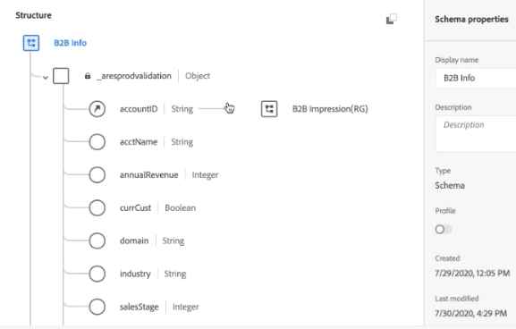

# Adicionar dados da conta como um conjunto de dados de pesquisa

Este caso de uso B2B mostra como adicionar dados da conta a uma análise no nível da pessoa e no nível do evento. Ao adicionar dados da conta, você pode responder a perguntas como:

* Que nome de empresa corresponde a esta conta?
* Que funções estão representadas nesta conta?
* Algumas funções (como o Gerente de TI) em uma conta estão se comportando de forma diferente da mesma função em outra conta?

Para adicionar informações de dados da conta, adicione e use um conjunto de dados [pesquisa](/help/technotes/glossary.md) que contenha essas informações.

As etapas envolvidas são:

1. [Criar um esquema de pesquisa](#create-lookup-schema) no Experience Platform.
1. [Crie um conjunto de dados de pesquisa](#create-lookup-dataset) no Experience Platform que permita assimilar dados de conta baseados em CSV.
1. [Combinar conjuntos de dados em uma conexão](#combine-datasets-in-a-connection) no Customer Journey Analytics, incluindo a pesquisa criada.
1. [Criar uma visualização de dados](#create-a-data-view-from-this-connection) no Customer Journey Analytics.
1. [Analisar estes dados](#analyze-the-data-in-workspace) no Workspace no Customer Journey Analytics.

>[!NOTE]
>
>As tabelas de pesquisa podem ter até 1 GB.
>

## Criar esquema de pesquisa

Ao criar seu próprio esquema para a tabela [de pesquisa](/help/technotes/glossary.md), esse esquema garante que o conjunto de dados usado esteja disponível no Customer Journey Analytics com a configuração correta (tipo de registro). A prática recomendada é [criar uma classe de esquema personalizada](https://experienceleague.adobe.com/en/docs/experience-platform/xdm/tutorials/create-schema-ui) que possa ser reutilizada para todas as tabelas de pesquisa.

## Criar conjunto de dados de pesquisa

Depois que o esquema for criado, é necessário criar um conjunto de dados de pesquisa, com base nesse esquema, no Experience Platform. Esse conjunto de dados de pesquisa contém as informações da conta. Por exemplo: nome da empresa, número total de funcionários, nome do domínio, a que setor a empresa pertence, receita anual e muito mais. Verifique se os dados contêm um identificador de pessoa que pode ser correspondido ao identificador de pessoa usado nos dados do evento.

1. No Experience Platform, vá para **[!UICONTROL Gerenciamento de dados > Conjuntos de dados]**.
1. Clique em **[!UICONTROL + Criar conjunto de dados]**.
1. Clique em **[!UICONTROL Criar conjunto de dados a partir do esquema]**.
1. Selecione a classe Esquema de Pesquisa criada.
1. Clique em **[!UICONTROL Avançar]**.
1. Nomeie o conjunto de dados (por exemplo, `B2B Info`) e forneça uma descrição.
1. Clique em **[!UICONTROL Concluir]**.

## Assimilar dados

As instruções sobre como [Mapear um arquivo CSV para um esquema XDM](https://experienceleague.adobe.com/en/docs/experience-platform/ingestion/tutorials/map-csv/existing-schema) devem ajudar se você estiver usando um arquivo CSV.

[Outros métodos](https://experienceleague.adobe.com/en/docs/experience-platform/ingestion/home) também estão disponíveis.

A assimilação de dados e o estabelecimento da pesquisa levam de 2 a 4 horas, dependendo do tamanho da tabela de pesquisa.

## Combinar conjuntos de dados em uma conexão

Neste exemplo, você combina três conjuntos de dados em uma conexão Customer Journey Analytics:

| Nome do conjunto de dados | Descrição | Classe de esquema do Adobe Experience Platform | Detalhes do conjunto de dados |
| --- | --- | --- | --- |
| Impressão B2B | Contém dados de sequência de cliques e nível de evento no nível de conta. Por exemplo, contém a ID de email e a ID de conta correspondente, além do nome de marketing, para a execução de anúncios de marketing. Também inclui as impressões desses anúncios por usuário. | Com base na classe de esquema XDM ExperienceEvent | O `emailID` é usado como a identidade primária e recebe um namespace `Customer ID`. Como resultado, é exibido como a **[!UICONTROL ID da pessoa]** padrão no Customer Journey Analytics.  |
| Perfil B2B | Este conjunto de dados de perfil informa mais sobre os usuários em uma conta, como o cargo, a qual conta eles pertencem, o perfil do LinkedIn etc. | Com base na classe de esquema Perfil individual XDM | Selecione `emailID` como a ID primária neste esquema. |
| Informações B2B | Consulte &quot;Criar conjunto de dados de pesquisa&quot; acima. | Conta B2B (classe de esquema de pesquisa personalizada) | A relação entre `accountID` e o conjunto de dados Impressões B2B é criada automaticamente quando você conecta o conjunto de dados Informações B2B ao conjunto de dados Impressões B2B no Customer Journey Analytics, conforme descrito nas etapas abaixo.  |

Veja como combinar conjuntos de dados:

1. No Customer Journey Analytics, selecione a guia **[!UICONTROL Conexões]**.
1. Selecione os conjuntos de dados que deseja combinar.
1. Para o conjunto de dados de Informações B2B, selecione a chave usada na tabela de pesquisa (por exemplo `personKey.sourceKey`). Em seguida, selecione a chave correspondente (dimensão correspondente), também no conjunto de dados do evento (por exemplo, p`ersonKey.sourceKey`).
1. Clique em **[!UICONTROL Próximo]**.
1. Nomeie e descreva a conexão e configure-a de acordo com [estas instruções](/help/connections/create-connection.md).
1. Clique em **[!UICONTROL Salvar]**.

## Criar uma visualização de dados a partir desta conexão

Siga as instruções em [criando visualizações de dados](/help/data-views/create-dataview.md).

* Adicione todos os componentes (dimensões e métricas) necessários dos conjuntos de dados. Verifique se, para métricas que exigem desduplicação para contagem excessiva, você configura essas métricas apropriadamente (consulte [Configurações do componente de desduplicação de métrica](/help/data-views/component-settings/metric-deduplication.md)). Exemplos dessas métricas são o número de funcionários ou a receita.

## Analisar os dados no Workspace

Agora é possível criar projetos do Workspace com base nos dados de todos os três conjuntos de dados.

Por exemplo, encontre respostas para as perguntas apresentadas na introdução:

* Detalhe a emailID por accountID para descobrir a empresa à qual uma ID de email pertence.
* Quantos funcionários estão mapeados para uma ID de conta específica?
* A que setor uma ID de conta pertence?

>[!MORELIKETHIS]
>
>Consulte [Um exemplo de projeto B2B](example.md) para obter mais detalhes.

