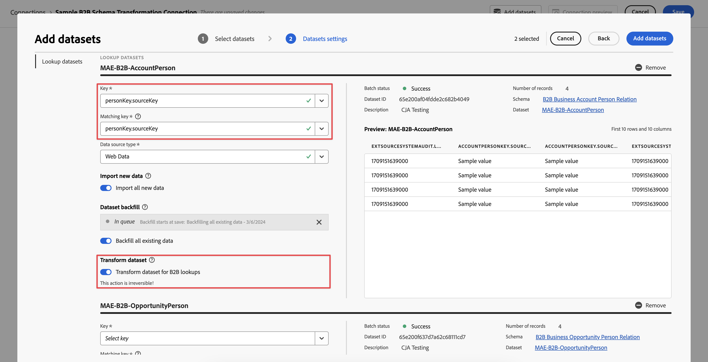
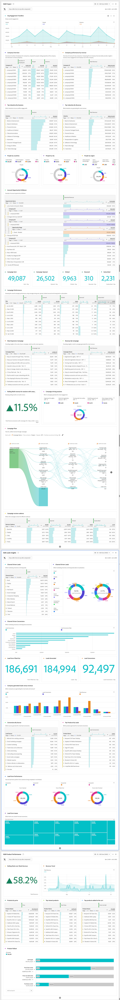

# Um exemplo de projeto B2B

Este artigo explica como definir, configurar e relatar dados B2B baseados em nível de perfil (pessoa) no Customer Journey Analytics.

## Conexão

Defina sua conexão para incluir todos os conjuntos de dados B2B relevantes do Experience Platform. Certifique-se de incluir e transformar todos os conjuntos de dados de pesquisa relevantes necessários para um cenário típico de relatórios com base em pessoas B2B. Consulte [Transformar conjuntos de dados de pesquisa B2B](/help/connections/transform-datasets-b2b-lookups.md) para obter mais informações.

Conjuntos de dados que você pode considerar adicionar à conexão:

| Conjunto de dados | Esquema | Tipo de esquema | Classe base | Descrição |
|---|---|---|---|---|
| Conjunto de dados da atividade B2B | Esquema de atividade B2B | Evento | XDM ExperienceEvent | Um ExperienceEvent é um registro de fato do que ocorreu, incluindo o momento e a identidade do indivíduo envolvido. ExperienceEvents podem ser explícitos (ações humanas diretamente observáveis) ou implícitos (gerados sem uma ação humana direta) e são registrados sem agregação ou interpretação. Eles são essenciais para a análise de domínio de tempo, pois permitem a observação e a análise de alterações que ocorrem em uma determinada janela de tempo e a comparação entre várias janelas de tempo para rastrear tendências. |
| Conjunto de dados de pessoa B2B | Esquema de pessoa B2B | Perfil | Perfil individual XDM | Um Perfil individual XDM forma uma representação singular dos atributos e interesses de indivíduos identificados e parcialmente identificados. Os perfis menos identificados podem conter apenas sinais comportamentais anônimos, como cookies de navegador, enquanto os perfis altamente identificados podem conter informações pessoais detalhadas, como nome, data de nascimento, localização e endereço de email. À medida que um perfil cresce, ele se torna um repositório robusto de informações pessoais, informações de identificação, detalhes de contato e preferências de comunicação de um indivíduo. |
| Conjunto de dados de relação pessoal da conta B2B | Esquema de relação pessoal da conta B2B | Pesquisa | Relação pessoal da conta de negócios XDM | A relação pessoal da conta comercial XDM é uma classe padrão do Experience Data Model (XDM) que captura as propriedades mínimas necessárias de uma pessoa associada a uma conta comercial. |
| Conjunto de dados de relação pessoal da oportunidade B2B | Esquema de relação pessoal de oportunidade B2B | Pesquisa | Relação pessoal de oportunidade de negócios XDM | A relação da pessoa com a oportunidade de negócios XDM é uma classe padrão do Experience Data Model (XDM) que captura as propriedades mínimas necessárias de uma pessoa associada a uma oportunidade de negócios. |
| Conjunto de dados de membros da Lista de marketing B2B | Esquema de membros da lista de marketing B2B | Pesquisa | Membros da lista de marketing XDM | Membros da Lista de marketing comercial XDM é uma classe padrão do Experience Data Model (XDM) que descreve membros, pessoas ou contatos associados a uma lista de marketing. |
| Conjunto de dados de membro da campanha B2B | Esquema de membro da campanha B2B | Pesquisa | Membros da campanha de negócios XDM | Membros da campanha de negócios XDM é uma classe padrão do Experience Data Model (XDM) que descreve um contato ou um cliente potencial associado a uma campanha de negócios. |

<!--
| B2B Account Dataset | B2B Account Schema | Lookup | XDM Business Account | XDM Business Account is a standard Experience Data Model (XDM) class that captures the minimum required properties of a business account.  |
| B2B Opportunity Dataset | B2B Opportunity Schema | Lookup | XDM Business Opportunity | XDM Business Opportunity is a standard Experience Data Model (XDM) class that captures the minimum required properties of a business opportunity.  |
| B2B Campaign Dataset | B2B Campaign Schema | Lookup | XDM Business Campaign | XDM Business Campaign is a standard Experience Data Model (XDM) class that captures the minimum required properties of a business campaign.  |
| B2B Marketing List Dataset | B2B Marketing List Schema | Lookup | XDM Marketing List | XDM Business Marketing List is a standard Experience Data Model (XDM) class that captures the minimum required properties of a marketing list. Marketing lists allow you to prioritize on prospect clients who are most likely to buy your product.  |
-->

A relação entre os esquemas de pesquisa, esquema de perfil e esquema de evento é definida na configuração B2B no Experience Platform. Consulte Esquemas no [Real-time Customer Data Platform B2B Edition](https://experienceleague.adobe.com/docs/experience-platform/rtcdp/schemas/b2b.html) e [Definir uma relação muitos para um entre dois esquemas no Real-time Customer Data Platform B2B Edition](https://experienceleague.adobe.com/docs/experience-platform/xdm/tutorials/relationship-b2b.html) para obter mais detalhes.

Para cada conjunto de dados de pesquisa adicionado à sua conexão, defina explicitamente a relação com um conjunto de dados de evento usando a **[!UICONTROL Chave]** e a **[!UICONTROL Chave correspondente]** na caixa de diálogo **[!UICONTROL Editar conjunto de dados]**. Por exemplo:

Quatro esquemas são usados explicitamente para conectar o esquema Pessoa a outros esquemas relevantes: Account, Opportunity, Campaign e Marketing List. Esses esquemas são baseados nas seguintes classes de esquema:

* Relação pessoal da conta de negócios XDM
* Relação pessoal de oportunidade de negócios XDM
* Membros da lista de marketing de negócios XDM
* Membros da campanha de negócios XDM

Para cada conjunto de dados de pesquisa, para um esquema baseado nessa classe de esquema, você também habilita **[!UICONTROL Transformar conjunto de dados]** para garantir que os dados sejam transformados para pesquisas baseadas em pessoas. Consulte [Transformar conjuntos de dados para pesquisas B2B](/help/connections/transform-datasets-b2b-lookups.md) para obter mais informações.

A tabela abaixo fornece um exemplo de visão geral dos valores de [!UICONTROL ID de pessoa], [!UICONTROL Chave] e [!UICONTROL Chave correspondente] para cada um dos conjuntos de dados.

| Conjunto de dados | ID de pessoa | Chave | Chave correspondente (no conjunto de dados do evento) |
|---|---|---|---|
| Conjunto de dados da atividade B2B | `personKey.sourceKey` | | |
| Conjunto de dados de pessoa B2B | `b2b.personKey.sourceKey` | | |
| Conjunto de dados Pessoa da conta B2B | | `personKey.sourceKey` | `personKey.sourceKey` |
| Conjunto de dados de oportunidade B2B | | `personKey.sourceKey` | `personKey.sourceKey` |
| Conjunto de dados de membros da campanha B2B | | `personKey.sourceKey` | `personKey.sourceKey` |
| Conjunto de dados da lista de marketing B2B | | `personKey.sourceKey` | `personKey.sourceKey` |

{style="table-layout:auto"}

Consulte [Adicionar e configurar conjuntos de dados](../../connections/create-connection.md) para obter mais informações sobre como definir configurações para um conjunto de dados.

## Visualização de dados

Para ter acesso a dimensões e métricas B2B relevantes ao criar seu projeto do Workspace, você deve definir sua visualização de dados adequadamente.

Você pode adicionar os seguintes componentes como dimensões à sua visualização de dados para garantir que possa relatar o nível com base em pessoas nos seus dados B2B. Os nomes dos componentes são modificados para maior clareza.

| Nome do componente | Conjunto de dados | Tipo de dados de esquema | Caminho do esquema |
|---|---|---|---|
| Pessoa | Atividade B2B | Sequência de caracteres | `personID` |
| Conta | Conta B2B Pessoa | Sequência de caracteres | `accountKey.sourceID` |
| Campanha | Membro da campanha B2B | Sequência de caracteres | `campaignKey.sourceKey` |
| Nome da lista de marketing | Lista de marketing B2B | Sequência de caracteres | `marketingListID` |
| Oportunidade | Pessoa da oportunidade B2B | Sequência de caracteres | `opportunityKey.sourceID` |

<!--
This section provides recommendations and suggestions on what dimensions and metrics to include when defining the [components](../../data-views/create-dataview.md#components) for B2B datasets in your data view.

For each component, the name, schema type, schema path, and (when applicable) details about the configuration are provided.

+++ B2B Activity dataset

### Metrics

| Component Name | Schema data type | Schema path | Configuration |
|---|---|---|---|
| Add To Campaign | String | `eventType` | **[!UICONTROL Set include/exclude values]** **[!UICONTROL Case sensitive]** Match: **[!UICONTROL If all criteria are met]** Criteria: **[!UICONTROL Equals]** `leadOperation.addToCampaign` |
| Add To Opportunity | String | `eventType` | **[!UICONTROL Set include/exclude values]** **[!UICONTROL Case sensitive]** Match: **[!UICONTROL If all criteria are met]** Criteria: **[!UICONTROL Equals]** `opportunityEvent.addToOpportunity` |
| Application Closed | String | `eventType` | **[!UICONTROL Set include/exclude values]** **[!UICONTROL Case sensitive]** Match: **[!UICONTROL If all criteria are met]** Criteria: **[!UICONTROL Equals]** `application.close` |
| Application Launch | String | `eventType` | **[!UICONTROL Set include/exclude values]** **[!UICONTROL Case sensitive]** Match: **[!UICONTROL If all criteria are met]** Criteria: **[!UICONTROL Equals]** `application.launch` |
| Campaign Stream | String | `eventType` | **[!UICONTROL Set include/exclude values]** **[!UICONTROL Case sensitive]** Match: **[!UICONTROL If all criteria are met]** Criteria: **[!UICONTROL Equals]** ` leadOperation.changeCampaignStream` |
| Checkout | String | `eventType` | **[!UICONTROL Set include/exclude values]** **[!UICONTROL Case sensitive]** Match: **[!UICONTROL If all criteria are met]** Criteria: **[!UICONTROL Equals]** `commerce.checkouts` |
| Convert Lead | String | `eventType` | **[!UICONTROL Set include/exclude values]** **[!UICONTROL Case sensitive]** Match: **[!UICONTROL If all criteria are met]** Criteria: **[!UICONTROL Equals]** `leadOperation.convertLead` |
| Email Clicked | String | `eventType` | **[!UICONTROL Set include/exclude values]** **[!UICONTROL Case sensitive]** Match: **[!UICONTROL If all criteria are met]** Criteria: **[!UICONTROL Equals]** `directMarketing.emailClicked` |
| Email Delivered | String | `eventType` | **[!UICONTROL Set include/exclude values]** **[!UICONTROL Case sensitive]** Match: **[!UICONTROL If all criteria are met]** Criteria: **[!UICONTROL Equals]** `directMarketing.emailDelivered` |
| Email Opened | String | `eventType` | **[!UICONTROL Set include/exclude values]** **[!UICONTROL Case sensitive]** Match: **[!UICONTROL If all criteria are met]** Criteria: **[!UICONTROL Equals]** `directMarketing.emailOpened` |
| Email Sent | String | eventType | **[!UICONTROL Set include/exclude values]** **[!UICONTROL Case sensitive]** Match: **[!UICONTROL If all criteria are met]** Criteria: **[!UICONTROL Equals]** `directMarketing.emailSent` |
| Email Unsubscribed | String | `eventType` | **[!UICONTROL Set include/exclude values]** **[!UICONTROL Case sensitive]** Match: **[!UICONTROL If all criteria are met]** Criteria: **[!UICONTROL Equals]** `directMarketing.emailUnsubscribed` |
| Form Filled Out | String | `eventType` | **[!UICONTROL Set include/exclude values]** **[!UICONTROL Case sensitive]** Match: **[!UICONTROL If all criteria are met]** Criteria: **[!UICONTROL Equals]** `web.formFilledOut` |
| Form Started | String | `web.fillOutForm.webFormName` | |
| Leads | String | eventType | **[!UICONTROL Set include/exclude values]** **[!UICONTROL Case sensitive]** Match: **[!UICONTROL If all criteria are met]** Criteria: **[!UICONTROL Equals]** `leadOperation.newLead` |
| Opportunity Updated | String | `eventType` | **[!UICONTROL Set include/exclude values]** **[!UICONTROL Case sensitive]** Match: **[!UICONTROL If all criteria are met]** Criteria: **[!UICONTROL Equals]** `opportunityEvent.opportunityUpdated` |
| Price | Double | *_organizationID*`.interactions.products.price` |  |
| Priority | Integer | `leadOperation.changeScore.priority` |  |
| Prod List Add | String | `eventType` |  **[!UICONTROL Set include/exclude values]** **[!UICONTROL Case sensitive]** Match: **[!UICONTROL If all criteria are met]** Criteria: **[!UICONTROL Equals]** `commerce.productListAdds.value` |
| Prod List Open | String | `eventType` |  **[!UICONTROL Set include/exclude values]** **[!UICONTROL Case sensitive]** Match: **[!UICONTROL If all criteria are met]** Criteria: **[!UICONTROL Equals]** `commerce.productListOpens.value` |
| Prod View | String | `eventType` |  **[!UICONTROL Set include/exclude values]** **[!UICONTROL Case sensitive]** Match: **[!UICONTROL If all criteria are met]** Criteria: **[!UICONTROL Equals]** `commerce.productViews.value` |
| Purchases | String | `eventType` |  **[!UICONTROL Set include/exclude values]** **[!UICONTROL Case sensitive]** Match: **[!UICONTROL If all criteria are met]** Criteria: **[!UICONTROL Equals]** `commerce.purchases.value` |
| Remove From Opportunity | String | `eventType` |  **[!UICONTROL Set include/exclude values]** **[!UICONTROL Case sensitive]** Match: **[!UICONTROL If all criteria are met]** Criteria: **[!UICONTROL Equals]** `opportunityEvent.removeFromOpportunity` |
| Save for Laters | String | eventType |  **[!UICONTROL Set include/exclude values]** **[!UICONTROL Case sensitive]** Match: **[!UICONTROL If all criteria are met]** Criteria: **[!UICONTROL Equals]** `commerce.productViews.value` |

{style="table-layout:auto"}

### Dimensions

| Component Name | Schema data type | Schema path | Configuration |
|---|---|---|---|
| Account Key (Source Key) | String | *_organizationID*`.Interactions.accountKey.sourceKey` | |
| Converted Status | String | `leadOperation.convertLead.convertedStatus` | |
| Event Type | String | `eventType` | |
| Form Name | String | `leadOperation.newLead.formName` | |
| Identifier | String | `_id` | |
| Is Sent Notification | Boolean | `leadOperation.convertLead.isSentNotificationEmail` | |
| Keywords | String | `search.keywords` | |
| List ID | String | `listOperations.listID` | |
| List Name | String | `leadOperation.newLead.listName` | |
| Page Name | String | `web.webPageDetails.name` | |
| Person Key (Source Key) | String | `personKey.sourceKey` | |
| Produced By | String | producedBy | |
| Product Name | String | *_organizationID*`.Interactions.products.name` | |
| Role | String | `opportunityEvent.role` | | 
| Timestamp | Date-time | `timestamp` | Date-Time format: **[!UICONTROL Day]** |
| URL | String | `web.webPageDetails.URL` | |
| Web Form Name | String | `web.fillOutForm.webFormName` | |
| Product URL | String | *_organizationID*`.Interactions.products.url` | |

{style="table-layout:auto"}

+++

+++ B2B Person dataset

### Metrics

No metric components are defined as part of this dataset.

### Dimensions

| Component Name | Schema data type | Schema path | Configuration |
|---|---|---|---|
| Last Activity Date | Date-time | `extSourceSystemAudit.lastActivityDate` | Date-Time format: **[!UICONTROL Day]** |
| Person ID | String | `personID` | |

{style="table-layout:auto"}

+++

+++ B2B Account Person dataset

### Metrics

| Component Name | Schema data type | Schema path | Configuration |
|---|---|---|---|
| Annual Revenue | Double | `accountOrganization.annualRevenue.amount` | |
| Number of employees | Integer | `accountOrganization.numberOfEmployees` | |

{style="table-layout:auto"}

### Dimensions

| Component Name | Schema data type | Schema path | Configuration |
|---|---|---|---|
| Acount | String | `accountKey.sourceID` | 

{style="table-layout:auto"}

| Account Identifier | String | `accountID` | |
| Account Type | String | `accountType` | |
| City | String | `accountBillingAddress.city` | |
| Country | String | `accountBillingAddress.country` | |
| Industry | String | `accountOrganization.industry` | |
| Region | String | `accountBillingAddress.region` | |
| Source ID | String | `accountKey.sourceID` | |
| Source Instance ID | String | `accountKey.sourceInstanceID` | |
| Source Key | String | `accountKey.sourceKey` | |
| Source Type | String | `accountKey.sourceType` | |

+++

+++  B2B Opportunity Person dataset

### Metrics

| Component Name | Schema data type | Schema path | Configuration |
|---|---|---|---|
| Expected Revenue | Double | `expectedRevenue.amount` | Behavior: **[!UICONTROL Count values]** |
| Opportunity Amount | Double | `opportunityAmount.amount` | Behavior: **[!UICONTROL Count values]** |
| Opportunity Stage - Closed Book | String | `opportunityStage` | **[!UICONTROL Set include/exclude values]** **[!UICONTROL Case sensitive]** Match: **[!UICONTROL If all criteria are met]** Criteria: **[!UICONTROL Equals]** `Closed - Booked` |
| Opportunity Stage - Prospect | String | `opportunityStage` | **[!UICONTROL Set include/exclude values]** **[!UICONTROL Case sensitive]** Match: **[!UICONTROL If all criteria are met]** Criteria: **[!UICONTROL Equals]** `Prospect` |
| Opportunity Stage - Qualification | String | `opportunityStage` | **[!UICONTROL Set include/exclude values]** **[!UICONTROL Case sensitive]** Match: **[!UICONTROL If all criteria are met]** Criteria: **[!UICONTROL Equals]** `Opportunity Qualification` |
| Opportunity Stage - Solution Definition | String | `opportunityStage` | **[!UICONTROL Set include/exclude values]** **[!UICONTROL Case sensitive]** Match: **[!UICONTROL If all criteria are met]** Criteria: **[!UICONTROL Equals]** `Solution Definition and Validation` |

{style="table-layout:auto"}

### Dimensions

| Component Name | Schema data type | Schema path | Configuration |
|---|---|---|---|
| Closed Flag | Boolean | `isClosed` | |
| Company ID | String | `opportunityID` | |
| Forecast Category | String | `forecastCategoryName` | |
| Last Activity Date | Date-time | `lastActivityDate` | Date-time format: **[!UICONTROL Day]** |
| Lead Source | String | `leadSource` | |
| Opportunity Name | String | `opportunityName` | | 
| Opportunity Status | String | `opportunityStage` | |
| Won Flag | Boolean | `isWon` | |

{style="table-layout:auto"}

+++

+++ B2B Campaign Member dataset

### Metrics

| Component Name | Schema data type | Schema path | Configuration |
|---|---|---|---|
| Bounced | Long | *_organizationID*`.campaignBounced` | Behavior: **[!UICONTROL Count values]** |
| Clicked | Long | *_organizationID*`.campaignClicked` | Behavior: **[!UICONTROL Count values]** |
| Opened | Long | *_organizationID*`.CampaignOpened` | Behavior: **[!UICONTROL Count values]** |
| Sent | Long | *_organizationID*`.campaignSent` | Behavior: **[!UICONTROL Count values]** |
| Subscribed | Long | *_organizationID*`.campaignSubscribed` | Behavior: **[!UICONTROL Count values]** |
| Webinar Registrations | Long | *_organizationID*`.Registrations` | Behavior: **[!UICONTROL Count values]** |

{style="table-layout:auto"}

### Dimensions

| Component Name | Schema data type | Schema path | Configuration |
|---|---|---|---|
| Campaign ID | String | `campaignID` | |
| Campaign Member ID | String | `campaignMemberID` | |
| Campaign Member Status | String | `memberStatus` | |
| Campaign Member Status Reason | String | `memberStatusReason` | |
| Created Date | Date-time | `extSourceSystemAudit.createdDate` | Date-time format: **[!UICONTROL Day]** |
| First Responded Date | String | `firstRespondedDate` | Date-time format: **[!UICONTROL Day]** |
| Has Reached Success | Boolean | `hasReachedSuccess` | |
| Has Responded | Boolean | `hasResponded` | |
| Last Status | String | `lastStatus` | |
| Last Updated Date | Date-time | `extSourceSystemAudit.lastUpdatedDate` | Date-time format: **[!UICONTROL Day]** |
| Membership Date | Date-time | `membershipDate` | Date-time format: **[!UICONTROL Day]** |
| Nurture Cadence | String | `nurtureCadence` | |
| Nurture Track Name | String | `nurtureTrackName` | |
| Person ID | String | `personID` | |
| Reached Success Date | Date-time | `reachedSuccessDate` | Date-time format: **[!UICONTROL Day]** |
| Webinar Registration ID | String | `webinarRegistrationID` | |
| Webinar Registration URL | String | `webinarConfirmationUrl` | |
| isExhausted | Boolean | isExhausted | |

{style="table-layout:auto"}

+++

+++ B2B Marketing List Member dataset

### Metrics

### Dimensions

+++

-->

## Workspace

Com seus componentes definidos corretamente na visualização de dados, agora é possível criar relatórios e visualizações B2B específicos no projeto do Workspace.

Veja abaixo um exemplo de projeto que depende da conexão e da visualização de dados descritas acima.

<!-- See the descriptions for each visualization for more details.

+++ Example project

+++
-->
