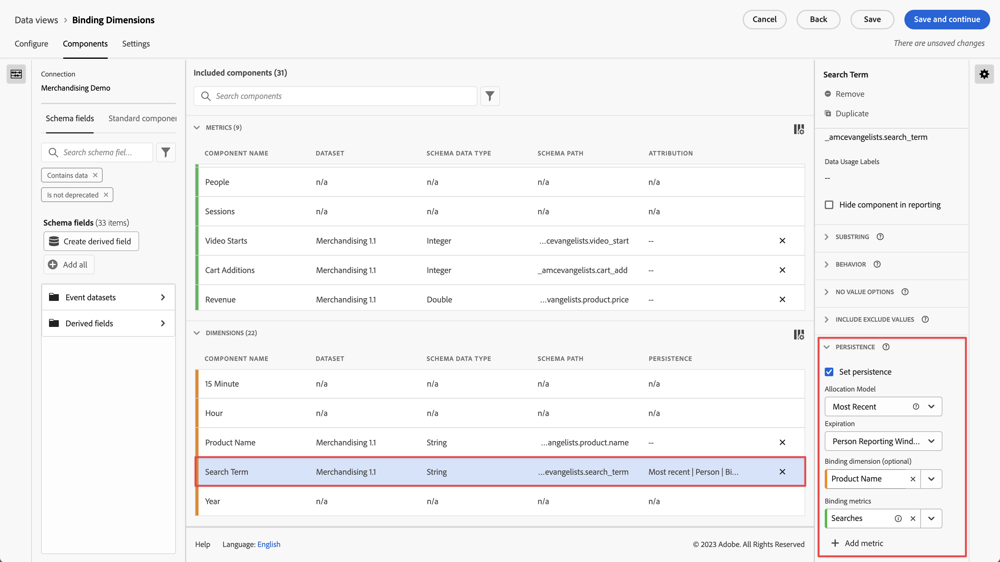

# Uso de dimensões e métricas de vinculação no CJA

Customer Journey Analytics offers several ways to persist dimension values beyond the hit that they are set on. Um dos métodos de persistência que o Adobe oferece é conhecido como Vínculo. In previous versions of Adobe Analytics, this concept was known as merchandising.

Embora você possa usar dimensões de vínculo com dados de evento de nível superior, esse conceito é melhor usado ao trabalhar com [Matrizes de objetos](object-arrays.md). Você pode atribuir uma dimensão a uma parte de uma matriz de objetos sem aplicá-la a todos os atributos em um determinado evento. For example, you can attribute a search term to one product in your shopping cart object array without binding that search term to the entire event.

## Exemplo 2: Usar métricas vinculativas para vincular termo de pesquisa a uma compra de produto

Um dos métodos de comercialização mais comuns no Adobe Analytics foi vincular um termo de pesquisa a um produto para que cada termo de pesquisa receba crédito pelo produto apropriado. Consider the following customer journey:

1. A visitor arrives to your site and searches for &quot;boxing gloves&quot;.

   ```json
   {
       "PersonID": "1",
       "page_name": "Search results",
       "search": "1",
       "search_term": "boxing gloves",
       "product": [
           {
               "name": "Beginner gloves",
               "color": "Red",
               "price": "25.69"
           },
           {
               "name": "Tier 3 gloves",
               "color": "Black",
               "price": "89.99"
           },
           {
               "name": "Professional gloves",
               "color": "Blue",
               "price": "224.99"
           }
       ]
   }
   ```

1. They find a pair of gloves that they like, and add it to their cart.

   ```json
   {
       "PersonID": "1",
       "page_name": "Shopping cart",
       "cart_add": "1",
       "product": [
           {
               "name": "Tier 3 gloves",
               "color": "Black",
               "price": "89.99"
           }
       ]
   }
   ```

1. The visitor then searches for &quot;tennis racket&quot;.

   ```json
   {
       "PersonID": "1",
       "page_name": "Search results",
       "search": "1",
       "search_term": "tennis racket",
       "product": [
           {
               "name": "Shock absorb racket",
               "price": "34.99"
           },
           {
               "name": "Women's open racket",
               "price": "49.99"
           },
           {
               "name": "Extreme racket",
               "price": "134.99"
           }
       ]
   }
   ```

1. Eles encontram uma raquete que gostam e a adicionam ao carrinho.

   ```json
   {
       "PersonID": "1",
       "page_name": "Shopping cart",
       "cart_add": "1",
       "product": [
           {
               "name": "Tier 3 gloves",
               "color": "Black",
               "price": "89.99"
           },
           {
               "name": "Shock absorb racket",
               "price": "34.99"
           }
       ]
   }
   ```

1. O visitante pesquisa por &quot;sapatos&quot; uma terceira vez.

   ```json
   {
       "PersonID": "1",
       "page_name": "Search results",
       "search": "1",
       "search_term": "shoes",
       "product": [
           {
               "name": "Men's walking shoes",
               "color": "Grey",
               "price": "54.95"
           },
           {
               "name": "Tennis shoes",
               "color": "White",
               "price": "42.59"
           },
           {
               "name": "Skate shoes",
               "color": "Black",
               "price": "79.99"
           }
       ]
   }
   ```

1. Eles encontram um par de sapatos de que gostam e o adicionam ao carrinho.

   ```json
   {
       "PersonID": "1",
       "page_name": "Shopping cart",
       "cart_add": "1",
       "product": [
           {
               "name": "Tier 3 gloves",
               "color": "Black",
               "price": "89.99"
           },
           {
               "name": "Shock absorb racket",
               "price": "34.99"
           },
           {
               "name": "Skate shoes",
               "color": "Black",
               "price": "79.99"
           }
       ]
   }
   ```

1. O visitante passa pelo processo de finalização e compra esses três itens.

   ```json
   {
       "PersonID": "1",
       "page_name": "Thank you for your purchase",
       "purchase": "1",
       "product": [
           {
               "name": "Tier 3 gloves",
               "color": "Black",
               "price": "89.99"
           },
           {
               "name": "Shock absorb racket",
               "price": "34.99"
           },
           {
               "name": "Skate shoes",
               "color": "Black",
               "price": "79.99"
           }
       ]
   }
   ```

Se você usar um modelo de alocação tradicional com termo de pesquisa, os três produtos atribuirão receita a apenas um único termo de pesquisa. Por exemplo, se você usou a primeira alocação com a dimensão do termo de pesquisa:

| search_term | Receita |
| --- | --- |
| boxing gloves | US$ 204,97 |

Se você tiver usado a última alocação com a dimensão do termo de pesquisa, os três produtos ainda atribuirão receita a um único termo de pesquisa:

| search_term | Receita |
| --- | --- |
| sapatos | US$ 204,97 |

Embora este exemplo inclua apenas um visitante, muitos visitantes que pesquisam por coisas diferentes podem atribuir termos de pesquisa a produtos diferentes, tornando difícil determinar quais são os melhores resultados de pesquisa.

Com uma dimensão de vínculo, o Adobe anota o item de dimensão ao qual está vinculado. Quando o mesmo valor de vínculo é visto em um evento subsequente, ele traz o item de dimensão para que você possa atribuir a métrica desejada a ele. Neste exemplo, podemos definir a dimensão de vínculo para search_term como nome do produto:


Quando definimos essa dimensão no Gerenciador de visualizações de dados, também precisamos definir uma métrica de vínculo, pois a dimensão de vínculo está em uma matriz de objetos. Uma métrica de vínculo atua como um acionador de uma dimensão de vínculo, de modo que se vincula apenas aos eventos em que a métrica de vínculo está presente. Neste exemplo de implementação, a página de resultados da pesquisa sempre inclui uma dimensão de termo de pesquisa e uma métrica de pesquisas. Podemos vincular termos de pesquisa ao nome do produto sempre que a métrica Pesquisas estiver presente.



Setting the search term dimension to this persistence model executes the following logic:

* Quando search_term estiver em um evento, verifique a presença do nome do produto.
* Se o nome do produto não estiver lá, não faça nada.
* Se o nome do produto estiver lá, verifique a presença da métrica Pesquisas.
* Se a métrica Pesquisas não estiver lá, não faça nada.
* Se a métrica Pesquisas estiver lá, vincule o termo de pesquisa a todos os nomes de produtos. It acts as though it at the same level as product name for that event. Neste exemplo, ele é tratado como product.search_term.
* If the same product name is seen in a subsequent event, the bound search term exists there as well.

In Analysis Workspace, the resulting report would look similar to the following:

| search_term | Receita |
| --- | --- |
| luvas de boxe | 89,99 $ |
| raquete de tênis | $34.99 |
| sapatos | 79,99 $ |
